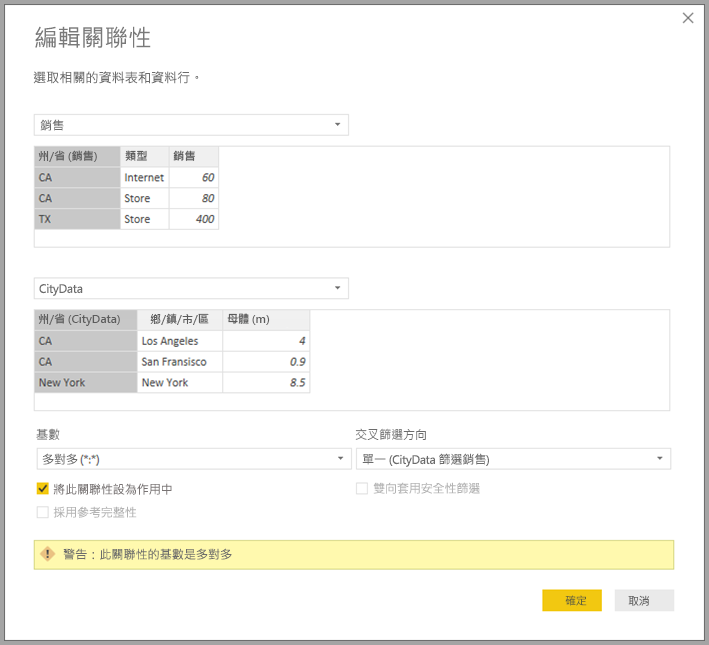

# Power BI Desktop 中的多對多關聯性 (預覽)

您可以藉由 **Power BI Desktop** 中的**多對多關聯性**功能，使用**多對多**基數來聯結資料表，並能以更簡單也更直覺的方式來建立包含多個資料來源的資料模型。 **複合模型**功能是 **Power BI Desktop** 中的大型功能，而**多對多關聯性**功能則是屬於其中的一部分。

![[編輯關聯性] 對話方塊中的多對多](media/desktop-many-to-many-relationships/many-to-many-relationships_01.png)

**Power BI Desktop** 中的**多對多關聯性**功能是三個相關功能集合的一部分：

* **複合模型**：讓報表能夠具有任意組合的多個資料連線，包括 DirectQuery 連線或匯入。
* **多對多關聯性**：您可以透過**複合模型**，在資料表之間建立**多對多關聯性**、移除資料表中對於唯一值的需求，以及移除先前的因應措施，例如，只為建立關聯性而導入新的資料表。 
* **儲存模式**：您現在可以指定需要查詢後端資料來源的視覺效果，並匯入不需要查詢後端資料來源的視覺效果 (即使是以 DirectQuery 為基礎的視覺效果也一樣)，以提升效能並減少後端負載。 以往，即使像是交叉分析篩選器之類的簡單視覺效果，也會起始要傳送到後端來源的查詢。 

有關**複合模型**三個相關功能的集合，分別會在個別文章中加以說明：

* **複合模型**會在 [Power BI Desktop 中的複合模型 (預覽)](desktop-composite-models.md) 一文中詳細說明。
* 本文將說明**多對多關聯性**。
* **儲存模式**會在本身的文章 [Power BI Desktop 中的儲存模式 (預覽)](desktop-storage-mode.md) 中說明。

## 正在啟用多對多關聯性預覽功能

**多對多關聯性**功能是**複合模型**功能的一部分且處於預覽狀態，並且必須在 **Power BI Desktop** 中啟用。 若要啟用**複合模型**，請選取 [檔案] > [選項及設定] > [選項] > [預覽功能]，然後選取 [複合模型] 核取方塊。

您必須重新啟動 **Power BI Desktop**，功能才會啟用。

## 多對多關聯性可解決的問題

在有**多對多關聯性**可用之前，當定義 Power BI 中兩個資料表之間的關聯性時，涉及關聯性的資料行中至少要有一個資料行包含唯一的值。 不過在許多情況下，資料表中的資料行無一包含唯一的值。 

例如，兩個資料表可能都有一個包含 *Country* 的資料行，但 *Country* 的值在任一資料表中不是唯一的。 若要聯結這類資料表，則必須設法避開限制，像是在模型中導入含有必要唯一值的額外資料表。 **多對多關聯性**功能可提供替代方法，使用含有 [多對多] 基數的關聯性，以直接聯結這類資料表。  

## 使用多對多關聯性

當定義 Power BI 中兩個資料表之間的關聯性時，您必須定義關聯性的基數。 例如，*ProductSales* 與 *Product* 之間的關聯性 (使用 *ProductSales[ProductCode]* 與 *Product[ProductCode]* 資料行) 可定義為**多對一**，因為每種產品會有多個銷售量，而 *Product* 資料表 *(ProductCode)* 中的資料行是唯一的。 當將關聯性定義為**多對一**、**一對多**或**一對一**時，Power BI 會執行驗證以確認選取的基數符合實際的資料。

例如，請查看下圖的簡單模型。

接著，假設 *Product* 資料表只包含兩個資料列。

另外，假設 *Sales* 資料表只有四個資料列，包括產品 **C** 的 *Sales*，但該產品不存在於 *Product* 資料表中 (由於參考完整性錯誤)。

顯示 *ProductName* 與 *Price* (來自 *Product* 資料表) 以及每種產品 *Qty* 總計 (來自 *ProductSales* 資料表) 的視覺效果如下圖所示： 

如上圖所示，視覺效果中有一個空白的 *ProductName* 資料列，其與產品 *C* 的銷售量相關聯。此空白資料列說明下列情況：

* 在 *ProductSales* 資料表中的某個資料，於 *Product* 資料表中沒有對應的資料列：發生參考完整性錯誤，如此範例中所見的產品 *C*。

* *ProductSales* 資料表中的某個資料列，其外部索引鍵資料行為 Null。 

因為上述原因，兩種情況下的空白資料列均代表 *ProductName* 與 *Price* 不明的銷售量。

不過，有時候的情況是資料表由兩個資料行聯結，但無一是唯一的資料行。 例如，以下列兩個資料表為例：

* *Sales* 資料表包含依 *State* 的銷售資料，每個資料列都包含該州 (包括 CA、WA 及 TX 等州) 某個銷售類型的銷售量 

    

* *CityData* 資料表包含城市的資料，包括人口與州 (包括 CA、WA 及 New York 等州)

    

雖然兩個資料表中都有 *State* 資料行，且合理推測可以依 *State* 來報告 *Sales* 總計以及各州的總人口，但有一個問題：*State* 資料行在任一資料表中都不是唯一的。 

## 先前的因應措施

在 2018 年 7 月版本之前的 **Power BI Desktop** 版本中，無法在這些資料表之間直接建立關聯性。 此問題的常見因應措施是執行下列動作：

* 建立第三個資料表，其中只包含唯一的 *State* 識別碼。 這可以是計算資料表 (使用 DAX 所定義) 或使用**查詢編輯器**中定義的查詢所定義的資料表，其中包含的唯一識別碼取自其中一個資料表或聯集的完整集合。

* 使用常見的「*多對一」關聯性，讓兩個原始資料表與新的資料表產生關聯。

該因應措施資料表在欄位清單中顯示或隱藏。 在後者的情況中，**多對一**關聯性常會設定為雙向篩選，以便能使用任一資料表的 *State* 欄位，並將後續交互篩選傳播給其他資料表。 此因應措施方法如下圖的**關聯性檢視**所示。

接著，顯示 *State* (來自 *CityData* 資料表) 以及 *Population* 總計與 *Sales* 總計的視覺效果會如下所示。

請注意，假設此因應措施中使用來自 *CityData* 資料表的州，則只會列出該資料表中的 *State* (因此會排除 TX)。 此外，和**多對一**關聯性的情況不同，雖然總計資料列包含所有 *Sales* (包括 TX 的銷售量)，但詳細資料不包括涵蓋這類不相符資料列的空白資料列。 同樣地，也不會有空白資料列以涵蓋 *State* 值為 Null 的任何 *Sales*。

如果也將 *City* 新增到視覺效果，雖然已知每個 *City* 的人口，但依 *City* 顯示的 *Sales* 只會重複對應 *State* 的 *Sales* (在為與某個彙總量值無關的資料行分組時，通常就會如此)，如下圖所示。

如果在此因應措施中，將新的資料表 *Sales* 定義為所有 *States* 的聯集，並顯示在欄位清單中，則顯示 *State* (新資料表上) 及 *Population* 總計與 *Sales* 總計的相同視覺效果會顯示如下。

在該情況下，並如視覺效果所示，*TX* (含有 *Sales* 但人口未知) 與 *New York* (含有已知人口但沒有 *Sales*) 都包括在內。 

如您所見，這個因應措施並不理想，並有許多問題。 建立**多對多關聯性**，可以解決這些問題，如下一節中所述。

## 使用多對多關聯性，而不是因應措施

從 2018 年 7 月版本的 **Power BI Desktop** 開始，您可以直接與上節所述的這類資料表產生關聯，不需要訴諸這類因應措施。 現在可將關聯性基數設定為**多對多**，表示資料表無一包含唯一的值。 對於這類關聯性，您仍可控制要以哪個資料表來篩選另一個資料表，或使用雙向篩選，讓兩個資料表彼此篩選。  

> [!NOTE]
> 建立**多對多**關聯性的功能仍處於預覽狀態，也因此無法將使用**多對多**關聯性的模型發行至 Power BI 服務。 

在 **Power BI Desktop** 中，當確定資料表在關聯性中的資料行無一包含唯一的值時，基數會預設為**多對多**。 在這類情況下，就會顯示警告，確認該關聯性設定是您的預期行為，而不是因資料問題造成的非預期效果。 

例如，在 *CityData* 與 *Sales* 之間直接建立關聯性時，其中的篩選條件應從 *CityData* 流至 *Sales*，關聯性對話方塊如下圖所示。

產生的**關聯性檢視**會包含兩個資料表之間的直接**多對多**關聯性。 當視覺效果建立後，[欄位] 清單中的外觀與後續行為都會和採用上節所述的因應措施相同，在其中會隱藏額外的資料表 (表中包含相異的 *States*)。 例如，視覺效果會如同上節所描述的因應措施，顯示 *States* 及人口與銷售量總計，如下所示。

**多對多**關聯性與較一般的**多對一**關聯性之間的主要差異如下。

* 顯示的值不包括代表下列資料列的空白資料列：另一資料表中任何不相符的資料列，或另一資料表中關聯性所用資料行為 Null 的資料列。
* 無法使用 *RELATED()* 函數 (因為可能會與多個資料列產生關聯)
* 在資料表上使用 *ALL()* 函數時，不會針對透過**多對多**關聯性與該資料表產生關聯的其他資料表來移除套用的篩選條件。 例如，在先前範例中定義如下的量值，不會移除相關 *CityData* 資料表上資料行的篩選條件：

    

    因此，顯示 *State*、*Sales* 及 *Sales total* 的視覺效果會產生：

    

因此，請務必格外小心，確認使用 *ALL(\<Table>)* (例如「總計百分比」) 的計算會傳回想要的結果。 

## 限制與考量

這一版的**多對多關聯性**與**複合模型**有一些限制。

下列 Live Connect (多維度) 來源不能與**複合模型**搭配使用：

* SAP HANA
* SAP Business Warehouse
* SQL Server Analysis Services
* Power BI 資料集
* Azure Analysis Services

使用 DirectQuery 連線到這些多維度來源時，將無法同時連線到其他 DirectQuery 來源，也無法結合匯入的資料。

使用**多對多關聯性**時，使用 DirectQuery 的現有限制仍然適用。 這其中有許多限制現在會依個別資料表的**儲存模式**而異。 例如，已匯入資料表上的計算結果欄可以參考其他資料表，但 DirectQuery 資料表上的計算結果欄仍僅限於參考相同資料表上的資料行。 如果模型內有任何資料表為 DirectQuery，則其他限制會套用至整個模型。 例如，如果某個模型內的任何資料表具有 DirectQuery 的**儲存模式**，則該模型不提供 **QuickInsights** 和**問與答**功能。 

## 後續步驟

下列文章會詳細說明複合模型與 DirectQuery。

* [Power BI Desktop 中的複合模型 (預覽)](desktop-composite-models.md)
* [Power BI Desktop 中的儲存模式 (預覽)](desktop-storage-mode.md)

DirectQuery 文章：

* [使用 Power BI 中的 DirectQuery](desktop-directquery-about.md)
* [Power BI 中 DirectQuery 支援的資料來源](desktop-directquery-data-sources.md)

