# 在 Power BI Desktop 中使用矩陣視覺效果
透過 [矩陣] 視覺效果，您可以在 **Power BI Desktop** 報表中建立矩陣視覺效果 (有時也稱為 [資料表])，並與其他視覺效果交叉醒目提示矩陣內的項目。 此外，您可以選取資料列、資料行，甚至是個別資料格，然後交叉醒目提示。 最後，為了更妥善運用配置空間，矩陣視覺效果支援分層式配置。

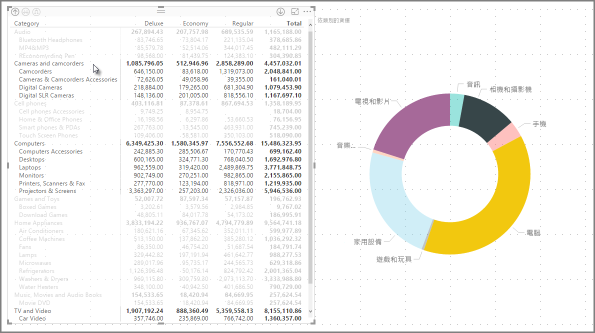

矩陣有許多相關的功能，我們將在本文的下列各節中逐一介紹。

> [!NOTE]
> 從 2017 年 7 月發行的 **Power BI Desktop** 開始，矩陣和資料表視覺效果會反映所套用**報表主題**中的樣式 (包括色彩)。 這些可能不是您預期的矩陣視覺效果色彩，而且您可以在「報表主題」設定中進行變更。 如需主題的詳細資訊，請參閱[**在 Power BI Desktop 中使用報表主題**](desktop-report-themes.md)。
> 
> 

## 了解 Power BI 如何計算總和

在開始了解如何使用**矩陣**視覺效果之前，務必先了解 Power BI 如何計算資料表和矩陣中的總和與小計值。 針對總和與小計資料列，量值會根據基礎資料的所有資料列進行評估，而不是僅僅加總可見或顯示資料列中的值。 這表示在總和資料列中，可能會得到與您預期不同的值。 

看看下列**矩陣**視覺效果。 

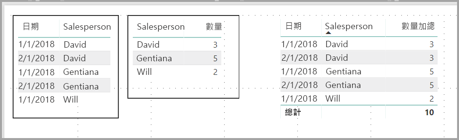

在此範例中，**矩陣**視覺效果最右邊的每個資料列都會顯示每位銷售人員/日期組合的 *Amount* (數量)。 不過，因為由於銷售人員能在多個日期上顯示，數字可能會出現一次以上。 因此，基礎資料的正確總和並不等於可見值的單純加總。 當加總的值屬於一對多關係中的「單一」端時，這是的常見模式。

查看總和與小計時，請記住這些值是來自基礎資料，而不是來自可見值。 

## 使用矩陣視覺效果的向下切入
透過 [矩陣] 視覺效果，您可以執行各式各樣有趣但之前未曾提供的向下切入活動。 這包括使用資料列、資料行，甚至是個別區段和資料格向下切入的功能。 讓我們來看看上述每項的運作方式。

### 資料列標題上的向下切入
在 [視覺效果] 窗格中，當您將多個欄位新增至 [欄位] 的 [資料列] 區段時，您可以在矩陣視覺效果的資料列上啟用向下切入功能。 此功能類似於建立階層，然後您就可以在整個階層內向下切入 (然後備份)，並分析每個層級的資料。

在下圖中，[資料列] 區段包含 [類別] 和 [子類別]，以在我們可鑽研的資料列中建立群組 (或階層)。

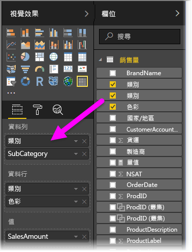

當視覺效果在 [資料列] 區段中建立群組時，視覺效果本身會在視覺效果左上角顯示「鑽研」和「展開」圖示。

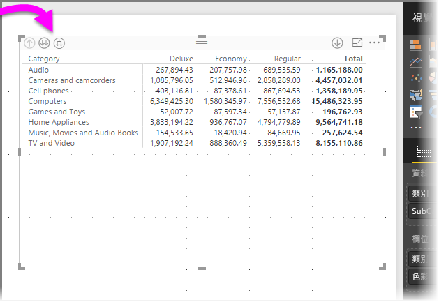

類似於其他視覺效果中的鑽研和展開行為，選取這些按鈕可讓我們在整個階層內向下切入 (或備份)。 在本例中，我們可以從 [類別] 向下切入至 [子類別]，如下圖所示，其中已選取向下切入一層圖示 (乾草叉)。

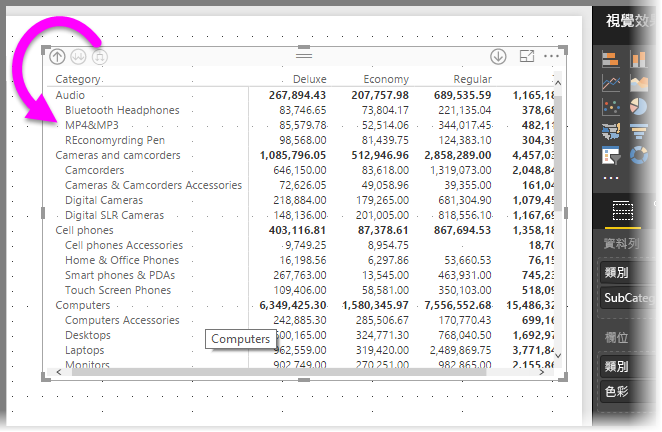

除了使用這些圖示，您還可以用滑鼠右鍵按一下任何資料列標題，然後從出現的功能表進行選取以向下切入。

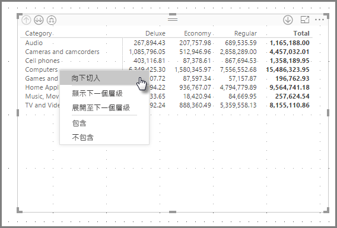

請注意，出現的功能表中還有一些選項會產生不同的結果：

選取 [向下切入] 會展開「該」資料列層級的矩陣，並「排除」除了按下右鍵的資料列標題以外的所有其他資料列標題。 在下圖中，已用滑鼠右鍵按一下 [Computers] 並選取 [向下切入]。 請注意，其他最上層的資料列不會再出現於矩陣中。 這是很有用的功能，並且是 [交叉醒目提示] 區段中特別酷炫的功能。

我們可以按一下**向上切入**圖示，回到之前的最上層檢視。 如果接著從右鍵功能表選取 [顯示下一個層級]，則會取得一份按字母排列的清單，列出下一層的所有項目 (在本例中為 [子類別] 欄位)，但不包含較高層級的階層分類。

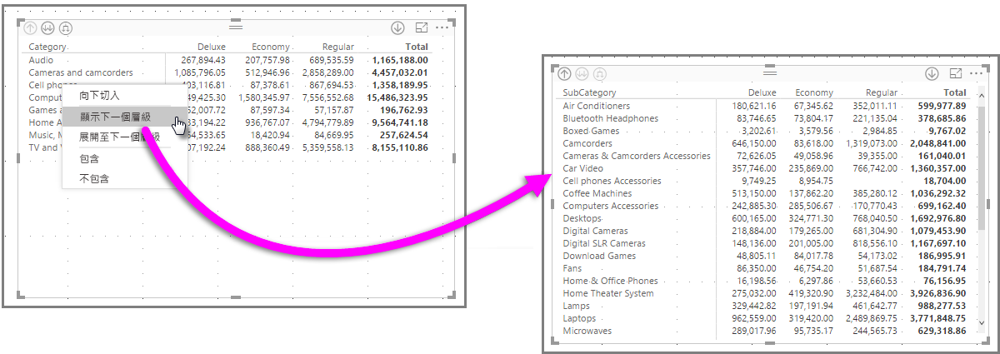

當我們按一下左上角的**向上切入**圖示讓矩陣顯示所有最上層類別，然後再按一下滑鼠右鍵並選取 [展開至下一個層級]，即會顯示下列畫面：

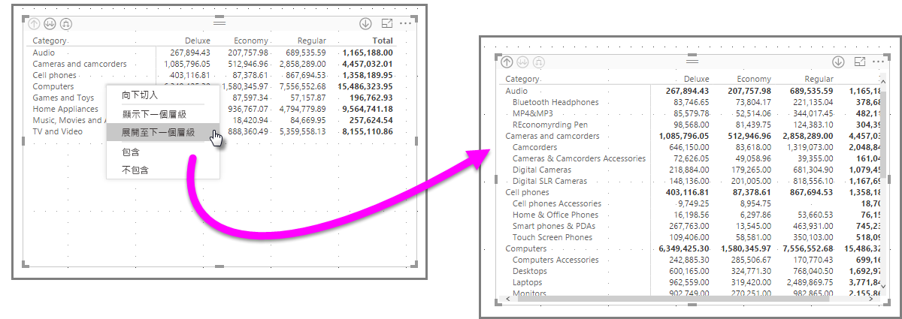

您也可以使用 [包含] 和 [排除] 功能表項目，以保留 (或分別移除) 矩陣中按下右鍵的資料列 (及任何子類別)。

### 資料行標題上的向下切入
類似於資料列上的向下切入功能，您也可以在 [資料行] 上向下切入。 在下圖中，您會在 [資料行] 欄位中看到兩個欄位，這會建立類似於本文稍早針對資料列所使用的階層。 在 [資料行] 欄位中，包含 [類別] 和 [色彩]。

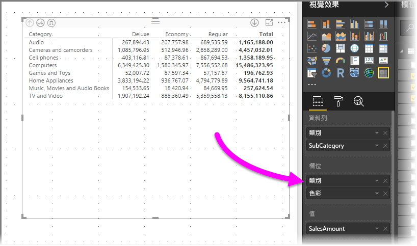

在 [矩陣] 視覺效果中，當我們以滑鼠右鍵按一下資料行，我們會看到向下切入的選項。 在下圖中，我們以滑鼠右鍵按一下 [Deluxe]，然後選取 [向下切入]。

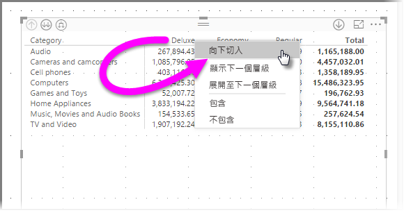

選取 [向下切入] 時，會顯示 [Deluxe] 之資料行階層的下一個層級，在本例中為 [色彩]。

其餘右鍵功能表項目在資料行上的運作方式與資料列相同 (請參閱上一節：**資料列標題上的向下切入**)。 您可以 [顯示下一個層級]、[展開至下一個層級]，以及 [包含] 或 [排除] 您的資料行，就像是處理資料列一樣。

> [!NOTE]
> 矩陣視覺效果左上角的向下切入圖示和向上切入圖示只適用於資料列。 若要在資料行上向下切入，您必須使用右鍵功能表。
> 
> 

## 矩陣視覺效果的分層式配置
[矩陣] 視覺效果會將階層中的子類別自動縮排在每個父系之下，此功能稱為**分層式配置**。

在矩陣視覺效果的「原始」版本中，子類別會顯示在完全不同的資料行中，並在視覺效果中佔用更多的空間。 下圖顯示原始 [矩陣] 視覺效果中的資料表；請注意，其子類別在完全不同的資料行中。

在下圖中，您會看到 [矩陣] 視覺效果，並已啟用**分層式配置**。 請注意，[Computers] 類別已將其子類別 ([Computers Accessories]、[Desktops]、[Laptops]、[Monitors] 等) 稍微縮排，以提供更精簡的視覺效果。

您可以輕鬆地調整 [分層式配置] 設定。 選取 [矩陣] 視覺效果時，在 [視覺效果] 窗格的 [格式] 區段 (油漆滾筒圖示) 中，展開 [資料列標題] 區段。 其中有兩個選項︰[分層式配置] 切換開關 (將它開啟或關閉) 和 [逐步的配置縮排]\(以像素為單位指定縮排數量)。

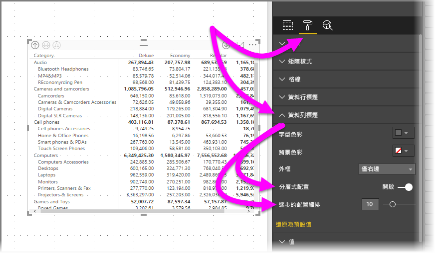

如果您關閉 [分層式配置]，子類別會顯示在另一個資料行中，而不是縮排在父系類別之下。

## 矩陣視覺效果的小計
您可以在矩陣視覺效果中，開啟或關閉資料列和資料行的小計。 如下圖所示，資料列小計已設定為 [開啟]。

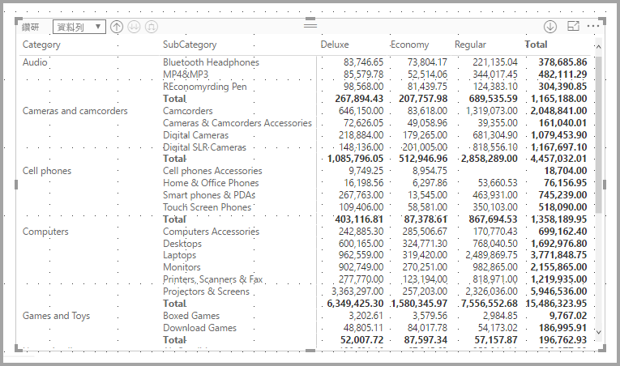

在 [視覺效果] 窗格的 [格式] 區段中，展開 [小計] 卡片，然後將 [資料列小計] 滑桿移至 [關閉]。 當您這樣做時，不會顯示小計。

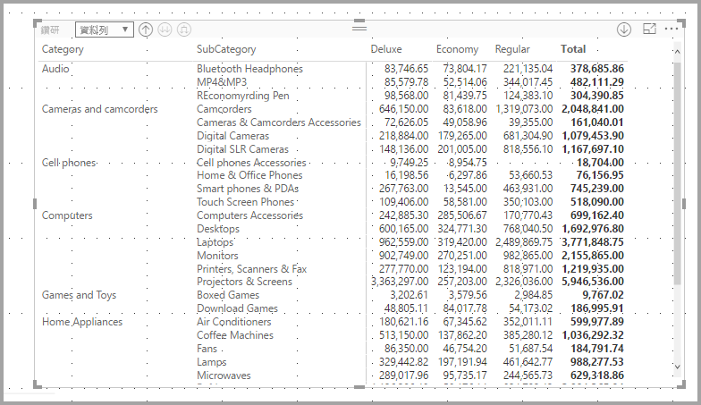

相同程序適用於資料行小計。

## 矩陣視覺效果的交叉醒目提示
透過 [矩陣] 視覺效果，您可以選取矩陣中的任何項目作為交叉醒目提示的基礎。 在 [矩陣] 中選取一個資料行，即會醒目提示該資料行，就像是報表頁面上的任何其他視覺效果一樣。 這向來是其他視覺效果和資料點選取範圍的通用功能，現在 [矩陣] 視覺效果也可參與。

此外，交叉醒目提示也可以使用 Ctrl+按一下滑鼠左鍵。 例如，在下圖中，已從 [矩陣] 視覺效果選取子類別集合。 注意視覺效果中未選取的項目如何呈現灰色，以及頁面上的其他視覺效果如何反映 [矩陣] 視覺效果中所做的選擇。

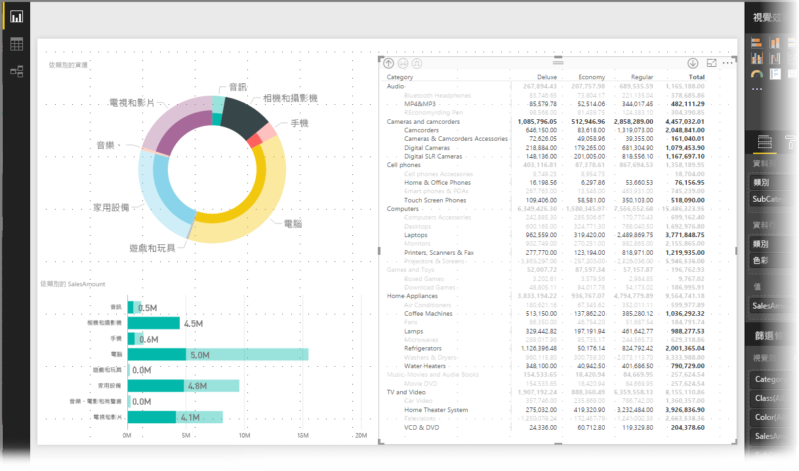

## 矩陣視覺效果的網底和字型色彩
透過 [矩陣] 視覺效果，您可以將**條件式格式設定** (色彩和網底) 套用至矩陣內的資料格背景，也可以將條件式格式設定套用至文字和值本身。

若要套用條件式格式設定，您可以在選取矩陣視覺效果時，執行下列任一動作：

* 在 [欄位] 窗格中，以滑鼠右鍵按一下 [欄位]，然後從功能表選取 [設定格式化的條件]。
  
  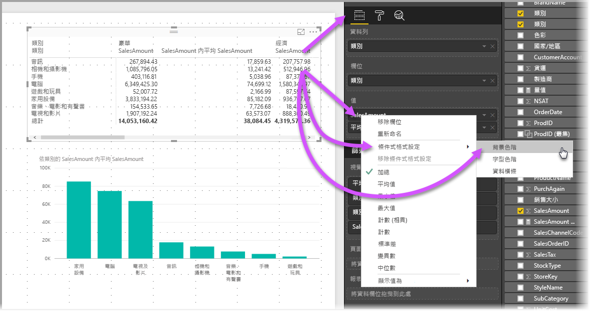
* 或者，在 [格式] 窗格中，展開 [設定格式化的條件] 卡片，然後將 [背景色階] 或 [字型色階] 的滑桿移至 [開啟]。 開啟任一項都會顯示 [進階控制項] 的連結，讓您自訂色彩和彩色格式的值。
  
  

任一方法都會達到相同結果。 選取 [進階控制項] 會顯示下列對話方塊，讓您進行調整：

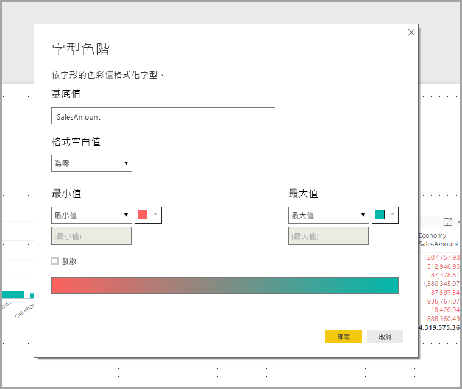

## 後續步驟

您可能也會對下列文章感興趣：

* [在 Power BI Desktop 報表中使用格線與貼齊格線](desktop-gridlines-snap-to-grid.md)
* [Power BI Desktop 中的資料來源](desktop-data-sources.md)
* [Power BI Desktop 中的資料類型](desktop-data-types.md)

 