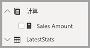

# <a name="create-measures-for-data-analysis-in-power-bi-desktop"></a>在 Power BI Desktop 中建立資料分析的量值

Power BI Desktop 可協助您深入探索資料，只要按幾下滑鼠按鍵即可。 但有時候，資料並無法提供您解決一些重要問題所需的一切答案， 而量值可協助您達成目的。

量值可用於一些最常見的資料分析。 您可以透過 [欄位]  來設定簡易的摘要，例如加總、平均、最小值、最大值和計數。 量值的計算結果一律會隨著您與報表的互動而改變，以針對特定資料進行快速且動態的瀏覽。 以下將進一步說明。 如需詳細資訊，請參閱[建立導出量值](/learn/modules/model-data-power-bi/4b-create-calculated-measures)。

## <a name="understanding-measures"></a>了解量值

在 Power BI Desktop 中，計量會在 [報表檢視]  或 [資料檢視]  中建立及顯示。 您自行建立的量值會出現在 [欄位]  清單中，並以計算機圖示表示。 您可以為量值指定任何名稱，並將其加入新的或現有的視覺效果，就像是其他任何欄位一樣。


> [!NOTE]
> 您也可能對*快速量值*有興趣，這是您可以從對話方塊選取的現成量值。 其適合用來快速建立量值，也適合用來了解資料分析運算式 (DAX) 語法，因為其自動建立的 DAX 公式都可供檢閱。 如需詳細資訊，請參閱[快速量值](desktop-quick-measures.md)。
> 
> 

## <a name="data-analysis-expressions"></a>資料分析運算式

量值會透過運算式公式來計算結果。 當您建立自己的量值時，您將會使用[ Data Analysis Expression](/dax/) (DAX) 公式語言。 DAX 所包含的程式庫是由 200 個以上的函式、運算子和建構函式所組成。 其程式庫為建立量值提供極大的彈性，可計算幾乎所有資料分析需求的結果。

DAX 公式與 Excel 公式很類似。 DAX 甚至有許多與 Excel 相同的函式，例如 `DATE`、`SUM` 和 `LEFT`。 但是，DAX 函式是為了處理類似 Power BI Desktop 中的關聯式資料。

## <a name="lets-look-at-an-example"></a>以下舉例說明

Jan 是 Contoso 的銷售經理。 有人要求 Jan 提供下一個會計年度的轉銷商銷售預測。 Jan 決定根據去年的銷售額進行預估，加上未來六個月所排定之各種促銷結果的 6% 年成長量。

為了報告預估值，Jan 將去年的銷售資料匯入 Power BI Desktop。 Jan 找到 **Reseller Sales** 資料表中的 **SalesAmount** 欄位。 由於匯入的資料只包含去年的銷售額，因此 Jan 將 **SalesAmount** 欄位重新命名為 *Last Years Sales*。 Jan 接著將 **Last Years Sales** 拖曳到報表畫布上。 該欄位在圖表視覺效果中，會顯示為去年所有轉售商銷售總和的單一值。

Jan 注意到雖然未指定計算方式，但系統已自動提供一個方式。 Power BI Desktop 透過加總 [Last Years Sales]  中的所有值，來建立自己的量值。

但是，Jan 需要能夠計算來年銷售預測的量值，其依據是將去年銷售額乘以 1.06，以代表預期業務會增加 6%。 針對這項計算，Jan 將建立一個量值。 Jan 可以使用 [新增量值]  功能建立新的量值，然後再輸入下列 DAX 公式：

```dax
    Projected Sales = SUM('Sales'[Last Years Sales])*1.06
```

Jan 接著將新的 Projected Sales 量值拖曳到圖表中。


只要幾個動作，很快地 Jan 便有量值可計算預測銷售額。 Jan 可以篩選特定轉銷商或將其他欄位新增至報表，以進一步分析預測。

## <a name="data-categories-for-measures"></a>量值的資料類別

您也可以選取量值的資料類別。

此外，資料類別可讓您使用量值來動態建立 URL，並將資料類別標示為 Web URL。

您可以建立將量值顯示為 Web URL 的資料表，並且能夠按一下根據您的選取範圍所建立的 URL。 當您想要使用 [URL 篩選參數](service-url-filters.md)連結至其他 Power BI 報表時，這個方法特別有用。

## <a name="organizing-your-measures"></a>組織您的計量

計量會具備一個「主資料表」  ，定義它們在欄位清單中的位置。 您可以從您模型中的資料表內選擇位置來變更其位置。


您也可以將資料表中的欄位組織成「顯示資料夾」  。 從 Power BI Desktop 的左邊緣選取 [模型]  。 在 [屬性]  窗格中，從可用欄位清單中選取您想要移動的欄位。 在 [顯示資料夾]  中輸入新資料夾的名稱，以建立資料夾。 建立資料夾會將選取的欄位移至該資料夾。


您可以使用反斜線字元來建立子資料夾。 例如，*Finance\Currencies* 會建立 *Finance* 資料夾，並在其中建立 *Currencies* 資料夾。

您可以使用分號區別資料夾名稱，讓欄位出現在多個資料夾中。 例如，*Products\Names;Departments* 會使欄位出現在 *Products* 資料夾內的 *Departments* 資料夾及 *Names* 資料夾中。

您可以建立只包含量值的特殊資料表。 該資料表一律會顯示在 [欄位]  的頂端。 若要執行此動作，請建立僅包含一個資料行的資料表。 您可以使用 [輸入資料]  來建立資料表。 然後將計量移動到該資料表。 最後，請隱藏您建立的資料行 (而非資料表)。 選取 [欄位]  頂端的箭號，以關閉並重新開啟 [欄位] 清單來查看您的變更。



## <a name="learn-more"></a>深入了解

我們在此僅快速介紹量值。 還有許多其他資訊可協助您了解如何建立自己的量值。 如需詳細資訊，請參閱[教學課程：在 Power BI Desktop 中建立您自己的量值](desktop-tutorial-create-measures.md)。 您可以從中下載範例檔案，並取得有關如何建立更多量值的逐步解說課程。  

若要更深入了解 DAX，請參閱 [Power BI Desktop 的 DAX 基礎概念](desktop-quickstart-learn-dax-basics.md)。 [Data Analysis Expression 參考](/dax/)提供有關每個函數、語法、運算子和命名慣例的詳細文章。 DAX 在 Excel 的 Power Pivot 和 SQL Server Analysis Services 中已行之有年。 因此還有其他許多實用的資源可供使用。 請務必查看 [DAX 資源中心 Wiki](https://social.technet.microsoft.com/wiki/contents/articles/1088.dax-resource-center.aspx)，其中具影響力的 BI 社群成員將與您分享 DAX 的知識。
