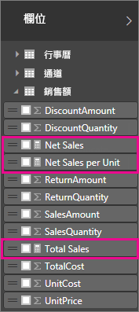
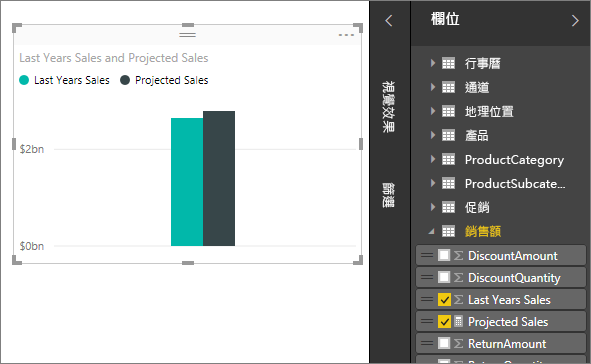

# Power BI Desktop 中的量值

**Power BI Desktop** 可協助您深入探索資料，只要按幾下滑鼠按鍵即可。 但有時候，資料並無法提供您解決一些重要問題所需的一切答案， 而量值可協助您達成目的。

量值可用於一些最常見的資料分析。 例如，總和、平均值、最小值或最大值、計數，或使用 DAX 公式自行建立的更進階計算。 量值的計算結果一律會隨著您與報表的互動而改變，以針對特定資料進行快速且動態的瀏覽。 以下將進一步說明。

## 了解量值

在 **Power BI Desktop** 中，您可以在 [報表檢視]  或 [資料檢視]  中建立及使用量值。 您自行建立的量值會出現在 [欄位] 清單中，並以計算機圖示表示。 您可以為量值指定任何名稱，並將其加入新的或現有的視覺效果，就像是其他任何欄位一樣。

> [!NOTE]
> 您也可能對**快速量值**有興趣，這是您可以從對話方塊選取的現成量值。 它們適合用來快速建立量值，也適合用來了解 DAX 語法，因為它們自動建立的 DAX 公式都可供檢閱。 請參閱文章︰[快速量值](desktop-quick-measures.md)。
> 
> 

## 資料分析運算式

量值會透過運算式公式來計算結果。 當您建立自己的量值時，您將會使用[ Data Analysis Expression](https://msdn.microsoft.com/library/gg413422.aspx) (DAX) 公式語言。 DAX 所包含的程式庫是由 200 個以上的函式、運算子和建構函式所組成。 其程式庫為建立量值提供極大的彈性，可計算幾乎所有資料分析需求的結果。

DAX 公式與 Excel 公式很類似。 DAX 甚至有許多與 Excel 相同的函式，例如 DATE、SUM 和 LEFT。 但是，DAX 的函數是為了處理類似 Power BI Desktop 中的關聯式資料。

## 以下舉例說明
Jan 是 Contoso 的銷售經理。 有人要求 Jan 提供下一個會計年度的轉銷商銷售預測。 Jan 決定根據去年的銷售額進行預估，加上未來六個月所排定之各種促銷結果的 6% 年成長量。

為了報告這個預估值，Jan 將去年的銷售資料匯入 Power BI Desktop。 Jan 找到 Reseller Sales 資料表中的 SalesAmount 欄位。 由於匯入的資料只包含去年的銷售額，因此 Jan 將 [SalesAmount] 欄位重新命名為 [Last Years Sales]。 Jan 接著將 Last Years Sales 拖曳到報表畫布上。 該欄位在圖表視覺效果中，會顯示為去年所有轉售商銷售總和的單一值。

Jan 注意到雖然他們未指定計算方法，但系統已自動提供一個方法。 Power BI Desktop 透過加總 [Last Years Sales] 中的所有值，來建立自己的量值。

但是，Jan 需要能夠計算來年銷售預測的量值，其依據是將去年銷售額乘以 1.06，以代表預期業務會增加 6%。 針對這項計算，Jan 將建立自己的量值。 他們可以使用 [新增量值] 功能建立新的量值，然後輸入下列 DAX 公式：

    Projected Sales = SUM('Sales'[Last Years Sales])*1.06

Jan 接著將他們的新 Projected Sales 量值拖曳到圖表中。

只要幾個動作，很快地 Jan 便有量值可計算預測銷售額。 Jan 可以篩選特定轉銷商或將其他欄位新增至報表，以進一步分析預測。

## 量值的資料類別

您也可以選取量值的資料類別。 

此外，這可讓您使用量值來動態建立 URL，並將資料類別標示為 Web URL。 

您可以建立將量值顯示為 Web URL 的資料表，並且能夠按一下根據您的選取範圍所建立的 URL。 當您想要使用 [URL 篩選參數](service-url-filters.md)連結至其他 Power BI 報表時，這會特別有用。

## 深入了解
我們在此只為您快速介紹量值，還有許多其他資訊可協助您了解如何建立自己的量值。 務必參閱[教學課程：在 Power BI Desktop 中建立您自己的量值](desktop-tutorial-create-measures.md)，您可以從中下載範例檔案，並取得有關如何建立更多量值的逐步解說課程。  

若要更深入了解 DAX，請務必查看 [Power BI Desktop 的 DAX 基礎概念](desktop-quickstart-learn-dax-basics.md)。 [Data Analysis Expression 參考](https://msdn.microsoft.com/library/gg413422.aspx)提供有關每個函數、語法、運算子和命名慣例的詳細文章。 DAX 在 Excel 的 Power Pivot 和 SQL Server Analysis Services 中已行之有年，因此還有其他許多實用的資源可供使用。 請務必查看 [DAX 資源中心 Wiki](http://social.technet.microsoft.com/wiki/contents/articles/1088.dax-resource-center.aspx)，其中具影響力的 BI 社群成員將與您分享 DAX 的知識。

