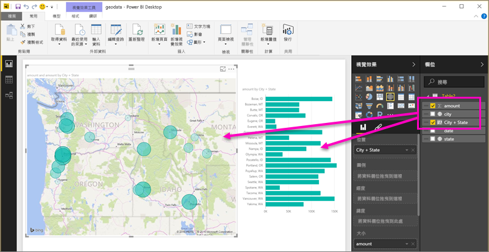
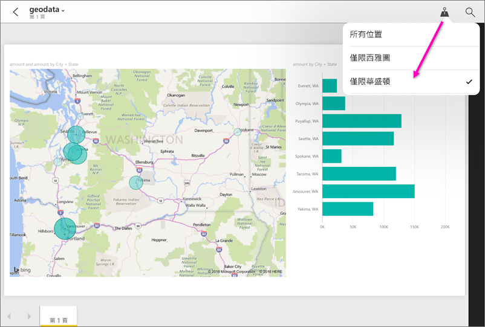

# 在 Power BI Desktop 中為行動裝置應用程式設定地理篩選
在 Power BI Desktop 中，您可以為資料行[分類地理資料](desktop-data-categorization.md)，使 Power BI Desktop 知道如何處理報表中視覺效果的值。 作為額外的權益，當您或您的同事在 Power BI Mobile Apps 中檢視該報表時，Power BI 會自動提供符合您所在地的地理篩選。 

例如，假設您是正要與客戶見面的銷售經理，而您想要快速的針對您計劃造訪的特定客戶進行總銷售與營收的篩選。 您想要獲得您目前位置的資料，不論是依州、城市或一個實際的地址。 稍後，如果您有剩餘時間，您還想要造訪位於附近的其他客戶。 您可以[依您的位置篩選報表以尋找客戶](mobile-apps-geographic-filtering.md)。

> [!NOTE]
> 只有在報表中的地理名稱是英文時 (例如 "New York City" 或 "Germany")，您才能在行動裝置應用程式中依位置篩選報表。
> 
> 

## 識別您報表中的地理資料
1. 在 Power BI Desktop 內切換到 [資料檢視] .
2. 選取具有地理資料的資料行，例如 City 資料行。
   
    
3. 在 [模型] 索引標籤中，選取 [資料類別]，然後選取正確的類別，在此範例中為 **City**。
   
    
4. 繼續為模型中的任何其他欄位設定地理資料類別。 
   
   > [!NOTE]
   > 您可以在模型中為每個資料類別設定多個資料行，但如果您這樣做，模型將無法在 Power BI 行動裝置應用程式中進行地理篩選。 在行動裝置應用程式中使用地理篩選時，每個資料類別只設定一個資料行，例如，只有一個 **City** 資料行中，一個 **State or Province** 資料行，和一個 **Country** 資料行。 
   > 
   > 

## 使用您的地理資料建立視覺效果
1. 切換到 [報表檢視] ，並建立使用資料中地理欄位的視覺效果。 
   
    
   
    在本例中，模型也包含將城市和州帶入同一個資料行中的計算結果欄。 了解如何[在 Power BI Desktop 中建立計算結果欄](desktop-calculated-columns.md)。
   
    
2. 將報表發佈至 Power BI 服務。

## 在 Power BI 行動裝置應用程式中檢視報表
1. 在任何 [Power BI Mobile Apps](mobile-apps-for-mobile-devices.md) 中開啟報表。
2. 如果報表中有您所在地理位置的資料，您可以自動篩選至該位置。
   
    

深入了解如何[使用 Power BI Mobile Apps 依位置篩選報表](mobile-apps-geographic-filtering.md)。

## 後續步驟
* [Power BI Desktop 中的資料分類](desktop-data-categorization.md)  
* 有問題嗎？ [嘗試在 Power BI 社群提問](http://community.powerbi.com/)

