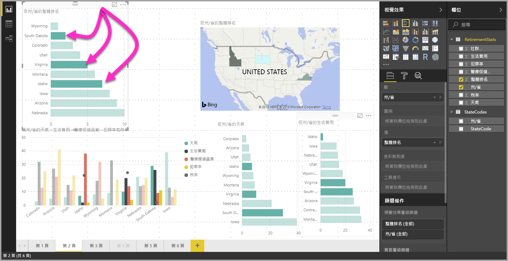

# 使用 Power BI Desktop 在視覺效果中的多重資料元素選取

在 **Power BI Desktop** 中，只要按一下視覺效果中的資料點，就可以在指定視覺效果中將資料點醒目提示。 例如，如果您有重要的橫條圖或圖表元素，且您想要報告頁面上的其他視覺效果根據您的選取項目將資料醒目提示，您可以按一下某個視覺效果中的資料元素，並看到結果反映在頁面上的其他視覺效果中。 這是基本或單一選取醒目提示。 以下影像顯示基本醒目提示。 

使用多重選取時，您現在可以在 **Power BI Desktop** 報告頁面中選取超過一個的資料點，並跨頁面上的視覺效果將結果醒目提示。 這相當於 **and** 陳述式或功能，例如 "highlight results for Idaho **and** Virginia"。 若要將視覺效果中的資料點多重選取，只要使用 **CTRL+按一下**來選取多個資料點即可。 下列影像顯示已選取**多個資料點** (多重選取)。

這聽起來像是簡單的功能，但它開啟了在建立，共用及與報告互動時的各種可能。 

## 後續步驟

您可能也會對下列文章感興趣：

* [在 Power BI Desktop 報表中使用格線與貼齊格線](desktop-gridlines-snap-to-grid.md)
* [在 Power BI 報表中進行篩選和醒目提示的相關事項](power-bi-reports-filters-and-highlighting.md)

