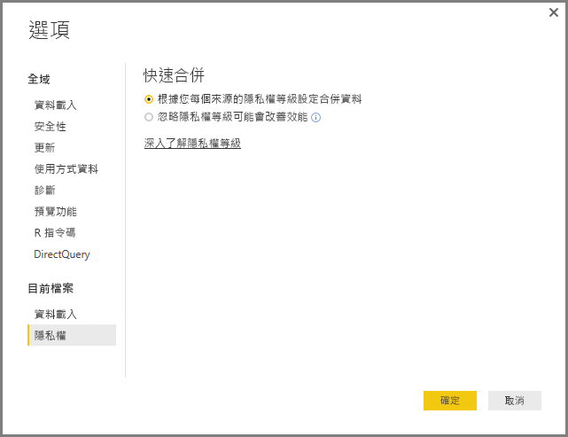
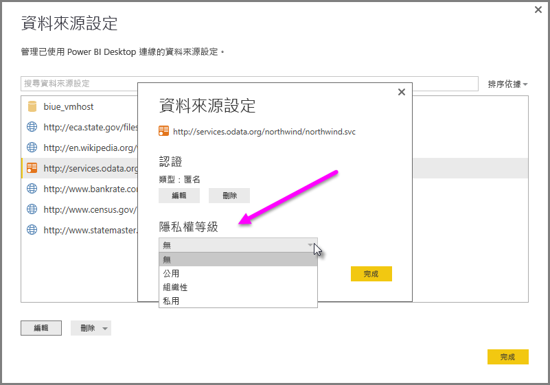

# Power BI Desktop 隱私權等級
在 **Power BI Desktop** 中，隱私權等級會指定某個資料來源與其他資料來源隔離程度的隔離等級。 雖然嚴格的隔離等級能夠阻擋資料來源交換資訊，卻可能會降低功能並影響效能。

位於 [檔案] > [選項及設定] > [選項] 之 [目前的檔案] > [隱私權] 下的 [隱私權等級] 設定可決定 Power BI Desktop 合併資料時是否使用 [隱私權等級] 設定。 這個對話方塊包含 Power BI Desktop 文件中有關 [隱私權等級] 和 [隱私權等級] 的連結 (即本文)。

 每個資料來源的 [隱私權] 設定對話方塊皆位於 [檔案] > [選項及設定] > [資料來源設定] 下。 請選取資料來源，然後選取 [編輯] 。 [資料來源設定]  對話方塊隨即出現，您可在對話方塊底部的下拉式功能表中選取適當的隱私權等級，如下圖所示。

 

> [!CAUTION]
> 包含高度敏感或機密資料的資料來源應設定為 [私人]。
> 
> 

## 設定隱私權等級
利用隱私權等級設定，您可指定某個資料來源與其他資料來源隔離程度的隔離等級。

| 設定 | 描述 | 資料來源範例 |
| --- | --- | --- |
| **私人資料來源** |[私人]  資料來源包含敏感或機密資訊，而且可以限制只有授權的使用者才能看到資料來源。 私人資料來源與其他資料來源完全隔離。 |Facebook 資料、包含股票獎酬的文字檔案或包含員工績效考核資訊的活頁簿。 |
| **組織資料來源** |[組織]  資料來源限制只有受信任的一群人才能看到資料來源。 [組織]  資料來源與所有 [公用]  資料來源相隔離，但與其他 [組織]  資料來源可彼此互見。 |內部網路 SharePoint 網站上啟用了信任群組權限的 **Microsoft Word** 文件。 |
| **公用資料來源** |[公用]  資料來源允許所有人看到資料來源中所包含的資料。 只有檔案、網際網路資料來源或活頁簿資料可以標示為 [公用] 。 |Microsoft Azure Marketplace 的可用資料、維基百科頁面的可用資料，或包含公開網頁複製資料的本機檔案。 |

## 設定隱私權等級設定
每個資料來源的 [隱私權] 設定對話方塊皆位於 [檔案] > [選項及設定] > [資料來源設定] 下。

若要設定資料來源的隱私權等級，請選取資料來源，然後選取 [編輯] 。 [資料來源設定]  對話方塊隨即出現，您可在對話方塊底部的下拉式功能表中選取適當的隱私權等級，如下圖所示。

> [!CAUTION]
> 包含高度敏感或機密資料的資料來源應設定為 [私人]。
> 

## 設定隱私權等級
[隱私權等級] 是預設為 [根據您每個來源的隱私權等級設定合併資料] 的設定，表示並未啟用 [隱私權等級]。

| 設定 | 描述 |
| --- | --- |
| \[根據您每個來源的隱私權等級設定合併資料] \(開啟，預設設定) |合併資料時使用隱私權等級設定決定資料來源的隔離等級。 |
| \[忽略隱私權等級可能會改善效能] \(關閉) |合併資料時不考慮隱私權等級，但可能會提高資料的效能和功能。 |

> **安全性注意事項：**在 [隱私權等級] 對話方塊中選取 [忽略隱私權等級可能會改善效能] 以啟用 [隱私權等級]，可能會將敏感或機密資料暴露給未經授權的人員。 除非確定資料來源不包含敏感或機密資料，否則請勿啟用 [隱私權等級]。
> 
> 

**設定隱私權等級**

在 Power BI Desktop 或 查詢編輯器 中，選取 **檔案 > 選項及設定 > 選項**，然後選取 **目前的檔案 > 隱私權**.

a. 選取 [根據您每個來源的隱私權等級設定合併資料] 後，就會根據您的 [隱私權等級] 設定合併資料。 跨隱私權隔離區域合併資料會導致某些資料緩衝。

b. 選取 [忽略隱私權等級可能會改善效能] 後，就會忽略 [隱私權等級] 合併資料，這樣可能會將敏感或機密資料洩露給未經授權的使用者。 此設定可能會改善效能和功能。

> **安全性注意事項：** 選取 [忽略隱私權等級可能會改善效能]  可能會改善效能，但是 Power BI Desktop 無法確保資料合併到 Power BI Desktop 檔案後的隱私權。
> 
> 

