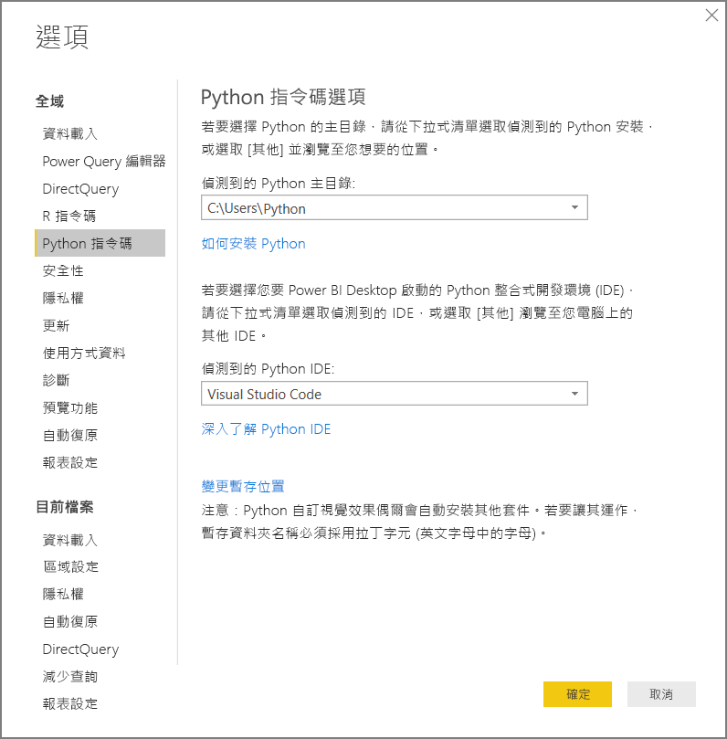
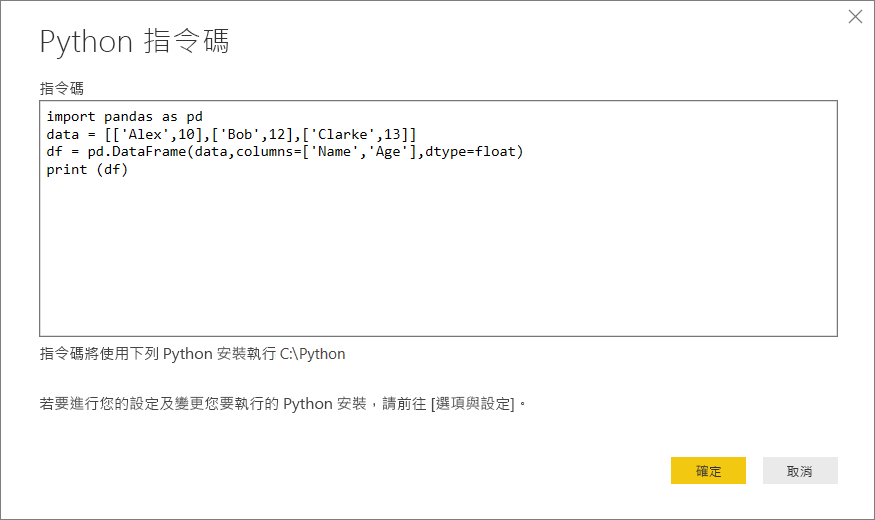
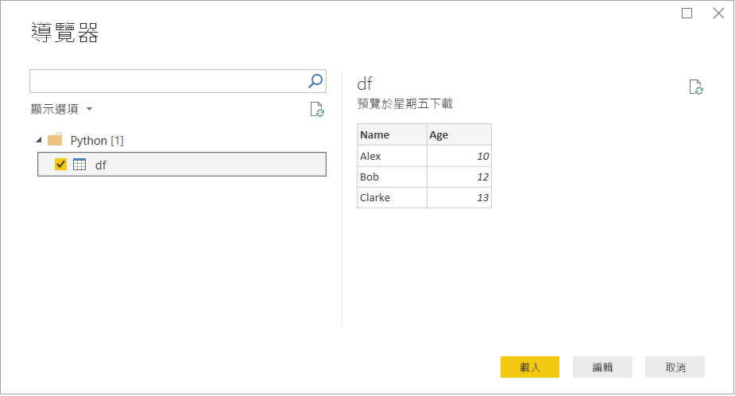

# <a name="run-python-scripts-in-power-bi-desktop"></a>在 Power BI Desktop 中執行 Python 指令碼

您可以直接在 Power BI Desktop 中執行 Python 指令碼，並將產生的資料集匯入 Power BI Desktop 資料模型。

## <a name="install-python"></a>安裝 Python

若要在 Power BI Desktop 中執行 Python 指令碼，您需要在本機電腦上安裝 Python。 您可以從 [Python 網站](https://www.python.org/)下載 Python。 目前的 Python 指令碼版本支援在安裝路徑中使用 Unicode 字元和空格。

### <a name="install-required-python-packages"></a>安裝必要的 Python 套件

Power BI Python 整合會要求安裝兩個 Python 套件：

* [Pandas](https://pandas.pydata.org/)。 適用於資料操作及分析的軟體程式庫。 它能提供資料結構和作業來操作數值資料表和時間序列。 您所匯入的資料必須處於 [Pandas 資料框架](https://www.tutorialspoint.com/python_pandas/python_pandas_dataframe.htm) \(英文\)。 資料框架是二維資料結構。 例如，資料會以表格式的方式在資料列和資料行中對齊。
* [Matplotlib](https://matplotlib.org/)。 適用於 Python 及其數值數學延伸模組 [NumPy](https://www.numpy.org/) \(英文\) 的繪製程式庫。 其提供物件導向的 API，以使用一般用途 GUI 工具組 (例如 Tkinter、wxPython、Qt 或 GTK+) 將繪圖內嵌至應用程式。

在主控台或殼層中，請使用 [pip](https://pip.pypa.io/en/stable/) \(英文\) 命令列工具來安裝這兩個套件。 pip 工具會和較新的 Python 版本一起封裝。

```CMD
pip install pandas
pip install matplotlib
```

## <a name="enable-python-scripting"></a>啟用 Python 指令碼

啟用 Python 指令碼：

1. 在 Power BI Desktop 中，選取 [檔案]   > [選項及設定]   > [選項]   > [Python 指令碼]  。 [Python 指令碼選項]  頁面隨即出現。

   

1. 如有需要，請在 [偵測到的 Python 主目錄]  中指定您的本機 Python 安裝路徑。

   在上圖中，Python 的安裝本機路徑是 *C:\Python*。 請確認該路徑是您希望 Power BI Desktop 使用之本機 Python 安裝的路徑。

1. 選取 [確定]  。

指定 Python 安裝後，您就可以開始在 Power BI Desktop 中執行 Python 指令碼。

## <a name="run-python-scripts"></a>執行 Python 指令碼

只要幾個步驟，您就可以執行 Python 指令碼並建立資料模型。 從這個模型，您可以建立報表並在 Power BI 服務上共用它們。

### <a name="prepare-a-python-script"></a>準備 Python 指令碼

首先，請在本機 Python 開發環境中建立指令碼，並確定它能順利執行。 例如，以下是能匯入 Pandas 並使用資料框架的簡單 Python 指令碼：

```python
import pandas as pd
data = [['Alex',10],['Bob',12],['Clarke',13]]
df = pd.DataFrame(data,columns=['Name','Age'],dtype=float)
print (df)
```

執行時，此指令碼會傳回：

```python
     Name   Age
0    Alex  10.0
1     Bob  12.0
2  Clarke  13.0
```

在 Power BI Desktop 中準備和執行 Python 指令碼時，會有一些限制：

* 只有 Pandas 資料框架會匯入，因此請確定您要匯入至 Power BI 的資料都位於資料框架中
* 任何 Python 指令碼若執行時間超過 30 分鐘就會逾時
* 在 Python 指令碼中的互動式呼叫 (例如等待使用者輸入) 會中止指令碼執行
* 在 Python 指令碼中設定工作目錄時，您「必須」  定義工作目錄的完整路徑，而非相對路徑
* 目前不支援巢狀資料表

### <a name="run-your-python-script-and-import-data"></a>執行 Python 指令碼並匯入資料

在 Power BI Desktop 中執行 Python 指令碼：

1. 在 [首頁] 功能區中，選取 [取得資料]   > [其他]  。

1. 選取 [其他]   > [Python 指令碼]  ，如下圖所示：

   

1. 選取 [連接]  。 系統會選取本機所安裝的最新 Python 版本作為 Python 引擎。 將指令碼複製到隨即顯示的 [Python 指令碼]  對話方塊中。 在這裡，我們會輸入先前所示的簡單 Python 指令碼。

   

1. 選取 [確定]  。 如果該指令碼能成功執行，[導覽器]  便會出現，而您將能載入資料並使用它。 針對此範例，請選取 [df]  \(如影像中所示\)，然後選取 [載入]  。

    

### <a name="troubleshooting"></a>疑難排解

如果尚未安裝或識別 Python，系統便會顯示警告。 如果您有多個本機電腦安裝，也可能會看見警告。 請重新瀏覽並檢閱先前的＜安裝 Python＞及＜啟用 Python 指令碼＞小節。


#### <a name="using-custom-python-distributions"></a>使用自訂 Python 發佈版本

Power BI 會以使用者所提供目錄 (透過設定頁面提供) 中的 python.exe 可執行檔來直接執行指令碼。 需要額外步驟來準備環境 (例如 Conda) 的發佈版本可能會在執行失敗時遇到問題。

我們建議使用從 https://www.python.org/ 取得的正式 Python 發佈版本，以避免相關問題。

作為其中一個可行的解決方案，您可以從自訂 Python 環境提示字元中啟動 Power BI Desktop。

### <a name="refresh"></a>重新整理

您可以在 Power BI Desktop 中重新整理 Python 指令碼。 若要重新整理，請移至 [常用]  功能區並選取 [重新整理]  。 當您重新整理 Python 指令碼時，Power BI Desktop 會再次執行 Python 指令碼。

## <a name="next-steps"></a>後續步驟

請查看下列有關 Power BI 中 Python 的其他資訊。

* [在 Power BI Desktop 中建立 Python 視覺效果](desktop-python-visuals.md)
* [透過 Power BI 使用外部 Python IDE](desktop-python-ide.md)
