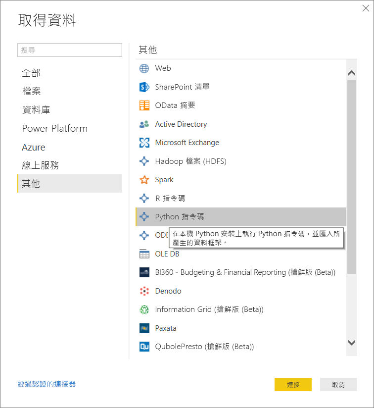
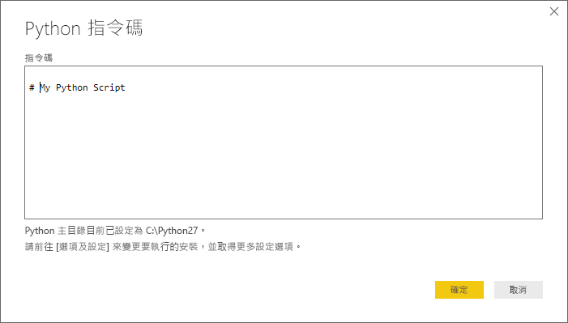
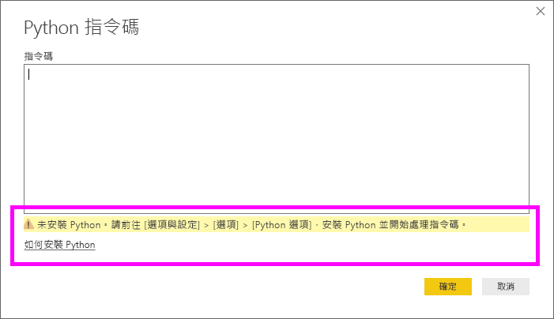
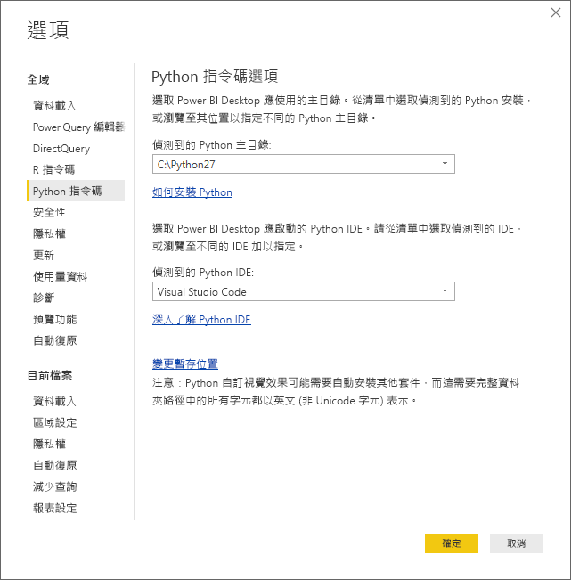

# <a name="run-python-scripts-in-power-bi-desktop"></a>在 Power BI Desktop 中執行 Python 指令碼
您可以直接在 **Power BI Desktop** 中執行 Python 指令碼，並將產生的資料集匯入 Power BI Desktop 資料模型。

## <a name="install-python"></a>安裝 Python
若要在 Po木wer BI Desktop 中執行 Python 指令碼，您需要在本機電腦上安裝 **Python**。 您可以從許多位置免費下載並安裝 **Python**，包括[官方 Python 下載頁面](https://www.python.org/)以及 [Anaconda](https://anaconda.org/anaconda/python/)。 Power BI Desktop 目前版本的 Python 指令碼支援在安裝路徑中使用 Unicode 字元和空格 (空白字元)。

### <a name="install-required-python-packages"></a>安裝必要的 Python 套件
Power BI Python 整合要求您必須安裝兩個 Python 套件 (Pandas 與 Matplotlib)。  使用 pip 命令列工具安裝下列兩個套件。

```
pip install pandas
pip install matplotlib
```

## <a name="run-python-scripts"></a>執行 Python 指令碼
只需 Power BI Desktop 中的幾個步驟，您就可以執行 Python 指令碼和建立資料模型，從中您可以建立報表，並在 Power BI 服務上共用。

### <a name="prepare-a-python-script"></a>準備 Python 指令碼
若要在 Power BI Desktop 中執行 Python 指令碼，請在本機 Python 開發環境中建立指令碼，並確定已順利執行。

若要在 Power BI Desktop 執行該指令碼，請確定該指令碼可在新的和未修改的工作區中順利執行。 這表示，所有套件和相依性都必須明確地載入並執行。

在 Power BI Desktop 中準備和執行 Python 指令碼時，會有一些限制：

* 只有 Pandas 資料框架會匯入，因此請確定您要匯入至 Power BI 的資料都位於資料框架中
* 任何 Python 指令碼若執行時間超過 30 分鐘就會逾時
* 在 Python 指令碼中的互動式呼叫 (例如等待使用者輸入) 會中止指令碼執行
* 在 Python 指令碼中設定工作目錄時，您「必須」定義工作目錄的完整路徑，而非相對路徑
* 目前不支援巢狀資料表 (包含多個資料表的資料表) 

### <a name="run-your-python-script-and-import-data"></a>執行 Python 指令碼並匯入資料
1. 在 Power BI Desktop 中，Python 指令碼資料連接器可在 [取得資料] 中找到。 若要執行 Python 指令碼，請選取 [取得資料] &gt; [其他...]，然後選取 [其他] &gt; [Python 指令碼]，如下圖所示：
   
   
2. 如果您的本機電腦上安裝了 Python，就會選取安裝的最新版本作為 Python 引擎。 只要將您的指令碼複製到指令碼視窗，然後選取 [確定] 。
   
   
3. 如果未安裝且未識別 Python，或者本機電腦上有多個安裝，將會顯示警告。
   
   
   
   Python 安裝設定集中位於 [選項] 對話方塊的 [Python 指令碼] 區段。 若要指定 Python 安裝設定，請選取 [檔案] > [選項和設定]，然後選取 [選項] > [Python 指令碼]。 如果有多個 Python 安裝，則會顯示下拉式功能表，讓您選取要使用的安裝。 您也可以選取 [其他] 並提供自訂路徑。
   
   
4. 選取 [確定] 來執行 Python 指令碼。 當指令碼順利執行時，您可以選擇要加入 Power BI 模型之產生的資料框架。

### <a name="refresh"></a>重新整理
您可以在 Power BI Desktop 中重新整理 Python 指令碼。 當您重新整理 Python 指令碼時，Power BI Desktop 會在 Power BI Desktop 環境中再次執行 Python 指令碼。

## <a name="next-steps"></a>後續步驟
請查看下列有關 Power BI 中 Python 的其他資訊。

* [在 Power BI Desktop 中建立 Python 視覺效果](desktop-python-visuals.md)
* [透過 Power BI 使用外部 Python IDE](desktop-python-ide.md)
