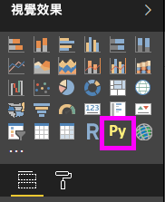
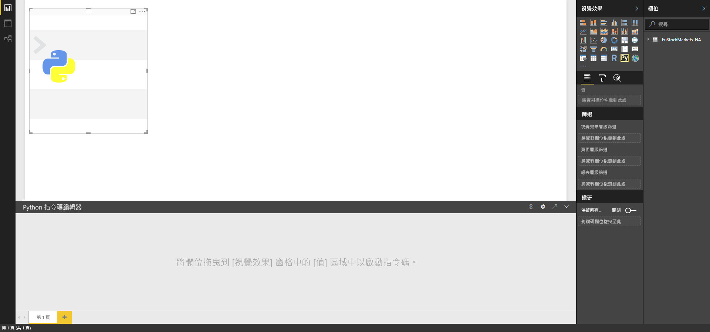
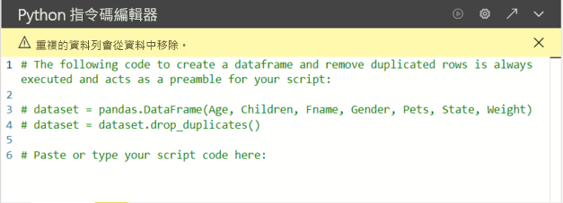

# <a name="create-power-bi-visuals-by-using-python"></a>使用 Python 建立 Power BI 視覺效果

有了 *Power BI Desktop*，您就可以使用 Python 將資料視覺化。

## <a name="prerequisites"></a>必要條件

使用下列 Python 指令碼逐步執行[在 Power BI Desktop 中執行 Python 指令碼](desktop-python-scripts.md)教學課程：

```python
import pandas as pd 
df = pd.DataFrame({ 
    'Fname':['Harry','Sally','Paul','Abe','June','Mike','Tom'], 
    'Age':[21,34,42,18,24,80,22], 
    'Weight': [180, 130, 200, 140, 176, 142, 210], 
    'Gender':['M','F','M','M','F','M','M'], 
    'State':['Washington','Oregon','California','Washington','Nevada','Texas','Nevada'],
    'Children':[4,1,2,3,0,2,0],
    'Pets':[3,2,2,5,0,1,5] 
}) 
print (df) 
```

[在 Power BI Desktop 中執行 Python 指令碼](desktop-python-scripts.md)一文會示範如何在本機電腦上安裝 Python，並在 Power BI Desktop 中予以啟用以進行 Python 指令碼撰寫。 本教學課程會使用來自上述指令碼的資料來說明如何建立 Python 視覺效果。

## <a name="create-python-visuals-in-power-bi-desktop"></a>在 Power BI Desktop 中建立 Python 視覺效果

1. 在 [視覺效果]  窗格中，選取 [Python 視覺效果]  圖示。

   

1. 在隨即顯示的 [啟用指令碼視覺效果]  對話方塊中，選取 [啟用]  。

    當您將 Python 視覺效果新增至報表時，Power BI Desktop 會執行下列動作：

    - 報表畫布上會出現預留位置 Python 視覺影像。

    - [Python 指令碼編輯器]  會隨即顯示在中央窗格的底部。

    

1. 接下來，將 [Age]  \(年齡\)、[Children]  \(子女數\)、[Fname]  \(名字\)、[Gender]  \(性別\)、[Pets]  \(寵物數\)、[State]  \(州\) 及 [Weight]  \(體重\) 欄位拖曳至 [值]  區段顯示 [於此處新增資料欄位]  的位置。

    ![拖曳至 [於此處新增資料欄位]](media/desktop-python-visuals/python-visuals-15.png)

   您的 Python 指令碼只能使用新增至 [值]  區段的欄位。 在處理 Python 指令碼時，您可以針對 [值]  區段新增或移除欄位。 Power BI Desktop 會自動偵測欄位變更。

   > [!NOTE]
   > Python 視覺效果的預設彙總類型為「不摘要」  。
   > 
   > 

1. 現在您可以使用選取的資料來建立繪圖。

    在您選取或移除欄位時，[Python 指令碼編輯器] 中的支援程式碼會隨之自動產生或移除。 

    依據您選取的項目，[Python 指令碼編輯器] 會產生下列繫結程式碼。

    - 編輯器已建立 [資料集]  資料框架，其中有您所新增的欄位。
    - 預設彙總為：[不摘要]  。
    - 類似於資料表視覺效果，欄位會進行分組，且重複的資料列只會出現一次。

    

     > [!TIP]
     > 在某些情況下，您可能不想要自動分組，或您希望顯示所有的資料列 (包括重複項目在內)。 若是如此，您可以將索引欄位加入資料集中，如此所有的資料列都會被視為唯一，且不會進行分組。

   您可以使用資料行的相對應名稱來在資料集中存取它們。 例如，您可以在 Python 指令碼中編寫 `dataset["Age"]`，以存取 [Age] \(年齡\) 欄位。

1. 由於資料框架是由您選取的欄位自動產生，因此您可以撰寫 Python 指令碼，進而繪製到 Python 預設裝置。 完成指令碼之後，請從 [Python 指令碼編輯器]  標題列選取 [執行]  。

   發生下列任一種狀況時，Power BI Desktop 會重新繪製視覺效果：

   - 當您從 [Python 指令碼編輯器]  標題列選取 [執行]  時
   - 每當因資料重新整理、篩選或反白顯示而發生資料變更時

   當執行 Python 指令碼並產生錯誤時，Python 視覺效果不會進行繪製，且會顯示畫布錯誤訊息。 如需錯誤詳細資料，請選取訊息中的 [查看詳細資料]  。

   若要取得更大的視覺效果檢視，您可以將 [Python 指令碼編輯器]  最小化。

好，讓我們來建立一些視覺效果。

## <a name="create-a-scatter-plot"></a>建立散佈圖

讓我們建立散佈圖，來查看年齡和體重之間是否有關聯性。

1. 在 [在此貼上或鍵入您的指令碼]  底下，輸入此程式碼：

   ```python
   import matplotlib.pyplot as plt 
   dataset.plot(kind='scatter', x='Age', y='Weight', color='red')
   plt.show() 
   ```  

   您的 [Python 指令碼編輯器] 窗格現在看起來應該像這樣：

   

   已匯入 **matplotlib** 程式庫來繪製及建立視覺效果。

1. 當您選取 [執行]  指令碼按鈕時，便會在預留位置 Python 視覺效果影像中產生下列散佈圖。

   

## <a name="create-a-line-plot-with-multiple-columns"></a>搭配多個資料行建立折線圖

 讓我們為每個人建立折線圖，來顯示他們的子女及寵物的數目。 將 [在此貼上或鍵入您的指令碼]  底下的程式碼移除或註解化，然後輸入此 Python 程式碼：

 ```python
 import matplotlib.pyplot as plt 
ax = plt.gca() 
dataset.plot(kind='line',x='Fname',y='Children',ax=ax) 
dataset.plot(kind='line',x='Fname',y='Pets', color='red', ax=ax) 
plt.show() 
```

當您選取 [執行]  指令碼按鈕時，系統便會產生下列搭配多個資料行的折線圖。


## <a name="create-a-bar-plot"></a>建立橫條圖

讓我們針對每個人的年齡建立橫條圖。 將 [在此貼上或鍵入您的指令碼]  底下的程式碼移除或註解化，然後輸入此 Python 程式碼：

```python
import matplotlib.pyplot as plt 
dataset.plot(kind='bar',x='Fname',y='Age') 
plt.show() 
```

當您選取 [執行]  指令碼按鈕時，系統會產生下列橫條圖：

 

## <a name="security"></a>安全性

> [!IMPORTANT] 
> **Python 指令碼的安全性︰** Python 視覺效果是從 Python 指令碼建立，其中的程式碼可能具有安全性或隱私權風險。 初次嘗試檢視 Python 視覺效果或與其互動時，使用者會看到安全性警告訊息。 請在信任作者與來源，或已檢閱並了解 Python 指令碼之後，才啟用 Python 視覺效果。
>  

## <a name="more-information-about-plotting-with-matplotlib-pandas-and-python"></a>搭配 Matplotlib、Pandas 及 Python 進行繪製的詳細資訊

此教學課程是設計來協助您在 Power BI Desktop 中開始搭配 Python 建立視覺效果。 只能稍微說明使用 Python、Pandas 及 Matplotlib 程式庫來建立視覺效果報表的許多選項及功能。 還有許多等待您發掘的詳細資訊，而這裡有一些連結可供您開始探索。

- [Matplotlib](https://matplotlib.org/) \(英文\) 網站上的文件。 
- [Matplotlib 教學課程：搭配 Python 使用 Matplotlib 的基本指南](https://www.datasciencelearner.com/matplotlib-tutorial-complete-guide-to-use-matplotlib-with-python/) \(英文\) 
- [Matplotlib 教學課程 – Python Matplotlib 程式庫及範例](https://www.edureka.co/blog/python-matplotlib-tutorial/) \(英文\) 
- [Pandas API 參考](https://pandas.pydata.org/pandas-docs/stable/reference/index.html) \(英文\) 
- [Power BI 服務中的 Python 視覺效果](https://powerbi.microsoft.com/blog/python-visualizations-in-power-bi-service/) \(英文\) 
- [在 Power BI 中使用 Python 視覺效果](https://www.absentdata.com/how-to-user-python-and-power-bi/) \(英文\)

## <a name="known-limitations"></a>已知的限制

Power BI Desktop 中的 Python 視覺效果有一些限制：

- 資料大小限制。 Python 視覺效果用於繪製的資料限制為 150,000 個資料列。 如果選取超過 150,000 個資料列，則只會使用前 150,000 個資料列，而且影像上會顯示訊息。 此外，輸入資料的限制為 250 MB。 
- 解決方法。 所有 Python 視覺效果都會以 72 DPI 顯示。
- 計算時間限制。 如果 Python 視覺效果計算超過五分鐘，執行時間會逾時並導致錯誤。
- 關聯性。 如同其他 Power BI Desktop 視覺效果，如果選取來自不同資料表的資料欄位，而其之間沒有定義關聯性，即會發生錯誤。
- Python 視覺效果會在資料更新、篩選及醒目提示時進行重新整理。 不過，影像本身不是互動式，因此不得為交叉篩選的來源。
- Python 視覺效果會回應醒目提示其他視覺效果，但您不能按一下 Python 視覺效果中的元素來交叉篩選其他元素。
- 只有繪製到 Python 預設顯示裝置的繪圖才會在畫布上正確顯示。 避免明確地使用不同的 Python 顯示裝置。
- Python 視覺效果不支援重新命名輸入資料行。 在指令碼執行期間，資料行會以其原始名稱來參考。

## <a name="next-steps"></a>後續步驟

請查看下列有關 Power BI 中 Python 的其他資訊。

- [在 Power BI Desktop 中執行 Python 指令碼](desktop-python-scripts.md)
- [透過 Power BI 使用外部 Python IDE](desktop-python-ide.md)

