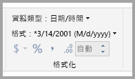
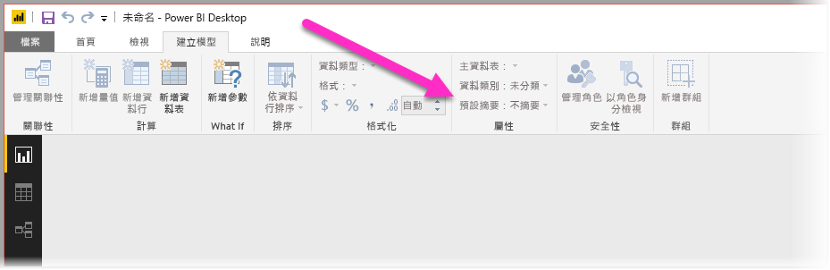
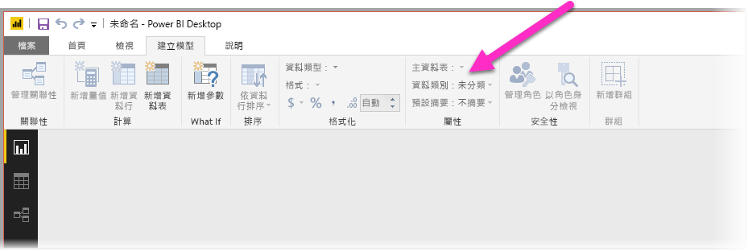
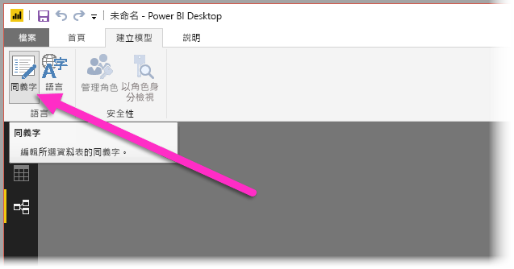
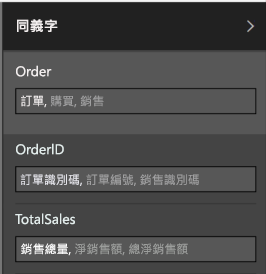

# 使用 Power BI Desktop 中的自然語言查詢問與答
使用一般片語和自然語言來詢問資料問題的功能十分強大。 甚至在資料回答時更為強大，這是 **Power BI Desktop** 中的問與答可讓您執行的作業。

若要讓問與答成功解譯可回應的大量問題，問與答必須對模型進行假設。 如果您模型的結構不符合其中一或多個假設，則需要調整模型。 不論是否使用問與答，這些問與答調整都是 Power BI 中任何模型的相同最佳做法最佳化。 

> [!NOTE]
> 只有在使用包含**已匯入**資料的模型時，才能使用「問與答」。 不支援即時連線至 SSAS 和 DirectQuery 模型。
>
>

在下列各節中，我們會描述如何調整您的模型，讓它適用於 Power BI 問與答。

## 新增遺漏的關聯性

如果您的模型遺漏資料表之間的關聯性，則在您詢問有關它們的問題時，Power BI 報表和問與答都無法解譯如何聯結這些資料表。 關聯性是良好模型的基石。 例如，如果遺漏「訂單」資料表與「客戶」資料表之間的關聯性，則無法詢問「西雅圖客戶總銷售額」。 下列各影像顯示多個需要運作的模型範例，以及一個已適用於問與答的模型。

**有待加強**

**已備妥可供問與答**

## 重新命名資料表和資料行

選擇的資料表和資料行對於問與答而言十分重要。 例如，如果您有一個名為 *CustomerSummary* 的資料表包含一份客戶名單，則需要詢問「列出芝加哥客戶摘要」這類問題，而非「列出芝加哥客戶」。 

雖然問與答可以對複數執行一些基本斷詞和偵測，但問與答假設您的資料表和資料行名稱正確地反映其內容。

請考慮另一個範例。 假設您有一個名為 *Headcount* 的資料表包含名字、姓氏和員工編號，而且您有另一個名為 *Employees* 的資料表包含員工編號、作業編號和開始日期。 雖然熟悉模型的人員可能了解這種情況，但詢問「計算員工人數」的其他人將會取得「員工」資料表中的資料列計數 (這可能不是他們記得的資料列計數)，因為這是每位員工曾經有過之每個作業的計數。 最好重新命名這些資料表，以確實反映它們所包含的項目。

**有待加強**

**已備妥可供問與答**

## 修正不正確的資料類型

已匯入資料的資料類型可能不正確。 特別的是，問與答不會將匯入為「字串」的「日期」和「數字」資料行解譯為日期和數字。 您應該確定在 Power BI 模型中選取正確的資料類型。

## 將年和識別碼資料行標示為「不摘要」

Power BI 預設會積極地彙總數值資料行，因此「年度總銷售額」這類問題有時可能會導致總銷售量以及年度總銷售額。 如果您有不想讓 Power BI 顯示此行為的特定資料行，請將資料行上的 [摘要方式] 屬性設定為 [不摘要]。 請注意「年」、「月」、「日」和「識別碼」資料行，因為這些資料行最常發生問題。 其他與加總無關的資料行 (例如「年齡」) 也可以獲益於將 [摘要方式] 設定為 [不摘要] 或 [平均]。 您可以在 [模型化] 索引標籤中找到此設定。

## 選擇每個日期和地理位置資料行的資料類別

「資料類別」提供其資料類型以外之資料行內容的其他語意知識。 例如，整數資料行可能會標示為「郵遞區號」、字串資料行可能會標示為「縣 (市)」、「國家/地區」、「區域」等等。 問與答透過兩種重要方式使用這項資訊：適用於視覺效果選取和語言偏差。

首先，問與答會使用**資料類別**資訊，協助選擇要使用的視覺效果顯示類型。 例如，它會辨識具有日期或時間「資料類別」的資料行通常是折線圖水平軸或泡泡圖播放軸的不錯選擇。 而且，它假設包含具有地理位置**資料類別**之資料行的結果在地圖上可能可呈現不錯的效果。

其次，問與答會對使用者可能如何討論日期和地理位置資料行進行有根據的猜測，有助於了解特定類型的問題。 例如，“When was John Smith hired?” 中的 “when” 幾乎確定是對應至日期資料行，而 “Count customers in Brown” 中的 “Brown” 最可能是縣 (市)，而不是頭髮顏色。

## 為相關資料行選擇依資料行排序

[依資料行排序] 屬性容許根據一個資料行排序，以自動改為依不同的資料行排序。 例如，當您詢問「依襯衫大小排序客戶」時，可能會想要依基礎大小數字 (XS、S、M、L、XL) 排序「襯衫大小」資料行，而不是依字母順序 (L、M、S、XL、XS)。

## 將模型正規化

請放心，我們不會建議您需要重新調整整個模型。 不過，有特定的簡單結構，因此問與答很難適當地處理它們。 如果您對模型結構執行一些基本正規化，則 Power BI 報表的使用性會大幅增加，而且問與答結果的精確度也會大幅增加。

您應該遵循的一般規則如下：使用者所談論的每個唯一「項目」都只能由一個模型物件 (資料表或資料行) 表示。 因此，如果您的使用者談論客戶，則應該有一個「客戶」物件。 而且，如果您的使用者談論銷售額，則應該有一個「銷售額」物件。 聽起來很簡單，不是嗎？ 根據您開始使用的資料形式，這可能是這樣。 如果您需要資料成形功能，則 [查詢編輯器] 中提供豐富的資料成形功能，而且只要在 Power BI 模型中使用計算就可以進行許多更直接的轉換。

下列各節包含您可能需要執行的一些常見轉換。

### 建立多資料行實體的新資料表

如果您有多個資料行作為較大資料表內的單一不同單位，則這些資料行應該分割成其專屬資料表。 例如，如果您的「公司」資料表內有「連絡人姓名」、「連絡人職稱」和「連絡人電話」資料行，則較好的設計是具有一個內含「姓名」、「職稱」和「電話」的不同「連絡人」資料表，以及一個返回「公司」資料表的連結。 這樣可大幅簡化有關連絡人問題的詢問，而且與本身是連絡人之公司的問題無關，並可改善顯示彈性。

**有待加強**

**已備妥可供問與答**

### 樞紐以消除屬性包

如果您的模型中有屬性包，則應該重建它們，讓一個屬性有一個資料行。 雖然屬性包方便管理大量屬性，但是有許多未設計 Power BI 報表和 Q&A 解決的固有限制。

例如，請考慮具有 CustomerID、Property 和 Value 資料行的 *CustomerDemographics* 資料表，而每個資料列都代表客戶的不同屬性 (例如，年齡、婚姻狀態、縣 (市) 等等)。 根據「屬性」資料行的內容來多載「值」資料行的意義，就無法讓問與答來解譯大部分參考它的查詢。 「顯示每個客戶的年齡」這類簡單問題可能有用，因為它可能解譯為「顯示屬性為年齡的客戶和客戶人口統計」。 不過，模型結構不只是支援稍微複雜的問題，例如「芝加哥客戶的平均年齡」。 雖然直接編寫 Power BI 報表的使用者有時可能會找到聰明的方式來取得所尋找的資料，但是問與答只適用於每個資料行只有單一意義時。

**有待加強**

**已備妥可供問與答**

### 聯集以消除資料分割

如果將您的資料分割為多個資料表，或具有跨多個資料行的樞紐值，則您的使用者很難或無法達成數個常見作業。 請先考慮一般資料表資料分割：*Sales2000-2010* 資料表和 *Sales2011-2020* 資料表。 如果所有重要報表限制為特定十年，則可能可以用於 Power BI 報表。 不過，問與答彈性會導致您的使用者預期會有「年度總銷售額」這類問題的解答。 針對此目的，您需要將資料聯集至單一 Power BI 模型資料表。

同樣地，請考慮一般樞紐值資料行：包含 Author、Book、City1、City2 和 City3 資料行的 *BookTour* 資料表。 具有與此類似的結構，甚至無法正確解譯「依縣 (市) 計算書籍數」這類簡單問題。 針對此目的，您應該建立不同的 *BookTourCities* 資料表，其將縣 (市) 值聯集到單一資料行。

**有待加強**

**已備妥可供問與答**

### 分割格式化資料行

如果您從中匯入資料的來源包含格式化資料行，則 Power BI 報表 (和問與答) 將不會到達要剖析其內容的資料行。 因此，如果您的「完整地址」資料行包含地址、縣 (市) 和國家/地區，則也應該將它分割為「地址」、「縣 (市)」和「國家/地區」資料行，讓使用者可以個別對其查詢。

**有待加強**

**已備妥可供問與答**

同樣地，如果您有人員的任何全名資料行，則會想要新增「名字」和「姓氏」資料行，但只在有人想要使用一部分名稱來詢問問題時。 

### 建立多重值資料行的新資料表

在類似的情況下，如果您從中匯入資料的來源包含多重值資料行，則 Power BI 報表 (和問與答) 將不會到達要剖析內容的資料行。 因此；例如，如果您的「作曲者」資料行包含某首歌的多位作曲者姓名，則應該將它分割為不同「作曲者」資料表中的多個資料列。

**有待加強**

**已備妥可供問與答**

### 反正規化以刪除非作用中關聯性

取得從某個資料表到另一個資料表的多個路徑時，會發生「正規化更好」規則的其中一個例外狀況。 例如，如果您的 *Flights* 資料表 包含 SourceCityID 和 DestinationCityID 資料行，則每個資料行都會與 *Cities* 資料表有關，而其中一個關聯性必須標示為非作用中。 因為問與答只可以使用作用中關聯性，所以您將無法詢問有關來源或目的地的問題 (根據您選擇的問題)。 如果您改為將縣 (市) 名稱資料行反正規化到 *Flights* 資料表，則可以詢問這類問題：「列出明天起飛的班機，起飛縣 (市) 是西雅圖，而目的地縣 (市) 是舊金山」。

**有待加強**

**已備妥可供問與答**

### 將同義字新增至資料表和資料行

此步驟專用於問與答，而且一般不適用於 Power BI 報表。 使用者通常會有用來參考相同事物的各種詞彙，例如總銷售額、淨銷售額、總淨銷售額。 Power BI 的模型容許將這些同義字新增至模型內的資料表和資料行。 

這可能是非常重要的步驟。 即使使用明顯易懂的資料表和資料行名稱，問與答使用者會使用首次出現的詞彙來詢問問題，並且不會從預先定義的資料行清單中進行選擇。 您可新增的同義字越有意義，您報表的使用者體驗就會越好。 若要新增同義字，請在 [關聯性] 檢視的功能區中選取 [同義字] 按鈕，如下圖所示。

[同義字] 欄位會出現在 **Power BI Desktop** 右側，而您可以在其中新增同義字，如下圖所示。

 新增同義字時請小心，因為將相同的同義字新增至多個資料行或資料表會造成模稜兩可。 如果可行，問與答會利用內容以在模稜兩可的同義字之間進行選擇，但並非所有問題都有足夠的內容。 例如，當您的使用者詢問「計算客戶數」時，如果您的模型中有三個具有同義字「客戶」的項目，則他們可能無法取得所要的解答。 在這些情況下，請確定主要同義字是唯一的，因為這是用於重新陳述的同義字。 它可以警告使用者發生模稜兩可 (例如重新陳述「顯示已封存客戶記錄的數目」)，以提示他們可能想要以不同的方式詢問。

## 後續步驟
如需 Power BI Desktop 中功能的詳細資訊，請查看下列文章：

* [在 Power BI Desktop 中使用鑽研](desktop-drillthrough.md)
* [以焦點模式顯示儀表板磚或報表視覺效果](service-focus-mode.md)

