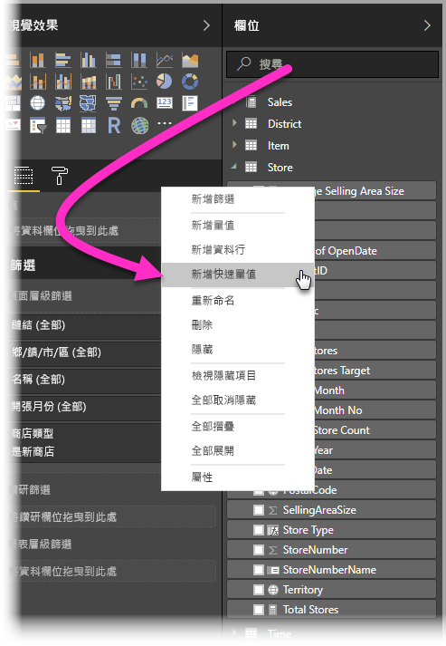
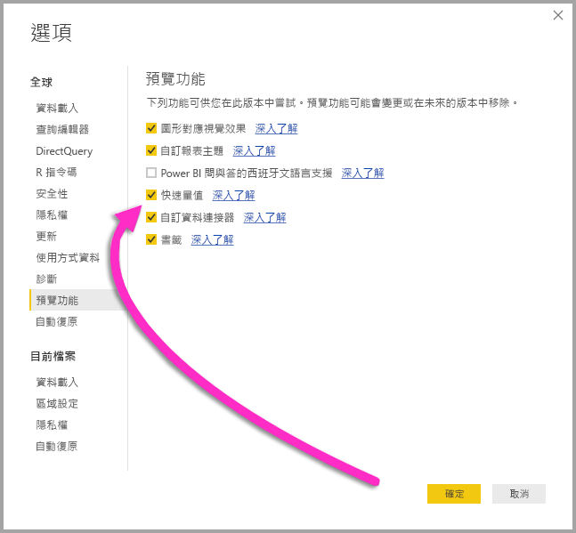
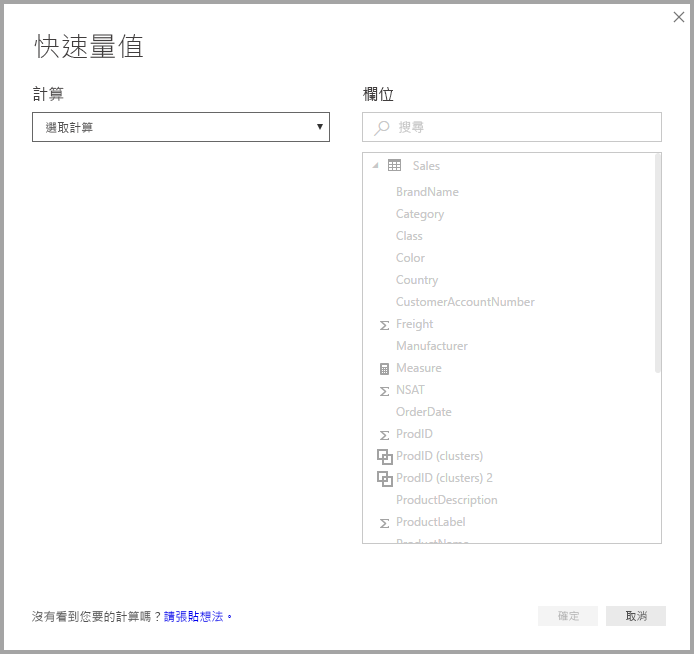
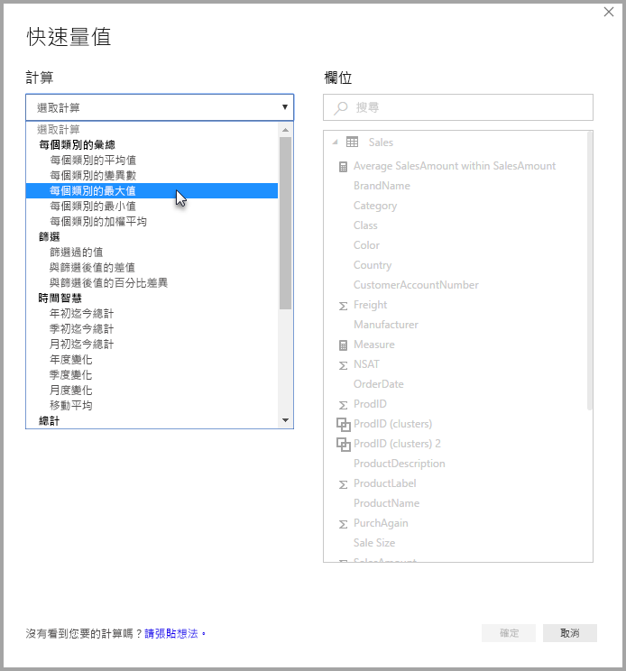
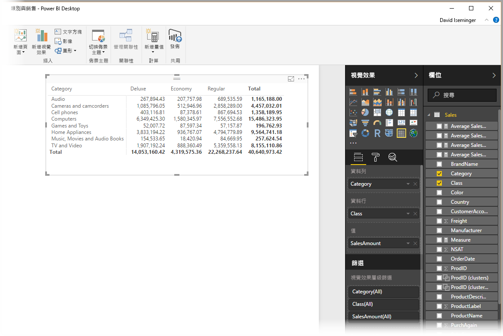
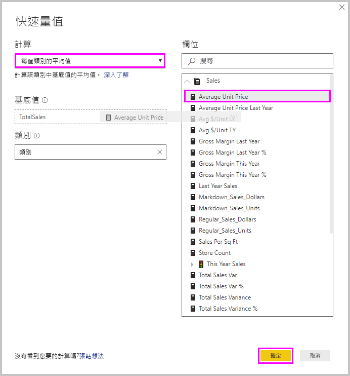
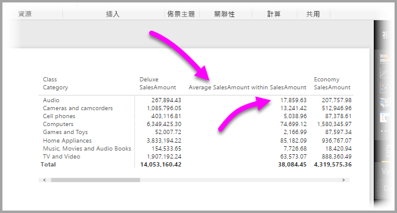
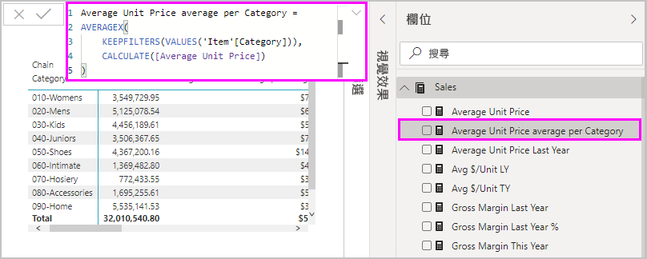
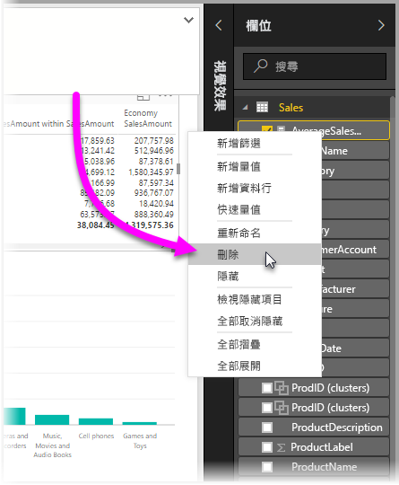

# 使用快速量值，輕鬆執行常用及功能強大的計算
您可以使用**快速量值**，快速輕鬆執行常用及功能強大的計算。 **快速量值**會依據您在對話方塊中提供的輸入，在幕後執行一組 DAX 命令 (DAX 是現成的，所以您不必撰寫)，然後顯示結果，供您在報表中使用。 更棒的是，您可以查看快速量值所執行的 DAX，以啟發或拓展您的 DAX 知識。

以右鍵按一下 [欄位] 區中的欄位，然後從出現的功能表中選取 [快速量值]，即可建立**快速量值**。 您也可以用右鍵按一下現有視覺效果的 [值] 窗格的任何值 (例如「橫條圖」視覺效果中的 [值] 欄位)。 計算有多種可用的分類，也有多種方式可以修改各項計算，以符合您的需求。

### 快速量值現在已正式運作

從 **Power BI Desktop** 2018 年 2 月發行開始，快速量值便已正式運作 (不再處於預覽狀態)。 如果您是使用舊版的 **Power BI Desktop**，則可以選取 [檔案] > [選項及設定] > [選項] > [預覽功能]，然後選取 [快速量值] 旁的核取方塊，便能嘗試使用從 **Power BI Desktop** **2017 年 4 月發行**開始提供的**快速量值**功能。

完成選取後，必須重新啟動 **Power BI Desktop**。

## 使用快速量值
若要建立 [快速量值]，請在 **Power BI Desktop** 中以右鍵按一下 [欄位] 區中的欄位 (任一欄位)，然後從出現的功能表中選取 [快速量值]。

使用 SQL Server Analysis Services (SSAS) 即時連線時，可以使用部分**快速量值**。 **Power BI Desktop** 只會顯示建立連線之 SSAS 版本支援的**快速量值**集合。 因此，如果您連線到 SSAS 即時資料來源，但看不到清單中的某些**快速量值**，這是因為您所連線的 SSAS 版本不支援用來實作該**快速量值**的 DAX 量值。

從右鍵功能表選取時，以下 [快速量值] 視窗隨即顯示，讓您可以選取想要的計算，以及您要執行計算的目標欄位。

當您選取下拉式功能表時，系統會顯示可用的 [快速量值] 長清單。

快速量值計算類型有五種不同群組，各自有一組計算。 群組和計算如下：

* **依類別來彙總**
  * 每個類別的平均值
  * 每個類別的變異數
  * 每個分類的最大值
  * 每個分類的最小值
  * 每個分類的加權平均
* **篩選條件**
  * 篩選過的值
  * 與篩選後值的差值
  * 與篩選後值的百分比差異
  * 新類別的銷售量
* **時間智慧**
  * 年初迄今總計
  * 季初迄今總計
  * 月初迄今總計
  * 與去年相比的變化
  * 與上季相比的變化
  * 月度變化
  * 移動平均
* **總計**
  * 累積總計
  * 分類總計 (套用篩選)
  * 分類總計 (未套用篩選)
* **數學運算**
  * 新增
  * 減
  * 乘
  * 除
  * 差異百分比
  * 相互關聯係數
* **文字**
  * 星級評等
  * 值的串連清單

我們很期待擴增這些計算，也想要知道您想要看見哪些**快速量值**，以及您是否對**快速量值**有任何想法 (包括基礎 DAX 公式) 要提交給我們參考。 您可以在文末找到相關的詳細資訊。

## 快速量值的範例
讓我們看看其中一個**快速量值**實際執行的範例。

下列**矩陣**視覺效果顯示不同電子產品的銷售資料表。 這是包含各分類總計的基本資料表。

當我們以滑鼠右鍵按一下 [值] 欄位並選取 [快速量值] 時，可以選取 [每個類別的平均值] 作為「計算」，然後選取 [Sum of SalesAmount] 作為「基底值」，再從右側窗格的 [欄位] 方塊將該欄位拖曳到左側 [分類] 區段中，以指定 *SalesAmount*。

當我們選取 [確定] 時，會看到一些有趣的事情發生，如本清單後的圖片所示：

1. **矩陣**視覺效果現在有一個新的資料行，顯示我們的計算 (在這個案例中是「SalesAmount 中的平均 SalesAmount」)。
2. 新**量值**已經建立並在 [欄位] 區中提供使用，而且有醒目提示 (Power BI 會在周圍加上黃色方塊)。 不僅其原先建立的視覺效果，報表中其他任何視覺效果也都可以使用這個量值。
3. 為**快速量值**建立的 DAX 公式會顯示在 [公式] 列中。

若要開始使用第一個項目，請注意**快速量值**已套用到視覺效果。 現在有新的資料行及相關聯的值，兩者都以建立的**快速量值**為基礎。

其次，**快速量值**會顯示在資料模型的 [欄位] 區中，而且可以在其他任何視覺效果使用，方式如同模型中的其他任何模型。 在下圖中，我們使用**快速量值**所建立的新欄位，建立了簡易的**橫條圖**視覺效果。

讓我們前往下一章，討論第三部份：DAX 公式。

## 了解使用快速量值的 DAX
**快速量值**功能另一個很大的優勢是，您可以直接從中看到建立來實作量值的 DAX 公式。 在下圖中，我們選取了**快速量值**所建立的量值 (現在已經在 [欄位] 區中，所以只要按一下即可)。 這樣做之後，[公式列] 隨即出現，顯示 Power BI 建立來實作量值的 DAX 公式。

這項功能本身很棒，因為您可以看到量值背後的公式。 但更重要的是，還能讓您使用**快速量值**來了解如何建立基礎 DAX 公式。

想像您需要進行年度計算，但不確定如何建立 DAX 公式 (或您不知道從哪裡著手！)。 與其在桌前懊惱，不如使用**年度變化**計算來建立**快速量值**，並查看執行方式。 也就是建立**快速量值**並查看其如何在視覺效果中顯示、查看 DAX 公式如何運作，然後直接對 DAX 進行變更或建立另一個量值，直到計算滿足您的需求或預期為止。

這就像是有一位敏捷的老師，只要您按幾下就能立即回應您的假設問題。 如果不想要這些量值，您可以隨時從模型中予以刪除，方式相當簡單，只要以右鍵按一下量值後選取 [刪除] 即可。

在您的量值呈現完美狀態後，您可以使用相同的右鍵功能表，按照自己的想法為其重新命名。

## 限制與考量
有幾點限制和考量要留意。

* **快速量值**僅在您可以修改模型時可供使用，當您使用一些即時連線時則無法使用 (如上所述支援 SSAS 表格式即時連線)。
* 新增到 [欄位] 區的量值可以搭配報表中任何視覺效果使用。
* 您可以隨時查看與**快速量值**相關的 DAX，方法是選取 [欄位] 區中已建立的量值，然後查看 [公式列] 中的公式。
* 使用 DirectQuery 模式時，無法建立時間智慧快速量值。 轉譯成傳送到您資料來源的 T-SQL 陳述式時，這些快速量值中使用的 DAX 函式會影響效能。

> [!WARNING]
> 快速量值目前「只會」產生 DAX 陳述式，並以逗號作為引數分隔符號。 如果 **Power BI Desktop** 版本的當地語系化語言是以逗號作為小數分隔符號，快速量值就無法正常運作。
> 
> 

### 時間智慧與快速量值
從 2017 年 10 月更新的 **Power BI Desktop** 開始，您可以使用自己的自訂日期資料表並搭配時間智慧**快速量值**。 如果您要使用外部表格式模型，則請確定建置模型時，該資料表中的主要日期資料行已標示為「日期」資料表，如[這篇文章](https://docs.microsoft.com/sql/analysis-services/tabular-models/specify-mark-as-date-table-for-use-with-time-intelligence-ssas-tabular)中所述。 如果您要匯入自己的日期資料表，則請務必將它標記為日期資料表，如[這篇文章](https://docs.microsoft.com/power-bi/desktop-date-tables)中所述

### 其他資訊及範例
我們預期會為各個**快速量值**計算提供範例和指引，因此請儘速回來查看焦點文章的更新。

對於尚未提供的**快速量值**有任何想法嗎？ 太棒了！ 請查看[這個頁面](https://go.microsoft.com/fwlink/?linkid=842906)，並為您想在 **Power BI Desktop** 中看到的**快速量值**提交想法 (或 DAX 公式)，我們會考慮在未來版本中，將其新增到提供的**快速量值**清單。

