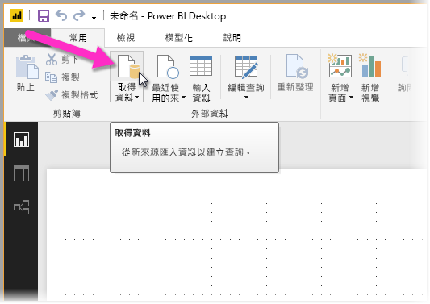
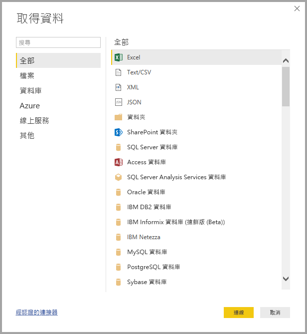

# 快速入門：在 Power BI Desktop 中連線至資料

在本快速入門中，您會使用 **Power BI Desktop** 連線至資料，這是建置資料模型和建立報表的第一步。

如果您尚未註冊 Power BI，請先進行[免費註冊](https://app.powerbi.com/signupredirect?pbi_source=web)再開始。

## 先決條件

若要完成本文中的步驟，您需要下列項目：
* 下載並安裝 **Power BI Desktop**，這是可在您的本機電腦上執行的免費應用程式。 您可以直接[下載 **Power BI Desktop**](https://powerbi.microsoft.com/desktop)，或是從 [**Microsoft Store**](http://aka.ms/pbidesktopstore) 取得。
* [下載此範例 Excel 活頁簿](http://go.microsoft.com/fwlink/?LinkID=521962)，並建立名為 *C:\PBID-qs* 的資料夾，您可在其中儲存 Excel 檔案。 本快速入門中的後續步驟，均假設該處為所下載 Excel 活頁簿的檔案位置。

## 啟動 Power BI Desktop

一旦您安裝 **Power BI Desktop** 之後，請啟動應用程式以使它在本機電腦上執行。 您會看到空白畫布，您可以在其中從連線的資料來建立視覺效果和報表。 

## 連接到資料

有了 **Power BI Desktop**，您可以連線到各種不同資料類型。 您可以連線到基本資料來源，例如 Microsoft Excel 檔案，且可以連線到包含各式各樣資料的線上服務，例如 Salesforce、Microsoft Dynamics、Azure Blob 儲存體等等。 

若要連線到資料，請選取 [常用] 功能區的 [取得資料]。

[取得資料] 視窗隨即出現，其中有各種不同的資料來源供您選擇來讓 **Power BI Desktop** 連線。 在本快速入門中，我們使用您在本文開頭*先決條件*一節的描述中所下載的 Excel 活頁簿。 

因為這是 Excel 檔案，所以我們從 [取得資料] 視窗中選取 [Excel]，然後選取 [連線] 按鈕。

接著會出現提示，要求我們提供所要連線 Excel 檔案的位置。 下載的檔案名為 *Financial Sample* (財務範例)，因此我們選取該檔案，然後選取 [開啟]。

接著，**Power BI Desktop** 會載入活頁簿並讀取其內容，然後使用 [導覽器] 視窗顯示檔案中可供使用的資料，您在當中可以選擇要將哪些資料載入 Power BI Desktop。 您可以將每個資料表旁的核取方塊標記，來選取要匯入的資料表。 在本案例中，我們將匯入這兩個可用的資料表。

一旦完成選取之後，選取 [載入] 以將資料匯入至 Power BI Desktop。

## 在 [欄位] 窗格中檢視資料

一旦您載入資料之後，[欄位] 窗格便會顯示資料。 您可以選取資料表名稱旁的三角形，來展開每個資料表。 在下列影像中，[financials (財務)] 資料表已展開，顯示其每個欄位。 

這樣就大功告成了！ 您已在 **Power BI Desktop** 中連線資料及載入該資料，現在就可以查看那些資料表中所有可用的欄位。

## 後續步驟
一旦您已連線資料之後，就可利用 **Power BI Desktop** 來執行各種事項，例如建立視覺效果和報表。 請參閱下列可引導您進行的資源：

* [Power BI Desktop 使用者入門指南](desktop-getting-started.md)

