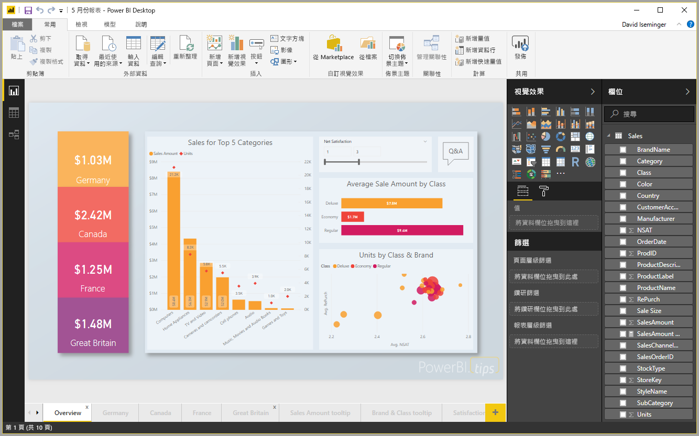
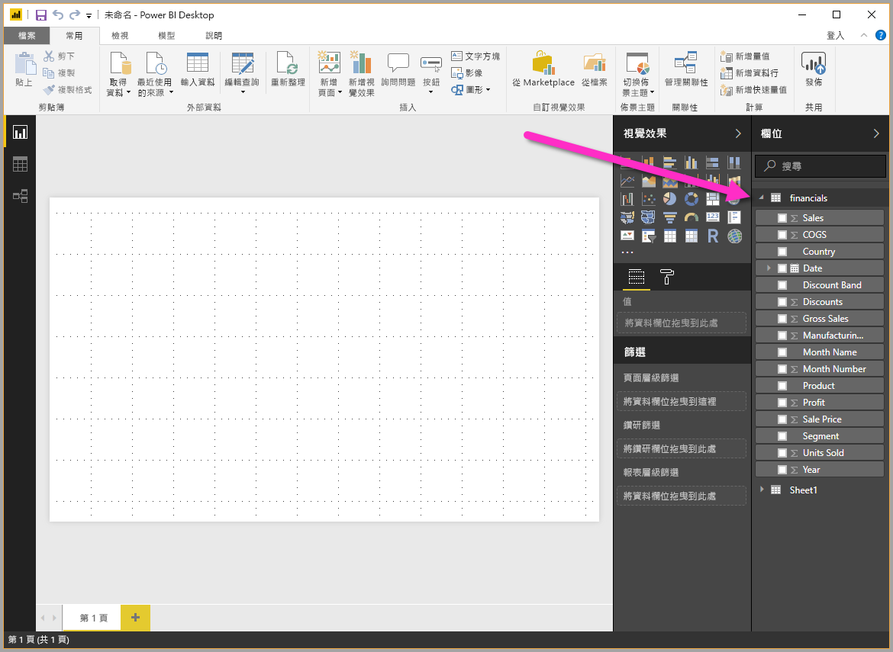

# 快速入門：在 Power BI Desktop 中連線至資料

在本快速入門中，您會使用 Power BI Desktop 連線到資料，這是建置資料模型和建立報表的第一步。

如果您尚未註冊 Power BI，請先進行[免費註冊](https://app.powerbi.com/signupredirect?pbi_source=web)再開始。

## 必要條件

若要完成本文中的步驟，您需要下列資源：

* 下載並安裝 Power BI Desktop 中，這是在本機電腦上執行的免費應用程式。 您可以直接[下載 Power BI Desktop](https://powerbi.microsoft.com/desktop)，或是從 [Microsoft Store](https://aka.ms/pbidesktopstore) 取得。
* [下載此範例 Excel 活頁簿](https://go.microsoft.com/fwlink/?LinkID=521962)，並建立名為 *C:\PBID-qs* 的資料夾，您可在其中儲存 Excel 檔案。 本快速入門中的後續步驟，均假設該處為所下載 Excel 活頁簿的檔案位置。
* 對於 Power BI Desktop 中的許多資料連線器而言，需要 Internet Explorer 10 (或更新版本) 才能進行驗證。

## 啟動 Power BI Desktop

一旦您安裝 Power BI Desktop 之後，請啟動應用程式，使其在本機電腦上執行。 您會看到 Power BI 教學課程。 請遵循教學課程或關閉對話方塊以從空白畫布開始。 畫布是您根據資料建立視覺效果和報表的位置。

## 連接到資料

使用 Power BI Desktop，您可以連線到各種不同類型的資料。 這些來源包含基本資料來源，例如 Microsoft Excel 檔案。 您可以連線到包含各式各樣資料的線上服務，例如 Salesforce、Microsoft Dynamics、Azure Blob 儲存體等。

若要連線到資料，請選取 [常用]  功能區的 [取得資料]  。

![[常用] 功能區上的 [取得資料]](media/desktop-quickstart-connect-to-data/qs-connect-data_02.png)

[取得資料]  視窗隨即出現。 您可以從 Power BI Desktop 能連線的各種不同資料來源中進行選擇。 在本快速入門中，請使用您在[必要條件](#prerequisites)中下載的 Excel 活頁簿。

![[取得資料] 的所有來源](media/desktop-quickstart-connect-to-data/qs-connect-data_03.png)

因為此資料來源是 Excel 檔案，所以請從 [取得資料]  視窗中選取 [Excel]  ，然後選取 [連線]  按鈕。

Power BI 會提示您提供所要連線 Excel 檔案的位置。 下載的檔案稱為 *Financial Sample* (財務範例)。 請選取該檔案，然後選取 [開啟]  。

接著，Power BI Desktop 會載入活頁簿並讀取其內容，然後使用 [導覽器]  視窗顯示檔案中可供使用的資料。 在該視窗中，您可以選擇想要載入 Power BI Desktop 的資料。 標記每個資料表旁的核取方塊，即可選取要匯入的資料表。 請匯入這兩個可用的資料表。

![在 [導覽器] 視窗中選取資料](media/desktop-quickstart-connect-to-data/qs-connect-data_05.png)

一旦完成選取之後，選取 [載入]  以將資料匯入至 Power BI Desktop。

## 在 [欄位] 窗格中檢視資料

一旦您載入資料之後，[欄位]  窗格便會顯示資料。 您可以選取資料表名稱旁的箭頭來展開每個資料表。 在下列影像中，[financials (財務)]  資料表已展開，顯示其每個欄位。

這樣就大功告成了！ 您已在 Power BI Desktop 中連線資料及載入該資料，現在就可以查看那些資料表中所有可用的欄位。

## 後續步驟

一旦您連線到資料之後，就可使用 Power BI Desktop 來執行各種作業。 您可以建立視覺效果和報表。 請參閱下列可引導您進行的資源：

* [開始使用 Power BI Desktop](desktop-getting-started.md)
