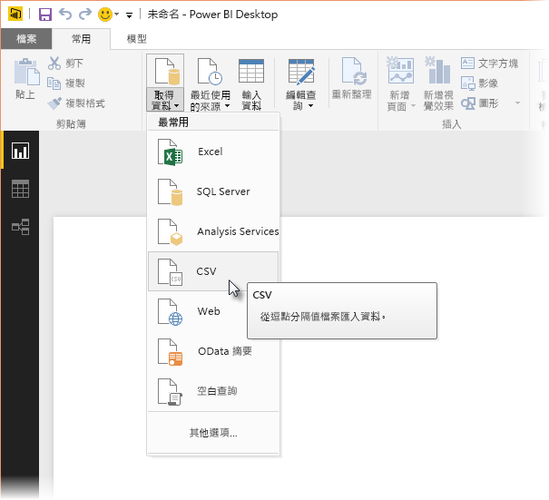
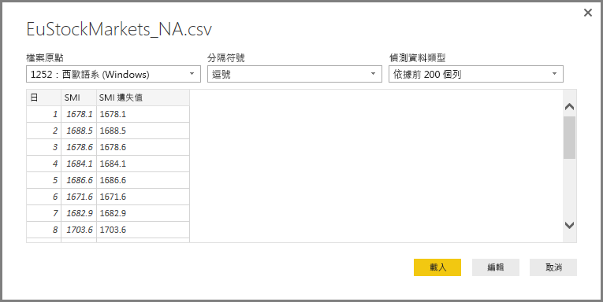
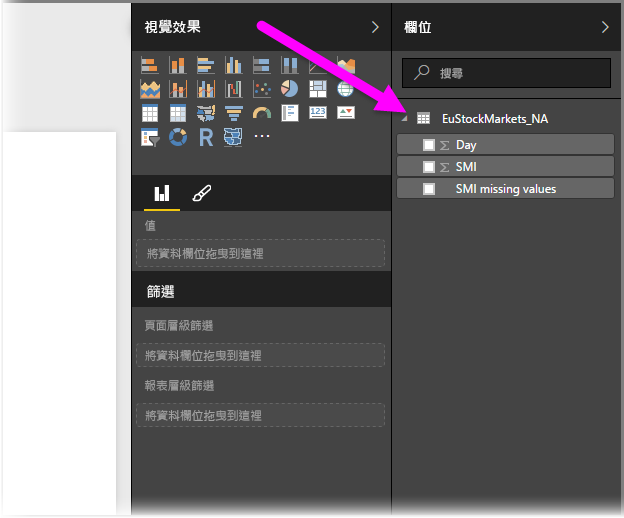
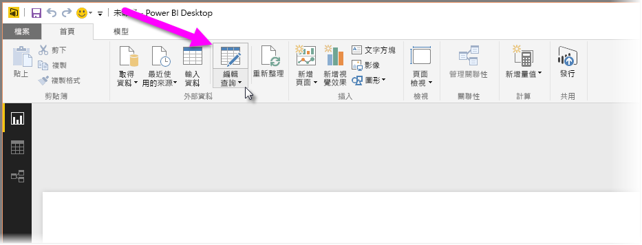
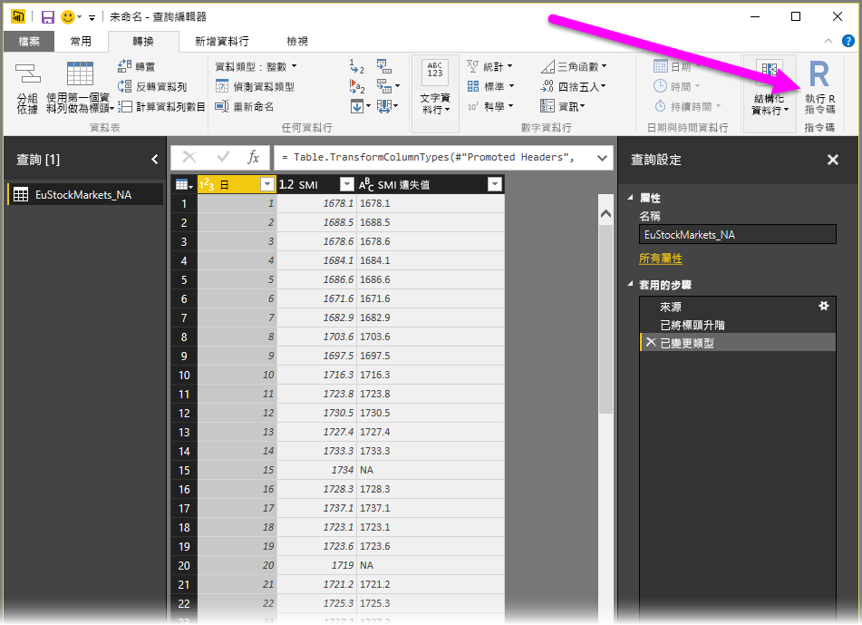
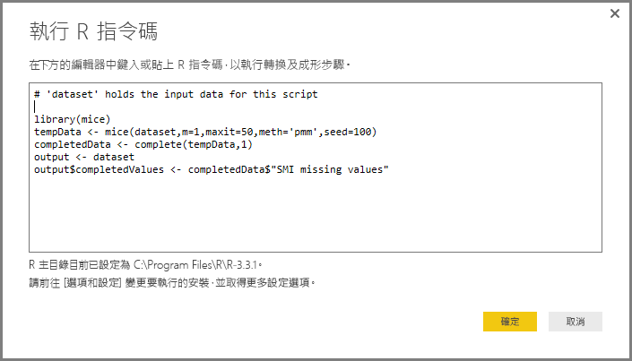
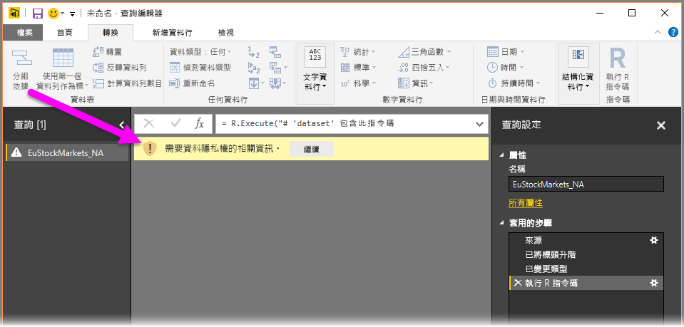
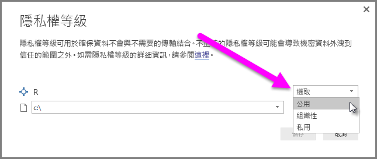
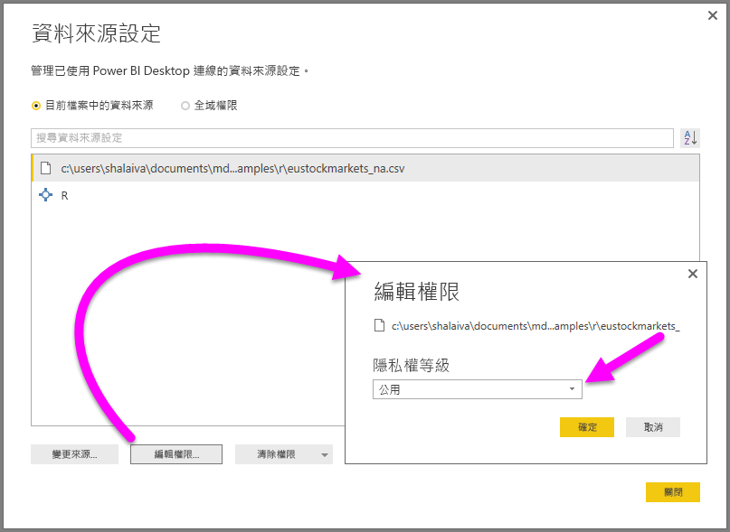

# <a name="using-r-in-query-editor"></a>在查詢編輯器中使用 R
您可以在 Power BI Desktop **查詢編輯器**中使用 **R，** 統計學家、資料科學家和資料分析師廣泛使用的程式設計語言。 將 R 整合到**資料編輯器中**，可讓您使用 R 執行資料清理，以及在資料集執行進階資料成形與分析，包括補足遺漏的資料、預測及叢集等。 **R**是功能強大的語言，可用於**查詢編輯器**以準備您的資料模型及建立報表。

## <a name="installing-r"></a>安裝 R
若要在 Power BI Desktop 的  使用 **R**，您需要在本機電腦上安裝 **R**。 您可以從許多位置免費下載並安裝 **R**，包括 [Revolution Open 下載頁面](https://mran.revolutionanalytics.com/download/)以及 [CRAN 儲存機制](https://cran.r-project.org/bin/windows/base/)。

## <a name="using-r-in-query-editor"></a>在查詢編輯器中使用 R
為了示範如何在**查詢編輯器**中使用 **R**，我們會使用來自股市資料集的範例，您可以[從這裡下載](http://download.microsoft.com/download/F/8/A/F8AA9DC9-8545-4AAE-9305-27AD1D01DC03/EuStockMarkets_NA.csv)該 .CSV 檔案並遵循指示。 本範例的步驟如下所示：

1. 首先，將您的資料載入 **Power BI Desktop**。 在此範例中，載入 *EuStockMarkets_NA.csv* 檔案，然後從 **Power BI Desktop** 的 [首頁]  功能區選取 [取得資料] > [CSV]  。

   
2. 選取檔案後選取 [開啟]  ，CSV 隨即顯示在 [CSV 檔案]  對話方塊中。

   
3. 資料載入後，會出現在 Power BI Desktop 的 [欄位]  窗格中。

   
4. 您也可以從 **Power BI Desktop**的 [首頁]  索引標籤選取 [編輯查詢]  ，以開啟**查詢編輯器**。

   
5. 在 [轉換]  索引標籤中選取 [執行 R 指令碼]  ，[執行 R 指令碼]  編輯器隨即出現 (於下個步驟示範)。 請注意，第 15 和 20 列遺失了資料，您在下圖中無法看到的其他列亦然。 下方步驟示範 R 可以 (將會) 如何為您補足這些列。

   
6. 本範例會輸入下列指令碼：

    ```r
       library(mice)
       tempData <- mice(dataset,m=1,maxit=50,meth='pmm',seed=100)
       completedData <- complete(tempData,1)
       output <- dataset
       output$completedValues <- completedData$"SMI missing values"
    ```

   > [!NOTE]
   > 您的 R 環境中必須安裝 mice  程式庫，前述指令碼才能正常運作。 若要安裝 mice，請在 R 安裝中執行下列命令： |      > install.packages('mice')
   > 
   > 

   放入 [執行 R 指令碼]  對話方塊時，程式碼看起來會像這樣：

   
7. 選取 [確定]  之後，**查詢編輯器**會顯示有關資料隱私權的警告。

   
8. 為使 R 指令碼在 Power BI 服務中正常運作，所有資料來源都必須設為「公開」  。 如需隱私權設定及其含意的詳細資訊，請參閱[隱私權等級](desktop-privacy-levels.md)。

   

   請注意 [欄位]  窗格中稱為 *completedValues* 的新資料行。 請注意，這裡有多個遺失的資料項目，像是第 15 和 18 列。 請參閱下一節，看 R 如何處理該狀況。


在 R 指令碼只有五行的情況下，**查詢編輯器**透過預測模型填入遺失的值。

## <a name="creating-visuals-from-r-script-data"></a>從 R 指令碼資料建立視覺效果
現在我們可以建立視覺效果，以了解 R 指令碼如何使用 *mice* 程式庫補足遺失的值，如下圖所示：


一旦完成該視覺效果以及其他要使用 **Power BI Desktop** 建立的任何視覺效果，您就可以儲存 **Power BI Desktop** 檔案 (儲存為 .pbix 檔案)，然後在 Power BI 服務中使用資料模型，包括屬於其中的 R 指令碼。

> [!NOTE]
> 想查看完成這些步驟後的完成後 .pbix 檔案嗎？ 幸運的是，您可以在[這裡](http://download.microsoft.com/download/F/8/A/F8AA9DC9-8545-4AAE-9305-27AD1D01DC03/Complete%20Values%20with%20R%20in%20PQ.pbix)下載這些範例中使用的完成後 **Power BI Desktop** 檔案。

一旦將 .pbix 檔案上傳到 Power BI 服務，就必須再執行幾個步驟以 (在服務中) 啟用資料重新整理，並讓視覺效果在服務中保持更新 (資料需要 R 存取權以更新視覺效果)。 其他步驟如下：

* **為資料集啟用排程重新整理** - 若要為包含使用 R 指令碼之資料集的活頁簿啟用排程重新整理，請參閱[設定排程重新整理](refresh-scheduled-refresh.md)，其中也包括 **Personal Gateway**相關資訊。
* **安裝 Personal Gateway** - 檔案及 R 安裝所在的電腦上必須安裝 **Personal Gateway**；Power BI 必須存取該活頁簿及重新轉譯任何更新的視覺效果。 您可以取得如何[安裝及設定 Personal Gateway](service-gateway-personal-mode.md) 的詳細資訊。

## <a name="limitations"></a>限制
建立於**查詢編輯器**並含有 R 指令碼的查詢有幾項限制：

* 所有 R 資料來源設定都必須設為「公開」  ，建立於**查詢編輯器**的查詢中其他所有步驟也都必須為公開。 若要取得資料來源設定，請在 **Power BI Desktop** 中選取 **[檔案] > [選像和設定] > [資料來源設定]** 。

  

  從 [資料來源設定]  對話方塊選取資料來源，然後選取 [編輯權限...]  ，並確認 [隱私權等級]  已設為「公開」  。

      
* 若要啟用 R 視覺效果或資料集的排程重新整理，您必須啟用 [排程重新整理]  ，並在裝載活頁簿與 R 安裝的電腦上安裝 **Personal Gateway**。 如需這兩者的詳細資訊，請參閱本文前一節，其中提供了深入了解各項的連結。

R 和自訂查詢有各種用途，您可以用想要的呈現方式探索資料並使其成形。

