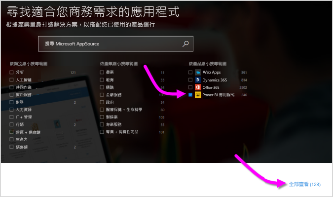
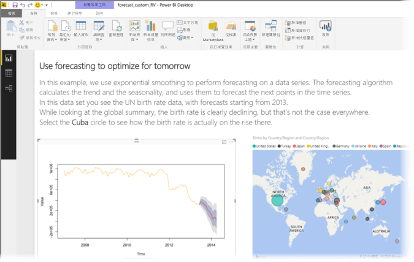
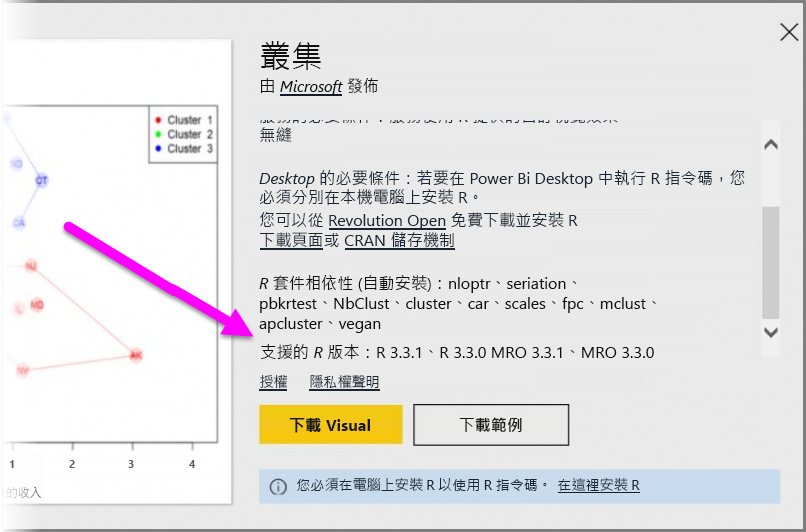

# 在 Power BI 中使用 R 提供技術的自訂視覺效果
在 **Power BI Desktop** 與 **Power BI 服務**中，您不必具備任何 R 的知識或編寫任何 R 指令碼，就能使用 R 提供技術的自訂視覺效果。 這讓您能夠充分運用 R 視覺效果的分析與視覺效果功能及 R 指令碼，而不必親自學習 R 或設計程式。

若要使用 R 提供技術的自訂視覺效果，您必須先從 [**AppSource**](https://appsource.microsoft.com/marketplace/apps?product=power-bi-visuals&page=1) 的 Power BI **自訂視覺效果**資源庫選取並下載想要使用的 R 自訂視覺效果。

下列章節描述如何選取、載入以及在 **Power BI Desktop** 使用由 R 提供技術的視覺效果。

## 使用 R 自訂視覺效果
若要使用 R 提供技術的自訂視覺效果，您必須先從**自訂視覺效果**資源庫下載每個視覺效果，然後就可以像使用 **Power BI Desktop** 中任何其他類型的視覺效果一樣地使用它。 取得自訂視覺效果的方法有兩種：您可以從線上 **AppSource** 網站下載，或在 **Power BI Desktop** 中瀏覽並取得。 

### 從 AppSource 取得自訂視覺效果

以下是從線上 **AppSource** 網站瀏覽並選取視覺效果的步驟：

1. 瀏覽位在 [https://appsource.microsoft.com](https://appsource.microsoft.com/) 的 Power BI 視覺效果資源庫。 選取「依產品縮小搜尋範圍」下的 [Power BI 應用程式]，然後選取 [查看全部] 連結。
   
   

2. 在 [Power BI 視覺效果](https://appsource.microsoft.com/marketplace/apps?product=power-bi-visuals&page=1)資源庫頁面上，選取左窗格增益集清單中的 [Power BI 視覺效果]。

   

3. 從資源庫選取您想要使用的**視覺效果**，就會前往視覺效果的說明頁面。 選取 [立即取得] 按鈕即可下載。
   
   > [!NOTE]
    > 若要在 **Power BI Desktop** 中撰寫，您必須將 R 安裝在本機電腦上。 但當使用者想要在 **Power BI 服務**中檢視 R 提供技術的視覺效果時，則不需要將 R 安裝在本機。
   > 
   > 
   
   
   
   您無須先安裝 R 才能在 **Power BI 服務**中使用 R 提供技術的自訂視覺效果，但是如果您要在 **Power BI Desktop** 中使用 R 提供技術的自訂視覺效果，則「必須」於本機上安裝 R。 您可以從下列位置下載 R：
   
   * [CRAN](https://cran.r-project.org/)
   * [MRO](https://mran.microsoft.com/)

4. 下載視覺效果之後 (如同從瀏覽器下載任何檔案)，移至 [Power BI Desktop] 並按一下 [視覺效果] 窗格中的省略符號 (...)，然後選取 [從檔案匯入]。
   
   
5. 您會在匯入自訂視覺效果時收到警告，如下圖所示：
   
   
6. 瀏覽至儲存視覺效檔案的位置，然後選取該檔案。 **Power BI Desktop** 自訂視覺效果的副檔名為 .pbiviz。
   
   
7. 當您返回 Power BI Desktop 時，即可在 [視覺效果] 窗格中使用新的視覺效果類型。
   
   
8. 當您匯入新的視覺效果 (或開啟的報表包含 R 提供技術的自訂視覺效果)，**Power BI Desktop** 會安裝所需的 R 套件。
   
   

9. 您可以從該位置將資料新增至視覺效果，方式如同其他任何 **Power BI Desktop** 視覺效果。 完成時，您會在畫布上看到完成的視覺效果。 在下列視覺效果中，R 提供技術的 [預測] 視覺效果搭配使用聯合國 (UN) 生育率投影 (左側視覺效果)。

    

    如同其他任何 **Power BI Desktop** 視覺效果，您可以將此報表及其 R 提供技術的視覺效果一併發佈至 **Power BI 服務**並與其他人分享。

    由於視覺效果不斷增加，請時常查看資源庫。

### 從 **Power BI Desktop** 中取得自訂視覺效果

1. 您也可以從 **Power BI Desktop** 中取得自訂視覺效果。 在 [Power BI Desktop] 中，於 [視覺效果] 窗格內按一下省略符號 (...)，然後選取 [從市集匯入]。
   
   

2. 當您這樣做時，[Power BI 視覺效果] 對話方塊隨即顯示，您可以在其中捲動檢視可用的自訂視覺效果，並選取想要的自訂視覺效果。 您可以依名稱搜尋、選取類別，或只是捲動檢視可用的視覺效果。 當您準備就緒後，選取 [新增] 即可將自訂視覺效果新增至 **Power BI Desktop**。

   

## 發表 R 提供技術的自訂視覺效果
如果您自行建立可用於您報表中的 R 視覺效果，您可在**自訂視覺效果資源庫**提供該類自訂視覺效果，進而與各地使用者分享。 貢獻會透過 GitHub 進行，程序概述於下列位置：

* [貢獻給 R 提供技術的自訂視覺效果資源庫](https://github.com/Microsoft/PowerBI-visuals#building-r-powered-custom-visual-corrplot)

## 針對 R 提供技術的自訂視覺效果進行疑難排解
R 提供技術的自訂視覺效果具有特定相依性，視覺效果必須符合這些相依性才能正常運作。 當 R 提供技術的自訂視覺效果未正確執行或載入時，通常是下列其中一個問題所致：

* R 引擎遺失
* 視覺效果所依據的 R 指令碼中發生錯誤
* R 套件遺失或過期

下一節說明您可以執行的疑難排解步驟，以協助解決所遇到的問題。

### R 套件遺失或過期
嘗試安裝 R 提供技術的自訂視覺效果時，如果 R 套件遺失或過期，您可能會遇到錯誤；這通常是由於下列其中一個原因所致：

* R 安裝與 R 套件不相容
* 防火牆、防毒軟體或 Proxy 設定導致 R 無法連線到網際網路
* 網際網路連線速度很慢，或網際網路連線發生問題

Power BI 小組會在連絡您之前主動解決這些問題，下一版 Power BI Desktop 將納入更新以解決這些問題。 在那之前，您可以採取下列一或多個步驟來解決問題：

1. 移除自訂視覺效果，然後重新安裝。 這會起始 R 套件的重新安裝。
2. 如果您的 R 安裝不是最新版本，請升級您的 R 安裝，然後如上一個步驟所述移除並重新安裝自訂視覺效果。
   
   每個 R 提供技術的自訂視覺效果描述會列出支援的 R 版本，如下圖所示。
   
     
     > [!NOTE]
    > 您可以保留原始 R 安裝，只將 Power BI Desktop 與您安裝的目前版本建立關聯。 移至 [檔案] -> [選項及設定] -> [選項] > [R 指令碼]。
    >
    >
3. 使用任何 R 主控台手動安裝 R 套件。 此作法的步驟如下：
   
   a.  下載 R 提供技術的視覺效果安裝指令碼，並將該檔案儲存至本機磁碟。
   
   b.  從 R 主控台執行下列命令：
   
       > source(“C:/Users/david/Downloads/ScriptInstallPackagesForForecastWithWorkarounds.R”)    
   
   一般預設安裝位置如下所示：
   
       c:\Program Files\R\R-3.3.x\bin\x64\Rterm.exe (for CRAN-R)
       c:\Program Files\R\R-3.3.x\bin\x64\Rgui.exe (for CRAN-R)
       c:\Program Files\R\R-3.3.x\bin\R.exe (for CRAN-R)
       c:\Program Files\Microsoft\MRO-3.3.x\bin\R.exe (for MRO)
       c:\Program Files\Microsoft\MRO-3.3.x\bin\x64\Rgui.exe (for MRO)
       c:\Program Files\RStudio\bin\rstudio.exe (for RStudio)
4. 如果上述步驟沒有作用，請嘗試下列步驟：
   
   a. 使用 **R Studio** 並依照上面 3.b. 中所述的步驟執行 (從 R 主控台執行指令碼行)。
   
   b. 如果上述步驟沒有作用，請在 **R Studio** 中變更 [工具] > [全域選項] > [套件]，並啟用 [Use Internet Explorer library/proxy for HTTP] \(針對 HTTP 使用 Internet Explorer 程式庫/Proxy) 核取方塊，然後重複執行 上述步驟中的步驟 3.b。

## 後續步驟
請看看下列有關 Power BI 中 R 的其他資訊。

* [Power BI 自訂視覺效果資源庫](https://app.powerbi.com/visuals/)
* [在 Power BI Desktop 中執行 R 指令碼](desktop-r-scripts.md)
* [在 Power BI Desktop 中建立 R 視覺效果](desktop-r-visuals.md)
* [在 Power BI 使用外部 R IDE](desktop-r-ide.md)

