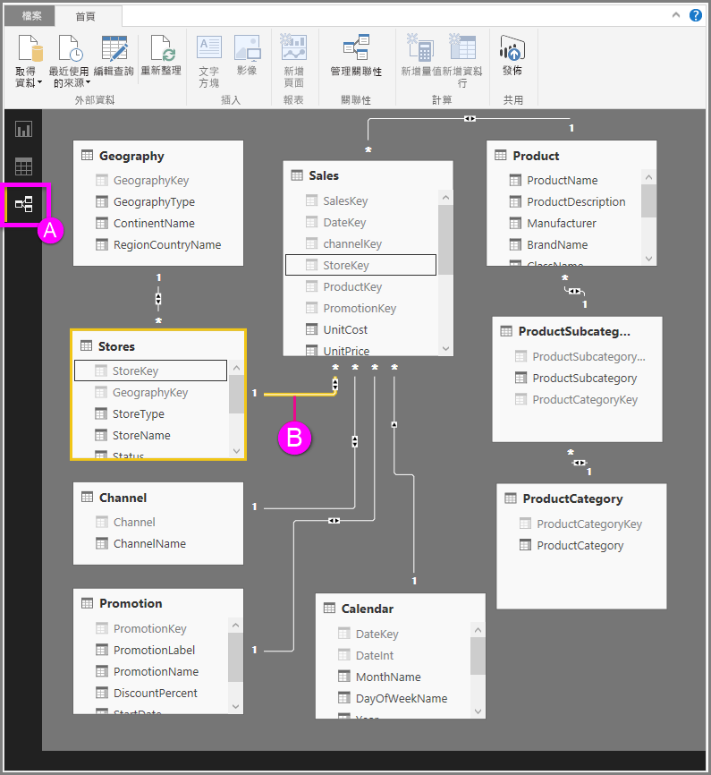

# Power BI Desktop 中的關聯性檢視
[關聯性檢視]  會顯示模型中所有的資料表、資料行及關聯性。 這在模型包含許多資料表，且其關聯十分複雜時十分實用。

讓我們一起來看看。

**A.**  關聯性檢視圖示 - 按一下此圖示可在關聯性檢視中顯示您的模型

**B.** 關聯性 - 將游標暫留在關聯性上可顯示所使用的資料行。 按兩下關聯性可以在 [編輯關聯性]  對話方塊中開啟該關聯性。 

在上圖所示的 *Stores* 資料表中，有一個與 *StoreKey* 相關的 *Sales* 資料表，本身也具有一個 *StoreKey* 資料行。 這是*多對一* (\*:1) 的關聯性；線中間的圖示指出交叉篩選方向的設定為 *兩者* 。 在圖示上的箭頭指出篩選內容流量的方向。

若要深入了解關聯性，請參閱[在 Power BI Desktop 中建立和管理關聯性](desktop-create-and-manage-relationships.md).

