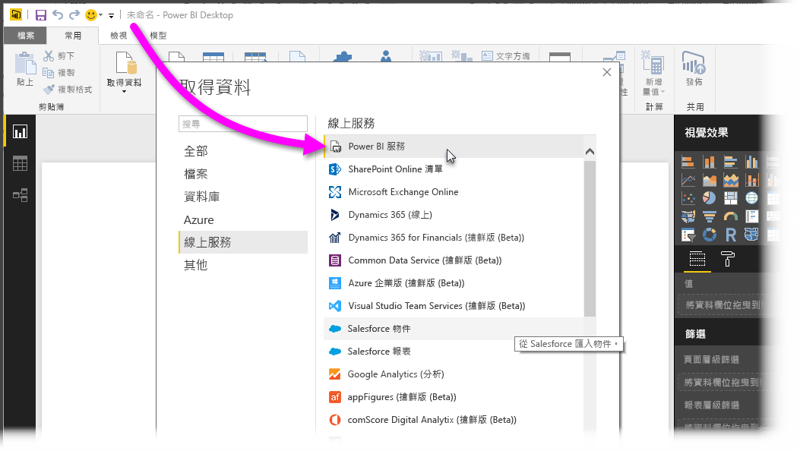
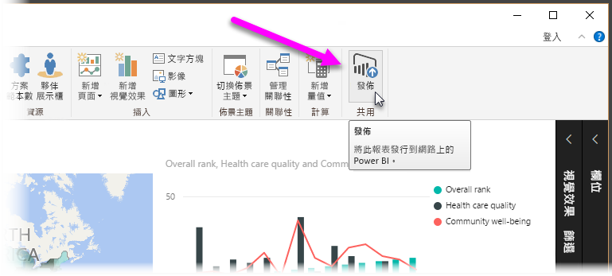
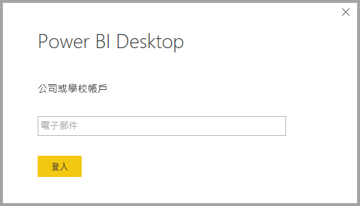
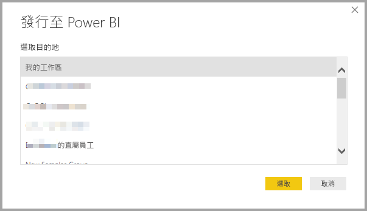
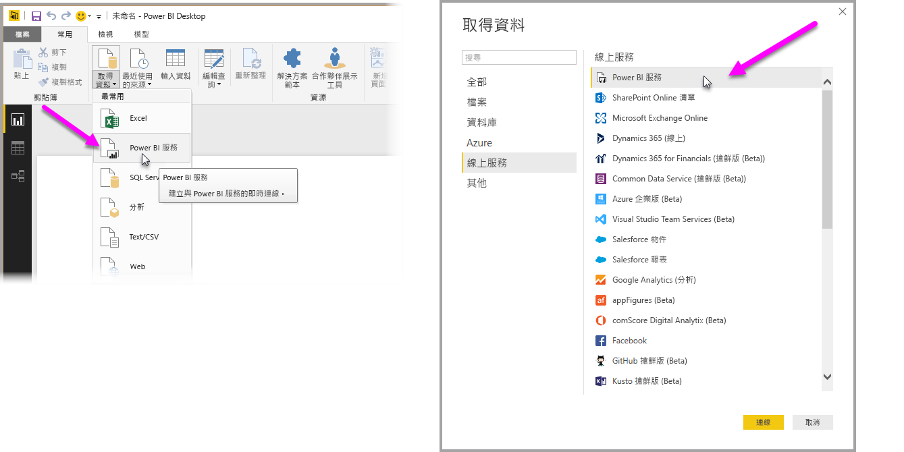
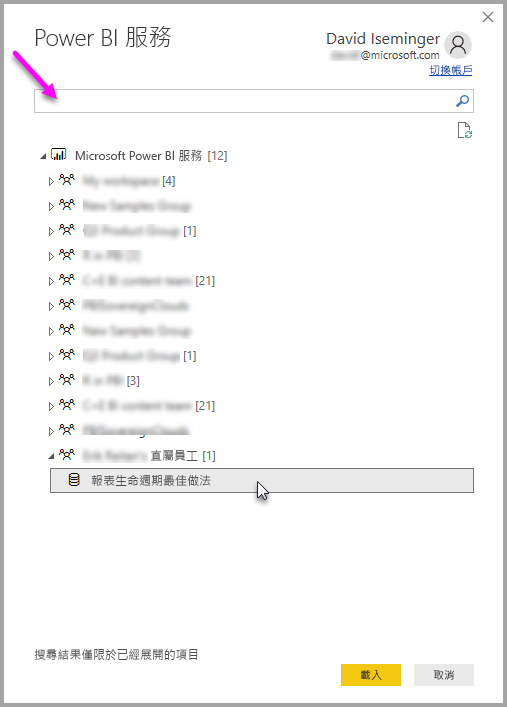
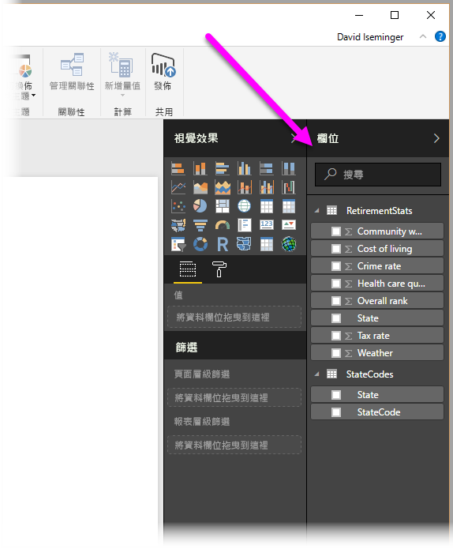

# 從 Power BI Desktop 連線到 Power BI 服務中的資料集
您可在 Power BI 服務中建立連到共用資料集的即時連線，並從同一個資料集建立許多不同的報表。 這表示您可以在 Power BI Desktop 中建立完美的資料模型、將其發佈到 Power BI 服務，接著您和其他人就可以從同一個通用資料模型建立多個不同報表 (在個別 .pbix 檔案中)。 這項功能稱為 **Power BI 服務即時連線**。

這項功能有各種優點，包括最佳做法，而我們會在本文加以討論。 本文結尾另外有幾點考量與限制，請務必詳加閱讀。

## 使用 Power BI 服務即時連線進行報表生命週期管理
Power BI 的熱門程度帶來一項挑戰，也就是報表、儀表板及其基礎資料模型數量激增。 原因在於，人們能夠輕鬆在 **Power BI Desktop** 中建立引人入勝的報表，然後在 **Power BI 服務**中共用 ([發佈](desktop-upload-desktop-files.md)) 這些報表，以及從資料集建立優質的儀表板。 由於這樣做的人為數眾多，而且時常使用相同 (或幾乎相同) 的資料集，因此要知道哪個報表以哪個資料集為基礎、各資料集的更新時間有多近，便成了一大挑戰。 **Power BI 服務即時連線**解決了這項難題，並且讓建立、共用及擴展通用資料集的報表及儀表板變得更簡單、一致。

### 建立任何人都能使用的資料集並加以共用
假設 Anna (一名業務分析師) 在您的團隊中，而她很擅長建立優異的資料模型 (通常稱為資料集)。 透過 Anna 的專長，她能夠建立資料集和報表，然後在 **Power BI 服務**裡共用該報表。

每個人都喜愛她的報表和資料集，但這就是問題所在。團隊裡每個人都嘗試建立「自己的」資料集版本，然後與團隊共用自己的報表。 於是團隊在 **Power BI 服務**中的工作區，一下子就有了大量報表 (來自不同資料集)。 哪一個是最新的？ 資料集內容完全相同，或只是幾乎相同？ 差別在哪裡？ 有了 **Power BI 服務即時連線**功能，這一切問題都能迎刃而解。 在下一節，我們會知道其他人可以如何在他們自己的報表使用 Anna 發佈的資料集，以及讓所有人都能使用同一個穩固、通過檢驗、已發佈的資料集來打造自己的獨特報表。

### 使用即時連線來連線到 Power BI 服務資料集
在 Anna 建立她的報表 (並建立其依據的資料集) 之後，便將其發佈到 **Power BI 服務**，而報表隨即顯示在她的團隊在 Power BI 服務中的工作區。 現在，她的工作區中每個人都可以查看及檢視該報表。

工作區的其他成員現在可以對 Anna 共用的資料模型建立即時連線 (使用 **Power BI 服務即時連線**功能)，以及從「她的原始資料集」建立自己的獨特報表。

在下圖中，您可以看到 Anna 如何建立一份 **Power BI Desktop** 報表，然後將報表 (包括其資料模型) 發佈到 **Power BI 服務**。 接著，工作區中的其他人就可以使用 **Power BI 服務即時連線**來連線到她的資料模型，並依據她的資料集建立自己的獨特報表。

> [!NOTE]
> 資料集只會在一個工作區中共用。 若要建立 Power BI 服務即時連線，您要連上的資料集必須位在您所在的共用工作區中。
> 
> 

## 使用 Power BI 服務即時連線的逐步解說
現在我們已經知道 **Power BI 服務即時連線**有多好用，以及如何將這個方法當作報表生命週期管理的最佳做法使用，接著為您逐步解說步驟，從 Anna 的優質報表 (和資料集) 前進到她 Power BI 工作區中的團隊成員可以使用的資料集。

### 發佈 Power BI 報表和資料集
使用 **Power BI 服務即時連線**管理報表生命週期的第一步，是擁有團隊成員想要使用的報表 (和資料集)。 因此，Anna 必須先從 **Power BI Destkop** **發佈**她的報表。 她從 Power BI Desktop 的 [常用] 功能區選取 [發佈] 以完成這個動作。

如果她未登入 Power BI 服務帳戶，系統會提示她登入。

她可以從那裡選擇報表和資料集要發佈的工作區目的地。 請記住，只有擁有報表發佈目標工作區存取權的成員，才能使用 **Power BI 服務即時連線**存取報表的資料集。

發佈程序隨即開始，而 **Power BI Desktop** 會顯示進度。

完成後，**Power BI Desktop** 會顯示您已成功，並提供一組讓您連上 **Power BI 服務**中實際報表的連結，以及取得報表**深入資訊摘要**的連結。

接下來，我們來看看其他擁有報表 (和資料集) 發佈目標工作區存取權的團隊成員可以如何連線到資料集，及建立他們自己的報表。

### 對發佈的資料集建立 Power BI 服務即時連線
若要對發佈的報表建立連線，並建立自己以發佈的資料集為基礎的報表，請從 **Power BI Desktop**中 [常用] 功能區選取 [取得資料]，然後選取 [Power BI 服務]。 您也可以從 [取得資料] > [線上服務] > [Power BI 服務] 加以選取。

如果您尚未登入 Power BI，系統會提示您登入。 登入後，您會看到一個視窗顯示您身為其中成員的工作區，您可以選取哪個工作區包含要對其建立 **Power BI 服務即時連線**的資料集。

工作區旁方括弧中的數字會顯示該工作區中有多少可用的共用資料集，選取左邊的三角形則可展開工作區，讓您可以選取共用資料集。

前述 **Power BI 服務**即時連線視窗有幾點需要注意：

* 您可以搜尋共用資料集，但搜尋結果限為展開的項目，而不包括任何未展開的工作區。
* 您可以展開多個工作區，以擴展搜尋範圍。

當您選取視窗中的 [載入] 時，隨即對選取的資料集建立即時連線，這表示您看到的資料 (欄位及其值) 會即時載入 **Power BI Desktop** 中。

現在您 (和其他人) 只要從同一個資料集，就可以建立及共用自訂報表並加以共用。 這方法很適合讓一位具有專業知識的人建立一份內容完善的資料集 (就像 Anna 做的那樣)，再讓許多團隊成員使用那份共用資料集建立自己的報表。

> [!NOTE]
> 當您依據使用 **Power BI 服務**即時連線的資料集建立報表時，只能將該報表發佈到包含所用資料集的相同 Power BI 服務工作區。
> 
> 

## 限制與考量
使用 **Power BI 服務即時連線**須留意幾項限制和考量。

* 工作區的唯讀成員無法從 **Power BI Desktop** 連接到資料集。
* 只有屬於同一個 **Power BI 服務**工作區的使用者，才可以使用 **Power BI 服務即時連線**來連線到發佈的資料集。 使用者可以 (也通常會) 屬於一個以上的工作區。
* 由於這是即時連線，因此無法使用左側瀏覽和模型化，行為與連線到 **SQL Server Analysis Services** 時相似。
* 由於這是即時連線，因此會強制執行 RLS (資料列及角色層級安全性)、商務用 OneDrive 及其他這類連線行為，方式和連線到 **SQL Server Analysis Services** 時相同。
* 選取 **Power BI 服務**中要連線的目標資料集時，搜尋方塊僅適用於已展開的工作區。
* 如果您修改原本共用的 .pbix 檔案，就會覆寫 **Power BI 服務**中共用的資料集和報表。
* 無法取代原先共用的報表。 嘗試這樣做會導致產生警告，提示您為檔案重新命名再發佈。
* 如果您刪除 **Power BI 服務**中的共用資料集，其他 **Power BI Desktop** (.pbix 檔案) 就無法再正常運作或顯示其視覺效果。
* 若是內容套件，您必須先建立內容套件的複本，再將其當作將 .pbix 報表和資料集共用到 **Power BI 服務**的基礎。
* 若是來自「我的組織」的內容套件，在複製後，您就無法取代服務上建立的報表及 (或) 透過即時連線時複製內容套件而建立的報表。 嘗試這樣做會導致產生警告，提示您為檔案重新命名再發佈。 在此情況下，您只能取代已發行的即時連線報表。
* 當您依據使用 **Power BI 服務**即時連線的資料集建立報表時，只能將該報表發佈到包含所用資料集的相同 Power BI 服務工作區。
* 刪除 **Power BI 服務**中的共用資料集，意味著您無法再從 **Power BI Desktop**存取該資料集。

