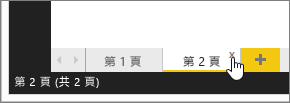
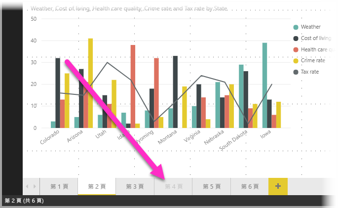

# Power BI Desktop 中的報表檢視
若您已在使用 Power BI，就會知道建立報表提供動態檢視方塊及深入剖析資訊有多容易。 Power BI Desktop 提供更多進階的 Power BI 功能。 有了 Power BI Desktop，您可以建立進階查詢、混用來自多種來源的資料、建立資料表之間的關聯性等等。

Power BI Desktop 包含 [報表檢視]，可讓您從中建立任意數量的報表頁面且包含視覺效果。 報表檢視提供中有許多設計，與 Power BI 服務中的報表編輯檢視幾乎完全相同。 您可以在四處移動、複製及貼上、合併其中的視覺效果等等。

之間唯一的差別是使用 Power BI Desktop 時，您可以處理您的查詢及建立資料模型，讓資料在報表中能夠提供最透徹的深入剖析資訊。 您可以將 Power BI Desktop 檔案儲存在任何位置，無論是本機磁碟機或雲端。

## 讓我們一起來看看！
當您第一次在 Power BI Desktop 中載入資料時，[報表檢視] 中會顯示空白的畫布。

您只需要選取左導覽列中的圖示，就能切換 [報表檢視]、[資料檢視] 與 [關聯性檢視]：

當您加入一些資料之後，可以在畫布中新增一些視覺效果的欄位。

若要變更視覺效果類型，您可以從功能區的 [視覺效果] 群組中選取該類型，或在**變更視覺效果類型**圖示上按一下滑鼠右鍵，然後選取其他類型。

> [!TIP]
> 請務必嘗試各種不同視覺效果類型。 您的視覺效果必須能夠清楚傳達資料中的資訊。
> 
> 

報表至少會提供一個空白頁面讓您開始。 頁面會出現在畫布左側的導覽窗格中。 您可以在頁面中加入各種視覺效果，但請注意不要過量。 在頁面上加入太多的視覺效果，反而會讓頁面看起來十分零亂而不利尋找到正確的資訊。 您可以新增頁面至報表。 只要按一下功能區上的 [新增頁面] 即可。

若要刪除頁面，只要在 [報表檢視] 的底部，按一下頁面索引標籤上的 **X** 即可。

> [!NOTE]
> Power BI Desktop 的報表與視覺效果無法釘選到儀表板。 若要達到此目的，必須[從 Power BI Desktop 發行](desktop-upload-desktop-files.md)到您的 Power BI 網站。

## 隱藏報表頁面

當您建立報表時，您也可以隱藏報表的頁面。 如果您需要在報表中建立基礎資料或者視覺效果，但是不希望其他人可以看見這些頁面 (例如，當您建立的資料表或支援的視覺效果會用於其他報表頁面時)，這會很有幫助。 還有其他各式各樣的原因，讓您想要建立報表頁面，但是要從發行的報表中隱藏這些報表頁面。 

隱藏報表頁面很簡單。 只要以滑鼠右鍵按一下報表頁面索引標籤，並從顯示的功能表中選取 [隱藏]。

隱藏報表頁面時，有幾個需要謹記在心的考量：

* 當您在 **Power BI Desktop** 中時，仍然可以看見隱藏的報表檢視，即使頁面的標題會變成灰色。在下圖中，第 4 頁已隱藏。

    

* 在 **Power BI 服務**中檢視報表時，您無法查看隱藏的報表頁面。

* 隱藏報表頁面並非安全性措施。 頁面仍然可由使用者存取，且其內容仍然可以透過鑽研和其他方法來存取。

* 當頁面隱藏時，在 [檢視模式] 中不會顯示檢視模式瀏覽箭號。

