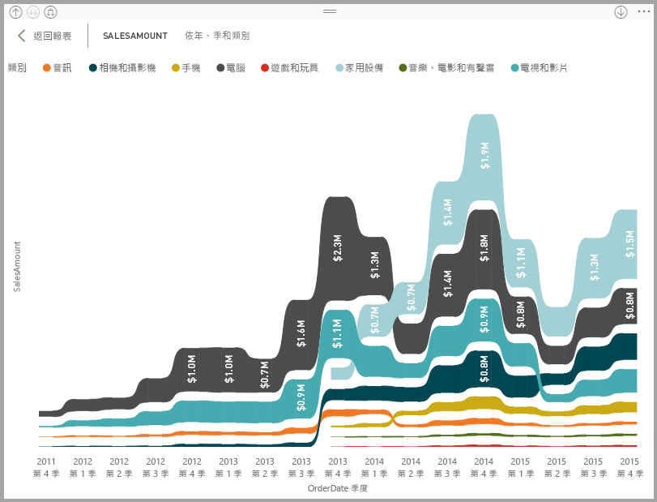
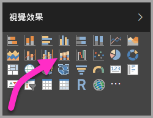
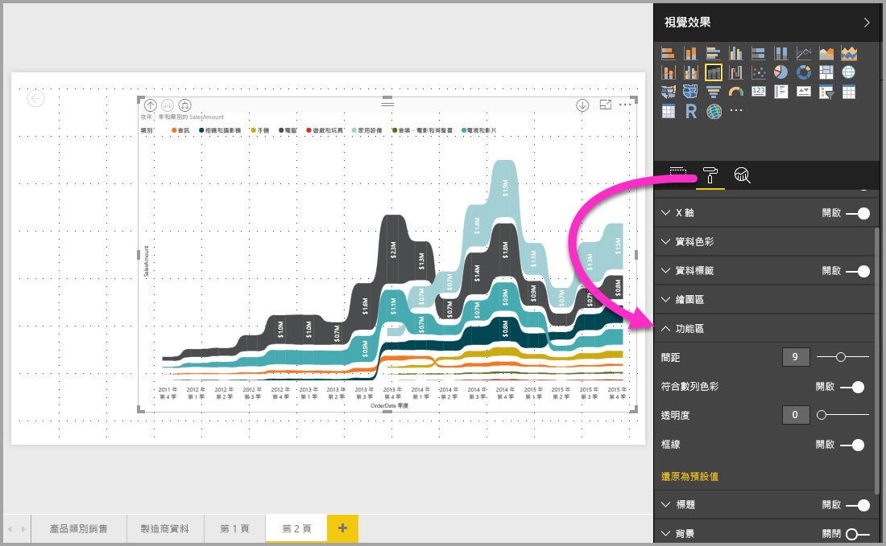

# 在 Power BI 中使用功能區圖表
您可以在 **Power BI** 中使用功能區圖表來視覺化資料，並快速地判斷哪個類別的資料具有最高的等級 (最大值)。 功能區圖表適合顯示等級變更，最高等級 (值) 一律顯示於每個時段的最上方。 從 2017 年 9 月版本開始，功能區圖表提供於 **Power BI Desktop** 中，並提供於 **Power BI 服務**的後續更新。

## 建立功能區圖表
若要建立功能區圖表，請從 [視覺效果] 畫面選取 [功能區圖表]。

功能區圖表會透過使用功能區，連接視覺化時間連續體的資料類別，藉此讓您能看到整個圖表的 X 軸 (通常為時間軸) 的範圍中，某個類別的等級為何。

## 格式化功能區圖表
當您建立功能區圖表時，您可以在 [視覺效果] 窗格的 [格式] 區段中，使用格式設定的選項。 功能區圖表的格式設定選項類似於堆疊直條圖的選項，但有功能區特有的額外格式設定選項。

功能區圖表的這些格式設定選項可讓您調整下列各項：

* **間距**可讓您調整多少空白字元出現在功能區之間。 數字是資料行最大高度的百分比。
* **符合數列色彩**可讓您讓功能區色彩符合數列色彩。 關閉時，功能區是灰色。
* **透明度**指定功能區的透明程度，預設值為 30。
* **框線**可讓您在功能區的上方和底部放置深色框線。 根據預設，框線會關閉。

## 後續步驟
如需 **Power BI Desktop** 的詳細資訊，以及如何開始使用，請參閱下列文章。

* [開始使用 Power BI Desktop](desktop-getting-started.md)
* [Power BI Desktop 的查詢概觀](desktop-query-overview.md)
* [Power BI Desktop 中的資料來源](desktop-data-sources.md)
* [連接至 Power BI Desktop 中的資料](desktop-connect-to-data.md)
* [使用 Power BI Desktop 合併資料並使其成形](desktop-shape-and-combine-data.md)
* [Power BI Desktop 中的常見查詢工作](desktop-common-query-tasks.md)   

