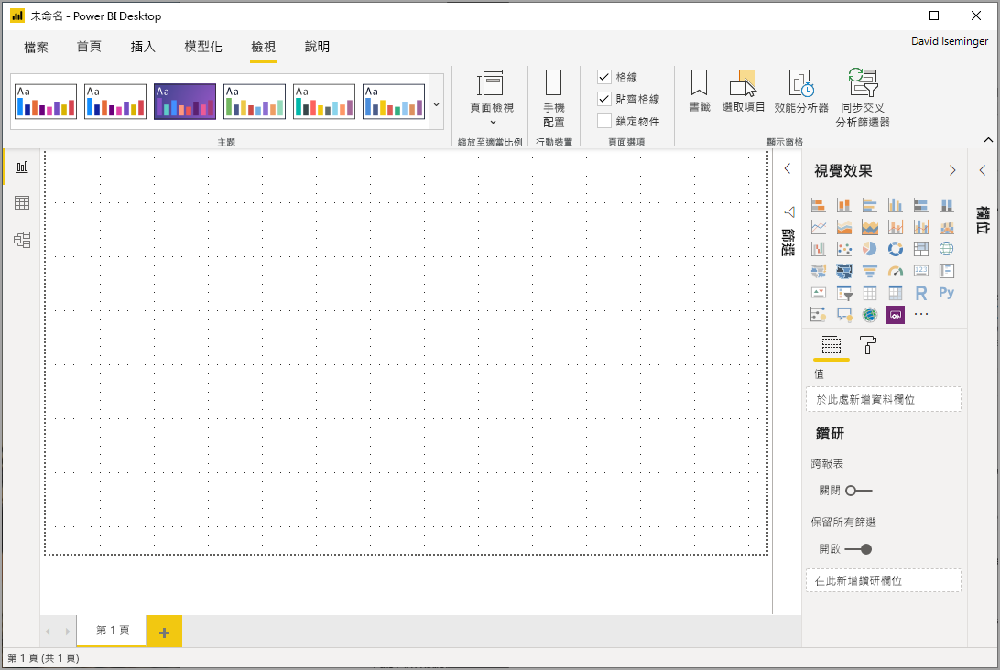
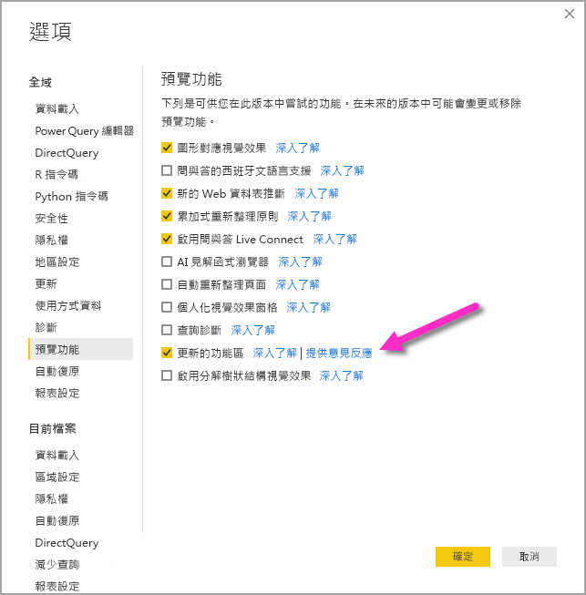
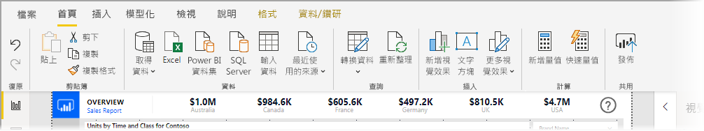
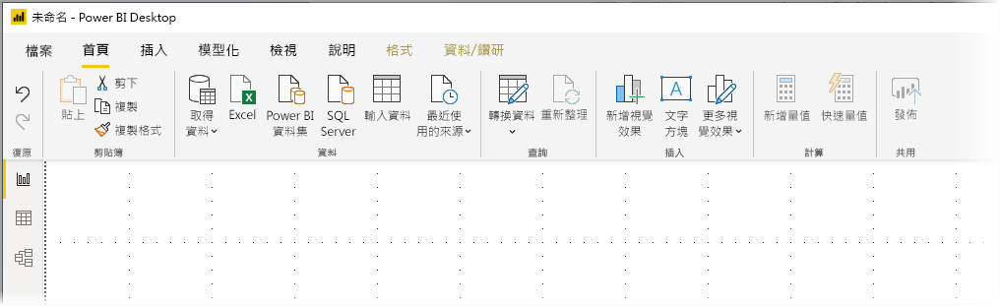
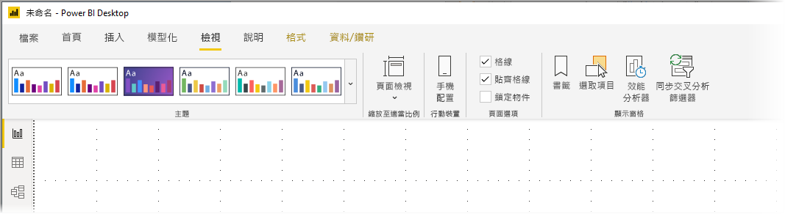
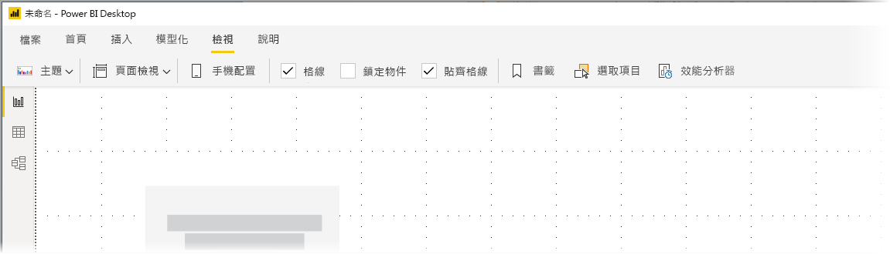

# 使用 Power BI Desktop 中已更新的功能區 (預覽)

從 2019 年 11 月更新開始，Power BI Desktop 會修訂其功能區，使其外觀和體驗更能與其他 Microsoft 產品 (例如 Microsoft Office) 保持一致。

已更新功能區處於預覽狀態，因此我們可以收集使用者和客戶的意見反應，並確定體驗是例外的。 在 Power BI Desktop 已更新功能區發行正式推出之前，我們預期會有幾個月的預覽、意見反應和改進。 

## 如何啟用已更新功能區

Power BI 中的已更新功能區是預覽功能，必須啟用。 若要啟用它，選取 [檔案] > [選項及設定] > [選項]  ，然後從左側資料行選取 [預覽功能]  。 右窗格中為 [已更新功能區]  選取項目。 核取 [已更新功能區]  旁的方塊，以啟用預覽功能。 您必須重新啟動 Power BI Desktop，預覽功能變更才會生效。

## 新功能區的特徵

更新功能區的優點，是為了使跨 Power BI Desktop 以及其他 Microsoft 產品的體驗，變得簡單而熟悉。 

這些優點可以分組成下列類別：

* **改良的外觀、風格與組織** - Power BI Desktop 已更新功能區中的圖示和功能，都與 Office 應用程式中功能區項目的外觀、風格和組織一致。

    

* **直覺化的佈景主題庫** - 佈景主題庫 (可在 [檢視]  功能區中找到) 具有 PowerPoint 佈景主題庫的熟悉外觀與風格。 因此，功能區中的影像會向您顯示佈景主題變更後的外觀，例如色彩組合和字型。 

    

* **以您的檢視為基礎的動態功能區內容** - 在 Power BI Desktop 的現有功能區中，無法使用的圖示或命令只會呈現灰色，因而產生不太理想的體驗。 使用已更新功能區時，圖示會以動態方式顯示和排列，讓您在內容中一律知道哪些選項可供您使用。

* **單行功能區折疊後可為您節省空間** - 已更新功能區的另一個優點，是能夠將功能區本身折疊成單行，以動態方式顯示以您的內容為基礎的功能區項目。 

    

除了那些可見的變更之外，已更新功能區也可以讓我們對 Power BI Desktop 及其功能區進行後續更新，如下所示：

* 在功能區中建立更具彈性且直覺的控制項，例如視覺效果資源庫
* 將「黑色」  和「深灰色」  Office 佈景主題加入到 Power BI Desktop
* 改善協助工具

## 後續步驟
您可以使用 Power BI Desktop 連接至各式各樣的資料。 如需有關資料來源的詳細資訊，請參閱下列資源︰

* [Power BI Desktop 是什麼？](desktop-what-is-desktop.md)
* [Power BI Desktop 中的資料來源](desktop-data-sources.md)
* [使用 Power BI Desktop 合併資料並使其成形](desktop-shape-and-combine-data.md)
* [在 Power BI Desktop 中連接至 Excel 活頁簿](desktop-connect-excel.md)   
* [直接將資料輸入 Power BI Desktop 中](desktop-enter-data-directly-into-desktop.md)   

