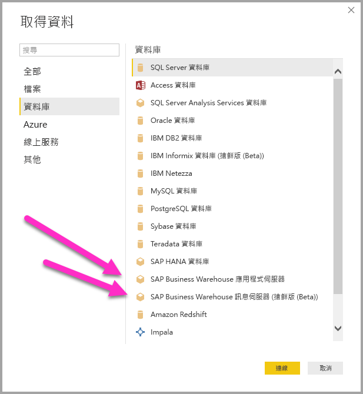
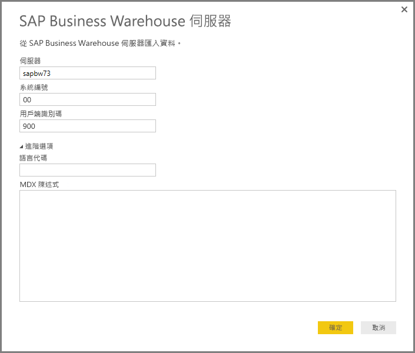
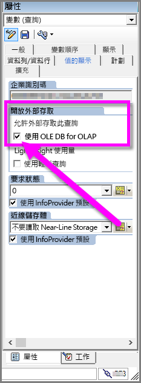

# 在 Power BI Desktop 中使用 SAP BW 連接器
您可以透過 Power BI Desktop 存取 **SAP Business Warehouse (BW)** 資料。

如需有關 SAP 客戶可如何從將 Power BI 連線到其現有的 SAP Business Warehouse (BW) 系統中受益的資訊，請參閱 [Power BI 與 SAP BW 白皮書](https://aka.ms/powerbiandsapbw)。

從 2018 年 6 月版本的 **Power BI Desktop** 開始，您可以使用 SAP BW 連接器，它具有大幅提升效能與功能的實作。 此更新版本的 SAP BW 連接器由 Microsoft 開發，稱為**實作 2.0**。 您可以選取標準 **SAP BW 連接器**，或**實作 2.0 SAP 連接器**。 下列各節會依序描述每個版本的安裝。 從 Power BI Desktop 連線至 SAP BW 時，您可以選擇其中一個或另一個連接器。

我們建議您盡可能使用**實作 2.0 SAP 連接器**。

## 標準 SAP BW 連接器的安裝
我們建議盡可能使用實作 2.0 SAP 連接器 (請參閱下一節中的指示)。 本節描述標準 **SAP BW 連接器**的安裝，您可以採取下列安裝步驟來安裝：

1. 在本機電腦上安裝 **SAP NetWeaver** 程式庫。 您可以從 SAP 管理員，或是直接從 [SAP Software Download Center](https://support.sap.com/swdc) (SAP 軟體下載中心) 取得 **SAP Netweaver**。 由於 **SAP Software Download Center** (SAP 軟體下載中心) 經常變更其結構，因此未提供瀏覽該網站的更具體指引。 **SAP NetWeaver** 程式庫通常也包含在 SAP 用戶端工具的安裝中。
   
   您可以搜尋 *SAP Note #1025361* 以取得最新版本的下載位置。 請確認 **SAP NetWeaver** 程式庫 (32 位元或 64 位元) 的架構符合您的 **Power BI Desktop** 安裝，然後依據 SAP Note 安裝 **SAP NetWeaver RFC SDK** 內含的所有檔案。
2. [取得資料] 對話方塊在 [資料庫] 類別中包含 **SAP Business Warehouse 應用程式伺服器**和 **SAP Business Warehouse 訊息伺服器**項目。
   
   

## 實作 2.0 SAP 連接器的安裝

SAP 連接器的**實作 2.0** 需要使用 SAP .NET 連接器 3.0。 您可以使用下列連結從 SAP 的網站[下載 SAP .NET 連接器 3.0](https://go.microsoft.com/fwlink/?linkid=872300)：

* [SAP .NET 連接器 3.0](https://go.microsoft.com/fwlink/?linkid=872300)

下載存取需要有效的 S 使用者。 我們建議客戶與 SAP 基礎小組連絡，以取得 SAP .NET 連接器 3.0。 

連接器有 32 位元和 64 位元的版本，使用者「必須」選擇符合他們 Power BI Desktop 安裝的版本。 在撰寫本文時，網站列出兩個版本 (適用於 .NET 4.0 Framework)：

* 適用於 Windows 32 位元 (x86) 的 SAP Connector for Microsoft .NET 3.0.20.0，ZIP 檔 (6.896 KB)，2018 年 1 月 16 日
* 適用於 Windows 64 位元 (x64) 的 SAP Connector for Microsoft .NET 3.0.20.0，ZIP 檔 (7.180 KB)，2018 年 1 月 16 日

在安裝時的 [選用設定步驟] 視窗中，請確定您選取 [安裝組件至 GAC] 選項，如下圖所示。

> [!NOTE]
> 標準 SAP BW 實作需要 Netweaver DLL；如果您使用 SAP 連接器實作 2.0 且不使用標準版本，則不需要 Netweaver DLL。

## 標準 SAP BW 連接器功能
Power BI Desktop 的標準 **SAP BW 連接器**可讓您從您的 **SAP Business Warehouse 伺服器** Cube 匯入資料，或使用 DirectQuery。 

若要深入了解 **SAP BW 連接器**以及它如何與 DirectQuery 搭配使用，請參閱 [DirectQuery 和 SAP Business Warehouse (BW)](desktop-directquery-sap-bw.md) 一文。

連線時，您必須指定「伺服器」、「系統名稱」與「用戶端識別碼」以建立連線。

您也可以指定其他兩個**進階選項**︰語言代碼，以及對指定的伺服器執行自訂 MDX 陳述式。

如果未指定 MDX 陳述式，您會看到 [導覽] 視窗，其中顯示伺服器中可用的 Cube 清單，以及從可用 Cube 向下鑽研並選取項目 (包括維度和量值) 的選項。 Power BI 會公開 [BW Open Analysis Interface OLAP BAPI](https://help.sap.com/saphelp_nw70/helpdata/en/d9/ed8c3c59021315e10000000a114084/content.htm) 所公開的查詢和 Cube。

當您從伺服器選取一個或多個項目時，會根據選取範圍建立輸出資料表的預覽。

[導覽] 視窗也提供一些 [顯示選項]，可讓您執行下列動作︰

* **顯示「僅選取的項目」和「所有項目」 (預設檢視)︰** 此選項適用於驗證所選取的最後一組項目。 另一個檢視方法是在 [預覽] 區域中選取 [資料行名稱]。
* **啟用資料預覽 (預設行為)**︰您也可以控制是否應該在此對話方塊中顯示資料預覽。 停用資料預覽可減少伺服器呼叫的數量，因為它不會再要求資料進行預覽。
* **技術名稱**︰SAP BW 支援 Cube 內物件的「技術名稱」概念。 技術名稱可讓 Cube 擁有者公開 Cube 物件的「使用者易記」名稱，而不只是公開 Cube 中這些物件的「實體名稱」。

![[導覽器] 視窗](media/desktop-sap-bw-connector/sap_bw_6.png)

在 [導覽] 中選取所有必要物件後，您可以選取 [導覽] 視窗底部的下列其中一個按鈕來決定後續動作︰

* 選取 [載入] 會觸發將輸出資料表的整組資料列載入 Power BI Desktop 資料模型，然後帶您前往 [報表] 檢視，您可以在此使用 [資料] 或 [關聯性] 檢視開始對資料進行視覺化或進一步修改。
* 選取 [編輯] 會顯示 [查詢編輯器]，您可以在此執行其他資料轉換和篩選步驟，再將整組資料列帶入 Power BI Desktop 資料模型。

除了從 **SAP BW** Cube 匯入資料之外，請記住，您也可以從 Power BI Desktop 中的其他廣泛資料來源匯入資料，然後再合併成一個報表。 如此一來，便可根據 **SAP BW** 資料進行各種有趣的報告和分析案例。

## 使用實作 2.0 SAP BW 連接器

您必須建立新連線，才能使用 SAP BW 連接器的實作 2.0。 請採取下列步驟建立新連線。

1. 從 [取得資料] 視窗中，選取 [SAP Business Warehouse 應用程式伺服器] 或 [SAP Business Warehouse 訊息伺服器]。

2. 您會看到新連線對話方塊，然後便可以選取實作。 選取 [實作 2.0]，如下圖所示，會啟用 [執行模式]、[批次大小] 及 [啟用特性結構] 選項。

    

3. 選取 [確定]，之後 [導覽器] 體驗會與前一節中描述的標準 SAP BW 連接器相同。 

### 實作 2.0 的新選項 

實作 2.0 支援下列選項：

1. **ExecutionMode** - 指定用來在伺服器上執行查詢的 MDX 介面。 有效的選項如下：

        a. SapBusinessWarehouseExecutionMode.BasXml
        b. SapBusinessWarehouseExecutionMode.BasXmlGzip
        c. SapBusinessWarehouseExecutionMode.DataStream

    這個選項的預設值是 SapBusinessWarehouseExecutionMode.BasXmlGzip。

    使用 *SapBusinessWarehouseExecutionMode.BasXmlGzip* 可能會改善在大型資料集或大型資料集遇到高度延遲時的效能。

2. **BatchSize** - 指定執行 MDX 陳述式時將一次擷取的資料列數目上限。 在擷取大型資料集時，少量資料列會轉譯成更多個伺服器呼叫。 大量的資料列或可提升效能，但可能會造成 SAP BW 伺服器上的記憶體問題。 預設值為 50000 個資料列。

3. **EnableStructures** - 邏輯值，指出是否會辨識特性結構。 這個選項的預設值為 false。 會影響可讓您選取的物件清單。 原生查詢模式中不支援。

在此實作中，**ScaleMeasures** 選項已被淘汰。 行為現在與設定 *ScaleMeasures = false* 相同，也就是一律會顯示未縮放的值。

### 實作 2.0 的其他改善 

下列項目符號清單會描述新實作所隨附的一些其他改善：

* 改善的效能
* 能夠擷取數百萬個資料列的資料，以及透過批次大小參數進行微調。
* 能夠切換執行模式。
* 支援壓縮模式。 尤其對高延遲的連線或大型資料集有益處。
* 改善的日期變數偵測
* [實驗] 分別公開日期 (ABAP 類型 DATS) 和時間 (ABAP 類型 TIMS) 維度作為日期和時間，而不是文字值。
* 較佳的例外狀況處理。 現在會顯示 BAPI 呼叫中發生的錯誤。
* BasXml 和 BasXmlGzip 模式中的資料行摺疊。 例如，如果產生的 MDX 查詢擷取 40 個資料行，但目前的選取範圍只需要 10 個，則此要求會傳遞到伺服器以擷取較小的資料集。

### 變更現有的報表，以使用實作 2.0 

變更現有的報表以使用**實作 2.0**僅能在匯入模式中進行，而且需要下列手動步驟。

1. 開啟現有的報表、選取功能區中的 [編輯查詢]，然後選取您想要更新的 SAP Business Warehouse 查詢。

2. 以滑鼠右鍵按一下查詢並選取 [進階編輯器]。

3. 在 [進階編輯器] 中，變更 SapBusinessWarehouse.Cubes 呼叫，如下所示： 

    a. 判斷查詢是否已經包含選項記錄，例如在下列範例中顯示的內容：

    

    b. 若是如此，請新增實作 2.0 選項，並移除 ScaleMeasures 選項 (若有)，如下所示：

    

    c. 如果查詢尚未包含選項記錄，請新增它。 例如，如果它包含下列：

    

    d. 只要將它變更為：

    

4. 我們已盡最大努力，讓 SAP BW 連接器的實作 2.0 與標準 SAP BW 連接器相容。 不過，由於使用的不同 SAP BW MDX 執行模式，可能會有一些差異。 若要解決任何不一致，請嘗試在執行模式之間切換。

## 疑難排解
本節提供針對與 **SAP BW** 連接器搭配使用之情況 (和解決方法) 的疑難排解。

1. 來自 **SAP BW** 的數值資料會傳回小數點，而非逗號。 例如，1,000,000 傳回會變成 1.000.000。
   
   **SAP BW** 會傳回使用 *,* (逗號) 或 *.* (點號) 作為小數分隔符號的十進位資料。 為了指定 **SAP BW** 使用哪一種作為小數分隔符號，**Power BI Desktop** 所使用的驅動程式會對 *BAPI_USER_GET_DETAIL* 進行呼叫。 這個呼叫會傳回稱為 **DEFAULTS** 的結構，其中稱為 *DCPFM* 的欄位儲存了「十進位格式表示法」。 它會採用下列三個值之一：
   
       ‘ ‘ (space) = Decimal point is comma: N.NNN,NN
       'X' = Decimal point is period: N,NNN.NN
       'Y' = Decimal point is N NNN NNN,NN
   
   回報此問題的客戶發現特定使用者 (顯示不正確資料的使用者) 無法對 *BAPI_USER_GET_DETAIL* 進行呼叫，並出現類似這樣的錯誤訊息：
   
       You are not authorized to display users in group TI:
           <item>
               <TYPE>E</TYPE>
               <ID>01</ID>
               <NUMBER>512</NUMBER>
               <MESSAGE>You are not authorized to display users in group TI</MESSAGE>
               <LOG_NO/>
               <LOG_MSG_NO>000000</LOG_MSG_NO>
               <MESSAGE_V1>TI</MESSAGE_V1>
               <MESSAGE_V2/>
               <MESSAGE_V3/>
               <MESSAGE_V4/>
               <PARAMETER/>
               <ROW>0</ROW>
               <FIELD>BNAME</FIELD>
               <SYSTEM>CLNTPW1400</SYSTEM>
           </item>
   
   若要解決此問題，使用者必須要求他們的 SAP 管理員授與 Power BI 中使用的 SAPBW 使用者執行 *BAPI_USER_GET_DETAIL* 的權限。 也可以驗證使用者具有必要的 *DCPFM* 值，如這份疑難排解解決方案稍早所述。
2. **SAP BEx 的連線能力查詢**
   
   啟用特定屬性後，您可以在 Power BI Desktop 中執行 **BEx** 查詢，如下圖所示︰
   
   

## 後續步驟
如需 SAP 和 DirectQuery 的詳細資訊，請參閱下列資源：

* [DirectQuery 和 SAP HANA](desktop-directquery-sap-hana.md)
* [Power BI 中的 DirectQuery](desktop-directquery-about.md)
* [DirectQuery 支援的資料來源](desktop-directquery-data-sources.md)
* [Power BI 與 SAP BW 白皮書](https://aka.ms/powerbiandsapbw)
