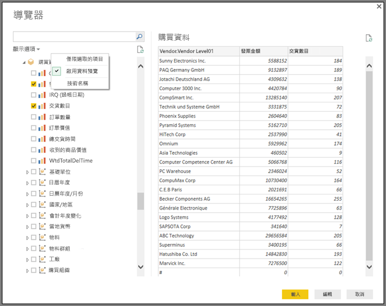

# 在 Power BI Desktop 中使用 SAP BW 連接器
您可以透過 Power BI Desktop 存取 **SAP Business Warehouse (BW)** 資料。

如需有關 SAP 客戶可如何從將 Power BI 連線到其現有的 SAP Business Warehouse (BW) 系統中受益的資訊，請參閱 [Power BI 與 SAP BW 白皮書](https://aka.ms/powerbiandsapbw)。

## SAP BW 連接器的安裝
若要使用 **SAP BW 連接器**，請執行下列安裝步驟︰

1. 在本機電腦上安裝 **SAP NetWeaver** 程式庫。 您可以從 SAP 管理員，或是直接從 [SAP Software Download Center](https://support.sap.com/swdc) (SAP 軟體下載中心) 取得 **SAP Netweaver**。 由於 **SAP Software Download Center** (SAP 軟體下載中心) 經常變更其結構，因此未提供瀏覽該網站的更具體指引。 **SAP NetWeaver** 程式庫通常也包含在 SAP 用戶端工具的安裝中。
   
   您可以搜尋 *SAP Note #1025361* 以取得最新版本的下載位置。 請確認 **SAP NetWeaver** 程式庫 (32 位元或 64 位元) 的架構符合您的 **Power BI Desktop** 安裝，然後依據 SAP Note 安裝 **SAP NetWeaver RFC SDK** 內含的所有檔案。
2. [取得資料] 對話方塊在 [資料庫] 類別中包含 **SAP Business Warehouse 應用程式伺服器**和 **SAP Business Warehouse 訊息伺服器**項目。
   
   

## SAP BW 連接器功能
Power BI Desktop 的 **SAP BW 連接器**可讓您從您的 **SAP Business Warehouse 伺服器** Cube 匯入資料，或使用 DirectQuery。 

若要深入了解 **SAP BW 連接器**以及它如何與 DirectQuery 搭配使用，請參閱 [DirectQuery 和 SAP Business Warehouse (BW)](desktop-directquery-sap-bw.md) 一文。

連線時，您必須指定「伺服器」、「系統名稱」與「用戶端識別碼」以建立連線。

您也可以指定其他兩個**進階選項**︰語言代碼，以及對指定的伺服器執行自訂 MDX 陳述式。

如果未指定 MDX 陳述式，您會看到 [導覽] 視窗，其中顯示伺服器中可用的 Cube 清單，以及從可用 Cube 向下鑽研並選取項目 (包括維度和量值) 的選項。 Power BI 會公開 [BW Open Analysis Interface OLAP BAPI](https://help.sap.com/saphelp_nw70/helpdata/en/d9/ed8c3c59021315e10000000a114084/content.htm) 所公開的查詢和 Cube。

當您從伺服器選取一個或多個項目時，會根據選取範圍建立輸出資料表的預覽。

[導覽] 視窗也提供一些 [顯示選項]，可讓您執行下列動作︰

* **顯示「僅選取的項目」和「所有項目」 (預設檢視)︰** 此選項適用於驗證所選取的最後一組項目。 另一個檢視方法是在 [預覽] 區域中選取 [資料行名稱]。
* **啟用資料預覽 (預設行為)**︰您也可以控制是否應該在此對話方塊中顯示資料預覽。 停用資料預覽可減少伺服器呼叫的數量，因為它不會再要求資料進行預覽。
* **技術名稱**︰SAP BW 支援 Cube 內物件的「技術名稱」概念。 技術名稱可讓 Cube 擁有者公開 Cube 物件的「使用者易記」名稱，而不只是公開 Cube 中這些物件的「實體名稱」。

在 [導覽] 中選取所有必要物件後，您可以選取 [導覽] 視窗底部的下列其中一個按鈕來決定後續動作︰

* 選取 [載入] 會觸發將輸出資料表的整組資料列載入 Power BI Desktop 資料模型，然後帶您前往 [報表] 檢視，您可以在此使用 [資料] 或 [關聯性] 檢視開始對資料進行視覺化或進一步修改。
* 選取 [編輯] 會顯示 [查詢編輯器]，您可以在此執行其他資料轉換和篩選步驟，再將整組資料列帶入 Power BI Desktop 資料模型。

除了從 **SAP BW** Cube 匯入資料之外，請記住，您也可以從 Power BI Desktop 中的其他廣泛資料來源匯入資料，然後再合併成一個報表。 如此一來，便可根據 **SAP BW** 資料進行各種有趣的報告和分析案例。

## 疑難排解
本節提供使用此預覽版 **SAP BW** 連接器的疑難排解情況 (和解決方法)。

1. 來自 **SAP BW** 的數值資料會傳回小數點，而非逗號。 例如，1,000,000 傳回會變成 1.000.000。
   
   **SAP BW** 會傳回使用 *,* (逗號) 或 *.* (點號) 作為小數分隔符號的十進位資料。 為了指定 **SAP BW** 使用哪一種作為小數分隔符號，**Power BI Desktop** 所使用的驅動程式會對 *BAPI_USER_GET_DETAIL* 進行呼叫。 這個呼叫會傳回稱為 **DEFAULTS** 的結構，其中稱為 *DCPFM* 的欄位儲存了「十進位格式表示法」。 它會採用下列三個值之一：
   
       ‘ ‘ (space) = Decimal point is comma: N.NNN,NN
       'X' = Decimal point is period: N,NNN.NN
       'Y' = Decimal point is N NNN NNN,NN
   
   回報此問題的客戶發現特定使用者 (顯示不正確資料的使用者) 無法對 *BAPI_USER_GET_DETAIL* 進行呼叫，並出現類似這樣的錯誤訊息：
   
       You are not authorized to display users in group TI:
           <item>
               <TYPE>E</TYPE>
               <ID>01</ID>
               <NUMBER>512</NUMBER>
               <MESSAGE>You are not authorized to display users in group TI</MESSAGE>
               <LOG_NO/>
               <LOG_MSG_NO>000000</LOG_MSG_NO>
               <MESSAGE_V1>TI</MESSAGE_V1>
               <MESSAGE_V2/>
               <MESSAGE_V3/>
               <MESSAGE_V4/>
               <PARAMETER/>
               <ROW>0</ROW>
               <FIELD>BNAME</FIELD>
               <SYSTEM>CLNTPW1400</SYSTEM>
           </item>
   
   若要解決此問題，使用者必須要求他們的 SAP 管理員授與 Power BI 中使用的 SAPBW 使用者執行 *BAPI_USER_GET_DETAIL* 的權限。 也可以驗證使用者具有必要的 *DCPFM* 值，如這份疑難排解解決方案稍早所述。
2. **SAP BEx 的連線能力查詢**
   
   啟用特定屬性後，您可以在 Power BI Desktop 中執行 **BEx** 查詢，如下圖所示︰
   
   

## 後續步驟
如需 SAP HANA 和 DirectQuery 的詳細資訊，請參閱下列資源：

* [DirectQuery 和 SAP HANA](desktop-directquery-sap-hana.md)
* [Power BI 中的 DirectQuery](desktop-directquery-about.md)
* [DirectQuery 支援的資料來源](desktop-directquery-data-sources.md)
* [Power BI 與 SAP BW 白皮書](https://aka.ms/powerbiandsapbw)
