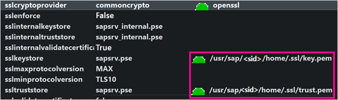
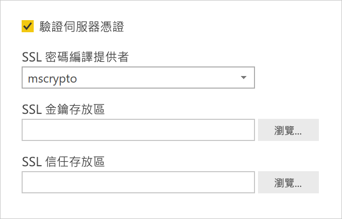

# <a name="enable-encryption-for-sap-hana"></a>啟用 SAP HANA 的加密

我們建議您將從 Power BI Desktop 和 Power BI 服務到 SAP HANA 伺服器的連線加密。 您可以使用 OpenSSL 和 SAP 的專屬 CommonCryptoLib (先前稱為 sapcrypto) 程式庫來啟用 HANA 加密。 SAP 建議使用 CommonCryptoLib，但可使用任一種程式庫來取得基本加密功能。

本文概述如何使用 OpenSSL 啟用加密，並參考 SAP 文件的某些特定區域。 我們會定期更新內容和連結，但如需完整的指示和支援，請務必參閱 SAP 官方文件。 如果您想要使用 CommonCryptoLib 而非 OpenSSL 來設定加密，請參閱 [How to Configure TLS/SSL in SAP HANA 2.0](https://blogs.sap.com/2018/11/13/how-to-configure-tlsssl-in-sap-hana-2.0/) (如何在 SAP HANA 2.0 設定 TLS/SSL)。如需從 OpenSSL 遷移至 CommonCryptoLib 的步驟，請參閱 [SAP Note 2093286](https://launchpad.support.sap.com/#/notes/2093286) (需要 s 使用者)。

> [!NOTE]
> 本文中詳述的設定步驟會與 SAML SSO 的安裝和設定步驟重疊。 無論您選擇 OpenSSL 或 CommonCryptoLib 作為 HANA 伺服器的加密提供者，請確定您的選擇在 SAML 和加密設定之間為一致。

有四個階段可讓您使用 OpenSSL 來啟用 SAP HANA 的加密。 接下來我們將討論這些階段。  如需詳細資訊，請參閱 [Securing the Communication between SAP HANA Studio and SAP HANA Server through SSL](https://blogs.sap.com/2015/09/28/securing-the-communication-between-sap-hana-studio-and-sap-hana-server-through-ssl/) (透過 SSL 保護 SAP HANA Studio 和 SAP HANA 伺服器之間的通訊)。

## <a name="use-openssl"></a>使用 OpenSSL

請確定您的 HANA 伺服器已設定為使用 OpenSSL 作為其密碼編譯提供者。 請使用 HANA 伺服器的伺服器識別碼 (SID) 來取代下方所遺漏的路徑資訊。



## <a name="create-a-certificate-signing-request"></a>建立憑證簽署要求

為 HANA 伺服器建立 X509 憑證簽署要求。

1. 使用 SSH 以 \<sid\>adm 身分連線到執行 HANA 伺服器的 Linux 機器。

1. 移至主目錄 _/__usr/sap/\<sid\>/home_。

1. 建立名為 _.__ssl_ 的隱藏目錄 (如果尚不存在的話)。

1. 執行下列命令：

    ```
    openssl req -newkey rsa:2048 -days 365 -sha256 -keyout Server\_Key.pem -out Server\_Req.pem -nodes
    ```

此命令會建立憑證簽署要求和私密金鑰。 簽署之後，憑證的有效期限為一年 (請參閱 -days 參數)。 當系統提示您輸入一般名稱 (CN) 時，請輸入 HANA 伺服器安裝所在電腦的完整網域名稱 (FQDN)。

## <a name="get-the-certificate-signed"></a>取得已簽署的憑證

取得憑證授權單位 (CA) 所簽署的憑證，而該憑證授權單位受到您用來連線到 HANA 伺服器的用戶端信任。

1. 如果您已經有信任的公司 CA (在下列範例中以 CA\_Cert.pem 和 CA\_Key.pem 表示)，請執行下列命令來簽署憑證要求：

    ```
    openssl x509 -req -days 365 -in Server\_Req.pem -sha256 -extfile /etc/ssl/openssl.cnf -extensions usr\_cert -CA CA\_Cert.pem -CAkey CA\_Key.pem -CAcreateserial -out Server\_Cert.pem
    ```

    如果您還沒有可使用的 CA，可以遵循 [Securing the Communication between SAP HANA Studio and SAP HANA Server through SSL](https://blogs.sap.com/2015/09/28/securing-the-communication-between-sap-hana-studio-and-sap-hana-server-through-ssl/) (透過 SSL 保護 SAP HANA Studio 和 SAP HANA 伺服器之間的通訊) 中所述步驟，自行建立根 CA。

1. 結合伺服器憑證、金鑰和 CA 的憑證 (key.pem 名稱是 SAP HANA 的慣例) 來建立 HANA 伺服器憑證鏈：

    ```
    cat Server\_Cert.pem Server\_Key.pem CA\_Cert.pem \> key.pem
    ```

1. 建立名為 trust.pem 的 CA\_Cert.pem 複本 (trust.pem 名稱是 SAP HANA 的慣例)：

    ```
    cp CA\_Cert.pem trust.pem
    ```

1. 重新啟動 HANA 伺服器。

1. 確認用戶端與您用來簽署 SAP HANA 伺服器憑證的 CA 之間有信任關係。

    用戶端必須信任用來簽署 HANA 伺服器 X509 憑證的 CA，才能從用戶端的電腦對 HANA 伺服器建立加密連線。

    有各種方式可以使用 Microsoft Management Console (mmc) 或命令列來確保存在此信任關係。 您可以將 CA X509 憑證 (trust.pem) 匯入即將建立連線的使用者 [信任的根憑證授權單位]  資料夾中，或是匯入用戶端電腦本身的相同資料夾中 (想要的話)。

    

    您必須先將 trust.pem 轉換成 .crt 檔案，才能將憑證匯入「信任的根憑證授權單位」資料夾，例如藉由執行下列 OpenSSL 命令：

    ```
    openssl x509 -outform der -in your-cert.pem -out your-cert.crt
    ```
    
    如需使用 OpenSSL 進行轉換的資訊，請參閱 [OpenSSL 文件](https://www.openssl.org/docs/manmaster/man1/x509.html)。

## <a name="test-the-connection"></a>測試連線

在 Power BI Desktop 或 Power BI 服務中測試連線。

1. 在 Power BI Desktop 或 Power BI 服務的 [管理閘道]  頁面中，確定已啟用 [驗證伺服器憑證]  ，然後嘗試建立與 SAP HANA 伺服器的連線。 針對 [SSL 密碼編譯提供者]  ，如果您已遵循 OpenSSL 安裝步驟，請選取 mscrypto；如果您已將 commoncrypto 程式庫設定為密碼編譯提供者，請選取 commoncrypto。 將 [SSL 金鑰存放區] 和 [SSL 信任存放區] 欄位保留為空白。

    - Power BI Desktop

        

    - Power BI 服務

        

1. 藉由在 Power BI Desktop 中載入資料，或在 Power BI 服務中重新整理已發佈的報表，確認您可以成功地建立與伺服器的加密連線，且已啟用 [驗證伺服器憑證]  選項。
