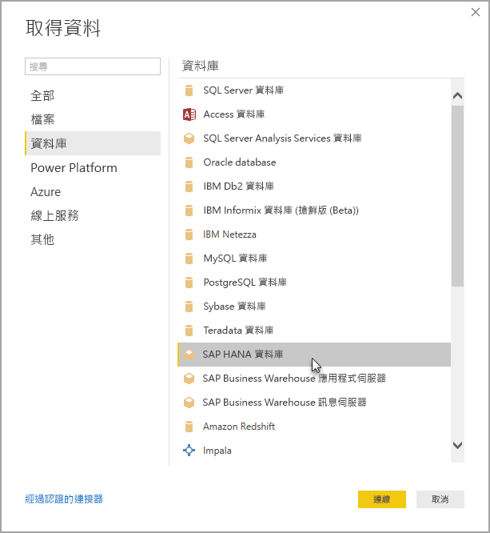

# 在 Power BI Desktop 中使用 SAP HANA
使用 Power BI Desktop，您現在可以存取 **SAP HANA** 資料庫。 若要使用 **SAP HANA**，SAP HANA ODBC 驅動程式必須安裝在本機用戶端電腦，以便 Power BI Desktop **SAP HANA** 資料連接正常運作。 您可以從 [SAP Software Download Center](https://support.sap.com/swdc) (SAP 軟體下載中心) 下載 SAP HANA ODBC 驅動程式. 從該處搜尋適用於 Windows 電腦的 SAP HANA CLIENT。 由於 **SAP Software Download Center** (SAP 軟體下載中心) 經常變更其結構，因此未提供瀏覽該網站的更具體指引。

若要連線到 **SAP HANA** 資料庫，請選取 [取得資料] > [資料庫] > [SAP HANA 資料庫]，如下圖所示。

連接至 SAP HANA 資料庫時，請指定伺服器名稱和連接埠，格式為 *server: port* -下圖顯示的範例使用名為 *ServerXYZ* 和連接埠為 *30015* 的伺服器。

在此版本中，Power BI Desktop 和 Power BI Service 支援 [DirectQuery](desktop-use-directquery.md) 模式中的 **SAP HANA**，而且您可以在 DirectQuery 模式中，將使用 **SAP HANA** 的報表發佈或上傳至 Power BI 服務。 如果不在 DirectQuery 模式中使用 **SAP HANA** ，您可以發佈和上傳報表至 Power BI Service。

### SAP HANA 的支援功能
這個版本包含許多 **SAP HANA**功能，如下列清單所示：

* 適用於 **SAP HANA** 的 Power BI 連接器使用 SAP ODBC 驅動程式來提供最佳使用體驗。
* **SAP HANA** 同時支援 [DirectQuery] 和 [匯入] 選項
* Power BI 支援 HANA 資訊模型 (例如 [分析] 和 [計算] 檢視)，而且已最佳化瀏覽
* 透過 **SAP HANA** ，您也可以使用直接 SQL 功能連接到資料列和資料行資料表
* 包含 HANA 模型的最佳化瀏覽
* Power BI 支援 **SAP HANA** 變數和輸入參數

### 安裝 SAP HANA ODBC 驅動程式
### SAP HANA 的限制
使用 **SAP HANA**也會有一些限制，如下所示：

* NVARCHAR 字串會截斷成 4000 個 Unicode 字元的最大長度
* 不支援 SMALLDECIMAL
* 不支援 VARBINARY
* 有效日期介於 1899/12/30 到 9999/12/31 之間。

