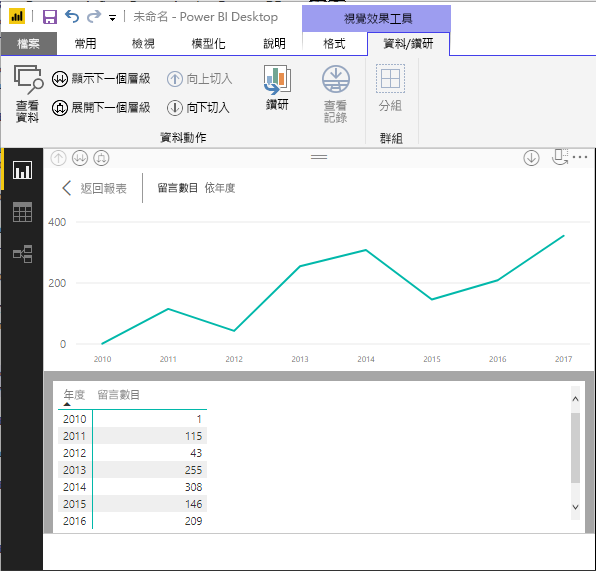
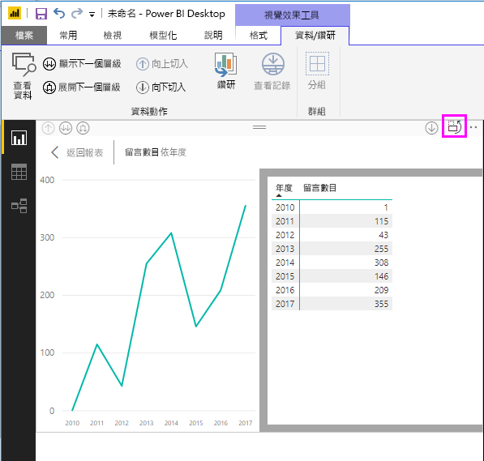
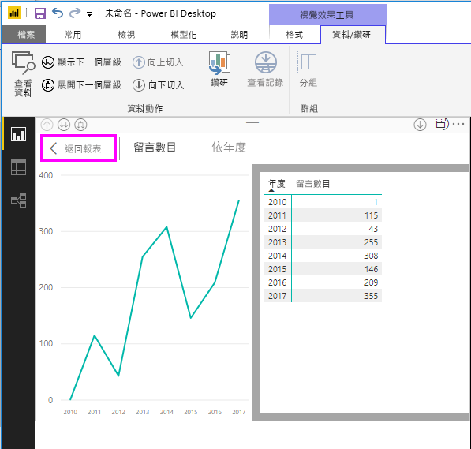
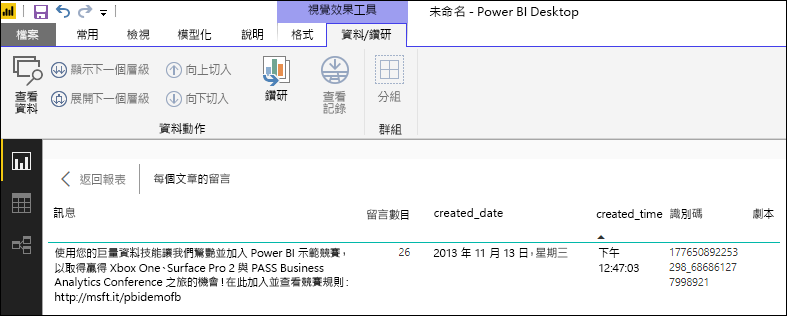
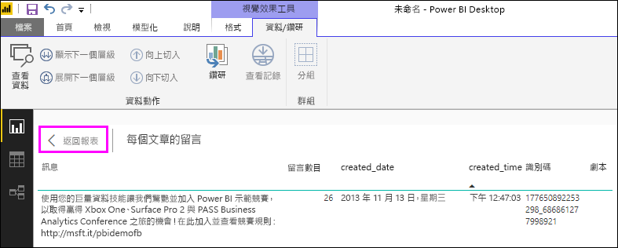

# 使用 Power BI Desktop 中的查看資料和查看記錄
在 **Power BI Desktop** 中，您可以向下鑽研到視覺效果的詳細資料，並查看所選視覺效果基底資料的文字表示或個別資料記錄。 這些功能有時稱為「按一下」  ，或「鑽研」  或「鑽研到詳細資料」  。

您可以使用 [查看資料]  來檢視所選視覺效果所使用的值的文字版本，或使用 [查看記錄]  來檢視所選記錄或資料點的所有資料。 

![[查看資料] 與 [查看記錄]](media/desktop-see-data-see-records/see-data-record.png)

>[!IMPORTANT]
>[查看資料]  與 [查看記錄]  只支援以下視覺效果類型：
>  - 橫條圖
>  - 直條圖
>  - 環圈圖
>  - 區域分布圖
>  - 漏斗圖
>  - 地圖
>  - 圓形圖
>  - 樹狀圖

## 使用 Power BI Desktop 中的 [查看資料]

[查看資料]  會顯示視覺效果的基底資料。 [查看資料]  會在已選取視覺效果時，顯示在功能區 [視覺效果工具]  區段的 [資料/鑽研]  索引標籤中。

![功能區中的 [查看資料]](media/desktop-see-data-see-records/see-data1.png)

若要查看資料，您也可以用滑鼠右鍵按一下視覺效果，然後從顯示的功能表選取 [顯示資料]  ，或選取視覺效果右上角的 [更多選項]  (...)，然後選取 [顯示資料]  。

![按一下滑鼠右鍵的 [顯示資料]](media/desktop-see-data-see-records/see-data2.png)&nbsp;&nbsp;![更多選項的 [顯示資料]](media/desktop-see-data-see-records/see-data3.png)

> [!NOTE]
> 您的滑鼠必須在視覺效果的資料點暫留，才能使用右鍵功能表。

當您選取 [查看資料]  或 [顯示資料]  時，Power BI Desktop 畫布會同時顯示資料的視覺效果和文字表示。 在「水平檢視」  中，視覺效果顯示在畫布的上半部，而資料顯示在下半部。 

您可以選取畫布右上角的圖示，以在水平檢視和「垂直檢視」  之間切換。

若要回到報表，請選取畫布左上角的 [< 返回報表]  。

## 在 Power BI Desktop 中使用 [查看記錄]

您也可以將焦點放在視覺效果中的一個資料記錄，然後鑽研到它背後的資料。 若要使用 [查看記錄]  ，請選取視覺效果，然後選取功能區的 [視覺效果工具]  區段中 [資料/鑽研]  索引標籤的 [查看記錄]  ，然後選取視覺效果上的資料點或資料列。 

![功能區中的 [查看記錄]](media/desktop-see-data-see-records/see-record1.png)

> [!NOTE]
> 如果功能區中的 [查看記錄]  按鈕已停用且顯示為灰色，表示所選取的視覺效果不支援 [查看記錄]  。

您也可以滑鼠右鍵按一下資料元素，並從顯示的功能表中選取 [查看記錄]  。

![按一下滑鼠右鍵的 [查看記錄]](media/desktop-see-data-see-records/see-record2.png)

當您選取資料元素的 [查看記錄]  時，Power BI Desktop 畫布會顯示與所選元素相關聯的所有資料。 

若要回到報表，請選取畫布左上角的 [< 返回報表]  。

> [!NOTE]
>[查看記錄]  有以下限制：
> - 您無法在 [查看記錄]  檢視中變更資料並儲存回報表。
> - 當視覺效果使用導出量值時，無法使用 [查看記錄]  。
> - 當您連接到即時多維度模型 (MD) 時，不能使用 [查看記錄]  。

## 後續步驟
**Power BI Desktop** 有各種報表格式和資料管理功能。 請查看下列資源以取得一些範例︰

* [在 Power BI Desktop 中使用群組和收納](desktop-grouping-and-binning.md)
* [在 Power BI Desktop 報表中使用格線、貼齊格線、堆疊順序、對齊及相等間距](desktop-gridlines-snap-to-grid.md)

