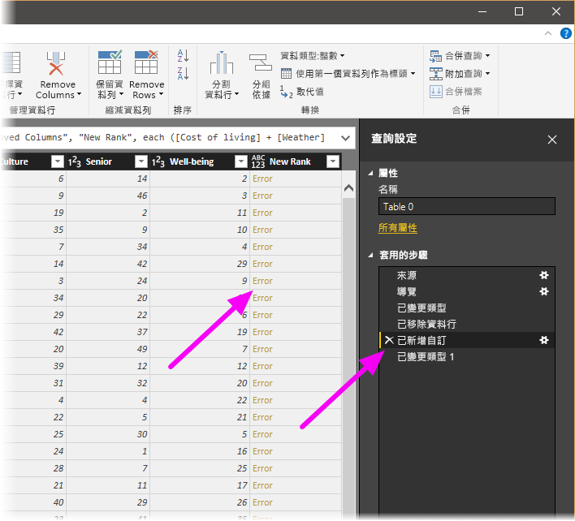
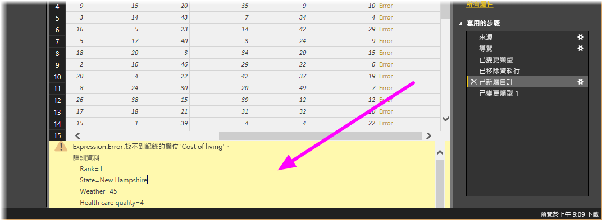

# <a name="tutorial-shape-and-combine-data-in-power-bi-desktop"></a>教學課程：在 Power BI Desktop 中將資料成形及合併

使用 Power BI Desktop，您可以連線到各種不同的資料來源，然後將資料成形以符合需求，以便建立能夠與其他人共用的視覺效果報表。 將資料「成形」  的意思為轉換資料：重新命名資料行或資料表、將文字變更為數值、移除資料列、將第一個資料列設定為標頭等。 「結合」  資料的意思為連線到二個或更多個資料來源、視需要將資料成形，然後合併成一個實用的查詢。

在本教學課程中，您將了解如何：

* 使用查詢編輯器將資料成形。
* 連線到不同的資料來源。
* 合併那些資料來源，並建立可在報表中使用的資料模型。

本教學課程示範如何使用 Power BI Desktop 讓查詢成形，並特別說明最常見的工作。 如需進一步了解此處所用的查詢，包括如何從頭建立查詢，請參閱[開始使用 Power BI Desktop](desktop-getting-started.md).

Power BI Desktop 中的查詢編輯器經常會用到快顯功能表，以及 [轉換]  功能區。 您可以在功能區中選取的大多數功能，也可以透過以滑鼠右鍵按一下項目 (例如資料行)，然後從顯示的功能表中選擇來加以存取。

## <a name="shape-data"></a>資料成形
當在查詢編輯器中將資料成形時，您會提供逐步指示，讓查詢編輯器為您執行，以在查詢編輯器載入及呈現資料時調整資料。 原始資料來源不會受到影響，只有這個特定資料檢視會受調整或「成形」  。

查詢編輯器會記錄您指定的步驟 (例如重新命名資料表、轉換資料類型或刪除資料行)。 每次此查詢連線到資料來源時，查詢編輯器都會執行這些步驟，如此一來，資料便會一律以您指定的方式成形。 每當您使用查詢編輯器時，或任何人使用您的共用查詢，例如 Power BI 服務上的查詢，都會進行這個程序。 所有這些步驟都會循序擷取在 [查詢設定]  窗格的 [套用的步驟]  中。 我們將在接下來的幾個段落中，逐一說明每個步驟。

![[查詢設定] 中套用的步驟](media/desktop-shape-and-combine-data/shapecombine_querysettingsfinished2.png)

從[開始使用 Power BI Desktop](desktop-getting-started.md)，讓我們使用退休資料，也就是連線到 Web 資料來源時找到的資料，將該資料成形以符合我們的需求。 我們將新增自訂資料行以根據所有資料皆為相等因子來計算排名，並將此資料行與現有資料行 **Rank** 進行比較。  

1. 從 [新增資料行]  功能區，選取 [自訂資料行]  ，這可讓您新增自訂資料行。

    

1. 在 [自訂資料行]  視窗的 [新增資料行名稱]  中，輸入 _New Rank_。 在 [自訂資料行公式]  中，輸入下列資料：

    ```
    ([Cost of living] + [Weather] + [Health care quality] + [Crime] + [Tax] + [Culture] + [Senior] + [#"Well-being"]) / 8
    ```
 
1. 確定狀態訊息為「未偵測到任何語法錯誤」  ，然後選取 [確定]  。

    ![沒有語法錯誤的 [自訂資料行] 頁面](media/desktop-shape-and-combine-data/shapecombine_customcolumndialog.png)

1. 為了讓資料行的資料保持一致，請將新的資料行值轉換為整數。 以滑鼠右鍵按一下資料行標頭，然後選取 [變更類型] \> [整數]  就能加以變更。 

    如果需要選擇多個資料行，請先選取一個資料行、按住 **SHIFT**、選取其他相鄰的資料行，然後以滑鼠右鍵按一下資料行標頭。 您也可以使用 **CTRL** 鍵選擇非相鄰的資料行。

    

1. 若要「轉換」  資料行資料類型來將目前的資料類型轉換成另一種，請從 [轉換]  功能區選取 [資料類型文字]  。 

   

1. [查詢設定]  中的 [套用的步驟]  清單會反映已套用至資料的所有成形步驟。 若要移除成形程序中的步驟，請選取步驟左邊的 **X**。 

    在下圖中，[套用的步驟]  清單會反映目前為止新增的步驟： 
     - **來源**：連線到網站。
     - **導覽**：選取資料表。 
     - **已變更類型**：將以文字為基礎的數字資料行從「文字」  變更為「整數」  。 
     - **已新增自訂**：新增自訂資料行。
     - **已變更類型 1**：最後一個套用的步驟。

       

## <a name="adjust-data"></a>調整資料

使用這項查詢之前，我們需要進行一些變更以調整其資料：

   - 藉由移除資料行來調整排名。

       我們判定 [Cost of living]  在結果中不是一項因素。 移除此資料行之後，我們發現資料保持不變。 

   - 修正一些錯誤。

       由於我們移除了資料行，因此需要重新調整 [New Rank]  資料行中的計算，這牽涉到變更公式。

   - 將資料排序。

       根據 [New Rank]  和 [Rank]  資料行來排序資料。
 
   - 取代資料。

       我們將著重於如何取代特定值，以及插入 [套用的步驟]  的需求。

   - 變更資料表名稱。 

       因為 [Table 0]  不是資料表的有用描述項，所以我們會變更其名稱。

1. 若要移除 [Cost of living]  資料行，請選取該資料行並從功能區選擇 [首頁]  索引標籤，然後選取 [移除資料行]  。

    ![選取 [移除資料行]](media/desktop-shape-and-combine-data/shapecombine_removecolumnscostofliving.png)

   請注意，**New Rank** 值尚未變更；這是因為步驟順序的關係。 因為查詢編輯器會循序記錄步驟，但每個步驟彼此獨立，所以您可以在序列中上下移動每個 [套用的步驟]  。 

1. 以滑鼠右鍵按一下步驟。 查詢編輯器會提供一個功能表，讓您執行下列工作： 
   - **重新命名**；重新命名步驟。
   - **刪除**：刪除步驟。
   - **刪除到結尾**  ：移除目前步驟和所有後續步驟。
   - **上移**：在清單中向上移動步驟。
   - **下移**：在清單中向下移動步驟。

1. 將最後一個步驟 [已移除資料行]  向上移動到 [已新增自訂]  步驟的正上方。

   ![在 [套用的步驟] 中向上移動步驟](media/desktop-shape-and-combine-data/shapecombine_movestep.png)

1. 選取 [已新增自訂]  步驟。 

   請注意，資料現在會顯示我們需要處理的「錯誤」  。

   

   您可以使用幾種方式來取得每個錯誤的詳細資訊。 如果您選取資料格而未按一下 [錯誤]  一字，則查詢編輯器會在視窗底部顯示錯誤資訊。

   

   如果您直接選取 [錯誤]  一字，則查詢會在 [查詢設定]  窗格中建立一個 [套用的步驟]  ，並顯示該錯誤的相關資訊。 

1. 因為我們不需要顯示錯誤的相關資訊，所以請選取 [取消]  。

1. 若要修正錯誤，請選取 [New Rank]  資料行，然後從 [檢視]  索引標籤選取 [公式列]  核取方塊來顯示資料行的資料公式。 

   ![選取 [公式列]](media/desktop-shape-and-combine-data/shapecombine_formulabar.png)

1. 將公式變更為下列內容來移除 _Cost of living_ 參數並遞減除數： 
   ```
    Table.AddColumn(#"Removed Columns", "New Rank", each ([Weather] + [Health care quality] + [Crime] + [Tax] + [Culture] + [Senior] + [#"Well-being"]) / 7)
   ```

1. 選取公式方塊左邊的綠色核取記號，或按 **Enter**。

  查詢編輯器會以修改過的值來取代資料，而 [已新增自訂]  步驟會完成，而不會發生任何錯誤。

   > [!NOTE]
   > 您也可以使用功能區或快顯功能表選取 [移除錯誤]  來移除任何發生錯誤的資料列。 不過，我們不想在本教學課程中這麼做，因為我們想要保留資料表中的資料。

1. 根據 [New Rank]  資料行來排序資料。 首先，選取最後一個套用的步驟 ([已變更類型 1]  ) 以顯示最新資料。 然後，依序選取位於 [New Rank]  資料行標頭旁的下拉式清單和 [遞增排序]  。

   ![將 [New Rank] 資料行中的資料排序](media/desktop-shape-and-combine-data/shapecombine_sort.png)

   資料現在會根據 [New Rank]  進行排序。 不過，若您查看 [Rank]  資料行，將會注意到萬一 [New Rank]  有同分值，資料就不會正確排序。 我們會在下一個步驟中修正此問題。

1. 若要修正資料排序問題，請選取 [New Rank]  資料行，然後將 [公式列]  中的公式變更如下：

   ```
    = Table.Sort(#"Changed Type1",{{"New Rank", Order.Ascending},{"Rank", Order.Ascending}})
   ```

1. 選取公式方塊左邊的綠色核取記號，或按 **Enter**。 

   資料列現在會根據 [New Rank]  和 [Rank]  來排序。 此外，您可以選取清單中任何一處的 **套用的步驟** ，以從序列中的特定時間點繼續將資料成形。 查詢編輯器會直接在目前選取的 [套用的步驟]  之後自動插入新步驟。 

1. 在 [套用的步驟]  中，選取自訂資料行前面的步驟，也就是 [已移除資料行]  步驟。 我們將在此處取代亞利桑那州 [Weather]  排名的值。 以滑鼠右鍵按一下內含亞利桑那州 [Weather]  排名的適當資料格，然後選取 [取代值]  。 記下目前選取哪個 [套用的步驟]  。

   ![選取 [取代值] 資料行](media/desktop-shape-and-combine-data/shapecombine_replacevalues2.png)

1. 選取 [插入]  。

    因為我們想要插入步驟，所以查詢編輯器會警告我們這樣做有危險，後續步驟可能會導致查詢中斷。 

    

1. 將資料值變更為 _51_。 

   查詢編輯器會取代亞利桑那州的資料。 當您建立新的 [套用的步驟]  時，查詢編輯器會根據動作來命名步驟，在本例中為 [已取代值]  。 如果查詢中有多個步驟具有相同名稱，則查詢編輯器會在每個後續 [套用的步驟]  (依序) 加上編號以做區分。

1. 選取最後一個 [套用的步驟]  、[已排序資料列]  。 

   請注意，有關亞利桑那州新排名的資料已變更。 發生這項變更的原因是因為我們在正確位置插入了 [已取代值]  步驟 (在 [已新增自訂]  步驟之前)。

1. 最後，我們想要將該資料表的名稱變更為描述性名稱。 在 [查詢設定]  窗格的 [屬性]  底下，輸入資料表的新名稱，然後選取 [輸入]  。 將這個資料表命名為 *RetirementStats*。

   ![在 [查詢設定] 中重新命名資料表](media/desktop-shape-and-combine-data/shapecombine_renametable2.png)

   當我們開始建立報表時，具有描述性資料表名稱很有幫助，尤其是連線到多個資料來源時，這些名稱會列於 [報表]  檢視的 [欄位]  窗格中。

   現在資料已成形為我們所需的樣子。 接著我們來連接到其他資料來源並結合資料。

## <a name="combine-data"></a>合併資料
各州的相關資料很有趣，且適用於建立額外的分析工作和查詢。 但是有一個問題：大多數資料使用兩個字母的縮寫州名代碼，而不是該州的完整名稱。 我們需要一種方式來建立州名及其縮寫的關聯。

我們很幸運：有另一個公用的資料來源可執行該項工作，但還需要進行相當多的成形，才能將資料來源連線到我們的退休資料表。 若要成形資料，請遵循下列步驟：

1. 從查詢編輯器的 [常用]  功能區，選取 [新來源] \> [Web]  。 

2. 輸入州名縮寫的網站位址 *https://en.wikipedia.org/wiki/List_of_U.S._state_abbreviations* ，然後選取 [連線]  。

   導覽器會顯示網站的內容。

    

1. 選取 [Codes and abbreviations]  \(代碼和縮寫\)。 

   > [!TIP]
   > 將此資料表資料削減至我們所想要結果會需要進行相當多的成形。 是否有更快或更容易的方法來完成下列步驟？ 沒錯，我們可以建立兩個資料表之間的 *關聯性* ，並以該關聯性為基礎使資料成形。 下列步驟在使用資料表時仍值得學習；不過，關聯性可以幫助您快速地使用來自多個資料表的資料。
> 
> 

若要讓資料成形，請遵循下列步驟：

1. 移除頂端資料列。 因為這是網頁資料表建立時的產物，而我們不需要該資料列。 從 **常用**功能區，選取 **減少資料列 \>移除資料列\> 移除頂端列**.

    ![選取 [移除頂端資料列]](media/desktop-shape-and-combine-data/shapecombine_removetoprows.png)

    [移除頂端列]  視窗隨即出現，以供您指定需要移除的資料列數目。

    > [!NOTE]
    > 如果 Power BI 不小心匯入資料表標頭作為資料表中的資料列，您可以從 [首頁]  索引標籤，或從功能區的 [轉換]  索引標籤，選取 [使用第一個資料列作為標頭]  來修正您的資料表。

1. 移除底端 26 個資料列。 這些資料列是美國領土，我們不需要包含進來。 從 **常用** 功能區，選取 **[減少資料列]\> [移除資料列]\> [移除底端列]** .

    ![選取 [移除底端資料列]](media/desktop-shape-and-combine-data/shapecombine_removebottomrows.png)

1. 因為 RetirementStats 資料表沒有華盛頓特區的資訊，所以我們需要從清單篩選掉。 選取 [Region Status]  下拉式清單，然後取消選取 [Federal District]  旁邊的核取方塊。

    ![取消選取 [Federal District] 核取方塊](media/desktop-shape-and-combine-data/shapecombine_filterdc.png)

1. 移除一些不必要的資料行。 因為我們只需要將州對應到正式的雙字母縮寫，所以可以移除下列資料行：**Column1**、**Column3**、**Column4**，以及 **Column6** 到 **Column11**。 先選取 **Column1**，然後按住 **CTRL** 鍵並選取其他要移除的每個資料行。 從功能區上的 [常用]  索引標籤，選取 [移除資料行] \> [移除資料行]  。

   

   > [!NOTE]
   > 現在便可看出查詢編輯器中套用的步驟*順序*很重要，該順序可能會影響資料的成形方式。 同時也必須考慮一個步驟對另一個後續的步驟可能會有什麼影響；如果您從 [套用的步驟] 移除一個步驟，後續的步驟可能就不會和原本預期的行為一樣，這便是受到查詢步驟順序的影響。

   > [!NOTE]
   > 當您調整 [查詢編輯器] 視窗的大小使其變窄時，會壓縮某些功能區項目，以便充分利用可見空間。 當您加寬 [查詢編輯器] 視窗時，功能區項目會展開以充分利用增加的功能區。

1. 重新命名資料行和資料表。 有幾種方式可重新命名資料行：先選取資料行，然後從功能區上的 [轉換]  索引標籤選取 [重新命名]  ，或按一下滑鼠右鍵，然後選取 [重新命名]  。 下圖的箭號指向這兩個選項；您只需要選擇其中一項。

   

1. 將資料行重新命名為 *State Name* 和 *State Code*。 若要重新命名資料表，請在 [查詢設定]  窗格中輸入 [名稱]  。 將這個資料表命名為 *StateCodes*。

## <a name="combine-queries"></a>結合查詢

現在，我們已依照想要的方式將 StateCodes 資料表成形，那麼就讓我們將這兩個資料表或查詢結合成一個。 因為我們現在所擁有資料表是對資料套用查詢的結果，所以通常稱為「查詢」  。

有兩個主要方式可結合查詢：「合併」  和「附加」  。

- 當您有一或多個資料行要加入另一個查詢時，您可「合併」  查詢。 
- 當您有其他資料列要加入現有的查詢時，您可「附加」  查詢。

在本案例中，我們想要合併查詢。 請遵循下列步驟執行此項作業：
 
1. 從查詢編輯器的左窗格中，選取您要讓其他查詢合併「到其中」  的查詢。 在本案例中是 **RetirementStats**。 

1. 從功能區上的 [常用]  索引標籤選取 [結合] \> [合併查詢]  。

   ![選取 [合併查詢]](media/desktop-shape-and-combine-data/shapecombine_mergequeries.png)

   系統應該會提示您設定隱私權等級，以確保結合後的資料不會包含或傳輸不想要傳輸的資料。

   [合併]  視窗隨即出現。 此視窗會提示您選取要合併到所選資料表的資料表，以及要用於合併的相符資料行。 

1. 從 RetirementStats 資料表選取 [State]  ，然後選取 [StateCodes]  查詢。 

   當您選取正確的相符資料行時，就會啟用 [確定]  按鈕。

   ![[合併] 視窗](media/desktop-shape-and-combine-data/shapecombine_merge2.png)

1. 選取 [確定]  。

   查詢編輯器會在查詢的結尾建立 **NewColumn** 資料行，其中包含與現有查詢合併的資料表 (查詢) 內容。 來自合併查詢的所有資料行會壓縮成 [NewColumn]  資料行，但您可以 [展開]  資料表，並包含您要的任何資料行。

   

1. 若要展開合併的資料表，並選取要包含哪些資料行，請選取展開圖示 ()。 

   [展開]  視窗隨即出現。

   

1. 在本案例中，我們只想要 [State Code]  資料行。 選取該資料行、取消選取 [使用原始資料行名稱作為前置詞]  ，然後選取 [確定]  。

   如果我們維持選取 [使用原始資料行名稱作為前置詞]  核取方塊，則合併的資料行會命名為 **NewColumn.State Code**。

   > [!NOTE]
   > 想要探索如何帶入 NewColumn 資料表嗎？ 您可以試驗一下，如果您不喜歡結果，只需要從 [查詢設定]  窗格中的 [套用的步驟]  清單刪除該步驟；您的查詢便會回到套用 [展開]  步驟之前的狀態。 您可以不限次數地任意執行，直到展開程序看起來是您要的方式為止。

   我們現在有結合兩個資料來源的單一查詢 (資料表)，其中每個資料來源都已經成形以符合我們的需求。 此查詢可以作為許多其他且有趣資料連線的基礎，例如任何州的住房成本統計資料、人口統計資料或工作機會。

1. 若要套用變更並關閉查詢編輯器，請從 [常用]  功能區索引標籤選取 [關閉並套用]  。 

   已轉換資料集隨即出現在 Power BI Desktop，您可以準備用來建立報表。

   ![選取 [關閉並套用]](media/desktop-shape-and-combine-data/shapecombine_closeandapply.png)

## <a name="next-steps"></a>後續步驟
如需 Power BI Desktop 及其功能的詳細資訊，請參閱下列資源：

* [Power BI Desktop 是什麼？](desktop-what-is-desktop.md)
* [Power BI Desktop 中的查詢概觀](desktop-query-overview.md)
* [Power BI Desktop 中的資料來源](desktop-data-sources.md)
* [在 Power BI Desktop 中連線至資料](desktop-connect-to-data.md)
* [Power BI Desktop 中的常見查詢工作](desktop-common-query-tasks.md)   

