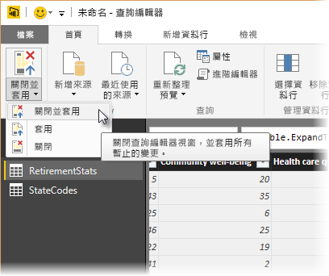

-- title: 在 Power BI Desktop 中塑造與合併資料 description: 在 Power BI Desktop 中塑造與合併資料 services: powerbi documentationcenter: '' author: davidiseminger manager: kfile backup: '' editor: '' tags: '' qualityfocus: no qualitydate: ''

ms.service: powerbi ms.devlang: NA ms.topic: article ms.tgt_pltfrm: NA ms.workload: powerbi ms.date: 01/30/2018 ms.author: davidi

---
# 在 Power BI Desktop 中將資料成形及合併
有了 **Power BI Desktop**，您可以連接到各種不同的資料來源，再將資料成形以符合您的需求。 將資料 *成形* 的意思為轉換資料，例如重新命名資料行或資料表、將文字變更為數值、移除資料列、將第一個資料列設定為標頭等。 「結合」資料的意思為連線到二或多個資料來源、視需要將資料成形，再將它們合併為一個實用的查詢。

本文示範如何使用 Power BI Desktop 將查詢成形，並特別說明其中一些最常見的工作。 如需進一步了解此處所用的查詢，包括如何從頭建立查詢，請參閱[開始使用 Power BI Desktop](desktop-getting-started.md).

請注意，Power BI Desktop 中的 **查詢編輯器** 經常會用到快顯功能表及功能區。 您可以在 [轉換]  功能區中選取的大多數功能，也可以透過以滑鼠右鍵按一下項目 (例如資料行)，然後從顯示的功能表中進行選擇來加以存取。

## 資料成形
當您在查詢編輯器中將資料成形時，您會提供逐步指示 (查詢編輯器會為您執行)，以在查詢編輯器載入及呈現資料時調整資料。 原始資料來源不會受到影響，只有這個特定資料檢視會受調整或「成形」 。

查詢編輯器會記錄您指定的步驟 (例如重新命名資料表、轉換資料類型或刪除資料行)，而且會在這個查詢每次連接到資料來源時執行這些步驟，因此資料一律會以您指定的方式來成形。 每當您使用 Power BI Desktop 的查詢編輯器功能時，或任何人使用您的共用查詢，例如 **Power BI** 服務上的查詢，都會進行這個程序。 系統會循序擷取 [查詢設定]  窗格之 [套用的步驟] 下的所有步驟。

下圖顯示已塑造查詢的 [查詢設定]  窗格，我們將於接下來幾個段落中逐一說明每個步驟。

使用[開始使用 Power BI Desktop](https://powerbi.uservoice.com/knowledgebase/articles/471664)中的退休資料，也就是我們連線到 Web 資料來源所找到的資料，將該資料成形以符合我們的需求。

首先，當查詢編輯器載入資料表時，資料行的評分並不會自動從文字轉換成數值，而我們需要將其轉換成數值。 沒問題，只要以滑鼠右鍵按一下資料行標頭，然後選取 **變更類型\> [整數]** 加以變更即可。 若要選擇多個資料行，請先選取一個資料行，然後按住 **SHIFT** 鍵並選取其他相鄰的資料行，然後以滑鼠右鍵按一下資料行標頭，即可變更所有選取的資料行。 您也可以使用 **CTRL** 鍵選擇非相鄰的資料行。

您也可以從 [轉換]  功能區，將這些資料行從文字「轉換」  成標頭。 以下是 [轉換]  功能區，並且有箭頭指向 [資料類型]  按鈕，這個按鈕可讓您將目前的資料類型轉換成其他資料類型。

請注意，[查詢設定] 中的 [套用的步驟] 會反映已套用至資料的所有成形步驟。 如果我想要移除任何成形程序中的步驟，我只需選取步驟左邊的 **X** 即可。 在下圖中，**套用的步驟** 會反映到目前為止的步驟：連接到網站 (**來源**)；選取資料表 (**導覽**)；載入資料表時，查詢編輯器會將文字型數值資料行從文字*變更為整數*(**[變更的類型]**)。 排名的一個資料行未自動變更為數值類型，接下來幾個段落將說明原因。

使用這項查詢之前，我們需要進行一些變更以取得所需的資料：

* *移除第一個資料行* – 我們不需要它，它只包含指出「看看您那一州的退休評等」的重複資料列，這是資料來源為 Web 資料表的產物
* *修正一些錯誤* – 其中一個資料行 [Health care quality] 有幾州排名不分高下，這些州在網站上，會在數值後面加上 *(tie)* 文字註明。 這在網站上不成問題，但我們需要手動將資料行從文字轉換成資料。 使用 Power BI Desktop 即可輕鬆修正這個問題，而執行這項操作同時可示範查詢中一項很棒的功能：[套用的步驟] 
* *變更資料表名稱* – 「資料表 0」  不是有用的描述元，但變更它很簡單

若要移除第一個資料行，只要選取資料行並從功能區選擇 [常用]  索引標籤，然後選擇 [移除資料行]  ，如下圖所示。

接下來，我們需要處理文字資料行，並將其轉換成數值。 一開始看似簡單，我們可以將 [Health care quality] 資料行的類型從文字直接變更為數值 (例如 [整數] 或 [十進位數字])。 不過，當我們將類型從 [文字] 變更為 [整數]，然後查看該資料行中的所有值時，我們發現 [查詢編輯器] 回報了幾個錯誤。

您可以使用幾種方式來取得每個錯誤的詳細資訊。 您可以選取資料格 (而不是按一下 **Error**一字)，或直接按一下 **Error** 一字。 如果您選取資料格而「不是」  直接按一下 **Error**一字，查詢編輯器會在視窗底部顯示錯誤資訊。

如果您直接按一下 *Error* 一字，查詢會在 [查詢設定]  窗格中建立一個 **套用的步驟** ，並顯示該錯誤的相關資訊。

若要回到查詢編輯器，您必須選取步驟旁的 **X** 來移除該步驟。

當我們選取最近使用的 **套用的步驟**時，我們會看到剛才描述的錯誤，如下圖所示。

由於查詢編輯器會循序記錄步驟，因此我們可以在 [套用的步驟] 中選取變更類型之前的步驟，然後查看該資料格在轉換前的值，如下圖所示。

現在我們可以修正這些值，再  變更類型。 由於查詢編輯器會循序記錄步驟，但每個步驟彼此獨立，因此您可以在序列中上下移動每個 **套用的步驟** 。 只要以滑鼠右鍵按一下任何步驟，查詢編輯器便會提供功能表讓您執行下列動作：\[重新命名] 、\[刪除] 、\[刪除到結尾]   \(移除目前的步驟和所有後續步驟)、\[上移] 或 \[下移] 。

此外，您可以選取清單中任何一處的 **套用的步驟** ，以從序列中的特定時間點繼續將資料成形。 查詢編輯器會在目前選取的 **套用的步驟**之後自動插入新步驟。 讓我們來試試看。

首先，選取變更 [醫療保健品質]  資料行類型之前的 **套用的步驟** 。 然後取代資料格中具有 "(tie)" 文字的值，只留下數值。 以滑鼠右鍵按一下內含 "35 (tie)" 的資料格，然後從出現的功能表中選取 [取代值...]  。 記下目前所選取的 **套用的步驟** (變更類型之前的步驟)。

因為我們想要插入步驟，所以查詢編輯器會警告我們這樣做有危險，後續步驟可能會導致查詢中斷。 因此我們得謹慎周延！ 由於這是教學課程，而且我們想要強調查詢編輯器這項很棒的功能，以示範如何建立、刪除、插入及重新排列步驟，因此我們將繼續選取 [插入] 。

有三州不相上下，因此我們將取代每個值。 當您建立新的 [套用的步驟] 時，[查詢編輯器] 會根據動作來命名步驟，在本例中為 [取代的值]。 如果查詢中有多個步驟具有相同名稱，[查詢編輯器] 會在每個後續的 \[套用的步驟] \(依序) 加上編號以做區分。

下列畫面不僅顯示 [查詢設定]  中的三個 [取代的值] 步驟，還顯示其他更有趣的內容：由於我們從 [Health care quality]  資料行中移除了每個出現的 "(tie)" 文字，因此 [變更的類型]  步驟現在已完成且沒有錯誤 。

> [!NOTE]
> 您也可以 \[移除錯誤] \(使用功能區或快顯功能表)，以移除任何發生錯誤的資料列。 在本例中，會從資料中移除具有 "*(tie)*" 的所有州，但我們不想這麼做，我們喜歡所有的州並想全部加以保留在資料表中。

雖然這有點複雜，但卻不失為一個可證明查詢編輯器有多強大且多元的好例子。

最後，我們想要將該資料表的名稱變更為描述性名稱。 當我們建立報表時，具有描述性資料表名稱會特別有幫助，尤其是連接到多個資料來源時，這些名稱會全部列於 [報表]  檢視的 [欄位]  窗格中。

變更資料表名稱很容易：請在 [查詢設定]  窗格的 [屬性] 下，如下圖所示直接輸入資料表的新名稱，然後按 **Enter**鍵。 請將這個資料表命名為 *RetirementStats* 。

大功告成，現在資料已成形為我們所需的樣子。 接著我們來連接到其他資料來源並結合資料。

## 合併資料
有關各州的那份資料很有趣，而且適用於建立額外的分析工作和查詢。 但是有一個問題：大多數資料使用兩個字母的縮寫州名代碼，而不是該州的完整名稱。 我們需要某種方式來建立州名及其縮寫的關聯。

我們很幸運：有另一個公用的資料來源可執行該項工作，但還需要進行相當多的塑造，才能予以連接到我們的退休資料表。 以下是州名縮寫的 Web 資源：

<https://zh.wikipedia.org/wiki/美國各州縮寫列表>

從 [查詢編輯器] 的 **常用** 功能區，選取 **新增來源\>Web** 並輸入位址，然後選取 [確定]，[導覽器] 會顯示在該網頁上找到的資訊。

 

我們選取 **Table[edit]** ，因為它包含我們要的資料，但還需要進行相當多的成形，以便將該資料表的資料縮減成我們需要的數量。

> [!TIP]
> 是否有更快或更容易的方法來完成下列步驟？ 沒錯，我們可以建立兩個資料表之間的 *關聯性* ，並以該關聯性為基礎使資料成形。 下列步驟在使用資料表時仍值得學習，只是要知道，關聯性可以幫助您快速地從多個資料表中使用資料。
> 
> 

將資料成形時，我們可以採取下列步驟︰

* 移除前兩個資料列 - 其為網頁資料表建立方式的產物，而我們不需要這兩個資料列。 從 **常用**功能區，選取 **減少資料列 \>移除資料列\> 移除頂端列**.

[移除頂端列]  視窗隨即出現，以供您指定需要移除的資料列數目。

* 移除底部 26 個資料列 - 這些全部是領土名稱，我們不需要將其包含在內。 從 **常用** 功能區，選取 **[減少資料列]\> [移除資料列]\> [移除底端列]**.

* 因為 RetirementStats 資料表沒有華盛頓特區的資訊，所以我們需要從清單中篩選。 選取 [區域狀態] 資料行旁邊的下拉式箭頭，然後將 [Federal District] 旁邊的核取方塊取消選取。

* 移除一些不必要的資料行 - 我們只需要將州對應到正式的兩個字母縮寫，所以我們可以移除下列資料行： **Column2**、 **Column3**，以及 **Column5** 到 **Column10**。 先選取 Column2，然後按住 **CTRL** 鍵並選取其他要移除的資料行 (這可讓您選取多個非連續的資料行)。 從功能區上的 [常用] 索引標籤，選取 **[移除資料行] \> [移除資料行]**.

* 使用第一個資料列做為標頭 - 由於我們移除了前三個資料列，因此目前的頂端列是我們想要的標頭。 您可以從 [主資料夾]  索引標籤上選取 [使用第一個資料列做為標頭]  ，或從功能區的 [轉換]  索引標籤選取。

>[!NOTE]
>現在便可看出查詢編輯器中套用的步驟*順序*很重要，該順序可能會影響資料的成形方式。 同時也必須考慮一個步驟對另一個後續的步驟可能會有什麼影響；如果您從 [套用的步驟] 移除一個步驟，後續的步驟可能就不會和原本預期的行為一樣，這便是受到查詢步驟順序的影響。

>[!NOTE]
>當您調整 [查詢編輯器] 視窗的大小使其變窄時，會壓縮某些功能區項目，以便充分利用可見空間。 當您加寬 [查詢編輯器] 視窗時，功能區項目會展開以充分利用增加的功能區。

* 重新命名資料行和資料表本身 – 一般會有幾種方式可以重新命名資料行，您可以先選取資料行，然後從功能區上的 [轉換] 索引標籤選取 [重新命名]，或者按一下滑鼠右鍵，並從出現的功能表選取 [重新命名…] 。 下圖的箭號指向這兩個選項；您只需要選擇其中一項。

請將其重新命名為 *State Name* 和 *State Code* 。 若要重新命名資料表，請在 [查詢設定]  窗格的 [名稱]  方塊中，直接輸入名稱。 請將這個資料表命名為 *StateCodes* 。

以想要的方式將 StateCodes 資料表成形之後，請將這兩個資料表或查詢結合成一個；由於現在的資料表是我們對資料套用查詢的結果，因此它們通常稱為「查詢」 。

有兩個主要方式可合併查詢 – 「合併」  和「附加」 。

當您有一或多個資料行要加入另一個查詢時，您可「合併」  查詢。 當您有其他資料列要加入現有的查詢時，您可「附加」  查詢。

在本例中，我們想要合併查詢。 若要開始，我們從 [查詢編輯器] 左窗格中選取想將其他查詢併入的目標 查詢，在本案例中為 *RetirementStats* 。 然後從功能區上的 **[常用]\>**索引標籤選取 **[組合]** [合併查詢]。

系統應該會提示您設定隱私權等級，以確保結合後的資料不會包含或傳輸不想要傳輸的資料。

接著會顯示 [合併] 視窗，提示我們選取要將哪一個資料表合併到選取的資料表，然後選取要用於合併的相符資料行。 從 *RetirementStats* 資料表 (查詢) 選取 [State]，然後選取 *StateCodes* 查詢 (在本案例中很容易，因為只有一個其他查詢。當您連線到許多資料來源時，會有許多查詢可選擇)。 當我們選取正確的相符資料行時 – 來自 *RetirementStats* 的 **State**，和來自 *StateCodes* 的 **State Name** – [合併] 視窗的外觀會如下所示，且 [確定] 按鈕會啟用。

在查詢的結尾會建立 **NewColumn** ，它是與現有查詢合併的資料表 (查詢) 內容。 來自合併查詢的所有資料行會壓縮成 **NewColumn**，但您可以選擇 [展開]  資料表，並包含您要的任何資料行。

若要展開合併的資料表，並選取要包含哪些資料行，請選取展開圖示 ()。 [展開]  視窗隨即出現。

在本例中，我們只要 **State Code** 資料行，因此我們只選取該資料行，然後選取 [確定]。 清除 [使用原始資料行名稱作為前置詞] 核取方塊，因為我們不需要也不想要。如果我們保留選取，則合併的資料行將會命名為 **NewColumn.State Code** (原始資料行名稱或 **NewColumn**，然後一點 (.)，再來是帶入查詢的資料行名稱)。

>[!NOTE]
>想嘗試如何帶入 **NewColumn** 資料表嗎？ 您可以試驗一下，如果您不喜歡結果，只需要從 [查詢設定]  窗格中的 [套用的步驟]  清單刪除該步驟；您的查詢便會回到套用 [展開]  步驟之前的狀態。 就像是個自由重做的機會，您可以不限次數地任意執行，直到展開程序看起來是您要的方式為止。

我們現在有合併兩個資料來源的單一查詢 (資料表)，其中每個資料來源都已經過塑造以符合我們的需求。 此查詢可以做為許多其他相關資料連線的基礎 – 例如任何州的住房成本統計資料、人口統計資料或工作機會。

若要套用變更並關閉 [查詢編輯器]，請從 [常用] 功能區索引標籤選取 [關閉並套用]。已轉換資料集隨即出現在 Power BI Desktop，您可以準備用來建立報表。

## 後續步驟
您可以使用 Power BI Desktop 執行各種作業。 如需有關其功能的詳細資訊，請參閱下列資源：

* [開始使用 Power BI Desktop](desktop-getting-started.md)
* [Power BI Desktop 的查詢概觀](desktop-query-overview.md)
* [Power BI Desktop 中的資料來源](desktop-data-sources.md)
* [連接至 Power BI Desktop 中的資料](desktop-connect-to-data.md)
* [Power BI Desktop 中的常見查詢工作](desktop-common-query-tasks.md)   

