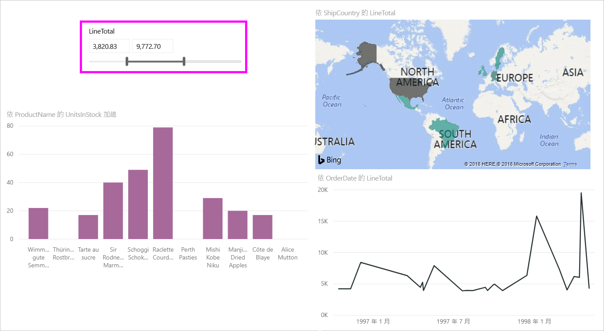
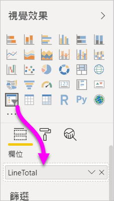

# 在 Power BI Desktop 中使用數值範圍交叉分析篩選器
透過 [數值範圍交叉分析篩選器]，您可以將各式各樣的篩選器套用至資料模型中的任何數值資料行。 您可以選擇篩選兩個數字**之間**、**小於或等於**某個數字，或是**大於或等於**某個數字。 這聽起來或許很簡單，但卻是篩選資料的強大方式。

## 使用數值範圍交叉分析篩選器
您可以將數值範圍交叉分析篩選器當作任何其他交叉分析篩選器來使用。 只要建立報表的 [交叉分析篩選器] 視覺效果，然後選取一個數值作為 [欄位] 值即可。 在下圖中，選取了 [LineTotal] 欄位。

選取 [數值範圍交叉分析篩選器] 右上角的向下鍵連結，即會出現一個功能表。

針對數值範圍，您可以從下列三個選項中進行選取：

* 之間
* 小於或等於
* 大於或等於

當您從功能表選取 [之間] 時，會出現一個滑桿，以供您篩選落於兩個數字之間的數值。 除了使用滑動軸本身，您還可以按一下任一方塊，然後輸入值。 當您想要配量特定數字時，此方法十分方便，但移動滑動軸的精細度很難剛好落在該數字上。

在下圖中，會針對範圍介於 2500.00 到 6000.00 之間的 [LineTotal] 值篩選報表頁面。

![數字範圍交叉分析篩選器與 [之間]](media/desktop-slicer-numeric-range/desktop-slicer-numeric-range-3-between-range.png)

當我們選取 [小於或等於] 時，滑動軸的左控點 (下限值) 會消失，而我們只能調整滑動軸的上限。 在下圖中，我們將滑動軸的上限設定為 5928.19。

![數字範圍交叉分析篩選器與 [小於]](media/desktop-slicer-numeric-range/desktop-slicer-numeric-range-4-less-than.png)

最後，如果我們選取 [大於或等於]，則滑動軸的右控點 (上限值) 會消失，而我們可以調整下限值，如下圖所示。 現在，只有 [LineTotal] 大於或等於 4902.99 的項目會顯示在報表頁面的視覺效果中。

![數字範圍交叉分析篩選器與 [大於]](media/desktop-slicer-numeric-range/desktop-slicer-numeric-range-5-greater-than.png)

## 使用數值範圍交叉分析篩選器貼齊至整數

如果基礎欄位的資料類型為 [整數]，數值範圍交叉分析篩選器會貼齊至整數。 這樣可讓您的交叉分析篩選器完全對齊整數。 [十進位數字] 類型欄位可讓您輸入或選取數字的小數部分。 文字方塊中套用的格式會符合欄位上設定的格式，不過您可以鍵入或選取更精確的數字。

## 限制與考量
[數值範圍交叉分析篩選器] 目前適用下列限制與考量：

* [數值範圍交叉分析篩選器] 目前會篩選資料中的每個基礎資料列，而不是任何彙總值。 例如，如果使用 [Sales Amount] 欄位，則會根據 [Sales Amount] 篩選每筆交易，而不是根據視覺效果之每個資料點的 [Sales Amount] 總和。
* 目前無法搭配量值使用。
* 您可以在數值交叉分析篩選器的文字方塊中鍵入任何數字，即使它超過基礎資料行中的值範圍也一樣。 如果您知道資料可能會在未來變更，這可讓您設定篩選。
