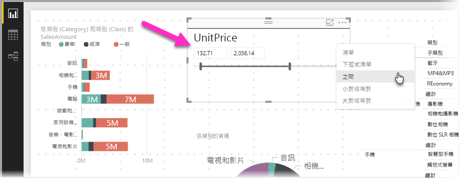
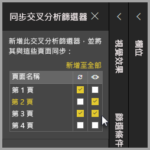
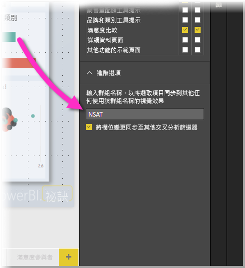

# 使用 Power BI Desktop 交叉分析篩選器

您可以使用 **Power BI Desktop** 中的**交叉分析篩選器**，在您的報表頁面上篩選視覺效果的結果。 您可以使用交叉分析篩選器，藉由與交叉分析篩選器本身的互動，輕鬆地調整所套用的篩選條件。 您也可以指定交叉分析篩選器如何顯示與如何互動的選項。 下圖示範了一個交叉分析篩選器，並顯示其「類型」下拉式清單視覺效果。 

交叉分析篩選器可以顯示為下列數種類型之一：

* 清單
* 下拉式清單
* 之間
* 小於或等於
* 大於或等於

您可以按一下 [視覺效果] 窗格中的 [交叉分析篩選器] 視覺效果，以便將交叉分析篩選器加入報表。

交叉分析篩選器在 **Power BI Desktop** 和 **Power BI 服務**中有類似的行為。 如需使用交叉分析篩選器的文章，請參閱 [Power BI 服務中的交叉分析篩選器](power-bi-visualization-slicers.md)。

## 同步處理所有報表頁面的交叉分析篩選器

在 **Power BI Desktop** 中，您可以同步處理多個報表頁面的交叉分析篩選器。 若要同步處理交叉分析篩選器，請在功能區的 [檢視] 窗格中，選取 [同步處理交叉分析篩選器]。 當您同步處理交叉分析篩選器時，會顯示如下圖所示的 [同步處理交叉分析篩選器] 窗格。

![顯示 [同步交叉分析篩選器] 窗格](media/desktop-slicers/desktop-slicers_03.png)

在 [同步處理交叉分析篩選器] 窗格中，您可以指定在所有報表頁面上同步處理交叉分析篩選器的方式。 您可以指定每個交叉分析篩選器是否應**套用**至每個個別的報表頁面，以及交叉分析篩選器在每個個別的報表頁面上是否**可見**。

例如，您可以將交叉分析篩選器放置在報表的**第 2 頁**，如下圖所示。 然後，您可以選取交叉分析篩選器是否應*套用*至報表中每個選取的頁面，以及交叉分析篩選器在報表中每個選取的頁面上是否*可見*。 針對每個交叉分析篩選器，您可以套用上列任何組合。 

使用窗格中的 [全部加入] 連結，將選取的交叉分析篩選器套用至報表中的全部頁面。

請注意，[同步處理交叉分析篩選器] 窗格上顯示的選取項目只會套用至「選取的交叉分析篩選器」。 您可以將多個交叉分析篩選器套用至不同頁面，並使用窗格來定義每個交叉分析篩選器個別套用至報表中不同頁面的方式。 

雖然您選取的交叉分析篩選器可以同步處理，其他如樣式、編輯和刪除等選取項目則不會同步處理。 

## 交叉分析篩選器的進階選項

您也可以在 [同步交叉分析篩選器] 窗格的 [進階選項] 區段中，將「群組名稱」套用至交叉分析篩選器集合，並在頁面之間同步共用相同群組的交叉分析篩選器。 

這項功能可讓您建立要保持同步的自訂交叉分析篩選器群組。 提供預設名稱，但您可以使用任何您偏好的名稱。 

群組名稱會提供交叉分析篩選器的額外彈性。 您可以建立不同的群組來同步使用相同欄位的交叉分析篩選器，或將使用不同欄位的交叉分析篩選器放入相同的群組。 

## 後續步驟

您可能也會對下列文章感興趣：

* [Power BI 服務中的交叉分析篩選器](power-bi-visualization-slicers.md)
* [在 Power BI Desktop 中使用數值範圍交叉分析篩選器](desktop-slicer-numeric-range.md)
* [在 Power BI Desktop 中使用相對日期交叉分析篩選器與篩選條件](desktop-slicer-filter-date-range.md)

