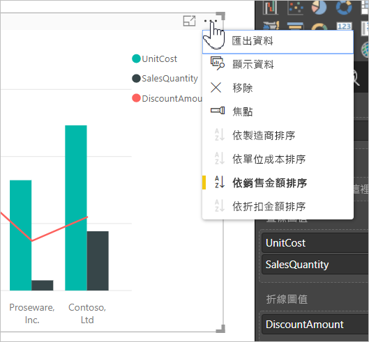
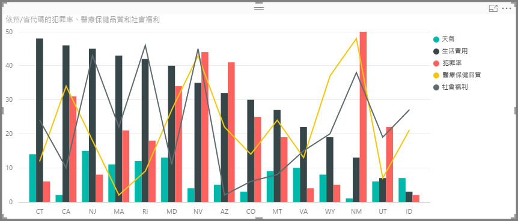
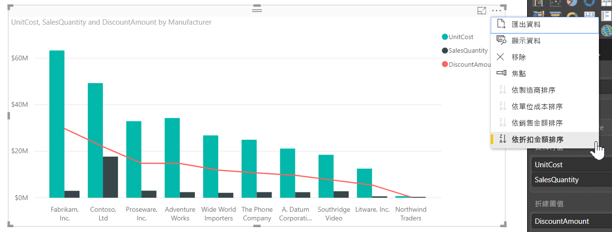
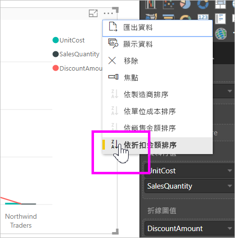
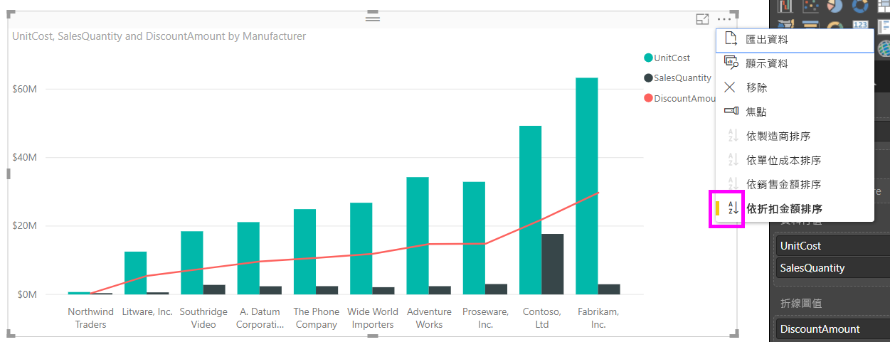
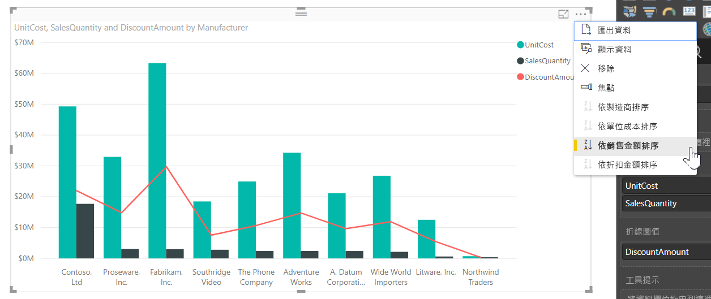
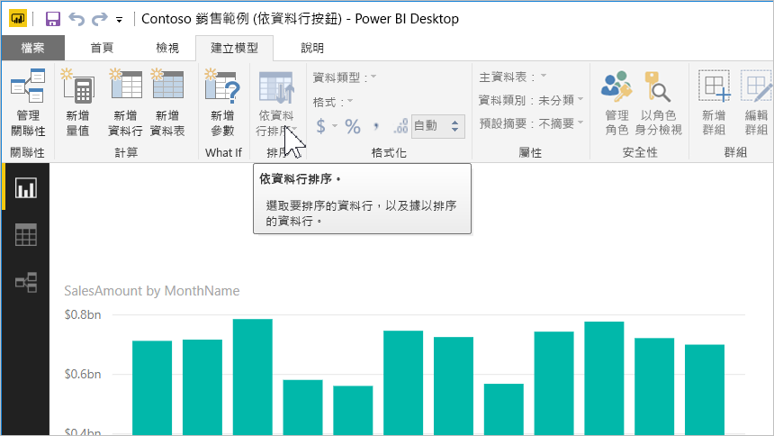
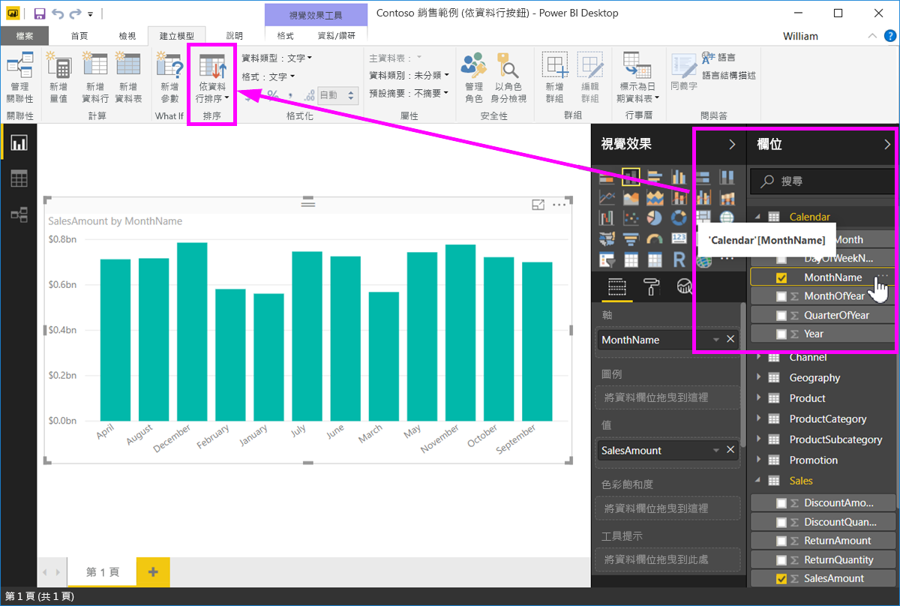
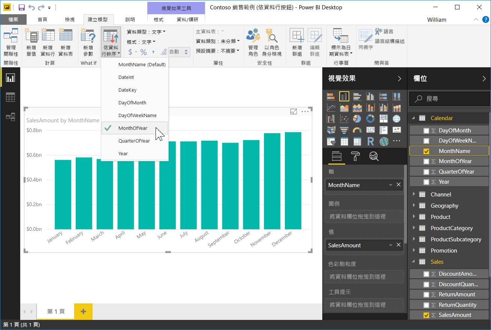
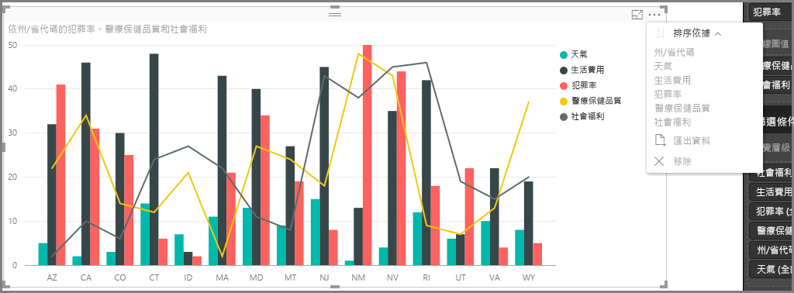

# Power BI Desktop 中的依資料行排序
在 **Power BI Desktop** 和 **Power BI 服務**中，您可以依不同資料欄位進行排序來變更視覺效果外觀。 變更視覺效果的排序方式，即可反白顯示您想要傳達的資訊，並確定視覺效果反映出該趨勢 (或強調)。

無論您是使用數值資料 (例如銷售數據) 或文字資料 (如州名稱)，都能以您希望的方式排序視覺效果，變成您要的樣子。  **Power BI** 提供更多的排序彈性，以及可供您使用的快速功能表。 在任何視覺效果上，選取省略符號功能表 (...)，然後選取要作為排序依據的欄位，如下圖所示。

## 深入探討和範例
讓我們深入探討範例，並查看它在 **Power BI Desktop** 中的運作方式。

下列視覺效果會依製造商名稱顯示成本、數量和金額。 以下是進行任何進一步排序之前的視覺效果。

視覺效果目前是以 [銷售數量] 排序，這可在將遞增的長條顏色與圖例比對後得知，但還有更好的方法可以判斷目前的排序資料行：視覺效果右上角的省略符號功能表 (...)。 當我們選取省略符號時，可以看到下列項目︰

* 目前的排序欄位為 [銷售數量]，由 [依銷售數量排序] 以粗體顯示並具有黃色橫條的事實來指出。 

* 目前的排序方向是從最小到最大，如小圖示 **A/Z** (A 在 Z 上方) 和向下箭所示。

我們會在接下來兩節中分別探討排序欄位和方向。

## 選取要用來排序的資料行
您應已注意到 [更多選項] 功能表中的 [依銷售數量排序] 旁邊的黃色橫條，該橫條指出視覺效果依照 [銷售數量] 資料行排序。 使用其他資料行排序很簡單：只要選取省略符號來顯示省略符功能表，然後選取其他資料行即可。

下圖中，我們選取 [折扣金額] 作為我們排序所用的資料行。 該資料行剛好是視覺效果中的其中一條線，而非長條。 在我們選取 [依折扣金額排序] 後，就會變成以下這個樣子。

請注意視覺效果的變化。 現在，這些值從最高的「折扣金額」值 (在此視覺效果中為 Fabrikam Inc.) 向下排序至具有最低值的 Northwind Traders。 

但是，如果我們要遞增排序，而不要遞減排序，那該怎麼做？ 下節會說明方法其實相當簡單。

## 選取排序順序 – 最小到最大、最大到最小
當我們深入觀察前一張圖的 [選項] 功能表時，可以看到 [依折扣金額排序] 旁顯示 **Z/A** (Z 在 A 的上方) 的圖示。 讓我們一起來看看：

當顯示 **Z/A** 時，表示視覺效果是依從最大值到最小值的順序來排序所選的資料行。 想要更改嗎？ 沒問題，只要點選或按一下 **Z/A** 圖示，它就會將排序順序改為 **A/Z** ，並從最小到最大值排序視覺效果 (根據所選的資料行)。

以下我們使用相同的視覺效果，但這次是先點選 [依折扣金額排序] 功能表項目中的 **Z/A** 圖示來變更順序。 請注意，Northwind Traders 現已列為第一個製造商，而 Fabrikam Inc. 是最後一個，這和之前的排序相反。

您可以使用視覺效果內的任何資料行進行排序：我們可輕鬆選取 [銷售金額] 作為用來排序的資料行，以 [依銷售金額排序] 先顯示銷售量最高的製造商，然後保留視覺效果中的其他資料行，不論其如何套用至其他製造商。 以下就來看看具有這些設定的視覺效果。

## 使用 [依資料行排序] 按鈕排序
還有另一個方法來排序資料，就是使用 [模型] 功能區中的 [依資料行排序] 按鈕。

這個排序方法會要求您從 [欄位] 窗格選取資料行，然後選取 [依資料行排序] 按鈕來選擇如何 (根據哪一個資料行) 排序視覺效果。 您必須從 [欄位] 窗格選取想要排序的資料行 (欄位)，以啟用 [依資料行排序] 按鈕，否則按鈕處於非使用中。

讓我們來看看一個常見的範例︰您有來自每年每一個月的資料，而且您想要根據時間順序排序。 下列步驟將顯示做法。

1. 首先，請注意，當已選取視覺效果，但沒有在 [欄位] 窗格中選取任何資料行，則 [依資料行排序] 按鈕無法使用 (灰色)。
   
   

2. 當我們選取要用來排序的資料行時，在 [欄位] 窗格中，[依資料行排序] 按鈕會變成使用中。
   
   
3. 接下來，選取視覺效果之後，我們可以選取 [年中的月]，而不是預設值 (「月份名稱」)，視覺效果即會以我們想要的順序排序︰依年中的月。
   
   

這樣就大功告成了！ 請記住，您必須在 [欄位] 窗格中選取資料行，[依資料行排序] 按鈕才會變成使用中。

## 回到預設資料行以進行排序
您可以隨心所欲排序任何資料行，但偶爾會想回到預設的排序資料行。 沒問題。 針對已選取排序資料行的視覺效果 (如前所述，已選取之排序資料行的省略符號功能表中會有一個黃色橫條)，只要開啟 [更多選項] 功能表並再次選取該資料行，視覺效果就會回到預設的排序資料行。

例如，以下是我們先前的圖表︰

當我們返回功能表並再次選取 [銷售數量] 時，視覺效果預設會依 [製造商] 以字母順序排序，如下圖所示。

有如此多種排序視覺效果的選項，建立所需的圖表或影像真的很簡單。

