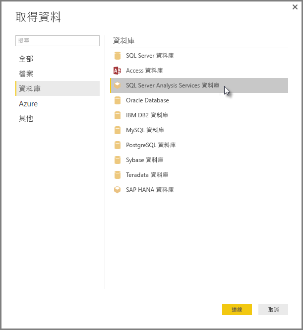

# 連接到 Power BI Desktop 中的 SSAS 多維度模型
使用 Power BI Desktop，您可以存取 **SSAS 多維度模型**，通常稱為 **SSAS MD**。

若要連線到 **SSAS MD** 資料庫，請選取 [取得資料] &gt; [資料庫] &gt; [SQL Server Analysis Services 資料庫]，如下圖所示。

Power BI 服務和支援 Power BI Desktop 皆支援即時連接模式中的 **SSAS 多維度模型**。 您也可以將使用即時模式中的 **SSAS 多維度模型**的報表，發佈和上傳到 Power BI 服務。

## SSAS MD 的功能與特點
下列章節說明 Power BI 和 SSAS MD 連接的功能與特點。

### 多維度模型的表格式中繼資料
下表顯示多維度物件與表格式中繼資料之間傳回至 Power BI Desktop 的通信。 Power BI 會查詢表格式中繼資料的模型，並根據傳回的中繼資料，在建立視覺效果 (例如資料表、矩陣、圖表或交叉分析篩選器) 時，以 Analysis Services 執行適當的 DAX 查詢。

| BISM 多維度物件 | 表格式中繼資料 |
| --- | --- |
| Cube |模型 |
| Cube 維度 |資料表 |
| 維度屬性 (索引鍵)、名稱) |資料行 |
| 量值群組 |資料表 |
| 量值 |量值 |
| 不含相關聯量值群組的量值 |在稱為「 *量值* 」的資料表內 |
| 量值群組 -> Cube 維度關聯性 |關聯性 |
| 檢視方塊 |檢視方塊 |
| KPI |KPI |
| 使用者/父子式階層 |階層 |

### 量值、量值群組和 KPI
多維度 Cube 中的量值群組會在 Power BI 中作為資料表公開，位於 [欄位]  窗格中，旁邊含 ∑ 符號。 沒有相關聯量值群組的導出量值，會群組於表格式中繼資料中稱作「量值」  的特殊資料表下。

在多維度模型中，您可以在 Cube 中定義一組量值或 KPI，使其位於「顯示資料夾」 內，有助於簡化複雜的模型。 Power BI 會辨識在表格式中繼資料中的顯示資料夾，並在顯示資料夾中顯示量值和 KPI。 多維度資料庫中的 KPI 支援「值」 、「目標」 、「狀態圖形」  和「趨勢圖形」 。

### 維度屬性類型
多維度模型也支援與特定維度屬性類型相關聯的維度屬性。 例如，[地理位置]  維度中的「城市」 、「省/市」 、「國家/地區」  和「郵遞區號」  維度屬性，都有與其相關聯的適當地理位置類型，會公開在表格式中繼資料中。 Power BI 會辨識中繼資料，讓您可以建立地圖視覺效果。 您可根據 Power BI 中 [欄位]  窗格中項目旁邊的地圖  圖示來辨識這些關聯。

當您提供包含影像 URL (統一資源定位器) 的欄位時，Power BI 也可以呈現影像。 您可以在 SQL Server Data Tools 中指定這些欄位為 *ImageURL* 類型 (或之後在 Power BI 中指定)，而且其類型資訊將在表格式中繼資料中提供給 Power BI。 之後 Power BI 可以從 URL 擷取這些影像，並以視覺方式顯示。

### 父子式階層
多維度模型支援父子式階層，可在表格式中繼資料中顯示為「階層」  。 父子式階層的每個層級會公開為表格式中繼資料中的隱藏資料行。 父子式維度的索引鍵屬性不會公開在表格式中繼資料中。

### 維度的導出成員
多維度模型支援建立各種「導出成員」 類型。 兩種最常見的導出成員類型如下所示：

* 屬性階層與 *所有* 不屬於同層級上的導出成員
* 使用者階層的導出成員

多維度模型會公開「屬性階層上的導出成員」  作為資料行的值。 公開這類型的導出成員時，有幾個其他選項和條件約束：

* 維度屬性可有選用的 *UnknownMember*
* 包含導出成員的屬性不能為維度的索引鍵屬性，除非它是該維度唯一的屬性
* 包含導出成員的屬性不可以是父子式屬性

使用者階層的導出成員不會公開於 Power BI 中。 相反地，如果導出成員不符合上述項目符號清單中所述的條件約束，您將能夠連接到包含使用者階層之導出成員的 Cube，但是無法看到導出成員。

### 安全性
多維度模型透過「角色」 支援維度和資料格層級的安全性。 當您使用 Power BI 連接到 Cube 時，會驗證和評估您是否有適當權限。 當使用者套用「維度安全性」  時，Power BI 中的使用者無法看到個別的維度成員。 不過，當使用者有已定義的「資料格安全性」  權限時，且其中某些資料格受到限制，則該使用者無法使用 Power BI 連接到 Cube。

## 在 Power BI Desktop 中 SSAS 多維度模型的限制
使用 **SSAS MD**會有某些限制：

* 伺服器必須執行 SQL Server 2012 SP1 CU4 或更新版本的 Analysis Services，才能使 Power BI Desktop SSAS MD 連接器正常運作
* *動作* 和 *具名集合* 不會公開至 Power BI，但您仍然可以連線到同樣包含「 *動作* 」或 *具名集合* 的 Cube，然後建立視覺效果和報表。

## Power BI Desktop 中 SSAS MD 支援的功能
在 Power BI Desktop 中支援下列 SSAS MD 的功能：

* **SSAS MD** 的這個版本支援使用下列項目 (您可以取得這些功能的[詳細資訊](https://msdn.microsoft.com/library/jj969574.aspx))：
  * 顯示資料夾
  * KPI 趨勢
  * 預設成員
  * 維度屬性
  * 維度導出成員 (當維度有一個以上的屬性時，必須是單一真實成員，除非它是唯一的屬性，而且不能是父子式屬性，否則它不能是維度的索引鍵屬性)
  * 維度屬性類型
  * 階層
  * 量值 (不論有無量值群組)
  * 量值做為變化
  * KPI
  * ImageUrls
  * 維度安全性

