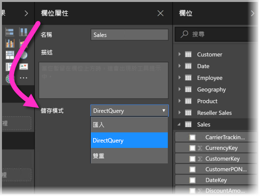
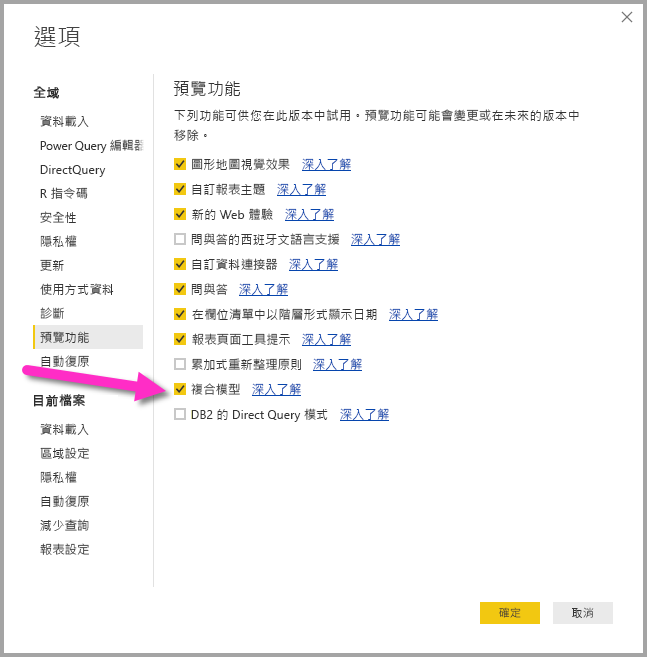
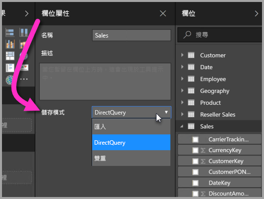
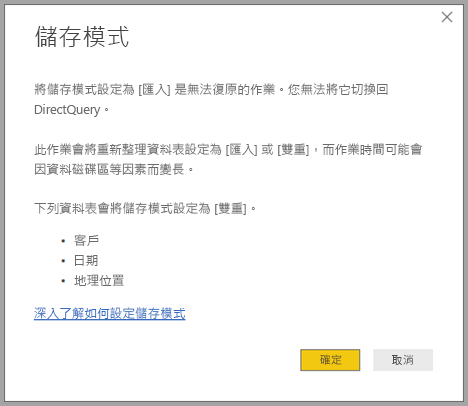

# Power BI Desktop 中的儲存模式 (預覽)

在 **Power BI Desktop** 中，您可以指定資料表的**儲存模式**，讓您可以控制是否要針對報表來將資料表資料快取於記憶體中。 

設定**儲存模式**提供了許多優點。 您可以針對模型中的每個資料表分別設定**儲存模式**，藉此讓單一資料集能夠利用下列一或多個優點：

* **查詢效能**：當使用者與 Power BI 報表中的視覺效果進行互動時，會將 DAX 查詢提交至資料集。 藉由適當地設定**儲存模式**來將資料快取到記憶體，可以提高報表的查詢效能及互動功能。
* **大型資料集**：未快取的資料表不會基於快取目的而耗用記憶體。 針對太大或太過昂貴而無法完全快取到記憶體的大型資料集，您可以啟用互動式分析。 您可以選擇哪些資料表值得快取，哪些不值得快取。
* **資料重新整理最佳化**：未快取的資料表不需要重新整理。 您可以藉由僅快取必要資料來減少重新整理時間，以符合您的服務等級協定和商務需求。
* **近乎即時的需求**：具有近乎即時需求的資料表可能不適合進行快取，因為快取會造成資料延遲。
* **回寫**：回寫可讓商務使用者藉由變更資料格的值來探索假設狀況。 自訂應用程式可以將變更套用到資料來源。 未快取的資料表可以立即反映變更，以便有即時分析的效果。

**Power BI Desktop** 中的**儲存模式**設定是三個相關功能之一：

* **複合模型**：讓報表能夠具有任意組合的多個資料連線，包括 DirectQuery 連線或匯入。
* **多對多關聯性**：您可以透過**複合模型**，在資料表之間建立**多對多關聯性**、移除資料表中對於唯一值的需求，以及移除先前的因應措施，例如，只為建立關聯性而導入新的資料表。 
* **儲存模式**：您現在可以指定需要查詢後端資料來源的視覺效果，並匯入不需要查詢後端資料來源的視覺效果 (即使是以 DirectQuery 為基礎的視覺效果也一樣)，以提升效能並減少後端負載。 以往，即使像是交叉分析篩選器之類的簡單視覺效果，也會起始要傳送到後端來源的查詢。 

有關**複合模型**三個相關功能的集合，分別會在個別文章中加以說明：

* **複合模型**會在它們自己的文章 [Power BI Desktop 中的複合模型 (預覽)](desktop-composite-models.md) 中詳細說明。
* **多對多關聯性**會在它們自己的文章 [Power BI Desktop 中的多對多關聯性 (預覽)](desktop-many-to-many-relationships.md) 中加以說明。
* **儲存模式**會在本文中詳細說明。

## 啟用儲存模式預覽功能

**儲存模式**功能處於預覽狀態，且必須在 **Power BI Desktop** 中加以啟用。 若要啟用**儲存模式**，請選取 [檔案] > [選項及設定] > [選項] > [預覽功能]，然後選取 [複合模型] 核取方塊。 

您必須重新啟動 **Power BI Desktop**，功能才會啟用。

## 使用儲存模式屬性

**儲存模式**是您可以在模型中每個資料表上設定的屬性。 若要設定**儲存模式**，請從 [欄位] 窗格選取資料表，然後以滑鼠右鍵按一下以顯示操作功能表。 從操作功能表中，選取 [屬性]。

![選取操作功能表中的 [屬性]](media/desktop-storage-mode/storage-mode_02.png)

**儲存模式**選項會顯示於資料表的 [欄位屬性] 窗格中。 您可以從該處檢視目前的**儲存模式**或修改它。

有三個**儲存模式**的值：

* **匯入**：設定為 [匯入] 時，就會快取已匯入的資料表。 針對提交至 Power BI 資料集且會從 [匯入] 資料表傳回資料的查詢，只能透過快取的資料來完成。
* **DirectQuery**：使用此設定，就不會快取 DirectQuery 資料表。 針對提交至 Power BI 資料集 (例如，DAX 查詢) 且會從 DirectQuery 資料表傳回資料的查詢，只能藉由對資料來源執行即時查詢來完成。 提交至資料來源的查詢會使用適用於該資料來源的查詢語言 (例如 SQL)。
* **雙重**：依提交至 Power BI 資料集的查詢內容而定，[雙重] 資料表可以快取或未快取的方式運作。 在某些情況下，會從快取的資料完成查詢；在其他情況下，會藉由對資料來源執行即時查詢來完成查詢。

將資料表變更為 [匯入] 是「無法復原」的作業；之後無法將它變更回 [DirectQuery] 或 [雙重]。

## [DirectQuery] 和 [雙重] 資料表的限制

[雙重] 資料表與 [DirectQuery] 資料表皆受相同的限制。 這些限制包括有限的 M 轉換，以及計算結果欄中受限制的 DAX 函式。 如需詳細資訊，請參閱[使用 DirectQuery 的影響](desktop-directquery-about.md#implications-of-using-directquery)。

## 具有不同儲存模式之資料表上的關聯性規則

關聯性必須根據相關資料表的**儲存模式**來遵守規則。 本節提供有效組合的範例。 如需完整資訊，請參閱 [Power BI Desktop 中的多對多關聯性 (預覽)](desktop-many-to-many-relationships.md)。

在具有單一資料來源的資料集上，以下為有效的 **1 對多**關聯性組合：

| 位於**多**邊的資料表 | 位於 **1** 邊的資料表 |
| ------------- |----------------------| 
| 雙重          | 雙重                 | 
| 匯入        | 匯入或雙重       | 
| DirectQuery   | DirectQuery 或雙重  | 

## 雙重的傳播方式
以下舉例說明。 請考慮下列簡單模型，其中所有資料表都來自支援 [匯入] 和 [DirectQuery] 的單一來源。

一開始，假設此模型中的所有資料表都是 DirectQuery。 如果我們接著將 *SurveyResponse* 資料表的**儲存模式**變更為 [匯入]，即會顯示以下提示：

維度資料表 (*Customer*、*Date* 及 *Geography*) 必須設定為 [雙重]，才能遵守先前說明的關聯性規則。 這些資料表可以在單一作業中設定，而不需要事先將它們設定為 [雙重]。

傳播邏輯是設計來協助包含許多資料表的模型。 假設您的模型具有 50 個資料表，而且只需要快取特定事實 (交易式) 的資料表。 **Power BI Desktop** 中的邏輯會計算出必須設為 [雙重] 的維度資料表最小組合，因此您不需要進行此作業。

傳播邏輯只會周遊至 **1 對多**關聯性的 1 邊。

* 因為 *Customer* 資料表與 DirectQuery 資料表 *Sales* 和 *SurveyResponse* 的關聯性，而不允許將它變更為 [匯入] (而不是變更 *SurveyResponse*)。
* 允許將 *Customer* 資料表變更為 [雙重] (而不是變更 *SurveyResponse*)。 傳播邏輯也會將 *Geography* 資料表設定為 [雙重]。

## 儲存體模式使用範例
讓我們繼續進行上一節的範例，並假設套用下列**儲存模式**屬性設定：

| 資料表                   | 儲存模式         |
| ----------------------- |----------------------| 
| *Sales*                 | DirectQuery          | 
| *SurveyResponse*        | 匯入               | 
| *Date*                  | 雙重                 | 
| *Customer*              | 雙重                 | 
| *Geography*             | 雙重                 | 

假設 *Sales* 資料表具有大量資料，進行上述儲存模式屬性設定就會導致下列行為。
* 維度資料表 (*Date*、*Customer* 及 *Geography*) 會進行快取，因此，在擷取要顯示的交叉分析篩選器值時，初始報表載入時間應該很快。
* 藉由不快取 *Sales* 資料表，會產生下列結果：
    * 資料重新整理時間可獲得改善，並降低記憶體耗用量
    * 以 *Sales* 資料表為基礎的報表查詢會在 DirectQuery 模式中執行，這可能需要較長的時間，但更接近即時，因為並未導入快取延遲

* 以 *SurveyResponse* 資料表為基礎的報表查詢會從記憶體中的快取傳回，因此它們應該相對快速。

## 命中或遺漏快取的查詢

藉由將 **SQL Profiler** 連線至 **Power BI Desktop** 的診斷通訊埠，您可以根據下列事件執行追蹤，藉以查看哪些查詢會命中或遺漏記憶體中的快取：

* 查詢事件\查詢開始
* 查詢處理\Vertipaq SE 查詢開始
* 查詢處理\DirectQuery 開始

針對每個「查詢開始」事件，請檢查其他具有相同 *ActivityID* 的事件。 例如，如果沒有任何「DirectQuery 開始」事件，但有「Vertipaq SE 查詢開始」事件，則代表已從快取回應查詢。

參考**雙重**模式資料表的查詢會儘可能從快取傳回資料，否則會還原為 DirectQuery。

延續上一個範例，下列查詢只會參考來自 *Date* 資料表的資料行，此資料表處於**雙重**模式。 因此，它應該會命中快取。

下列查詢只會參考 *Sales* 資料表的資料行，此資料表處於 **DirectQuery** 模式。 因此，它應該「不會」命中快取。

下列查詢的特別之處在於它結合了兩個資料行。 此查詢將不會命中快取。 您可能一開始就預期它會從快取中擷取 *CalendarYear* 值，以及從來源中擷取 *SalesAmount* 值，然後合併結果，但相較於將 SUM/GROUP BY 提交至來源系統，此動作比較沒有效率。 如果將此作業向下推送至來源，傳回的資料列數目可能大幅減少。 

> [!NOTE]
> 在合併快取和非快取的資料表時，此行為與 [Power BI Desktop 中的多對多關聯性 (預覽)](desktop-many-to-many-relationships.md) 不同。

## 快取應該保持同步

上一節所示的查詢顯示**雙重**資料表有時會命中快取，有時則不會命中快取。 因為這個緣故，如果快取過期，可傳回不同的值。 例如，查詢執行將不會藉由篩選 DirectQuery 結果以符合快取的值，嘗試掩飾資料問題。 您應該最了解自己的資料流程，並應據此進行設計。 如有必要，可使用一些現有技術，在來源處理這類案例。

**雙重**儲存模式是一種效能最佳化。 只有在不影響達成商務需求的前提之下，才應使用此模式。 如需替代行為，請考慮使用 [Power BI Desktop 中的多對多關聯性 (預覽)](desktop-many-to-many-relationships.md) 一文中所述的技術。

## 資料檢視
如果資料集中至少有一個資料表已將其**儲存模式**設定為 [匯入] 或 [雙重]，就會顯示 [資料檢視] 索引標籤。

在 [資料檢視]*** 中選取時，[雙重] 和 [匯入] 資料表會顯示快取的資料。 [DirectQuery] 資料表不會顯示資料，而且會顯示一則訊息表示無法顯示 DirectQuery 資料表。

## 限制與考量

對於這個版本的**儲存模式**以及它與**複合模型**的相互關聯，有一些限制。

下列 Live Connect (多維度) 來源不能與**複合模型**搭配使用：

* SAP HANA
* SAP Business Warehouse
* SQL Server Analysis Services
* Power BI 資料集
* Azure Analysis Services

使用 DirectQuery 連線到這些多維度來源時，將無法同時連線到其他 DirectQuery 來源，也無法結合匯入的資料。

使用**複合模型**時，仍然受限於 DirectQuery 的現有使用限制。 這其中有許多限制現在會依個別資料表的**儲存模式**而異。 例如，已匯入資料表上的計算結果欄可以參考其他資料表，但 DirectQuery 資料表上的計算結果欄仍僅限於參考相同資料表上的資料行。 如果模型內有任何資料表為 DirectQuery，則其他限制會套用至整個模型。 例如，如果某個模型內的任何資料表具有 DirectQuery 的**儲存模式**，則該模型不提供 **QuickInsights** 和**問與答**功能。 

## 後續步驟

下列文章會詳細說明複合模型與 DirectQuery。

* [Power BI Desktop 中的複合模型 (預覽)](desktop-composite-models.md)
* [Power BI Desktop 中的多對多關聯性 (預覽)](desktop-many-to-many-relationships.md)

DirectQuery 文章：

* [使用 Power BI 中的 DirectQuery](desktop-directquery-about.md)
* [Power BI 中 DirectQuery 支援的資料來源](desktop-directquery-data-sources.md)

