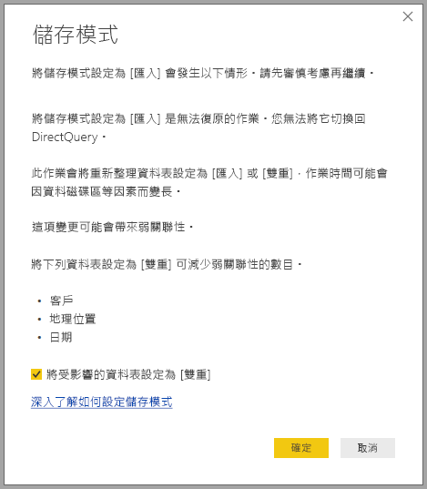

# 管理 Power BI Desktop 中的儲存模式

在 Microsoft Power BI Desktop 中，您可以指定資料表的儲存模式。 儲存模式可讓您控制 Power BI Desktop 是否要將報表資料快取到記憶體內。 

設定儲存模式有許多好處。 您可以為模型中的每份資料表分別設定儲存模式。 此動作會啟用單一資料集，而且具有下列優點：

* **查詢效能**：當使用者與 Power BI 報表中的視覺效果互動時，會將資料分析運算式 (DAX) 查詢提交至資料集。 適當地設定儲存模式，將資料快取到記憶體，可以大幅提升報表的查詢效能及互動效果。

* **大型資料集**：未快取的資料表不會因為快取的用途而耗用記憶體。 您可以對太大或太過昂貴而無法完全快取到記憶體中的大型資料集啟用互動式分析。 您可以選擇值得與不值得快取的資料表。

* **資料重新整理最佳化**：未經快取的資料表不需要重新整理。 您可以只快取符合您服務等級協定及商務需求的資料，從而減少重新整理的時間。

* **近乎即時的需求**：有近乎即時需求的資料表可能適合不快取，這樣能減少資料延遲。

* **回寫**：回寫允許商務使用者變更資料格的值來探索假設狀況。 自訂應用程式可以將變更套用到資料來源。 未快取的資料表可以立即顯示變更，達到即時分析的效果。

Power BI Desktop 中的儲存模式設定是三個相關功能之一：

* **複合模型**：允許報表可有兩 (含) 個以上任意組合的資料連線，包括 DirectQuery 連線或匯入。 如需詳細資訊，請參閱[在 Power BI Desktop 中使用複合模型](desktop-composite-models.md)。

* **多對多關聯性**：您可以使用複合模型在資料表之間建立「多對多關聯性」  。 多對多關聯性會移除資料表中需有唯一值的要求。 此外也會移除先前的因應措施，像是只為了建立關聯性而導入新的資料表。 如需詳細資訊，請參閱 [Power BI Desktop 中的多對多關聯性](desktop-many-to-many-relationships.md)。

* **儲存模式**：使用儲存模式，您現在可以指定哪些視覺效果必須查詢後端資料來源。 不需要查詢的視覺效果，即便是使用 DirectQuery，也同樣會匯入。 此功能可提升效能，並減輕後端的負載。 先前即使是像交叉分析篩選器這類簡單的視覺效果，都會起始查詢，並將其傳送到後端來源。 

## 使用儲存模式屬性

**儲存模式**屬性是您可以對模型中每份資料表設定的屬性，以控制 Power BI 快取資料表資料的方式。

若要設定**儲存模式**屬性，或檢視其目前的設定： 

1. 在 [模型]  檢視中，選取您想要檢視或設定其屬性的資料表。 
2. 在 [屬性]  窗格中，展開 [進階]  區段，然後展開 [儲存模式]  下拉式按鈕。

   

您可以將**儲存模式**屬性設定為下列三個值的其中之一：

* **匯入**：已快取使用此設定匯入的資料表。 將查詢提交給會從匯入資料表傳回資料的 Power BI 資料集，只會傳回快取的資料。

* **DirectQuery**：未快取使用此設定的資料表。 您提交給 Power BI 資料集 (例如 DAX 查詢) 的查詢，以及從 DirectQuery 資料表傳回資料的查詢，只能透過對資料來源執行隨選查詢完成。 您提交給資料來源的查詢，會使用適用於該資料來源的查詢語言，例如 SQL。

* **雙重**：使用此項設定的資料表可以快取或不快取兩種形式運作，視提交給 Power BI 資料集的查詢內容而定。 在某些情況下，您可以從快取的資料完成查詢。 在其他的情況下，則可以對資料來源執行即時查詢來完成查詢。

將資料表的 [儲存模式]  變更為 [匯入]  是「無法復原」  的作業。 此屬性一經設定，即無法再變更回 [DirectQuery]  或 [雙重]  。

> [!NOTE]
> 您可以在 Power BI Desktop 和 Power BI 服務中使用 [雙重]  儲存模式。

## [DirectQuery] 和 [雙重] 資料表的限制

「雙重」資料表具有與 DirectQuery 資料表相同的功能性限制。 包括有限的 M 轉換，以及限制計算結果欄中的 DAX 函式。 如需詳細資訊，請參閱[使用 DirectQuery 的影響](desktop-directquery-about.md#implications-of-using-directquery)。

## [雙重] 設定的傳播
請考慮下列簡單模型，其中所有資料表都來自支援 [匯入] 和 [DirectQuery] 的單一來源。

假設此模型中的所有資料表一開始都設為 [DirectQuery]  。 如果您之後將 **SurveyResponse** 資料表的 [儲存模式]  變更為 [匯入]  ，則會顯示下列警告視窗：

您可將維度資料表 (**Customer**、**Geography** 和 **Date**) 設定為 [雙重]  ，以減少資料集中弱關聯性的數目並改善效能。 弱關聯性通常至少涉及一份聯結邏輯無法推送至來源系統的 DirectQuery 資料表。 因為雙重資料表可以作為 DirectQuery 或匯入資料表使用，所以可避免這種情況。

傳播邏輯是設計來協助包含許多資料表的模型。 假設模型有 50 份資料表，而您只需要快取某些事實 (交易式) 資料表。 Power BI Desktop 的邏輯會計算出必須設定為 [雙重]  之維度資料表的最小組合，因此您無須執行此作業。

傳播邏輯只會周遊至一對多關聯性的一邊。

## 儲存體模式使用範例
接著讓我們繼續上一節的範例，並假設套用了下列儲存模式的屬性設定：

| 資料表                   | 儲存模式         |
| ----------------------- |----------------------| 
| 銷售                 | DirectQuery          | 
| SurveyResponse        | 匯入               | 
| 日期                  | 雙重                 | 
| 客戶              | 雙重                 | 
| 地理位置             | 雙重                 | 

假設 **Sales** 資料表包含大量資料，則設定這些儲存模式屬性會引發下列行為：
* Power BI Desktop 會快取 **Date**、**Customer** 及 **Geography** 等維度資料表；因此，當報表在擷取交叉分析篩選器值以顯示時，很快就能載入初始報表。
* Power BI Desktop 不快取 **Sales** 資料表。 因為不快取此資料表，所以 Power BI Desktop 可提供下列結果：
    * 資料重新整理時間可獲得改善，同時降低記憶體耗用量。
    * 會在 **DirectQuery** 模式中執行 **Sales** 資料表的報表查詢。 這些查詢可能需要較長的時間，但因為沒有快取延遲，所以更接近即時。

* 對 **SurveyResponse** 資料表執行的報表查詢，會從記憶體內的快取傳回，因此速度相對較快。

## 命中或遺漏快取的查詢

如果您將 SQL Profiler 連線至 Power BI Desktop 的診斷連接埠，您就可以利用下列事件執行追蹤，查看哪些查詢會叫用或遺失記憶體中的快取：

* 查詢事件\查詢開始
* 查詢處理\Vertipaq SE 查詢開始
* 查詢處理\DirectQuery 開始

針對每個「查詢開始」  事件，請檢查其他具有相同 *ActivityID* 的事件。 例如，若無 *DirectQuery 開始*事件，但有 *Vertipaq SE 查詢開始*事件，即表示已從快取回應查詢。

參考雙重資料表的查詢，可能會從快取傳回資料，否則會還原為 DirectQuery。

延續上一個範例，下列查詢只會參考來自**雙重**模式之 **Date** 資料表的資料行。 因此，查詢應會叫用快取：

下列查詢只會參考 **Sales** 資料表的資料行，此資料表處於 **DirectQuery** 模式。 因此，它應該「不會」  叫用快取：

下列查詢的特別之處在於它結合了兩個資料行。 此查詢不會命中快取。 您可能一開始就預期此查詢會從快取中擷取 **CalendarYear** 值，並從來源中擷取 **SalesAmount** 值，然後合併結果，但相較於將 SUM/GROUP BY 作業提交至來源系統，此方法比較沒有效率。 如果將此作業向下推送至來源，則傳回的資料列數目可能會大幅減少： 

> [!NOTE]
> 在合併快取及非快取的資料表時，此行為與 [Power BI Desktop 中的多對多關聯性](desktop-many-to-many-relationships.md)不同。

## 快取應該保持同步

上節所示的查詢顯示，雙重資料表不一定每次都會叫用快取。 如此一來，當快取過期時，就可傳回不同的值。 查詢執行不會嘗試掩飾資料問題，例如篩選 DirectQuery 結果以符合快取值。 您應該最了解自己的資料流程，並應據此進行設計。 如有必要，可使用一些現有技術，在來源處理這類案例。

**雙重**儲存模式是一種效能最佳化。 只有在不影響達成商務需求的前提之下，才使用此模式。 如需替代行為，請考慮使用 [Power BI Desktop 中多對多關聯性](desktop-many-to-many-relationships.md)一文中描述的技術。

## 資料檢視
若資料集中至少有一份資料表已將其儲存模式設定為 [匯入]  或 [雙重]  ，即會顯示 [資料檢視]  索引標籤。

在 [資料檢視]  中選取雙重和匯入資料表時，這些資料表會顯示快取的資料。 DirectQuery 資料表不會顯示資料，並會顯示表示無法顯示 DirectQuery 資料表的一則訊息。

## 限制與考量

此版的儲存模式及其與複合模型之間的相互關聯有一些限制。

下列即時連線 (多維度) 來源無法用於複合模型：

* SAP HANA
* SAP Business Warehouse
* SQL Server Analysis Services
* Power BI 資料集
* Azure Analysis Services

當使用 DirectQuery 連線到這些多維度來源時，您將無法連線到其他 DirectQuery 來源，也無法合併此來源與匯入的資料。

使用複合模型時，仍然受限於 DirectQuery 的現有使用限制。 其中有許多限制每個資料表不同，視資料表的儲存模式而定。 例如，已匯入資料表上的計算結果欄可以參考其他資料表，但 DirectQuery 資料表上的計算結果欄仍僅限於參考相同資料表上的資料行。 如果模型內有任何資料表為 DirectQuery，則其他限制會套用至整個模型。 例如，當 QuickInsights 及問與答功能中有任何資料表為 DirectQuery 的儲存模式時，該模型便無法使用這兩項功能。 

## 後續步驟

如需複合模型及 DirectQuery 的詳細資訊，請參閱下列文章：
* [Power BI Desktop 中的複合模型](desktop-composite-models.md)
* [Power BI Desktop 中的多對多關聯性](desktop-many-to-many-relationships.md)
* [使用 Power BI 的 DirectQuery](desktop-directquery-about.md)
* [Power BI 中 DirectQuery 支援的資料來源](desktop-directquery-data-sources.md)
