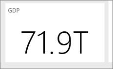

# 在 Power BI Desktop 中建立報表的秘訣和訣竅
為了充分利用您的資料，有時您需要一些額外的協助。 我們集結了一些秘訣與技巧，可供您在 Microsoft Power BI Desktop 中，*以及*在啟用 Power Pivot 增益集與安裝並啟用 Power Query 的 Microsoft Excel 2016 或 Microsoft Excel 2013 Pro-Plus 版本中，用來建立報表。 

## 了解如何使用查詢編輯器
Power BI Desktop 中的查詢編輯器與 Excel 2013 中的 Power Query 增益集功能很類似。 雖然 Power BI 支援中有許多篇實用文章，然而您可能也需要檢閱 support.office.com 上的 Power Query 文件，然後再開始使用。

您可以從 [Power Query 資源中心](https://support.office.com/article/Microsoft-Power-Query-for-Excel-Help-2b433a85-ddfb-420b-9cda-fe0e60b82a94)取得其他資訊.

您也可以檢視[公式參考](https://support.office.com/Article/Learn-about-Power-Query-formulas-6bc50988-022b-4799-a709-f8aafdee2b2f).

## 查詢編輯器中的資料類型
使用 Power BI Desktop 中的查詢編輯器載入資料時，可對資料類型偵測做出最佳猜測。 使用公式時，有時不會保留資料行的資料類型設定。 執行下列作業之後，請確保資料行的資料類型是否正確：將資料初始載入 [查詢] 索引標籤、以第一個資料列作為標頭、加入資料行、群組依據、合併、附加，以及第一次按下 [載入資料] 之前。

請記住一個重點：資料格中的斜體並不代表資料類型已正確設定，只是代表資料不會被視為文字。

## 查詢編輯器中的參考查詢
在 Power BI Desktop 的查詢編輯器的導覽器中，當您以滑鼠右鍵按一下其中一個查詢，即可使用 [參考] 選項。 這相當實用，原因如下 ︰

* 當您使用檔案做為查詢的資料來源時，檔案的絕對路徑會儲存在查詢中。 共用或移動 Power BI Desktop 檔案或 Excel 活頁簿時，只需更新一次而無須更新所有路徑，藉此節省更新路徑的時間。

根據預設，所有查詢都會載入至資料模型。 某些查詢是中繼步驟，不適合使用者使用。 當參考上述查詢時，通常會是這種情況。 您可以控制查詢載入行為，方法是以滑鼠右鍵按一下導覽器中的查詢，然後切換 [啟用載入] 選項。 如果 [啟用載入]  旁沒有核取記號，您仍可從 [查詢] 索引標籤使用查詢，並可搭配其他查詢使用。 它特別適合搭配「合併」、「附加」和「參考」轉換使用。 不過，由於不會將查詢結果載入至資料模型，因此查詢不會造成報表欄位清單或資料模型紊亂的情況。 

## 散佈圖需要點識別元
以簡單的溫度表為例，並計時閱讀所花的時間。 如果您直接在散佈圖上繪製，Power BI 會將所有值彙總成一點。 若要顯示個別資料點，您必須將一個欄位加入欄位區中的 [詳細資料] 貯體。 在 Power BI Desktop 中這麼做的一個簡單方法，便是在查詢索引標籤上使用 [新增資料行] 功能區上的 [新增索引資料行] 選項。 

## 報表中的參考線
您可以在 Power BI Desktop 中使用計算結果欄來定義參考線。 指定您要建立參考線的資料表和資料行。 在功能區中選取 [新增資料行]，然後在公式列中輸入下列公式：

    Target Value = 100

不論使用的位置為何，這個導出資料行都會傳回值 100。 您的新資料行會顯示在 [欄位] 清單中。 將 Target Value 導出資料行加入折線圖中，以顯示任何數列與特定參考線的關聯。 

## 依其他資料行排序
當您在 Power BI 中針對圖表座標軸，或者在交叉分析篩選器或篩選條件中使用分類 (字串) 值時，預設會依字母順序排列。 如果您需要覆寫這個順序，例如針對一週天數或月數等項目，您可以指示 Power BI Desktop 依其他資料行排序。 若要深入了解，請參閱 [Power BI Desktop 中的依資料行排序](desktop-sort-by-column.md)。

## 透過對 Bing 的建議更輕鬆地建立地圖
Power BI 與 Bing 整合以提供預設地圖座標 (這個程序稱為地理編碼)，因此可讓您更輕鬆地建立地圖。 Bing 使用一些演算法和建議來嘗試取得正確的位置，但這是它所能做出的最佳猜測。 若要提高正確地理編碼的可能性，您可以使用下列秘訣：

當您建立地圖時，通常會繪製國家/地區、州/省和縣/市。 在 Power BI Desktop 中，如果您以地理位置替資料行命名，將有助於 Bing 猜測您想要顯示的項目。 例如，如果您有一個名為「加利福尼亞」及「華盛頓」的美國州名欄位，則 Bing 可能會針對「華盛頓」一字傳回華盛頓特區，而不是華盛頓州。 將資料行命名為「州」可改善地理編碼。 同樣的方法也適用於名為「國家/地區」和「縣/市」的資料行。 

某些名稱放在多個國家/地區內容中考量時會有模稜兩可的情況。 某個國家/地區視為「州」的位置，在某些情況下可能會被視為「省」、「郡/縣市」或其他名稱。 您可以建立同時附加多個欄位的資料行來提高地理編碼的精確度，並使用這些資料行來繪製資料位置。 例如，與其只傳遞「威爾特郡」，您可以傳遞「英國威爾特郡」以取得更精確的地理編碼結果。 

您隨時可以在 Power BI 服務或 Power BI Desktop 中提供特定經度和緯度位置。 當您這麼做時，同時也需要傳遞 [位置] 欄位，否則預設會彙總資料，而導致緯度和經度的位置可能不符合您的預期。

## 分類地理欄位以建議 Bing 的地理編碼
確保欄位地理編碼正確的另一個方法，便是在資料欄位上設定 [資料類別]。 在 Power BI Desktop 中，選取所需的資料表，移至進階功能區，然後將 [資料類別] 設定為 [地址]、[城市]、[洲]、[國家/地區]、[國家]、[郵遞區號]、[州] 或 [省]。 這些資料類別可以協助 Bing 將該資料正確編碼。 若要深入了解，請參閱 [Power BI Desktop 中的資料分類](desktop-data-categorization.md)。

## 以更具體的位置改善地理編碼
有時候，即使設定了地圖的資料分類還是不夠。 在 Power BI Desktop 中使用查詢編輯器建立街道地址等更特定的位置。 您可以使用 [加入資料行] 功能來建立自訂資料行。 然後建立所需的位置，如下所示： 

    = [Field1] & " " & [Field2]

接著在地圖視覺效果中使用這個產生的欄位。 這對於從資料集中的交貨地址欄位建立街道地址非常有用。 值得注意的一點是串連僅適用於文字欄位。 如有需要，請將街道號碼轉換成文字資料類型，再用來建立地址。

## 查詢階段中的長條圖
在 Power BI Desktop 中建立長條圖的方法有數種，我們會從最簡單的開始，並進一步介紹其他方法：

最簡單的長條圖 - 決定哪個查詢具有您想要建立長條圖的欄位。 使用查詢的 [參考] 選項來建立新的查詢，並命名為 "FieldName Histogram"。 使用 [轉換] 功能區中的 [群組依據] 選項，然後選取 [資料列計數] 彙總。 確定所產生之彙總資料行的資料類型為數值。 然後在報表頁面上以視覺化方式呈現這項資料。 建置過程快速且容易，但如果您有許多資料點且不允許跨多種視覺效果進行筆刷繪製，則不適用。

定義值區以建立長條圖 - 決定哪個查詢具有您想要建立長條圖的欄位。 使用查詢的 [參考] 選項來建立新的查詢，並命名為 "FieldName"。 現在使用規則來定義值區。 使用 [加入資料行] 功能區上的 [加入自訂資料行] 選項，並建立自訂規則。 簡單的值區規則看起來可能會類似這樣：

    if([FieldName] \< 2) then "\<2 min" else
    if([FieldName] \< 5) then "\<5 min" else
    if([FieldName] \< 10) then "\<10 min" else
    if([FieldName] \< 30) then "\<30 min" else
    "longer")

確定所產生之彙總資料行的資料類型為數值。 您現在可以使用＜最簡單的長條圖＞中所述的群組依據方法來取得長條圖。 這個選項會處理更多資料點，但仍無法解決筆刷繪製的問題。

定義支援筆刷繪製的長條圖 – 筆刷繪製是指將視覺效果連結在一起，以便使用者選取某個視覺效果中的資料點時，報表頁面上的其他視覺效果會醒目提示或篩選與所選資料點相關的資料點。 由於我們要在查詢期間操作資料，因此需要建立資料表之間的關聯性，並確保知道哪個詳細資料項目與長條圖中的值區相關，反之亦然。

在具有您想要建立長條圖之欄位的查詢上，使用 [參考] 選項開始進行這個程序。 將新的查詢命名為 "Buckets"。 在此範例中，我們將原始查詢稱為 "Details"。 接著移除所有資料行，只留下要做為長條圖值區使用的資料行。 現在，在查詢中使用 [移除重複項目] 功能，如此留在資料行中的值便是唯一的值；您可以選取資料行，然後在快顯功能表中找到這項功能。 您若是使用十進位數字，可以先應用定義貯體的祕訣來建立長條圖，以產生一組可以管理的貯體。 現在，檢查查詢預覽中顯示的資料。 若您發現空白值或 null，必須先修正這些問題，然後再建立關係。 請參閱＜資料包含 Null 或空白值時建立關聯性＞。 使用這個方法時，由於需要排序，因此可能會造成問題。 若要讓值區正確排序，請參閱＜排列順序：以我想要的順序來顯示類別＞。 

>[!NOTE]
>在建立任何視覺效果前先考慮排序次序會很有幫助。 

本程序中的下一個步驟是在值區資料行上，定義 "Buckets" 和 "Details" 查詢之間的關聯性。 在 Power BI Desktop 中，按一下功能區中的 [管理關聯性]  。 建立關聯性，其中 Buckets 位於左側資料表，而 Details 位於右側資料表，然後選取用於長條圖的欄位。 

最後一個步驟是建立長條圖。 從 "Buckets" 資料表拖曳 Bucket 欄位。 從產生的直條圖中移除預設欄位。 現在從 "Details" 資料表將長條圖欄位拖曳到同一個視覺效果上。 將欄位區中的預設彙總方式變更為 [計數]。 結果會產生長條圖。 如果您從 Details 資料表建立類似矩形式樹狀結構圖的另一個視覺效果，請選取矩形式樹狀結構圖中的某個資料點以查看長條圖的醒目提示，並顯示與整個資料集趨勢相關的所選資料點長條圖。

## 長條圖
在 Power BI Desktop 中，您可以使用導出欄位來定義長條圖。 指定您要建立長條圖的資料表和資料行。 在計算區域中，輸入下列公式：

> Frequency:=COUNTROWS(\<資料行名稱\>)
> 
> 

儲存您的變更並返回報表。 將 \<資料行名稱\> 和 Frequency 加入資料表，然後轉換成橫條圖。 確定 \<資料行名稱\> 位於 X 軸上，而導出欄位 Frequency 位於 Y 軸上。

## 在 Power BI Desktop 中建立關聯性的祕訣和訣竅
通常從多個來源載入詳細資料集時，Null 值、空白值或重複值等問題會使您無法建立關聯性。 

以下舉例說明： 

如果從作用中的客戶支援要求載入資料集，並載入具有下列結構描述的另一個工作項目資料集：

> CustomerInicdents: {IncidentID, CustomerName, IssueName, OpenedDate, Status} WorkItems: {WorkItemID, IncidentID, WorkItemName, OpenedDate, Status, CustomerName } 
> 
> 

當我們想要追蹤所有與特定 CustomerName 相關的事件與工作項目時，不能只是建立這兩個資料集之間的關係。 有些 WorkItems 可能與 CustomerName 無關，因此該欄位會是空白或 NULL。 任何指定 CustomerName 的 WorkItems 和 CustomerIncidents 中可能會有多筆記錄。 

### 在 Power BI Desktop 中，於資料包含 Null 或空白值時建立關聯性
資料集通常包含具有 Null 或空白值的資料行。 當您嘗試使用關聯性時，這會造成問題。 基本上有兩個選項可解決問題。 您可以移除具有 Null 或空白值的資料列。 您可以在查詢中使用 [篩選] 功能來執行這項操作，或者如果您想要合併查詢，請選取 [僅保留相符的資料列] 選項。 或者，您可以將 Null 或空白值取代成關聯性適用的值，通常是 "NULL" 和 "(Blank)" 等字串。 沒有絕對正確的方法；篩選出查詢階段的資料列會移除資料列，並可能會影響摘要統計資料和計算。 而第二種方法雖然可以保留資料列，但可能會使無關的資料列在模型中顯示為相關，而導致計算不正確。 如果您採用第二種解決方法，請確保適時在檢視/圖表中使用篩選條件，以確保取得精確的結果。 請務必評估保留/移除了哪些資料列，並了解分析的整體影響。 

### 在 Power BI Desktop 中，於資料包含重複值時建立關聯性
通常從多個來源載入詳細資料集時，重複的資料值會使您無法建立關聯性。 您可以從兩個資料集建立具有唯一值的維度資料表，來解決這個問題。 

以下舉例說明： 

如果從作用中的客戶支援要求載入資料集，並載入具有下列結構描述的另一個工作項目資料集：

> CustomerInicdents: {IncidentID, CustomerName, IssueName, OpenedDate, Status} WorkItems: {WorkItemID, IncidentID, WorkItemName, OpenedDate, Status, CustomerName } 
> 
> 

當我們想要追蹤所有與特定 CustomerName 相關的事件和工作項目時，不能僅是建立這兩個資料集之間的關聯性。 有些 WorkItems 可能與 CustomerName 無關，因此該欄位會是空白或 NULL。 如果您的 CustomerNames 資料表中有任何空白值或 Null，您可能仍然無法建立關聯性；請參閱＜資料包含 Null 或空白值時建立關聯性＞。 一個 CustomerName 可能會有多個 WorkItems 和 CustomerIncidents。 

若要在這種情況下建立關聯性，則需要跨兩個資料集建立所有 CustomerNames 的邏輯資料集。 您可以在 [查詢] 索引標籤中，依下列順序建立邏輯資料集：

1. 同時複製這兩個查詢，將第一個查詢命名為 **Temp** ，第二個查詢命名為 **CustomerNames**。
2. 在每個查詢中，移除所有其他資料行只留下  CustomerName 資料行。
3. 在每個查詢中，使用 [移除重複項目]   。
4. 在 **CustomerNames** 查詢中，選取功能區的 [附加]  選項，然後選取 **Temp**查詢。
5. 在 **CustomerNames** 查詢中，選取 [移除重複項目]  。

現在您會有一個維度資料表，可用來與 CustomerIncidents 和 WorkItems 建立關聯，其中包含這兩者的所有值。 

## 可以協助您快速開始使用查詢編輯器的模式
查詢編輯器的功能很強大，它可以操作資料使其成形，並加以整理，以供視覺化檢視或建立模型使用。 請注意以下幾個模式。

### 計算結果之後便可刪除暫存資料行
通常您需要在 Power BI Desktop 中建立計算，以便將來自多個資料行的資料轉換成單一的新資料行。 這會相當複雜。 解決這個問題的一項簡單方法是將作業分成幾個步驟。 首先複製初始資料行。 接著建立暫存資料行， 再為最終結果建立資料行。 接著您可以刪除暫存資料行，以確保最終資料集有條不紊。 由於 [查詢] 索引標籤會依序執行步驟，因此可以這麼做。 

### 複製或參考查詢，再合併到原始查詢
有時候，計算資料集的摘要統計資料會很有幫助。 執行這項操作的簡單做法是在 [查詢] 索引標籤中複製或參考查詢。然後使用 [群組依據]  來計算摘要統計資料。 摘要統計資料可協助您標準化原始資料中的資料，讓資料更容易進行比較。 這特別適用於進行個別值與整體的比較。 若要執行這項操作，請移至原始查詢並選取 [合併] 選項。 然後合併符合適當識別項之摘要統計資料查詢中的資料。 現在您已準備好視分析所需來標準化資料。

## 第一次使用 DAX
DAX 是 Power BI Desktop 的計算公式語言， 並已針對 BI 分析最佳化。 如果您只用過類似 SQL 的查詢語言，則這與您熟悉的語言稍有不同。 如需了解 DAX，網路上和文獻中均提供相當實用的資源。 

[了解 Power BI Desktop 的 DAX 基本概念](desktop-quickstart-learn-dax-basics.md)

[資料分析運算式 (DAX) 參考](https://msdn.microsoft.com/library/gg413422.aspx)

[DAX 資源中心](https://social.technet.microsoft.com/wiki/contents/articles/1088.dax-resource-center.aspx)

## Power BI 服務和  Power BI Desktop

### 閱讀並/或觀賞「如何在 Power BI 中設計令人驚豔的報表 (和儀表板)」
社群成員 Miguel Myers 是資料科學家暨圖形設計人員。

* [閱讀部落格](https://powerbi.microsoft.com/blog/how-to-design-visually-stunning-reports/)
* [觀賞網路研討會](https://info.microsoft.com/CO-PowerBI-WBNR-FY16-04Apr-19-Design-Reports-in-PowerBI-Registration.html)

### 請考慮您的對象
什麼關鍵度量能幫助他們做出決策？ 報表使用的方式為何？ 哪些已了解的或文化特性的假設可能會影響設計選擇？ 哪些資訊是您的對象邁向成功所需？

報表在何處顯示？ 如果儀表板位於大型監視器上，您可以在上面放置更多的內容。 如果讀者會在平板電腦上檢視報表，則較少的視覺效果可提高可讀性。

### 說個故事並保存到一個畫面
每個報表頁面都應該簡單清楚地呈現故事。 是否可以避免頁面上出現卷軸？ 報表是否太雜亂無章或太複雜？  移除必要資訊以外的所有內容，可以更加輕鬆地讀取和解譯。

### 將最重要的資訊大小調整為最大
如果報表頁面上的文字和視覺效果大小都一樣，則讀者會很難專注於最重要的內容。 例如，卡片視覺效果是凸顯重要數字的好方法：  

### 但請務必提供內容脈絡  

使用文字方塊和工具提示等功能，將內容脈絡加入您的視覺效果。

### 將最重要的資訊放在左上角
大部分的人從上往下讀取，所以將最高層級的詳細資料放置在頂端，並且當您順著對象閱讀的方向移動時，會顯示更多的詳細資料 (由左到右、由右到左)。

### 為資料使用正確的視覺效果，並將其格式化以方便閱讀
請不要只是為了不同而讓視覺效果不同。  視覺效果應該要能繪製圖片，且應該要很容易「閱讀」及解譯。  對某些資料和視覺效果而言，簡單的圖形視覺效果已經綽綽有餘。 但是其他資料可能需要更複雜的視覺效果 - 請務必使用標題和標籤，以及使用其他自訂項目，以協助讀者。  

* 請謹慎使用會導致事實失真的圖表，例如 3D 圖表與不是從零開始的圖表。 請記住，圓形的圖形會較難理解。 圓形圖、環圈圖、量測計和其他圓形的圖表類型可能很好看，但是否有可以使用的其他圖表？    
* 軸的圖表刻度、圖表維度次序，以及在圖表內維度值所用的色彩務必保持一致。    
* 請務必小心地編碼量化資料。 顯示數字時，不要超過三或四個數字。 量值應在小數點、千位數、百萬等左邊顯示為一或兩個數字，亦即可以將量值顯示為 3.4 百萬，而不要顯示為 3,400,000。    
* 避免混用精確度和時間的層級。 請確定時間框架可讓人充分了解。  不要讓上個月的圖表緊鄰從該年度指定月份篩選出的圖表。    
* 此外，也請避免在同一個刻度尺上混合大量值和小量值，例如在折線圖或橫條圖上。  例如，一個量值可能數以百萬計，而其他量值以千為單位。  如果刻度太大，會很難看到以千為單位之量值的差異。  如果您需要混合，請選擇可使用第二個軸的視覺效果，例如組合圖。    
* 避免使用不必要的資料標籤，而造成圖表雜亂無章。 橫條圖中的值 (***如果夠大***) 通常很容易理解，而不用顯示實際值。   
* 請注意[圖表如何排序](consumer/end-user-change-sort.md)。 如果您想要強調最高或最低數字，請依量值排序。 如果您想要在許多其他類別目錄內，能夠快速尋找特定分類，請依軸排序。  
* 圓形圖最適合具有少於八個類別目錄的量值。 因為您無法以並排方式比較值，所以在圓形圖中比較值，會比在橫條圖和直條圖中比較值更困難。 圓形圖適於檢視部分與整體的關聯性，而不是用於部分比較。 量表圖非常適合用來在目標內容中顯示目前狀態。    

如需更多特定視覺效果的指引，請參閱[ Power BI 中的視覺效果類型](visuals/power-bi-visualization-types-for-reports-and-q-and-a.md).  

### 深入了解儀表板設計的最佳做法
幾本我們最喜愛的書籍包括：

* *Storytelling with Data*，Cole Nussbaumer Knafic 著
* *Data points*，Nathan Yau 著
* *The truthful Art*，Alberto Cairo 著
* *Now You See It* ，作者：Stephen Few  
* *Envisioning Information* ，作者：Edward Tufte  
* *Advanced Presentations Design*，Andrew Abela 著   

## 後續步驟
* [Power BI 服務中的設計工具基本概念](service-basic-concepts.md)
* [Power BI 中的報表](consumer/end-user-reports.md)

有其他問題嗎？ [試試 Power BI 社群](https://community.powerbi.com/)

