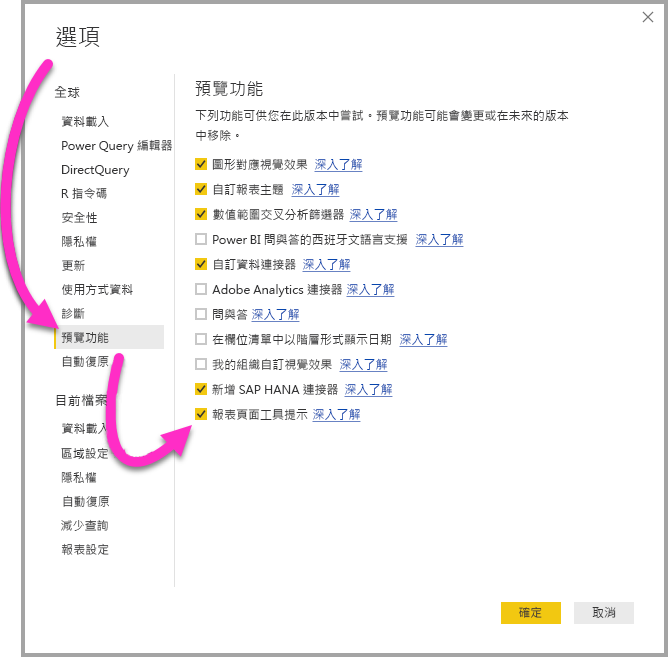
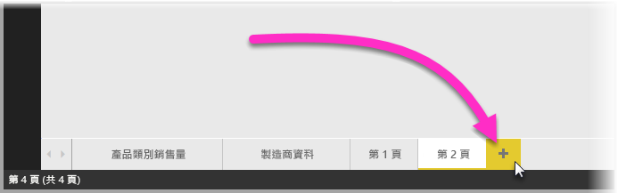
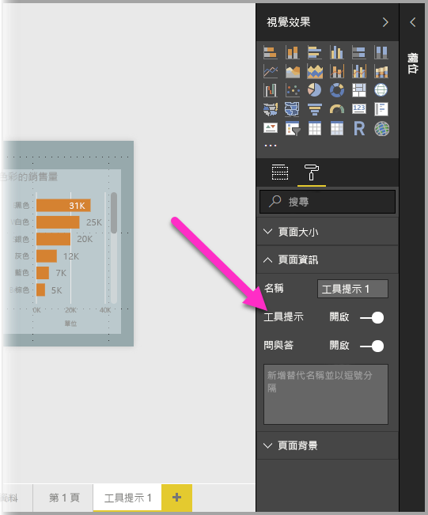
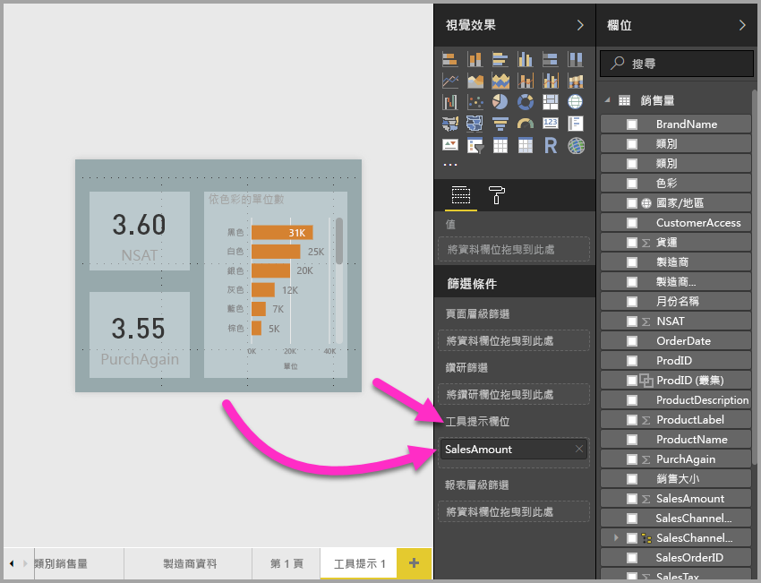
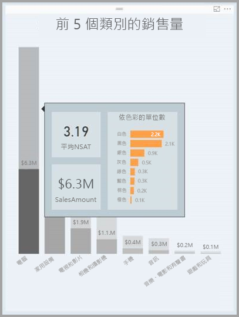

# 在 Power BI Desktop 中根據報表頁面建立工具提示 (預覽)
您可以建立視覺化的豐富**報表工具提示**，它們是您在 **Power BI Desktop** 中根據報表頁面所建立的，當您將滑鼠停留在視覺效果上時就會顯示。 透過建立作為工具提示的報表頁面，您的自訂工具提示可以包含視覺效果、影像和任何其他您在報表頁面中建立的項目集合。 

您可以建立許多工具提示頁面，不限數量。 每個工具提示頁面都可與報表中的一或多個欄位建立關聯，因此在您將滑鼠停留在包含所選欄位的視覺效果上時，您在工具提示頁面建立的工具提示，會根據滑鼠停留的資料點進行篩選，在滑鼠停留於視覺效果上時出現。 

您可以使用報表工具提示執行各式各樣有趣的作業。 讓我們看看如何建立工具提示，以及設定它們必須執行的作業。

### 啟用工具提示預覽 
因為報表工具提示目前為預覽，所以您要先啟用它們才可以建立報表工具提示。 若要啟用報表工具提示預覽功能，請選取 Power BI Desktop 的 [檔案] > [選項及設定] > [選項] > [預覽功能]，然後選取 [報表頁面工具提示] 旁的核取方塊。 

選取啟用報表工具提示預覽版後，您必須重新啟動 **Power BI Desktop**。

## 建立報表工具提示頁面
若要開始，請建立新的報表頁面，方法是按一下 **+** 按鈕，位在 **Power BI Desktop** 畫布底部的頁面索引標籤區域中。 此按鈕位於報表最後一頁的旁邊。 

您的工具提示可為任意大小，但請牢記，工具提示是暫留在報表畫布上，所以您可能希望它們保持適合的大小。 在 [頁面大小] 卡的 [格式] 窗格中，您可以看到新的頁面大小範本，稱為「工具提示」。 這會提供為您的工具提示備妥的報表頁面畫布大小。

**Power BI Desktop** 預設會讓您的報表畫布符合可用的頁面空間。 通常這樣做沒有錯，但對工具提示卻不然。 為能更清楚了解當您完成作業時，您的工具提示會有何種外觀，您可以將 [整頁模式] 變更成實際大小。 

若要這樣做，請選取功能區的 [檢視] 索引標籤。 在這裡選取 [整頁模式] > [實際大小]，如下圖所示。

您也可以命名報表頁面讓它的目的更清楚。 只要在 [格式] 窗格中選取 [頁面資訊] 卡，然後將名稱鍵入您在此找到的 [名稱] 欄位。 下圖中的工具提示報表名稱是 *Tooltip 1*，但您可以任意命名自己的報表名稱。

您可以在這裡建立您希望顯示在工具提示中的任何視覺效果。 在下圖中，工具提示頁面上有兩張卡片和一個群組橫條圖，加上頁面本身的背景色彩以及每個視覺效果的背景，就成了我們想要的外觀。

在您的工具提示報表頁面能夠當成工具提示來使用之前，需要完成很多步驟。 您需要用幾種方法設定工具提示頁面，如下節所述。 

## 設定您的工具提示報表頁面

建立工具提示報表頁面之後，您需要設定頁面，讓 **Power BI Desktop** 將它註冊為工具提示，並確保它會出現在正確的視覺效果上。

一開始，您需要在 [頁面資訊] 卡中將 [工具提示] 滑桿移至 [開啟]，將頁面變成工具提示。 

只要該滑桿設定在 [開啟]，您就可以指定報表工具提示出現在哪些欄位。 針對內含您指定欄位之報表中的視覺效果，會出現工具提示。 您指定要套用的一或多個欄位，方法是將它們拖曳到 [視覺效果] 窗格中 [欄位] 區段的**工具提示欄位**貯體。 在下圖中，*SalesAmount* 欄位已拖曳到**工具提示欄位**貯體。

 
您可以在**工具提示欄位**貯體中包含類別和數值欄位，包括量值。

一旦完成，您建立的工具提示報表頁面，就會在使用任何您放入**工具提示欄位**貯體之欄位的報表中，取代預設的 Power BI 工具提示，用為視覺效果的工具提示。

## 手動設定報表工具提示

除了建立滑鼠暫留在包含指定欄位的視覺效果上時，會自動顯示的工具提示之外，您也可以手動設定工具提示。 

任何支援報表工具提示的視覺效果，現在在其 [格式化] 窗格中都有 [工具提示] 卡。 

若要手動設定工具提示，請選取您想要指定手動工具提示的視覺效果，然後在 [視覺效果] 窗格中選取 [格式] 區段，展開 [工具提示] 卡。

接著在 [頁面] 下拉式清單中，選取您想要用於所選視覺效果的工具提示頁面。 請注意，只有指定為 [工具提示] 頁面的報表頁面，才會出現在對話方塊中。

手動設定工具提示功能有許多用途。 您可以設定空白的工具提示頁面，藉此覆寫預設的 Power BI 工具提示選項。 另一個用途是您不希望 Power BI 自動選取的工具提示成為工具提示。 例如，如果您有包含兩個欄位的視覺效果，而這兩個欄位都有相關聯的工具提示，則 Power BI 只會選取顯示一個。 您可能不希望發生這種情況，因此您可以手動選取應該顯示的工具提示。

## 還原成預設工具提示

如果您為視覺效果建立手動工具提示，但決定改用預設的工具提示，則可以隨時返回 Power BI 提供的預設工具提示。 若要這樣做，當已選取視覺效果且展開 [工具提示] 卡時，只要從 [頁面] 下拉式清單選取 [自動] 即可返回預設值。

## 自訂報表工具提示和折線圖

當您的報表工具提示與折線圖視覺效果，以及交叉醒目提示狀況下的視覺效果互動時，請牢記一些考量事項。

### 報表工具提示和折線圖

當報表工具提示針對折線圖顯示時，圖表中的所有折線只會顯示一個工具提示。 這類似折線圖的預設工具提示行為，也是只顯示一個工具提示。 

這是因為圖例中的欄位不會傳遞為工具提示的篩選條件。 下圖中所顯示的工具提示，會顯示報表工具提示中所示所有三個類別於該日售出的所有單位 (此範例中為 Deluxe、Economy 和 Regular)。 

### 報表工具提示及交叉醒目提示

當報表中以交叉醒目提示某個視覺效果時，報表工具提示一律顯示交叉醒目提示的資料，即使您將滑鼠暫留在資料點較淡的部分。 在下圖中，滑鼠暫留在橫條圖淡色部分 (未醒目提示的部分)，但報表工具提示仍顯示該資料點醒目提示部分的資料 (醒目提示的資料)。

## 限制與考量
在此預覽版的報表**工具提示**中，有幾點限制和考量要留意。

* 以行動裝置應用程式或在內嵌環境中檢視報表時 (包括發行至 Web)，不支援報表工具提示。 
* 自訂視覺效果不支援報表工具提示。 
* 叢集目前不支援作為欄位，無法顯示在報表工具提示中。 
* 選擇要在報表工具提示中顯示的欄位時，在比較使用欄位或類別時，當具有選取欄位的摘要符合時，包含該欄位的視覺效果只會顯示指定的工具提示。 

## 後續步驟
如需類似功能或與報表工具提示互動的詳細資訊，請參閱下列文章：

* [在 Power BI Desktop 中使用鑽研](desktop-drillthrough.md)
* [以焦點模式顯示儀表板磚或報表視覺效果](service-focus-mode.md)

