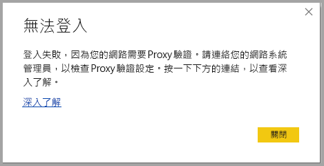

# 對 Power BI Desktop 的登入進行疑難排解
當您嘗試登入 **Power BI Desktop** 時，有時可能會遇到錯誤。 登入問題有兩個主要原因：**Proxy 驗證錯誤**和**非 HTTPS URL 重新導向錯誤**。 

若要判斷造成您登入問題的原因，首先請連絡您的系統管理員並提供診斷資訊，以便他們判斷問題的原因。 藉由追蹤與您登入問題相關聯的問題，系統管理員可以判斷適用於您的錯誤是以下哪一個。 

讓我們依序看看每個問題。 在本文結尾會討論如何在 Power BI Desktop 中擷取「追蹤」  ，這有助於追蹤疑難排解的問題。

## 需要 Proxy 驗證錯誤

以下畫面顯示「需要 Proxy 驗證」  錯誤的範例。

*Power BI Desktop* 追蹤檔案中的以下例外狀況與此錯誤相關聯：

* *Microsoft.PowerBI.Client.Windows.Services.PowerBIWebException*
* *HttpStatusCode:ProxyAuthenticationRequired*

當此錯誤發生時，最可能的原因是您網路上的 Proxy 驗證伺服器封鎖 **Power BI Desktop** 發出的 Web 要求。 

如果您的網路使用 Proxy 驗證伺服器，您的系統管理員可以在 Proxy 驗證伺服器上將以下網域加入允許清單，以修正此問題：

* app.powerbi.com
* api.powerbi.com
* *.analysis.windows.net 命名空間中的網域

對於屬於政府機構雲端的客戶，可藉由在 Proxy 驗證伺服器上將以下網域加入允許清單，以修正此問題：

* app.powerbigov.us
* api.powerbigov.us
* *.analysis.usgovcloudapi.net 命名空間中的網域

## 不支援非 HTTPS URL 重新導向錯誤

目前版本的 **Power BI Desktop** 使用目前版本的 Active Directory Authentication Library (ADAL)，而它不允許重新導向至不安全的 (非 HTTPS) URL。 

*Power BI Desktop* 追蹤檔案中的以下例外狀況與此錯誤相關聯：

* *Microsoft.IdentityModel.Clients.ActiveDirectory.AdalServiceException:WebView 中不支援非 HTTPS URL 重新導向*
* *ErrorCode: non_https_redirect_failed*

如果發生 *ErrorCode: non_https_redirect_failed*，表示重新導向鏈結中的一或多個重新導向頁面或提供者不是 HTTPS 保護的端點，或者一或多個重新導向的憑證簽發者不屬於裝置的信任根憑證。 登入重新導向鏈結中的所有提供者都必須使用 HTTPS URL。 若要解決此問題，請連絡您的系統管理員，並要求其驗證網站使用安全的 URL。 

## 如何在 Power BI Desktop 中收集追蹤

若要在 **Power BI Desktop** 中收集追蹤，請遵循這些步驟：

1. 在 [Power BI Desktop]  中的以下位置啟用追蹤，移至 [檔案] > [選項及設定] > [選項]  ，然後在左窗格中的選項中選取 [診斷]  。 在顯示的窗格中，選取 [啟用追蹤]  旁邊的方塊，如以下影像所示。 您可能需要重新啟動 [Power BI Desktop]  。
   
   

2. 然後按照重現錯誤的步驟操作。 當錯誤發生時，**Power BI Desktop** 會將事件新增到追蹤記錄 (保留在本機電腦上)。

3. 瀏覽到本機電腦上的 [Traces] 資料夾。 您可以藉由在您啟用追蹤的 [診斷]  中，選取顯示為 [開啟損毀傾印/追蹤資料夾]  的連結來尋找該資料夾，如上一個影像所示。 通常可以在本機電腦的以下位置找到：

    `C:\Users/<user name>/AppData/Local/Microsoft/Power BI Desktop/Traces`

該資料夾中可能有許多追蹤檔案。 請確定只傳送最近的檔案給您的系統管理員，這樣有助於他們快速識別錯誤。 

