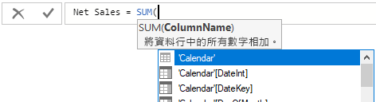
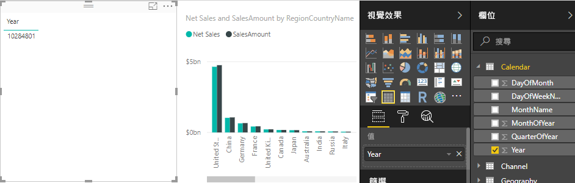
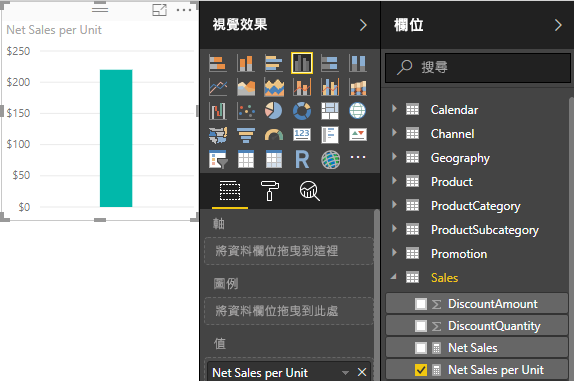

# 教學課程：在 Power BI Desktop 中建立您自己的量值
Power BI Desktop 中一些最強大的資料分析方案可使用量值來建立。 當我們與報表互動時，量值在我們的資料上執行計算，藉此協助我們。 本教學課程將引導您了解，並在 Power BI Desktop 中建立一些您自己的基本量值。

本文適用於已經熟悉使用 Power BI Desktop，用來建立更進階模型的 Power BI 使用者。 您應該已經很熟悉使用 [取得資料] 和 [查詢編輯器] 匯入資料、使用多個相關資料表，以及將欄位加入報表畫布。 如果您剛開始使用 Power BI Desktop，請務必參閱[開始使用 Power BI Desktop](desktop-getting-started.md)。

若要完成本教學課程中的步驟，您將需要下載 [Power BI Desktop 的 Contoso 銷售範例](http://download.microsoft.com/download/4/6/A/46AB5E74-50F6-4761-8EDB-5AE077FD603C/Contoso%20Sales%20Sample%20for%20Power%20BI%20Desktop.zip)檔案。 它已經包含虛構公司 Contoso, Inc. 的線上銷售資料。因為檔案中的資料是從資料庫所匯入，所以您無法連接到資料來源或在查詢編輯器中檢視。 當您自己的電腦上具備此檔案時，請直接在 Power BI Desktop 中開啟它。

## 這些量值是做什麼的？
通常會為我們自動建立量值，像是當我們選取欄位清單中 [Sales]  資料表 [SalesAmount]  欄位旁的核取方塊，或將 [SalesAmount]  拖曳至報表畫布時。

新的圖表視覺效果隨即出現，就像這樣：

我們會得到直條圖，其中顯示 [SalesAmount] 欄位中的銷售值總和總數。  我們的 [SalesAmount] 欄位，其實只是在我們已匯入的 [Sales] 資料表中名為 [SalesAmount] 的資料行。

[SalesAmount] 資料行包含超過兩百萬銷售值的資料列。 您可能會懷疑，為何沒有看到具有所有這些值之資料列的資料表。 其實 Power BI Desktop 知道所有 SalesAmount 中的值都屬於數值資料類型，而且您可能會想要以某些方式加以彙總，像是逐項加總、計算平均值、計數等...

每當您看到具有 sigma 圖示  之欄位清單中的欄位，這就表示該欄位是數值，而其值可以彙總。 在此情況下，當我們選取 [SalesAmount]，Power BI Desktop 便會建立自己的量值，計算並在圖表中顯示所有銷售金額總和。

當我們選取具有數字資料類型的欄位時，總和會是預設彙總方式，但我們也可以很輕鬆地變更為不同類型的彙總方式。

在 [值]  區域中，如果我們按一下 [SalesAmount] 旁邊的向下箭號，我們即可選取 [平均] 。

我們的視覺效果變更為 [SalesAmount] 欄位中所有銷售值的平均值。

我們可以根據我們想要的結果，變更彙總結果類型，但並非所有類型的彙總都可套用至任何數值資料類型。 例如，對於我們的 [SalesAmount] 欄位而言，總和與平均值具有意義。 最小值和最大值也有其意義。 但是對於我們的 [SalesAmount] 欄位，計數就不太合理，因為雖然其值為數值，但它們其實是貨幣。

了解彙總是了解量值的基礎，因為每個量值都會執行某種類型的彙總。 當您建立自己量值的某些範例時，我們稍後就會看到更多使用總和彙總的範例。

從量值計算的值一律依據報表與我們的互動變更。 例如，如果我們從 [Geography]  資料表將 [RegionCountryName]  欄位拖曳至圖表，就會平均並顯示每個國家/地區的銷售金額。

當量值的結果因為與我們的報表互動而變更時，我們會影響到量值的「內容」 。 事實上，每次您與報表互動時，您就會變更量值計算並顯示其結果的內容。

在大部分的情況下，Power BI 會執行其操作和計算，並根據我們加入的欄位以及我們選擇的彙總類型傳回值。 但在其他情況下，您可能想要建立自己的量值，來執行更複雜且獨特的計算。

有了 Power BI Desktop，您就可以使用資料分析運算式 (DAX) 公式語言，建立自己的量值。 DAX 公式非常類似 Excel 公式。 事實上，DAX 會使用許多與 Excel 公式相同的函數、運算子和語法。 不過，當我們與報表互動時，DAX 的函數主要用來處理關聯式資料，和執行更加動態的計算。

有超過 200 種 DAX 函數，執行各種計算，從總和與平均值的簡單彙總，到更複雜的統計和篩選函數皆有。 我們不打算在這裡太過著墨 DAX 語言的細節，但有許多資源可以幫助您深入了解。 在您已經完成本教學課程之後，請務必參閱 [Power BI Desktop 的 DAX 基本概念](desktop-quickstart-learn-dax-basics.md)。

當我們建立自己的量值時，會將它們加入我們想要的資料表之 [欄位] 清單。 這也稱為「模型」量值，會以欄位形式留在資料表中。 模型量值的幾個重要優點在於，我們可以將其命名為想要的名稱，使其更容易識別。 我們也可以將明確量值在其他 DAX 運算式中當做引數使用，而且可以建立非常快速執行複雜計算的量值。

## 讓我們建立自己的量值
假設我們想要分析淨銷售額。 如果我們查閱欄位清單中的 [Sales] 資料表，我們會發現並沒有名為 NetSales 的欄位。 但我們有建置組塊，用來建立自己的量值，以計算淨銷售額。

我們需要扣除折扣的量值，並從銷售金額傳回。 因為我們要讓量值不管視覺效果中內容為何都能計算結果，所以事實上，我們需要將 [SalesAmount] 的總和減去 [DiscountAmount] 和 [ReturnAmount] 的總和。 此時這看起來似乎有點複雜；但是別擔心，稍後就會更加清楚。

### 淨銷售額
1.  以滑鼠右鍵按一下，或按一下欄位清單中的 **Sales** 資料表向下箭號，然後按一下 **新增量值**。 這樣可確保我們新的量值會儲存在 [Sales] 資料表，在那裡會比較容易找到。
    
    
    
    > [!TIP]
    > 您也可以在 Power BI Desktop 的 [主資料夾] 索引標籤功能區的 [新增量值] 按鈕上按一下，建立新的量值。
    > 
    > 
    > 
    > 當您從功能區中建立量值時，即可在任何資料表中建立量值。 雖然量值不屬於任何特定資料表，但如果在對您最具邏輯關聯的資料表中建立，就會比較容易找到。 如果您想要使它位於特定資料表中，請先按一下此資料表，若要讓它成為作用中。 然後按一下 [新增量值]。 在本案例中，我們將在 [Sales] 資料表中建立第一個量值。
    > 
    > 
    
    報表畫布上方會出現公式列。 我們可以在其中將量值重新命名，並輸入 DAX 公式。
    
    
    
    讓我們命名新的量值。 根據預設，新的量值名稱就是「量值」。 如果我們沒有重新命名，則當我們建立另一個量值時，它就會命名為量值 2、量值 3，依此類推。 我們會想要讓量值更容易識別，所以就將我們的新量值命名為 Net Sales。
    
2. 在公式列中反白顯示 **量值**，然後鍵入 **Net Sales**。
    
    現在我們可以開始輸入公式。
    
3.  在等號後面輸入一個 **S**。您會看到下拉式建議清單隨即出現，列出所有開頭字母為 S 的 DAX 函數。當我們輸入更多字母，建議清單就更能調整至接近我們所需的函數。 向下捲動以選取 [SUM]，然後按 Enter 鍵。
    
    
    
    當我們按下 Enter 之後，左括弧隨即出現，並出現另一個建議清單，其中有我們可傳遞至 SUM 函數的可用資料行。
    
    
    
    運算式一律出現在左右括弧之間。 在此情況下，我們的運算式將包含傳遞至 SUM 函數的單一引數；也就是要加總的資料行。 我們可以輸入我們想要的第一個字母，來縮小資料行的清單。 在此情況下，我們想要 [SalesAmount] 資料行，因此當我們開始輸入 salesam 時，清單開始縮短，並顯示可以選取的兩個項目。 它們實際上是相同的資料行。 其中一個只顯示 [SalesAmount]，因為我們建立量值的資料表和 [SalesAmount] 資料行所在的相同。 而對於另外一個，我們會看到資料行名稱前面有資料表名稱。
    
    
    
    一般而言，最好輸入資料行的完整的名稱。 如此可讓您的公式易於閱讀。
    
4. 選取 [Sales [SalesAmount]]，然後鍵入右括弧。
    
    > [!TIP]
    > 語法錯誤通常因遺失或錯置右括弧所導致。
    > 
    > 
    
    現在我們要減去其他兩個資料行。
    
5.  在第一個運算式的右括弧後，輸入一個空格，然後輸入一個減號運算子 (**-**)，後面再接著另一個空格。 然後輸入另一個的 SUM 函數，其中引數為 **Sales [DiscountAmount]** 資料行。
    
    
    
    我們已逐漸將公式的空間用完了。 沒問題。
    
6.  按一下公式列右側的向下Ｖ形箭號。
    
    
    
    現在我們有更多空間了。 我們可以按下 Alt-Enter 在新行上輸入新的部分到我們的公式。 我們也可以使用索引標籤移動項目。
    
    
    
    現在我們可以加入公式的最後一個部分。
    
7.  加入另一個減號運算子，後面接著另一個 SUM 函數和 **Sales[ReturnAmount]** 資料行作為其引數。
    
    
    
    我們的公式現在看起來應該準備好了。

8.  按下 Enter 或按一下公式列中的核取記號以完成。 公式會進行驗證並加入 [Sales] 資料表中的欄位清單。

### 讓我們在報表中加入新的量值
現在我們可以將 [Net Sales] 量值加入報表畫布，且會依據我們加入報表的任何其他欄位來計算淨銷售額。 讓我們依國家/地區查閱淨銷售額。

1.  將 **Net Sales** 量值從 **Sales** 資料表拖曳至報表畫布。
    
2. 現在將 **RegionCountryName** 欄位從 **Geography** 資料表拖曳至此圖表。
    
    
    
    讓我們加入更多資料。
    
3.  將 **SalesAmount** 欄位拖曳到圖表，以查看淨銷售額與銷售金額之間的差異。
    
    現在，我們的圖表中真的有兩個量值。 已自動加總的 SalesAmount，和我們所建立的 Net Sales 量值。 在每個案例中，這些結果會依據圖表中另一個欄位的內容計算，即 [RegionCountryName] 中的國家/地區。
    
    
    
    讓我們加入交叉分析篩選器，如此可以依日曆年度進一步細分淨銷售額與銷售金額。
    
4.  按一下圖表旁邊的空白區域，然後在 **視覺效果** 中按一下 [資料表視覺效果]。
    
    
    
    這會在報表畫布中建立空白的資料表視覺效果。
    
    
    
5.  將 **Year** 欄位從 **Calendar** 資料表拖曳至新的空白資料表。
    
    
    
    因為 Year 是數字欄位，所以 Power BI Desktop 會將其值加總，並且給予我們圖表。 但是和交叉分析篩選器相比，這樣做幫助不大。
    
6. 在**值**中按一下**年** 旁邊的向下箭號，然後按一下 [不摘要]。
    
    
    
    現在我們可以變更資料表視覺效果的 [Year] 欄位到交叉分析篩選器中。

    7.  在 **視覺效果** 按一下 **交叉分析篩選器** 視覺效果。

    
    
    現在我們有做為交叉分析篩選器的 [Year]。 我們可以選取任何單獨或群組的年份，而我們的報表視覺效果將據此交叉分析。
    
8. 請繼續並按一下 [2013]。 您會看到圖表變更。 這會重新計算 Net Sales 和 SalesAmount 量值，只顯示 2013 年的新結果。 這裡我們又再次變更量值計算並顯示結果的內容。
    
    

## 讓我們來建立另一個量值
您現在知道如何建立您自己的量值，讓我們來建立另一個。

### 每個單位的淨銷售額
萬一我們想要了解哪些產品每單位銷售的銷售額最高？

其實我們可以建立另一個量值。 在此情況下，我們要將淨銷售額除以銷售單位數量。 事實上，我們想要將 Net Sales 量值的結果除以 Sales [SalesQuantity] 的總和。

1.  在 Sales 或 Products 資料表中建立新的量值，名稱為 **Net Sales per Unit**。
    
    在這個量值中，我們要使用稍早建立的 Net Sales 量值。 藉由 DAX，我們可以在公式中參考其他量值。
    
2.  開始輸入 **Net Sales**。 建議清單會顯示我們可以加入的項目。 選取 [Net Sales] 。
    
    
    
    您也可以參考另一個量值，只要輸入左括號 (**[**) 即可。 建議清單只會顯示可以加入公式的量值。
    
    
    
3.  在 **Net Sales** 後緊接著輸入一個空格，然後依序輸入除法運算子 (**/**)、SUM 函數，然後輸入**數量**。 建議清單顯示所有具有此名稱之數量的資料行。 選取 [Sales[SalesQuantity]] 。 公式現在看起來應該像這樣：
    
    > **Net Sales per Unit = [Net Sales] / SUM(Sales[SalesQuantity])**
    > 
    > 
    
    看起來很酷，對吧？ 當我們使用 DAX 編輯器的搜尋和建議功能時，輸入 DAX 公式其實相當簡單。 現在讓我們來看看新的每單位量值 Net Sales 有什麼。
    
4. 將 [Net Sales per Unit] 量值拖曳至報表畫布中的空白區域。
    
    
    
    很無聊，對吧？ 別擔心。
    
5.  請將圖表視覺效果類型變更為 **樹狀圖**。
    
    
    
6. 現在將 [ProductCategory] 欄位從 [ProductCategory] 資料表向下拖曳到 [Group] 區域。
    
    
    
    這些資訊很有用，但如果我們想要依產品查看淨銷售額呢？
    
7. 移除 [ProductCategory] 欄位，然後轉而將 [ProductName] 欄位從 [Product] 資料表向下拖曳到 [Group] 區域。 
    
    
    
    好，現在我們只是熱身而已，但您不得不承認，這很酷！ 當然我們可以用數種方式篩選這個樹狀圖，但這不在本教學課程的範圍內。

## 我們所學的內容
量值提供強大的功能，讓我們深入了解資料。 我們學到如何使用公式列建立量值。 我們可以命名量值為最有意義的任何名稱，而建議清單可讓您輕鬆尋找並選取正確項目，加入我們的公式。 我們也已經知道什麼是內容，其中量值計算的結果將根據其他欄位變更，或根據其他量值公式中的運算式變更。

## 後續步驟
如果您想要深入剖析 DAX 公式並建立某些更進階的量值，請參閱 [Power BI Desktop 的 DAX 基本概念](desktop-quickstart-learn-dax-basics.md)。 本文著重在 DAX 中的基本概念，例如語法、函數，並且更徹底了解內容。

請務必將[資料分析運算式(DAX) 參考](https://msdn.microsoft.com/library/gg413422.aspx)加入我的最愛中。 您可以在此找到 DAX 語法、運算子和超過 200 種 DAX 函數的詳細資訊。

