# 教學課程：使用 Power BI Desktop 的 Facebook 分析

在本教學課程中，您將了解如何從 Facebook 匯入資料，並用於 Power BI Desktop 中。 您將連線 Power BI Facebook 頁面並從中匯入資料、將轉換套用至匯入的資料，然後在報表視覺效果中使用資料。

## 連線至 Facebook 頁面

本教學課程使用來自 [Microsoft Power BI Facebook 頁面](https://www.facebook.com/microsoftbi) (*https://www.facebook.com/microsoftbi*) 的資料。 除了個人的 Facebook 帳戶之外，您不需要任何特殊認證就能連線此頁面並從中匯出資料。

1. 開啟 Power BI Desktop，接著在 [開始使用] 對話方塊中選取 [取得資料]，或在 [首頁] 功能區索引標籤中選取 [取得資料]，然後選取 [更多]。
   
2. 在 [取得資料] 對話方塊中，從 [線上服務] 群組選取 [Facebook]，然後選取 [連接]。
   
   
   
   對話方塊隨即出現，提醒您使用第三方服務的風險。
   
   
   
3. 選取 [繼續]。 [Facebook] 對話方塊隨即出現。
   
4. 在 [使用者名稱] 文字方塊中輸入或貼上頁面名稱 **microsoftbi**、從 [連接] 下拉式清單中選取 [貼文]，然後選取 [確定]。
   
   
   
5. 當提示您輸入認證時，請登入您的 Facebook 帳戶，並允許 Power BI 存取您的帳戶。
   
   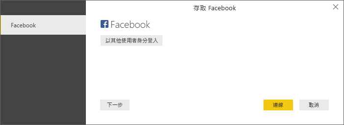

   連接到 Power BI Facebook 頁面之後，您就會看見頁面**貼文**資料的預覽。 
   
   
   
## 使匯入的資料成形和轉換

您想要查看並顯示歷來具有最多留言的貼文，但您注意到在**貼文**資料預覽中，**created_time** 資料難以閱讀和理解，而且完全沒有任何留言資料。 您需要執行某種資料成形和清理作業，才能充分利用資料。 您可以使用 Power BI Desktop 的 **Power Query 編輯器**，在將資料匯入至 Power BI Desktop 之前或之後加以編輯。 

### 分割日期/時間資料行

首先，分隔 **created_time** 資料行中的日期和時間值，使其更容易閱讀。 

1. 在 Facebook 資料預覽中，選取 [編輯]。 
   
   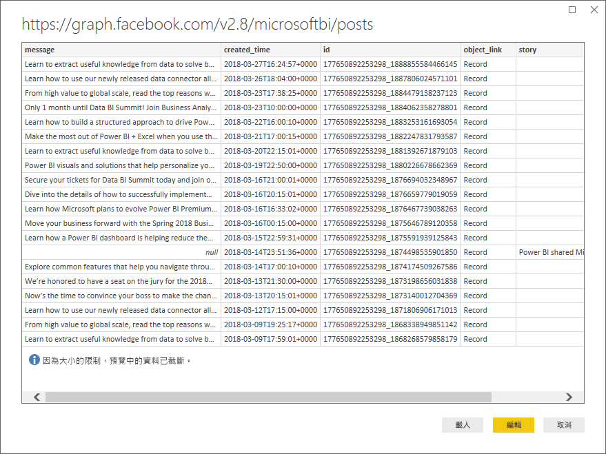
   
   Power BI Desktop 的 **Power Query 編輯器**會在新視窗中開啟，並顯示來自 Power BI Facebook 頁面的資料預覽。 
   
   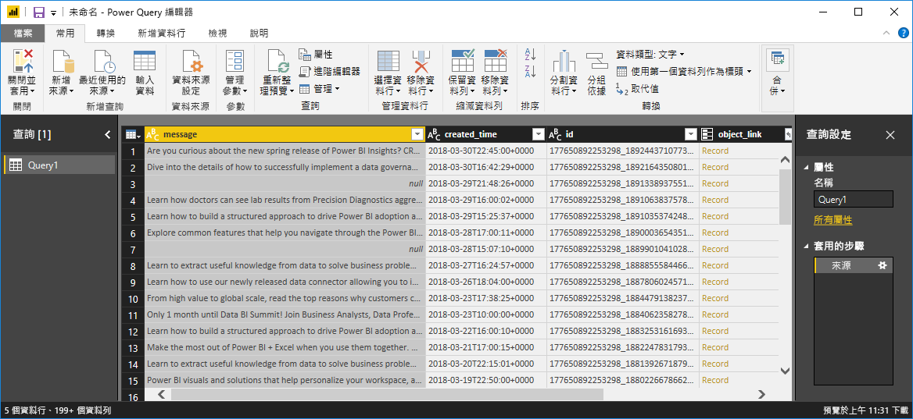
   
2. 選取 **created_time** 資料行。 請注意，它目前是文字資料類型，在資料行標頭中會以 **ABC** 圖示來表示。 以滑鼠右鍵按一下標頭，然後在下拉式清單中選取 [分割資料行] > [依分隔符號]，或在功能區 [首頁] 索引標籤的 [轉換] 下方選取 [分割資料行] > [依分隔符號]。  
   
   
   
3. 在 [依分隔符號分割資料行] 對話方塊中，從下拉式清單中選取 [自訂]、於輸入欄位中輸入 **T** (作為 created_time 值時間部分開頭的字元)，然後選取 [確定]。 
   
   ![[依分隔符號分割資料行] 對話方塊](media/desktop-tutorial-facebook-analytics/delimiter2.png)
   
   該資料行會分割成兩個資料行，各自包含 **T** 分隔符號前後的字串，並分別命名為 **created_time.1** 和 **created_time.2**。 請注意，Power BI 已自動偵測到並將第一個資料行的資料類型變更為 **Date**，以及將第二個資料行變更為 **Time**，而且已將日期和時間值格式化，使其更容易閱讀。
   
4. 按兩下各個資料行標頭，或選取每個資料行，然後選取功能區中 [轉換] 索引標籤之 [任何資料行] 群組中的 [重新命名]，接著分別輸入新的資料行標頭 **created_date** 和 **created_time**，藉以將資料行重新命名。
   
   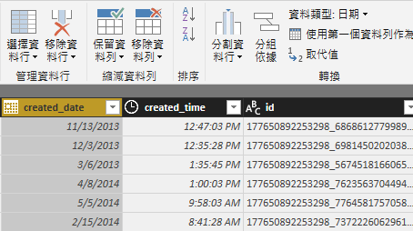
   
### 展開巢狀資料行

日期和時間資料現在會以您想要的方式呈現，您可以展開巢狀資料行即可公開留言資料。 

1. 選取 **object_link** 資料行，然後選取  圖示，以開啟 [展開/彙總] 對話方塊。 選取 [connections] \(連接\)，然後選取 [確定]。 
   
   
   
   資料行標題會變更為 **object_link.connections**。
2. 再次選取 **object_link.connections** 資料行上方的  圖示、選取 [comments] \(留言\)，然後選取 [確定]。 資料行標題會變更為 **object_link.connections.comments**。
   
3. 選取 **object_link.connections.comments** 資料行上方的  圖示，但這次在對話方塊中選取 [彙總] 而不是 [展開]。 選取 [# id 的計數]，然後選取 [確定]。 
   
   
   
   資料行現在會顯示每個訊息的留言數目。 
   
4. 將 **object_link.connections.comments.id 的計數**資料行重新命名為 **Number of comments** \(留言數目\)。
   
5. 選取 **Number of comments** \(留言數目\) 標頭旁的向下箭號，然後選取 [遞減排序] 以查看已排序的貼文 (從最多留言數目到最少留言數目)。 
   
   
   
### 檢閱查詢步驟

當您在 **Power Query編輯器**中使資料成形並轉換時，每個步驟都會記錄於 [Power Query 編輯器] 視窗右側 [查詢設定] 窗格的 [套用的步驟] 區域中。 您可以反向逐步執行「套用的步驟」，以確實查看您做了哪些變更，並視需要編輯、刪除或重新排列它們 (雖然這可能會有風險，因為變更前面的步驟可能中斷接下來的步驟)。 

套用資料轉換之後，套用的步驟看起來應該如下：
   
   
   
   >[!TIP]
   >套用的步驟本質上是以 **Power Query 語言** (亦稱為 **M** 語言) 所撰寫的公式。 若要查看和編輯公式，請選取功能區 [首頁] 索引標籤之 [查詢] 群組中的 [進階編輯器]。 

### 匯入轉換的資料

當您處理完資料之後，請在功能區的 [首頁] 索引標籤中選取 [關閉並套用] > [關閉並套用]，以將資料匯入至 Power BI Desktop。 
   
   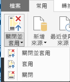
   
   對話方塊會顯示將資料載入至 Power BI Desktop 資料模型的進度。 
   
   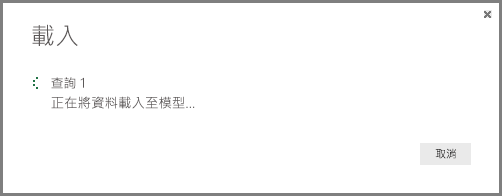
   
   載入資料之後，它會在報表檢視中顯示為 [欄位] 清單中的新查詢。
   
   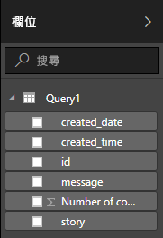
   
## 在報表視覺效果中使用資料 

現在您已從 Facebook 頁面載入資料，便可以使用視覺效果，快速且輕鬆地深入解析您的資料。 建立視覺效果很簡單；只要選取一個欄位，或將它從 [欄位] 清單拖曳至報表畫布即可。

### 建立橫條圖

1. 在 Power BI Desktop 報表檢視中，從欄位清單選取 [message] \(訊息\)，或將它拖曳至畫布。 畫布上會出現一個顯示所有貼文訊息的資料表。 
   
   
   
2. 選取該資料表之後，也請選取欄位清單中的 **Number of comments** \(留言數目\)，或將它拖曳到資料表。 
   
3. 在 [視覺效果] 窗格中，選取**堆疊橫條圖**圖示。 資料表會變更為橫條圖，並顯示每個貼文的留言數目。 
   
   
   
4. 選取視覺效果右上角的省略符號 (...)，然後選取 [排序依據 Number of comments]，以便依遞減的留言數目排序資料表。 
   
   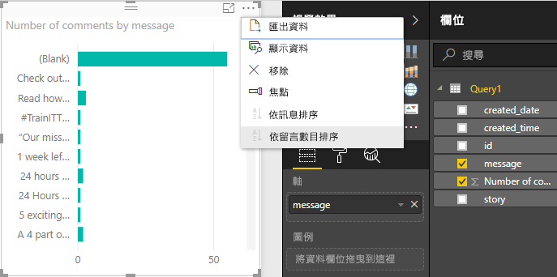
   
5. 請注意，大部分留言都會與**空白**訊息相關聯 (這些貼文可能是報導、連結、影片或其他非文字內容)。 若要篩選出空白列，請選取 [視覺效果] 窗格底部 [篩選] 下方的 [message (全部)]、選取 [全選]，然後選取 [空白] 以將之取消選取。 [篩選] 項目會變更為 [message 不是 (空白)]，而空白列會從圖表視覺效果中消失。 
   
   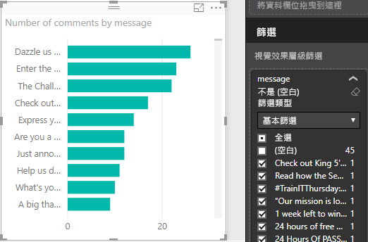
   
### 將資料表格式化

視覺效果變得越來越有趣了，但您在圖表中看不到大部分貼文內容。 顯示更多貼文內容：

1. 使用圖表視覺效果的控點，盡可能將圖表大小調整到最大。 
   
2. 選取圖表之際，選取 [視覺效果] 窗格中的**格式圖示** (滾筒刷)。
   
3. 選取 **Y 軸**旁的向下箭號，然後將 [最大容量] 旁的滑桿拖曳到最右邊 (50%)。 
4. 同時將 [文字大小] 降至 **10** 以容納更多文字。
   
   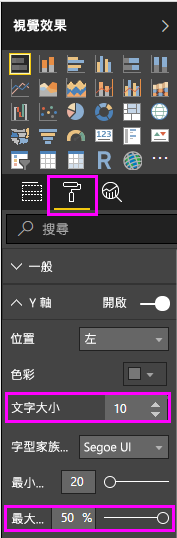
   
   圖表現在會顯示更多貼文內容。 
   
   
   
圖表的 X 軸 (留言數目) 不會顯示實際值，而且看不到圖表底部。 您決定改用資料標籤。 

1. 選取格式圖示，然後選取 **X 軸**旁的滑桿來將它**關閉**。 
   
2. 選取**資料標籤**旁的滑桿以將之**開啟**。 現在圖表會顯示每個貼文的確切留言數目。
   
   
   
### 編輯資料類型

看起來好多了，但資料標籤全都有 **.0** 小數位數，這可能會造成失焦與誤解，因為 **Number of posts** \(貼文數目\) 必須是整數。 您需要將 **Number of posts** \(貼文數目\) 資料行的資料類型變更為整數。

1. 若要編輯資料類型，以滑鼠右鍵按一下 [欄位] 清單中的 **Query1**，或將滑鼠停留在它的上方，並選取**更多選項**省略符號 (...)，然後選取 [編輯查詢]。 您也可以從功能區 [首頁] 索引標籤的 [外部資料] 區域中選取 [編輯查詢]，然後從下拉式清單中選取 [編輯查詢]。 Power BI Desktop 的 **Power Query 編輯器** 會在另一個視窗中開啟。
   
   ![從 [欄位] 清單編輯查詢](media/desktop-tutorial-facebook-analytics/editquery1.png)     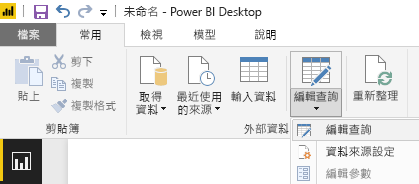
   
2. 在 Power Query 編輯器中，選取 **Number of comments** \(留言數目\) 資料行，並透過下列其中一種方式，將資料類型變更為**整數**： 
   - 選取 **Number of comments** \(留言數目\) 資料行標頭旁的 **1.2** 圖示，然後從下拉式清單中選取 [整數]，或者
   - 以滑鼠右鍵按一下資料行標頭，然後選取 [變更類型] > [整數]，或者
   - 在 [首頁] 索引標籤的 [轉換] 群組或 [轉換] 索引標籤的 [任何資料行] 群組中選取 [資料類型：十進位數字]，然後選取 [整數]。
   
   資料行標頭中的圖示會變更為 **123**，表示整數資料類型。
   
   
   
3. 選取 [關閉並套用] (或僅 [套用]) 以套用變更，同時讓 Power Query 編輯器視窗保持開啟。 一旦載入變更之後，圖表上的資料標籤就會變成整數。 
   
   
   
### 建立日期交叉分析篩選器

您想要以視覺化方式顯示貼文歷來的留言數目。 您可以建立交叉分析篩選器視覺效果，以篩選不同時間範圍的圖表資料。 

1. 按一下畫布的空白區域，然後選取 [視覺效果] 窗格中的**交叉分析篩選器圖示**。 空白的交叉分析篩選器視覺效果隨即出現。 
   
   
   
2. 從 [欄位] 清單中選取 **created_date** 欄位，或將它拖曳到新的交叉分析篩選器。 交叉分析篩選器會根據欄位的日期資料類型而變更為日期範圍滑桿。
   
   
   
3. 移動滑桿控點來選取不同的日期範圍，並注意圖表資料如何據以篩選。 您也可以選取交叉分析篩選器中的日期欄位並輸入特定日期，或從快顯行事曆中來選擇。
    
   
   
### 將視覺效果格式化

您決定要為圖表提供更清楚且更吸引人的標題。 

1. 選取圖表之際，選取**格式**圖示，然後選取下拉式箭號以展開**標題**。
2. 將 [標題文字] 變更為 **Comments per post** \(每篇貼文的留言\)。 
3. 選取 [字型色彩] 旁的下拉式箭號，然後選取綠色以搭配視覺效果的綠色列。
4. 將 [文字大小] 增加到 **10**，並將 [字型家族] 變更為 **Segoe (Bold)**。

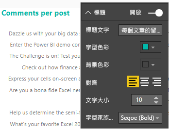

嘗試使用其他格式化選項和設定，以變更視覺效果的外觀。 

## 建立更多視覺效果

如您所見，很容易就能自訂報表中的視覺效果，以便依您想要的方式來呈現資料。 例如，嘗試使用匯入的 Facebook 資料來建立此折線圖，以顯示歷來的留言數目。

Power BI Desktop 提供從頭到尾流暢的體驗，包括從各種資料來源取得資料、讓資料成形以符合您的分析需求，乃至於以豐富且互動的方式將此資料視覺化。 準備好報表之後，您可以[將其上傳至 Power BI 服務](desktop-upload-desktop-files.md)並依此建立儀表板，以便與與其他 Power BI 使用者共用。

## 後續步驟
* [閱讀其他 Power BI Desktop 教學課程](http://go.microsoft.com/fwlink/?LinkID=521937)
* [觀看 Power BI Desktop 影片](http://go.microsoft.com/fwlink/?LinkID=519322)
* [瀏覽 Power BI 論壇](http://go.microsoft.com/fwlink/?LinkID=519326)
* [閱讀 Power BI 部落格](http://go.microsoft.com/fwlink/?LinkID=519327)

