# 教學課程：使用 Power BI Desktop 分析網頁資料

您是一名鐵桿足球迷，想要報導歐洲足球聯賽 (歐洲盃) 歷年的得獎者。 您可以使用 Power BI Desktop，從網頁將此資料匯入至報表，然後建立視覺效果來顯示資料。 在本教學課程中，您將學習使用 Power BI Desktop 來完成下列動作：

- 連線到 Web 資料來源並瀏覽可用的資料表，
- 在 **Power Query 編輯器**中塑造和轉換資料，
- 命名查詢並匯入 Power BI Desktop 報表，然後 
- 建立及自訂地圖和圓形圖視覺效果。

## 連線到 Web 資料來源

您可以從 UEFA 歐洲足球聯賽維基百科頁面的成績表格取得 UEEA 得獎者資料，網址是 http://en.wikipedia.org/wiki/UEFA_European_Football_Championship。 

匯入資料：

1. 在 Power BI Desktop [首頁]功能區索引標籤上，按一下 [取得資料] 旁的向下箭頭，然後選取 [Web]。
   
   ![功能區的 [取得資料]](media/desktop-tutorial-importing-and-analyzing-data-from-a-web-page/get-data-web3.png) 
   
   >[!NOTE]
   >您也可以選取 [取得資料] 項目本身，或從 Power BI [開始使用] 對話方塊選取 [取得資料]，然後從 [取得資料] 對話方塊的 [全部] 或 [其他] 區段選取 [Web]，最後選取 [連接]。
   
2. 在 [從 Web] 對話方塊方塊中，將 URL `http://en.wikipedia.org/wiki/UEFA_European_Football_Championship` 貼到 **URL** 文字方塊中，然後選取 [確定]。
   
    ![對話方塊的 [取得資料]](media/desktop-tutorial-importing-and-analyzing-data-from-a-web-page/get-data-web2.png)
   
   連線到維基百科網頁之後，Power BI [導覽器] 對話方塊會顯示頁面上可用的資料表清單。 您可以選取任何資料表名稱來預覽其資料。 **Results[edit]** 資料表有您想要的資料，但不是您想要的形式。 您將重新塑造和清除資料，然後再將資料載入報表。 
   
   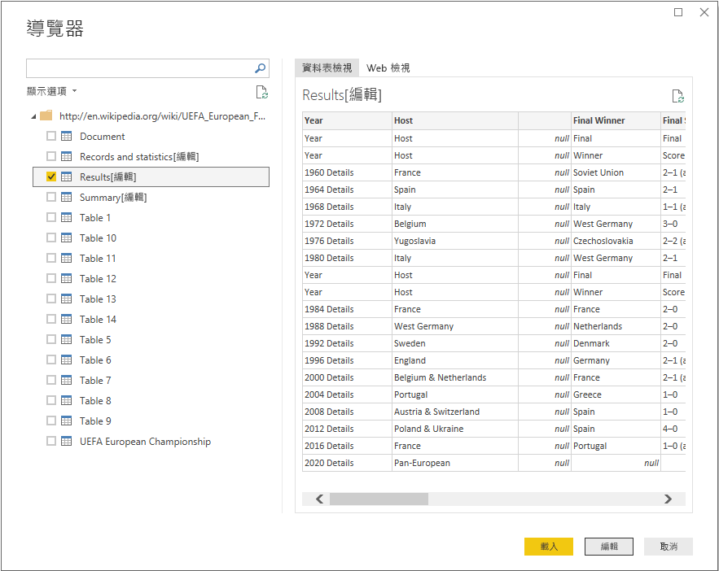
   
   >[!NOTE]
   >[預覽] 窗格會顯示最近選取的資料表，但當您選取 [編輯] 或 [載入] 時，所有選取的資料表都會載入 **Power Query 編輯器**。 
   
3. 選取 [導覽器] 清單中的 **Results[edit]** 資料表，然後再選取 [編輯]。 
   
   **Power Query 編輯器**中會開啟資料表的預覽，您可以在其中套用各種轉換來清除資料。 
   
   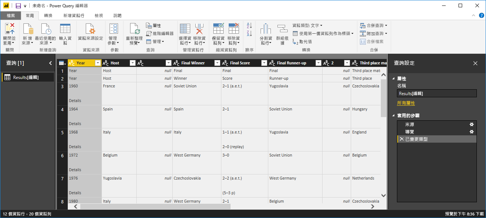
   
## 在 Power Query 編輯器中塑造資料

您想要只顯示年份和贏得勝利的國家/地區，以便讓資料更容易閱讀。 您可以使用 **Power Query 編輯器**來執行這些資料塑造和清理步驟。

首先，除了 [Year] \(年份\) 和 [Final Winners] \(最終獲勝者\) 之外，移除資料表中的所有資料行。

1. 在 **Power Query 編輯器**方格中，選取 [Year] \(年份\) 和 [Final Winners] \(最終獲勝者\) 資料行 (按住 **Ctrl** 鍵可選取多個項目)。
   
2. 以滑鼠右鍵按一下並從下拉式清單中選取 [移除其他資料行]，或者從 [首頁] 功能區索引標籤的 [管理資料行] 群組，依序選取 [移除資料行] > [移除其他資料行]，以便從資料表中移除所有其他資料行。 
   
   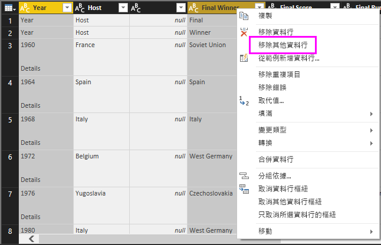 或 

接下來，從 [Year] \(年份\) 資料行儲存格移除 **Details** 這個多餘的字。

1. 選取 [年]  資料行。
   
2. 以滑鼠右鍵按一下並從下拉式清單中選取 [取代值]，或到功能區的 [首頁] 索引標籤中，從 [轉換] 群組中選取 [取代值] (也可以在 [轉換] 索引標籤的 [任何資料行] 群組中找到)。 
   
   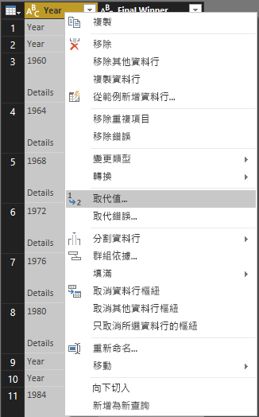 或 
   
3. 在 [取代值] 對話方塊的 [要尋找的值] 文字方塊中輸入 **Details**，並將 [取代為] 文字方塊保留空白，然後選取 [確定]，即可從 [Year] \(年份\) 項目中刪除 "Details" 這個字。
   
   

某些 [Year] \(年份\) 儲存格只包含 "Year" 這個字，而不是年份值。 您可以篩選 [Year] 資料行，以便只顯示不包含 "Year" 這個字的資料列。 

1. 按一下 [Year] \(年份\) 資料行的篩選向下箭頭。
   
2. 在下拉式清單中，向下捲動並清除 [Year] \(年份\) 選項旁邊的核取方塊，然後選取 [確定] 來移除在 [Year] \(年份\) 資料行中只有 "Year" 這個字的資料列。 

   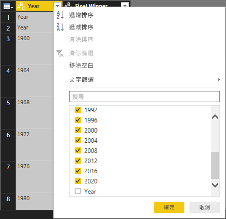

清除 [Year] \(年份\) 資料行中的資料之後，接著就可以使用 [Final Winner] \(最終獲勝者\) 資料行。 因為您現在只需要最終獲勝者資料，所以可以將此資料行重新命名為 **Country** \(國家/地區\)。 重新命名資料行：

1. 按兩下或點選並按住 [Final Winner] \(最終獲勝者\) 資料行標題，或 
   - 在 [Final Winner] \(最終獲勝者\) 資料行標題按一下滑鼠右鍵，然後從下拉式清單中選取 [重新命名]，或 
   - 選取 [Final Winner] \(最終獲勝者\) 資料行，然後從功能區 [轉換] 索引標籤的 [任何資料行] 群組中選取 [重新命名]。 
   
   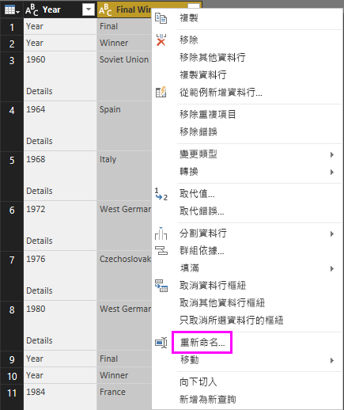 或 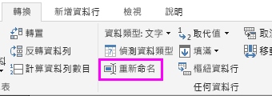
   
2. 在標題中輸入 **Country** \(國家/地區\)，然後按 **Enter** 鍵來重新命名資料行。

您也可以篩選掉 "2020" 之類的資料列，它們在 [Country] 資料行中為空值。 和處理 [Year] \(年份\) 值一樣，您可以使用篩選功能表，或者您可以：

1. 在 **2020** 資料列的 [Country] 儲存格上按一下滑鼠右鍵，此儲存格的值為 *null*。 
2. 依序選取內容功能表中的 [文字篩選] > [不等於]，以移除包含此儲存格值的所有資料列。
   
   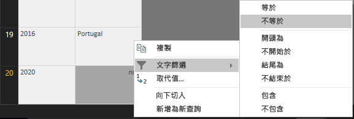
   
## 將查詢匯入報表檢視

將資料塑造成想要的形式之後，接著就可以將查詢命名為 "Euro Cup Winners" (歐洲盃獲勝者)，然後匯入報表中。

1. 在 [查詢設定] 窗格的 [名稱] 文字方塊中，輸入 **Euro Cup Winners** \(歐洲盃獲勝者\)，然後按 **Enter** 鍵。
   
   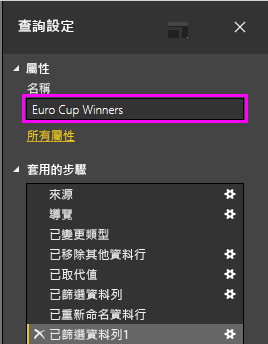

2. 從功能區的 [首頁] 索引標籤依序選取 [關閉並套用] > [關閉並套用]。
   
   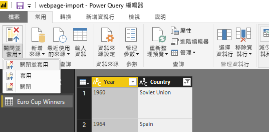
   
此查詢會載入至 Power BI Desktop **報表檢視**，顯示在其中的 [欄位] 窗格。 
   
   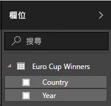
>[!TIP]
>您隨時可以回到 **Power Query 編輯器**並執行以下操作來編輯和精簡查詢：
>- 選取 [欄位] 窗格 [Euro Cup Winners] \(歐洲杯獲勝者\) 旁邊的 [更多選項] 省略符號 (**...**)，然後從下拉式清單中選取 [編輯查詢]，或
>- 在報表檢視 [首頁] 功能區索引標籤的 [外部資料] 群組中，依序選取 [編輯查詢] > [編輯查詢]。 

## 建立視覺效果

根據您的資料建立視覺效果： 

1. 選取 [欄位]窗格中的 [Country] \(國家/地區\) 欄位，或將它拖曳至報表畫布。 Power BI Desktop 會將資料辨識為國家/地區名稱，並自動建立**地圖**視覺效果。 
   
   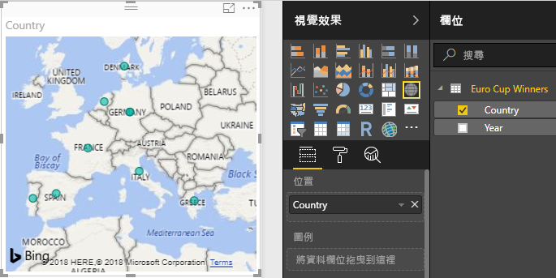
   
2. 拖曳位在角落的控點來放大地圖，這樣就可以看到所有獲勝國家/地區的名稱。  

   
   
3. 地圖會顯示顯示相同的資料點，代表每一個贏得歐洲盃聯賽的國家/地區。 若要讓每個資料點的大小反映該國家/地區的獲勝頻率，請將 [Year] \(年份\) 欄位拖曳至 [視覺效果] 窗格下方 [大小] 底下的 [將資料欄位拖曳到此處]。 這個欄位會自動變更為 [Count of Year] \(年度計數\) 量值。在地圖視覺效果中，現在較大的資料點代表贏得更多比賽的國家/地區。 
   
   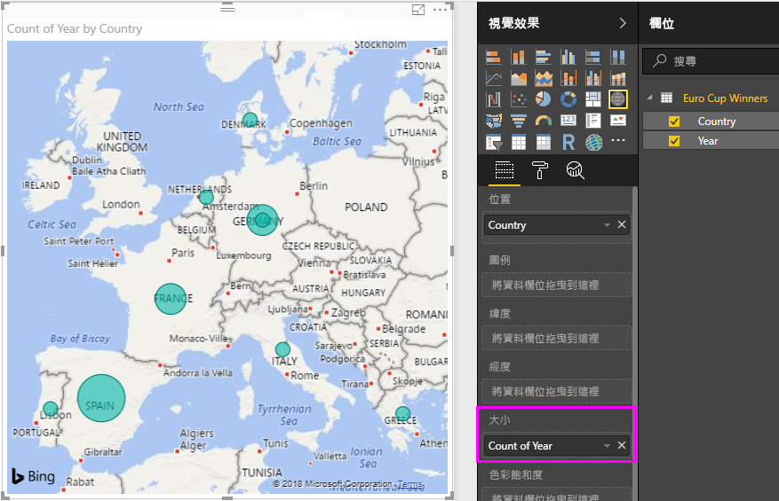
   

## 自訂視覺效果

如您所見，根據資料來建立視覺效果十分容易。 自訂視覺效果同樣輕鬆簡單，讓資料以您所希望的方式來呈現。 

### 設定地圖格式
您可以選取視覺效果，然後選取 [視覺效果] 窗格中的 [格式] 圖示 (滾筒刷)，即可變更視覺效果的外觀。 例如，視覺效果中的 "Germany" (德國) 資料點會產生誤導，因為西德贏了兩場聯賽且德國贏了一場，但地圖將兩個資料點重疊，而不是將它們分開或加在一起。 您可以將這兩個點用不同顏色表示，以突顯此事。 您也可以為地圖提供一個更清楚且更吸引人的標題。 

1. 選取視覺效果之際，選取 [格式] 圖示，接著選取 [資料色彩] 以展開資料色彩選項。 
   
   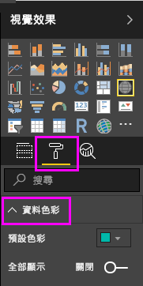
   
2. 將 [全部顯示] 設定為 [開啟]，然後選取 [West Germany] \(西德\) 旁邊的下拉式清單，最後選擇黃色。 
   
   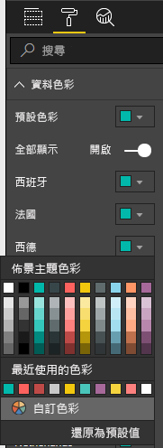
   
3. 選取 [標題] 來展開標題選項，然後在 [標題文字] 欄位中，輸入 **Euro Cup Winners** \(歐洲杯獲勝者\) 來取代目前的標題。 
4. 將 [文字色彩] 變更成紅色、[文字大小] 變更為 **12**，以及將 [字型家族] 變更為 [Segoe (Bold)]。 
   
   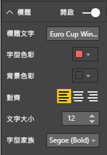
   

現在地圖視覺效果看起來像這樣：

   
### 變更視覺效果類型
您可以選取視覺效果，然後選取 [視覺效果] 窗格上方的不同圖示，即可變更視覺效果的類型。 例如，地圖視覺效果中沒有蘇聯和捷克的資料，因為世界地圖找不到這兩個國家。 樹狀圖或圓形圖之類的視覺效果可能更精確，因為它會顯示所有的值。 

若要將地圖變更為圓形圖，請選取地圖，然後選取 [視覺效果] 窗格中的 [圓形圖] 圖示。 
   
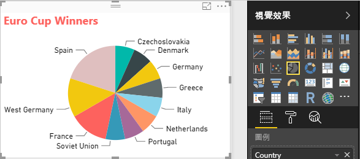

>[!TIP]
>- 您可以使用 [資料色彩] 格式化選項，讓 "Germany" (德國) 和 "West Germany" (西德) 變成相同的色彩。 
>- 若要將最常獲勝的國家/地區分在圓形圖上的同一組，請選取視覺效果右上角的省略符號 (**...**)，然後選取下拉式清單中的 [依據年度計數排序]。 

Power BI Desktop 提供從頭到尾流暢的體驗，包括從各種資料來源取得資料、讓資料成形以符合您的分析需求，乃至於以豐富且互動的方式將此資料視覺化。 準備好報表之後，您可以[將其上傳至 Power BI](desktop-upload-desktop-files.md) 並建立以此為基礎的儀表板，您可以與其他 Power BI 使用者共用該儀表板。

## 另請參閱
* [閱讀其他 Power BI Desktop 教學課程](http://go.microsoft.com/fwlink/?LinkID=521937)
* [觀看 Power BI Desktop 影片](http://go.microsoft.com/fwlink/?LinkID=519322)
* [瀏覽 Power BI 論壇](http://go.microsoft.com/fwlink/?LinkID=519326)
* [閱讀 Power BI 部落格](http://go.microsoft.com/fwlink/?LinkID=519327)

