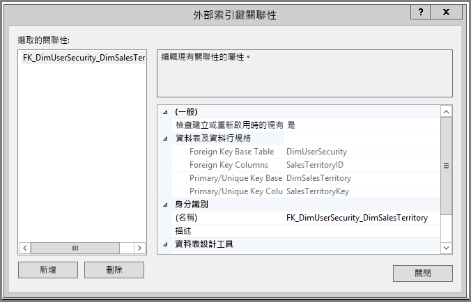
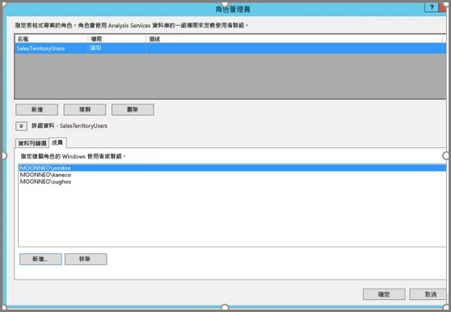
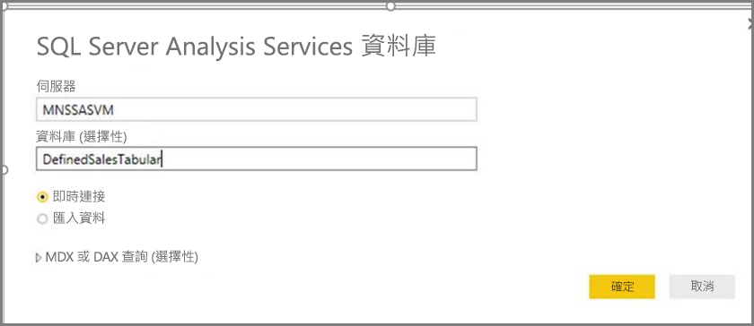
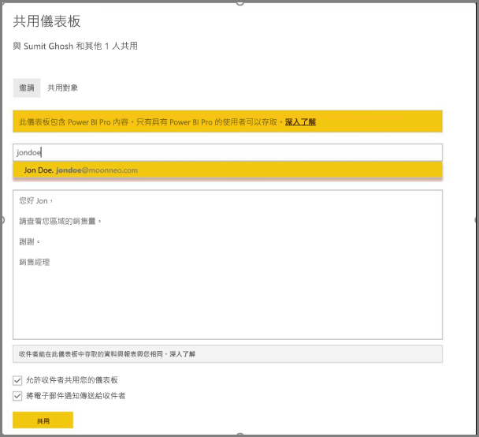
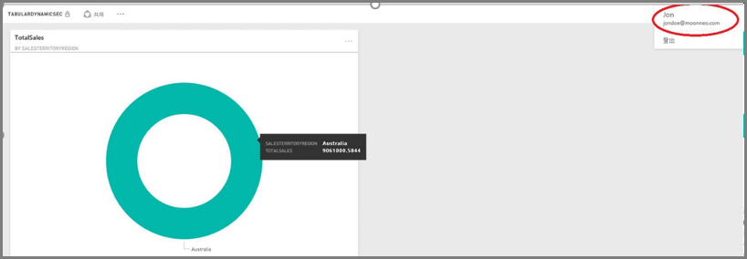

# <a name="dynamic-row-level-security-with-analysis-services-tabular-model"></a>動態資料列層級安全性與 Analysis Services 表格式模型
本教學課程示範實作 **Analysis Services 表格式模型**內**資料列層級安全性**的所需步驟，並示範如何將其用於 Power BI 報表中。 本教學課程的步驟設計為讓您依照指示進行，並藉由完成樣本資料集學習所需的步驟。

本教學課程會詳細敘述下列步驟，協助您了解如何使用 Analysis Services 表格式模型實作動態資料列層級安全性︰

* 在 **AdventureworksDW2012** 資料庫中建立新的安全性資料表
* 使用所需的事實和維度資料表建立表格式模型
* 定義使用者的角色和權限
* 將模型部署到 **Analysis Services 表格式**執行個體
* 使用 Power BI Desktop 建立報表，以顯示使用者存取報表所對應的資料
* 將報表部署至 **Power BI 服務**
* 根據報表建立新的儀表板，最後，
* 與同事共用儀表板

若要遵循本教學課程中的步驟，您需要 **AdventureworksDW2012** 資料庫，您可以從**[存放庫](https://github.com/Microsoft/sql-server-samples/releases/tag/adventureworks)** 下載。

## <a name="task-1-create-the-user-security-table-and-define-data-relationship"></a>工作 1︰建立使用者安全性資料表，並定義資料關聯性
有許多已發行的文章說明如何定義資料列層級動態的安全性與 **SQL Server Analysis Services (SSAS) 表格式** 模型。 我們的範例遵循 [Implement Dynamic Security by Using Row Filters](https://msdn.microsoft.com/library/hh479759.aspx) (使用資料列篩選來實作動態安全性) 一文。 下列步驟將引導您完成在本教學課程中的第一項工作：

1. 我們的範例使用 **AdventureworksDW2012** 關聯式資料庫。 在該資料庫中，建立 **DimUserSecurity** 資料表，如下圖所示。 此範例中，我們使用 SQL Server Management Studio (SSMS) 來建立資料表。
   
   
2. 建立資料表並儲存之後，我們必須建立 **DimUserSecurity** 資料表的 **SalesTerritoryID** 資料行與 **DimSalesTerritory** 資料表的 **SalesTerritoryKey** 資料行之間的關聯性，如下圖所示。 這可以從 **SSMS** 完成，方法是在 **DimUserSecurity** 資料表上按一下滑鼠右鍵，然後選取 [設計]。 然後從功能表選取 [資料表設計工具] -> [關聯性...]。
   
   
3. 儲存資料表，然後藉由再次以滑鼠右鍵按一下 **DimUserSecurity** 資料表，然後選取 [Edit Top 200 Rows] \(編輯前 200 個資料列\)，將幾個使用者資訊資料列新增到資料表中。 新增這些使用者之後，**DimUserSecurity** 資料表的資料列就會如同下圖所示︰
   
   
   
   我們會在稍後的工作中將焦點轉回這些使用者身上。
4. 接下來我們使用 **DimSalesTerritory** 資料表來完成*內部聯結*，該資料表顯示與使用者相關聯的區域詳細資料。 下列程式碼會執行 *內部聯結*，而隨後出現的圖片將展示在*內部聯結*成功完成之後，資料表出現的情形。
   
       select b.SalesTerritoryCountry, b.SalesTerritoryRegion, a.EmployeeID, a.FirstName, a.LastName, a.UserName from [dbo].[DimUserSecurity] as a join  [dbo].[DimSalesTerritory] as b on a.[SalesTerritoryKey] = b.[SalesTerritoryID]
   
   
5. 請注意上圖顯示哪些使用者負責哪些銷售區域等資訊。 我們在**步驟 2** 建立了關聯性，因此會顯示該資料。 另請注意，使用者 **Jon Doe 隸屬於澳洲銷售區域**。 我們會在接下來的步驟和工作中，將焦點重新轉回 Jon Doe 身上。

## <a name="task-2-create-the-tabular-model-with-facts-and-dimension-tables"></a>工作 2︰使用事實和維度資料表建立表格式模型
1. 在您的關聯式資料倉儲就緒之後，就可定義您的表格式模型。 該模型可以使用 **SQL Server Data Tools (SSDT)** 來建立。 若要取得如何定義表格式模型的詳細資訊，請參閱 [Create a New Tabular Model Project](https://msdn.microsoft.com/library/hh231689.aspx) (建立新的表格式模型專案)。
2. 將所有必要的資料表匯入模型中，如下所示。
   
    
3. 在您匯入所需的資料表之後，您必須使用**讀取**權限定義名為 **SalesTerritoryUsers** 的角色。 這可藉由按一下 [SQL Server 資料工具] 中的 [模型] 功能表，然後按一下 [角色]。 在 [角色管理員] 對話方塊中，按一下 [新增]。
4. 在 [角色管理員] 的 [成員] 索引標籤下，新增 **工作 1 - 步驟 3** 中 **DimUserSecurity** 資料表所定義的使用者。
   
    
5. 接下來，為 **DimSalesTerritory** 和 **DimUserSecurity** 資料表加入適當的函數，如 [資料列篩選] 索引標籤下所示。
   
    
6. 在此步驟中，我們使用 **LOOKUPVALUE** 函數傳回資料行的值，其中 Windows 使用者名稱與 **USERNAME** 函數所傳回的使用者名稱相同。 之後就可以限制查詢，其中 **LOOKUPVALUE** 傳回的值符合相同或相關資料表中的值。 在 [DAX 篩選]資料行中，輸入下列公式︰
   
       =DimSalesTerritory[SalesTerritoryKey]=LOOKUPVALUE(DimUserSecurity[SalesTerritoryID], DimUserSecurity[UserName], USERNAME(), DimUserSecurity[SalesTerritoryID], DimSalesTerritory[SalesTerritoryKey])
    在此公式中，**LOOKUPVALUE** 函數會傳回 **DimUserSecurity [SalesTerritoryID]** 資料行的所有值，其中 **DimUserSecurity [UserName]** 等同於目前登入的 Windows 使用者名稱，而 **DimUserSecurity [SalesTerritoryID]** 等同 **DimSalesTerritory [SalesTerritoryKey]**。
   
   SalesTerritoryKey 接著會使用透過 **LOOKUPVALUE** 所傳回的銷售集，限制在 **DimSalesTerritory** 中顯示的資料列。 只有當資料列的 **SalesTerritoryKey** 位於由 **LOOKUPVALUE** 函數所傳回的識別碼集內，該資料列才會顯示。
8. 對於 **DimUserSecurity** 表格，請於 **DAX 篩選**資料行中，輸入下列公式：
   
       =FALSE()

    此公式會指定將所有資料行解析為 false 布林條件。因此，沒有辦法查詢 **DimUserSecurity** 資料表中的資料行。
1. 現在我們需要處理並部署該模型。 您可以參考[部署文章](https://msdn.microsoft.com/library/hh231693.aspx)以取得有關部署模型方面的協助。

## <a name="task-3-adding-data-sources-within-your-on-premises-data-gateway"></a>工作 3︰在您的內部部署資料閘道中新增資料來源
1. 部署表格式模型以供使用之後，您需要在 Power BI 入口網站中將資料來源連線新增到內部部署 Analysis Services 表格式伺服器中。
2. 若要允許 **Power BI 服務**存取您內部部署的分析服務，必須在環境中安裝及設定**[內部部署資料閘道](service-gateway-onprem.md)**。
3. 當正確設定閘道之後，必須為 **Analysis Services** 表格式執行個體建立資料來源連接。 本文將說明如何[在 Power BI 入口網站中新增資料來源](service-gateway-enterprise-manage-ssas.md)。
   
   
4. 完成上一個步驟之後，即完成了閘道設定，可與內部部署的 **Analysis Services** 資料來源互動。

## <a name="task-4-creating-report-based-on-analysis-services-tabular-model-using-power-bi-desktop"></a>工作 4︰使用 Power BI desktop 建立以 Analysis Services 表格式模型為基礎的報表
1. 啟動 [Power BI Desktop]，然後選取 [取得資料] > [資料庫]。
2. 從資料來源的清單中，選取 **SQL Server Analysis Services 資料庫**，然後選取 [連線]。
   
   
3. 填寫您的 **Analysis Services** 表格式執行個體詳細資料，然後選取 [即時連線]。 選取 [確定] 。 使用 **Power BI**，動態安全性僅適用於**即時連線**。
   
   
4. 您會看到部署的模型在 **Analysis Services** 執行個體中。 選取個別的模型，然後選取 [確定]。
   
   
5. **Power BI Desktop** 現在會在 [欄位] 窗格中畫布右方顯示所有可用的欄位。
6. 在右方 [欄位] 窗格上，選取 [FactInternetSales] 資料表的 [SalesAmount] 量值和 [SalesTerritory] 資料表的 [SalesTerritoryRegion] 維度。
7. 我們會將這份報表保持簡潔，所以現在我們不會新增任何其他的欄位。 為了讓資料以更能表達意義的方式呈現，我們會將視覺效果變更為**環圈圖**。
   
   
8. 在報表準備就緒之後，您可以直接將其發行至 Power BI 入口網站。 在 **Power BI Desktop** 的 [主資料夾] 功能區上，選取 [發行]。

## <a name="task-5-creating-and-sharing-a-dashboard"></a>工作 5︰建立及共用儀表板
1. 您已經建立報表並在 **Power BI Desktop** 中按下了 [發行]，因此報表將會發行至 **Power BI** 服務。 既然現在其已存在服務之中，我們就可以使用在先前步驟中建立的範例來示範我們模型的安全性案例。
   
   在他的角色中，**銷售經理 - Sumit** 可以在所有不同的銷售區域查看資料。 因此他建立了此報告 (在上一個工作步驟中建立的報表)，並將其發行至 Power BI 服務。
   
   發行報表之後，他根據該報表在 Power BI 服務中建立了名為 **TabularDynamicSec** 的儀表板。 在下圖中，請注意銷售經理 (Sumit) 可以看到對應至所有銷售區域的資料。
   
   
2. 現在 Sumit 和他的同事 Jon Doe (負責澳洲地區的銷售) 共用儀表板。
   
   
   
   
3. 當 Jon Doe 登入 **Power BI** 服務並檢視 Sumit 建立的共用儀表板時，Jon Doe 應該**只**會看到他職責區域的銷售狀況。 因此在 Jon Doe 登入並存取 Sumit 和他共用的儀表板時，Jon Doe **只**能看見澳洲地區的銷售狀況。
   
   
4. 恭喜您！ 在內部部署 **Analysis Services** 表格式模型中定義的動態資料列層級安全性已成功地反映，並可在 **Power BI** 服務中觀察到。 Power BI 使用 **effectiveusername** 屬性，將目前的 Power BI 使用者認證傳送到內部部署資料來源以執行查詢。

## <a name="task-6-understanding-what-happens-behind-the-scenes"></a>工作 6︰了解幕後發生的情況
1. 此工作假設您熟悉 SQL Profiler，因為您需要擷取內部部署 SSAS 表格式執行個體上的 SQL Server Profiler 追蹤。
2. 使用者 (在本例中為 Jon Doe) 在 Power BI 服務中存取儀表板時，就會立刻將工作階段初始化。 您可以看到 **salesterritoryusers** 角色立即生效，並使用有效的使用者名稱 **<EffectiveUserName>jondoe@moonneo.com</EffectiveUserName>**
   
       <PropertyList><Catalog>DefinedSalesTabular</Catalog><Timeout>600</Timeout><Content>SchemaData</Content><Format>Tabular</Format><AxisFormat>TupleFormat</AxisFormat><BeginRange>-1</BeginRange><EndRange>-1</EndRange><ShowHiddenCubes>false</ShowHiddenCubes><VisualMode>0</VisualMode><DbpropMsmdFlattened2>true</DbpropMsmdFlattened2><SspropInitAppName>PowerBI</SspropInitAppName><SecuredCellValue>0</SecuredCellValue><ImpactAnalysis>false</ImpactAnalysis><SQLQueryMode>Calculated</SQLQueryMode><ClientProcessID>6408</ClientProcessID><Cube>Model</Cube><ReturnCellProperties>true</ReturnCellProperties><CommitTimeout>0</CommitTimeout><ForceCommitTimeout>0</ForceCommitTimeout><ExecutionMode>Execute</ExecutionMode><RealTimeOlap>false</RealTimeOlap><MdxMissingMemberMode>Default</MdxMissingMemberMode><DisablePrefetchFacts>false</DisablePrefetchFacts><UpdateIsolationLevel>2</UpdateIsolationLevel><DbpropMsmdOptimizeResponse>0</DbpropMsmdOptimizeResponse><ResponseEncoding>Default</ResponseEncoding><DirectQueryMode>Default</DirectQueryMode><DbpropMsmdActivityID>4ea2a372-dd2f-4edd-a8ca-1b909b4165b5</DbpropMsmdActivityID><DbpropMsmdRequestID>2313cf77-b881-015d-e6da-eda9846d42db</DbpropMsmdRequestID><LocaleIdentifier>1033</LocaleIdentifier><EffectiveUserName>jondoe@moonneo.com</EffectiveUserName></PropertyList>
3. 根據有效的使用者名稱要求，Analysis Services 會在查詢本機 Active Directory 後將要求轉換為實際 moonneo\jondoe 認證。 在 **Analysis Services** 從 Active Directory 中取得實際的認證後，根據使用者對資料擁有的存取和權限，**Analysis Services** 只會傳回他 (或她) 有權限的資料。
4. 如果儀表板發生更多的活動，例如若是 Jon Doe 從儀表板前往基礎報表，您可以使用 SQL Profiler 看到特定查詢會作為 DAX 查詢回到 Analysis Services 表格式模型。
   
   
5. 您也可以在下方看到正在執行以開始填入報表資料的 DAX 查詢。
   
   ```
   EVALUATE
     ROW(
       "SumEmployeeKey", CALCULATE(SUM(Employee[EmployeeKey]))
     )
   
   <PropertyList xmlns="urn:schemas-microsoft-com:xml-analysis">``
             <Catalog>DefinedSalesTabular</Catalog>
             <Cube>Model</Cube>
             <SspropInitAppName>PowerBI</SspropInitAppName>
             <EffectiveUserName>jondoe@moonneo.com</EffectiveUserName>
             <LocaleIdentifier>1033</LocaleIdentifier>
             <ClientProcessID>6408</ClientProcessID>
             <Format>Tabular</Format>
             <Content>SchemaData</Content>
             <Timeout>600</Timeout>
             <DbpropMsmdRequestID>8510d758-f07b-a025-8fb3-a0540189ff79</DbpropMsmdRequestID>
             <DbPropMsmdActivityID>f2dbe8a3-ef51-4d70-a879-5f02a502b2c3</DbPropMsmdActivityID>
             <ReturnCellProperties>true</ReturnCellProperties>
             <DbpropMsmdFlattened2>true</DbpropMsmdFlattened2>
             <DbpropMsmdActivityID>f2dbe8a3-ef51-4d70-a879-5f02a502b2c3</DbpropMsmdActivityID>
           </PropertyList>
   ```

## <a name="considerations"></a>考量
當使用資料列層級安全性、SSAS 和 Power BI 時，請牢記幾個考量：

1. 搭配 Power BI 的內部部署資料列層級安全性僅適用於即時連線。
2. 使用**即時連線**存取報表的使用者，可立即從 Power BI 服務使用處理模型後所的任何資料變更。

