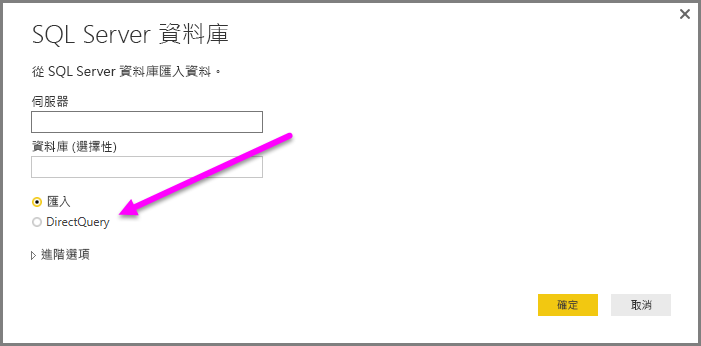
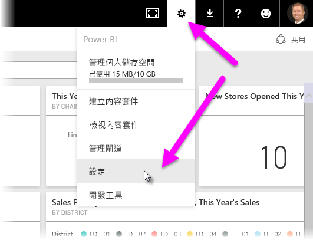
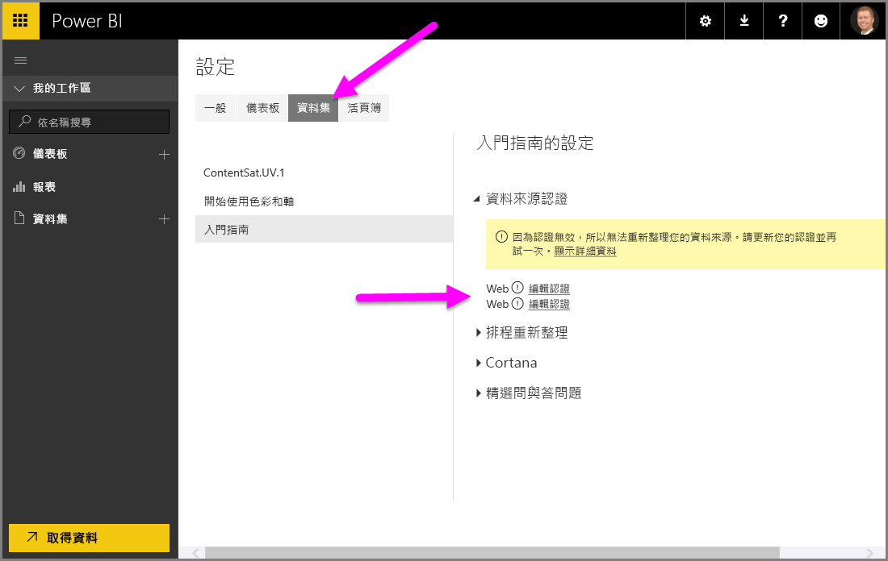

# 在 Power BI Desktop 中使用 DirectQuery
有了 **Power BI Desktop**，當您連接到資料來源時，隨時可將資料的複本匯入 **Power BI Desktop**。 對於某些資料來源，可用的替代方式是：使用 **DirectQuery**直接連接到資料來源。

## 支援的資料來源
如需支援 **DirectQuery** 之資料來源的完整清單，請參閱 [DirectQuery 支援的資料來源](desktop-directquery-data-sources.md)。

## 如何使用 DirectQuery 連接
當您使用 [取得資料] 連接到 **DirectQuery** 所支援的資料來源時，連接視窗可讓您選取想要的連接方式。  

選取 [匯入]  和 [DirectQuery]  的差異如下：

**匯入** – 將選取的資料表和資料行匯入 **Power BI Desktop** 中。 當您建立視覺效果或與其互動時，**Power BI Desktop** 會使用匯入的資料。 您必須重新整理資料，再次匯入完整的資料集，以查看自初始匯入或最近重新整理之後，基礎資料發生的任何變更。

**DirectQuery** – 沒有任何資料匯入或複製到 **Power BI Desktop**。 針對關聯式來源，選取的資料表和資料行會出現在 [欄位] 清單。 針對多維度來源，例如 SAP Business Warehouse，選取 Cube 的維度及量值會出現在 [欄位] 清單。 當您建立視覺效果或與其互動時，**Power BI Desktop** 會查詢基礎資料來源，這表示您一直都在檢視當下的資料。

使用 **DirectQuery**時，有許多資料模型和資料轉換可以使用，但仍有一些限制。 在建立視覺效果或與其互動時，必須查詢基礎來源，而且重新整理視覺效果所需的時間會視基礎資料來源的效能而定。 當服務要求所需的資料在最近已被要求時，Power BI Desktop 便會使用目前的資料，來減少顯示視覺效果所需的時間。 從 [主資料夾]  功能區選取 [重新整理]  可確保所有視覺效果都以目前的資料重新整理。

您可以從 [Power BI 和 DirectQuery](desktop-directquery-about.md) 文章中取得 **DirectQuery** 的詳細說明。 若您需要使用 **DirectQuery** 時之優點、限制和重要考量的詳細資訊，請參閱下列各節。

## 使用 DirectQuery 的優點
使用 **DirectQuery** 有一些好處：

* **DirectQuery** 可讓您透過非常大型的資料集建立視覺效果，原本在此狀況使用預先彙總先行匯入所有資料並不可行。
* 基礎資料變更可能需要重新整理資料，而針對某些報表，顯示目前的資料可能需要大量資料傳輸，造成重新匯入資料不太可行。 相較之下， **DirectQuery** 報表一律會使用目前的資料
* 1 GB 的資料集限制「不」適用於 **DirectQuery**

## DirectQuery 的限制
目前使用 **DirectQuery**會有一些限制：

* 所有資料表都必須來自單一資料庫
* 如果 [查詢編輯器] 查詢過於複雜，將會發生錯誤。 若要修正錯誤，您必須在 [查詢編輯器] 中刪除有問題的步驟，或「匯入」資料，而不要使用 **DirectQuery**。 多維度來源，例如 SAP Business Warehouse，不存在 [查詢編輯器]
* 關聯性篩選僅限於單一方向，而非雙向 (雖然您可以透過預覽功能啟用 **DirectQuery** 的雙向交叉篩選)。 多維度來源，例如 SAP Business Warehouse，不存在模型中定義的關聯性。
* **DirectQuery** 中不提供時間智慧功能。 例如，**DirectQuery** 模式不支援日期資料行 (年、季、月、日等) 的特殊處理。
* 根據預設，量值中允許的 DAX 運算式會有所限制，詳細資訊請參閱後續段落 (在此項目符號清單後)
* 使用 **DirectQuery** 傳回資料時，限制為 1 百萬個資料列。 這不會影響用來建立使用 **DirectQuery**傳回的資料集彙總或計算，只會影響傳回的資料列。 比方說，您可以使用在資料來源執行的查詢彙總 10 萬個資料列，並使用 **DirectQuery**準確地將該彙總的結果傳回 Power BI，只要傳回 Power BI 的資料小於 1 百萬個資料列即可。 如果從 **DirectQuery**傳回的資料列超過 1 百萬個，Power BI 便會傳回錯誤。

為確保傳送至基礎資料來源的查詢皆具有足夠的效能，系統根據預設會對量值有所限制。 進階使用者可以選擇略過此限制，方法是依序選取 [檔案] > [選項及設定] > [選項]、[DirectQuery]及 [允許在 DirectQuery 模式中量值不受限制] 選項。 選取該選項後，即可使用任何適用於量值的 DAX 運算式。 不過使用者也必須了解，在匯入資料時效能很好的某些運算式，在 DirectQuery 模式中可能會導致後端來源的查詢速度緩慢。

## 使用 DirectQuery 時的重要考量
使用 **DirectQuery** 時，應考慮下列三點：

* **效能和負載** - 所有 **DirectQuery** 要求都會傳送到來源資料庫，因此重新整理視覺效果所需的時間，取決於該後端來源回應一或多個查詢結果所花費的時間。 針對視覺效果使用 **DirectQuery** 的建議回應時間 (正在傳回要求的資料) 為 5 秒 (含) 以下，建議的結果回應時間上限為 30 秒。 超過此時間會讓取用報表的使用者體驗低落至無法接受的程度。 此外，將報表發行至 Power BI 服務之後，超過幾分鐘的任何查詢都會逾時，而且使用者會收到錯誤。
  
  您也必須考慮來源資料庫上的負載，這會視取用已發行報表的 Power BI 使用者數目而定。 使用「資料列層級安全性」(RLS) 也可能會造成顯著的影響；由多位使用者共用的非 RLS 儀表板磚會對資料庫產生單一查詢，但在儀表板磚使用 RLS 通常表示需要「每位使用者」查詢一次才能重新整理磚，因而大幅增加來源資料庫上的負載並可能影響效能。
  
  Power BI 會建立盡可能有效率的查詢。 不過在特定情況下，產生的查詢可能效率不足，而無法避免重新整理失敗。 這種情況的其中一個範例是，產生的查詢會從後端資料來源擷取非常大量的資料列 (超過 1 百萬個)，因而發生下列錯誤：
  
      The resultset of a query to external data source has exceeded
      the maximum allowed size of '1000000' rows.
  
  如果有一個簡單圖表包含基數很高的資料行，而且彙總選項設定為 [不摘要]，就可能會發生此情況。 此視覺效果必須只能包含其基數低於 1 百萬的資料行，否則就必須套用適當的篩選。
* **安全性** - 所有取用已發行報表的使用者，都會使用發行至 Power BI 服務之後輸入的認證來連接到後端資料來源。 此情況與匯入資料相同：不論後端來源中是否有定義任何安全性規則，所有使用者都會看到相同的資料。 想要使用 DirectQuery 來源為每個使用者實作安全性的客戶，應使用 RLS。 [深入了解 RLS](service-admin-rls.md)。
* **支援的功能** - **DirectQuery** 模式不支援 **Power BI Desktop** 的所有功能，或有一些限制。 此外，使用 **DirectQuery** 的資料集無法使用 Power BI 服務的某些功能 (例如 [深入資訊摘要])。 因此，決定是否要使用 **DirectQuery** 時，應該考慮使用 **DirectQuery** 時的這類功能限制。   

## 發行至 Power BI 服務
使用 **DirectQuery** 建立的報表可以發行至 Power BI 服務。

如果使用的資料來源不需要**內部部署資料閘道** (**Azure SQL Database**、**Azure SQL 資料倉儲**或 **Redshift**)，就必須提供認證，才能讓已發佈的報表顯示在 Power BI 服務中。

您可以提供認證，方法是選取 Power BI 中的 **設定** 齒輪圖示，然後選取 [設定] 。

Power BI 會顯示 [設定] 視窗。 從該處選取 [資料集] 索引標籤，選擇使用 **DirectQuery** 的資料集，然後選取 [編輯認證]。

除非提供認證，否則開啟已發行的報表，或探索使用連接至這類資料來源的 **DirectQuery** 建立的資料集會產生錯誤。

若是 **Azure SQL Database**、**Azure SQL 資料倉儲**及 **Redshift** 以外之使用 DirectQuery 的其他資料來源，必須安裝**內部部署資料閘道**，而且必須註冊資料來源以建立資料連線。 您可以[深入了解內部部署資料閘道](http://go.microsoft.com/fwlink/p/?LinkID=627094)。

## 後續步驟
如需 **DirectQuery** 的詳細資訊，請參閱下列資源：

* [Power BI 中的 DirectQuery](desktop-directquery-about.md)
* [DirectQuery 支援的資料來源](desktop-directquery-data-sources.md)
* [DirectQuery 和 SAP BW](desktop-directquery-sap-bw.md)
* [DirectQuery 和 SAP HANA](desktop-directquery-sap-hana.md)
* [內部部署資料閘道](service-gateway-onprem.md)

