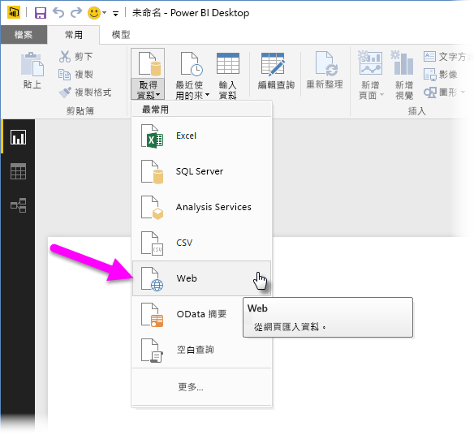
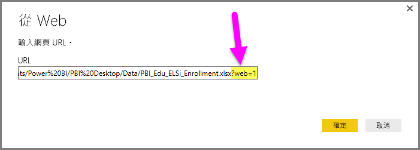
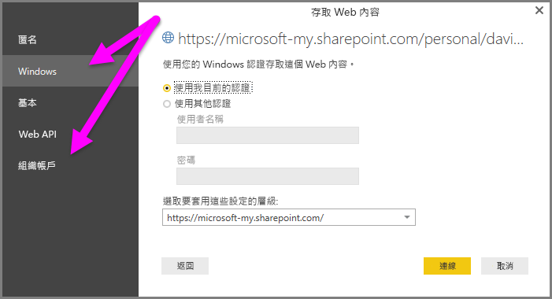

# 在 Power BI Desktop 中使用商務用 OneDrive
許多人都將 Excel 活頁簿儲存在可與 Power BI Desktop 完美搭配的商務用 OneDrive 磁碟機上。 有了 **Power BI Desktop**，您可以使用儲存在**商務用 OneDrive** 中的 **Excel** 檔案線上連結來建立報表和視覺效果。 您可以使用**商務用 OneDrive** 群組帳戶或您的個人**商務用 OneDrive** 帳戶。

從**商務用 OneDrive** 取得線上連結需要幾個特定步驟。 下列各節說明這些步驟，可讓您在不同電腦中，與同事共用群組中的檔案連結。

## 在瀏覽器中開始從 Excel 取得連結
1. 使用瀏覽器瀏覽至您商務用 OneDrive 位置。 以滑鼠右鍵按一下要使用的檔案，並選取 [在 Excel 中開啟]。
   
   > [!NOTE]
> 您的瀏覽器介面看起來可能不完全與下圖相同。 您可以透過許多方法針對在**商務用 OneDrive** 瀏覽器介面中的檔案選取 [在 Excel 中開啟]。 您可以使用可讓您在 Excel 中開啟檔案的任何選項。
   > 
   > 
   
   
2. 在 **Excel** 中，選取 [檔案] > [資訊]，並選取 [保護活頁簿] 按鈕上方的連結。 選取 [複製連結到剪貼簿] (您的版本可能會顯示 [複製路徑到剪貼簿])。
   
   

## 在 Power BI Desktop 中使用連結
在 Power BI Desktop 中，您可以使用您剛才複製到剪貼簿的連結。 請採取下列步驟：

1. 在 Power BI Desktop 中，選取 [取得資料] > [Web]。
   
   
2. 將連結貼入 [從 Web] 對話方塊 (請**勿**選取 [確定])。
   
    
3. 請注意連結結尾的 *?web=1* 字串，在選取 [確定] **之前** ，您必須 *移除 Web URL 字串的這部分* ，才能讓 **Power BI Desktop** 正確地瀏覽至您的檔案。
4. 如果 **Power BI Desktop** 提示您輸入認證，請選擇 \[Windows] \(適用於內部部署 SharePoint 網站) 或 \[組織帳戶] \(適用於 Office 365 或商務用 OneDrive 網站)。
   
   

[導覽器] 視窗隨即出現，可讓您從在 Excel 活頁簿中找到的資料表、工作表和範圍清單進行選取。 您可以從該處使用商務用 OneDrive 檔案，就像使用其他 Excel 檔案一樣，並建立報表且就像任何其他資料來源一樣在資料集中使用該報表。

> [!NOTE]
> 若要使用**商務用 OneDrive** 檔案作為 Power BI 服務中的資料來源，並針對該檔案啟用**服務重新整理**，請確定您在進行重新整理的設定時，會選取 [OAuth2] 作為**驗證方法**。 否則您可能會在嘗試連線或重新整理時遇到錯誤 (例如「無法更新資料來源認證」)。 選取 **OAuth2** 作為驗證方法，就能解決該項認證錯誤。
> 
> 

