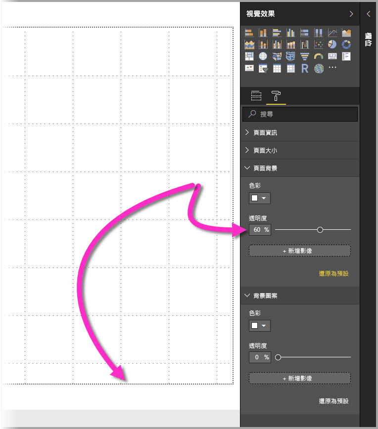

# 使用視覺效果元素來增強 Power BI 報表

您可以藉由 **Power BI Desktop**，使用視覺效果元素 (例如，背景圖案及改善的視覺效果標頭來取得視覺效果) 以增強報表外觀。

從 **Power BI Desktop** 的 2018 年 7 月版本開始，您便可以在報表中放入增強功能，並讓分析和報表比之前更吸引人。 本文所討論的增強功能包括下列各項： 

* 將**背景圖案**套用到報表，如此即可增強或強調顯示您想要使用資料述說的故事元素。
* 使用改善的**視覺效果標頭**來取得個別的視覺效果，以便在報表畫布上建立完美對齊的視覺效果。 

下列各節將說明如何使用這些增強功能，以及如何將之套用至您的報表。

## 在 Power BI 報表中使用背景圖案

您可以使用**背景圖案**，將報表頁面之外的灰色區域格式化。 下圖中有一個箭頭清楚指出背景圖案區域套用的位置。 

您可以為每個報表頁面來設定背景圖案，或是讓報表中的每個頁面都具有相同的背景圖案。 若要設定背景圖案，請在報表中未選取任何視覺效果時，點選或按一下 [格式化]  圖示，[背景圖案]  卡片隨即會出現在窗格中。

![[格式化] 窗格中的背景圖案區域](media/desktop-visual-elements-for-reports/visual-elements-for-reports_03.png)

您可以選取 [色彩]  下拉式清單來選擇要套用為**背景圖案**的色彩，或選取 [新增影像]  按鈕來選取要套用為背景圖案的影像。 不論背景圖案是否為色彩或影像，都可以使用**透明度**滑桿來套用透明度。

建議您記住下列屬於**背景圖案**的定義：

* 報表區域外部的灰色區域為**背景圖案**區域
* 您可以在畫布中放置視覺效果的區域是指報表**頁面**，並且可在 [格式]  窗格中使用 [頁面背景]  下拉式清單來修改。

報表**頁面**一律位於前景 (相較於背景圖案)，而**背景圖案**會在它後面，並且是報表頁面上最後面的元素。 當您將透明度套用至頁面時，該透明度也會套用至報表中的視覺效果，讓背景圖案可以透過您的視覺效果顯示於背景中。

以下為適用於所有新報表的預設設定：

* 報表**頁面**會設定為 [白色]  且其透明度會設定為 [100%] 
* **背景圖案**會設定為**白色**且其透明度會設定為 **0%**

若您將頁面背景設定為大於 50% 的透明度，在建立或編輯報表時，便會出現虛線的框線來顯示報表畫布框線的界限。 

請務必注意，虛線的界限「僅」  在編輯報表時出現，「不會」  讓檢視已發佈報表的人員看見，例如在 **Power BI 服務**中檢視該報表時。

> [!NOTE]
> 如果您使用深色背景作為背景圖案，並將文字色彩設定為白色或很淺的色彩，請注意 [匯出至 PDF]  功能不會包含背景圖案，因此在匯出的 PDF 檔案中幾乎看不見使用白色字型的任何匯出。 如需 [匯出至 PDF]  的詳細資訊，請參閱[匯出至 PDF](desktop-export-to-pdf.md)。

## 在 Power BI 報表中使用改善的視覺效果標頭

從 **Power BI Desktop** 的 2018 年 7 月版本開始，已大幅改善報表中標頭的視覺效果。 主要的增強功能是將標頭與視覺效果分離，以便根據您對於版面配置與位置的偏好來調整其位置，且標頭現在會出現在視覺效果本身內，而非在其上方浮動。 

根據預設，標頭會出現在視覺效果內，而且與標題對齊。 在下圖中，您可以在視覺效果內看見標頭 (釘選圖示、展開圖示及省略符號圖示) 且向右對齊，而且位於與視覺效果標題相同的水平位置上。

如果您的視覺效果沒有標題，則標頭會浮動於視覺效果頂端並向右對齊，如下圖所示。 

如果您的視覺效果定位於報表頂端，則視覺效果標頭會改為貼齊視覺效果底部。 

每個視覺效果在 [視覺效果]  窗格的 [格式化]  區段中都會有一張名為**視覺效果標頭**的卡片。 在該卡片中，您可以調整視覺效果標頭的各種特性。

![每個視覺效果在 [格式化] 窗格中都有一張視覺效果標頭卡](media/desktop-visual-elements-for-reports/visual-elements-for-reports_09.png)

> [!NOTE]
> 當您撰寫或編輯報表時，切換可見度並不會影響報表。 您必須發佈報表並以讀取模式檢視，才能看見該效果。 此行為可確保讓您在編輯時重視視覺效果標頭所提供的許多選項，尤其是在編輯時警示您發生問題的警告圖示。

針對只出現在 **Power BI 服務**中的報表，您可以前往 [我的工作區] > [報表]  ，然後選取 [設定]  圖示，以調整視覺效果標頭的使用方式。 如下圖所示，在該處可以看到您已選取 [設定]  的報表設定，而且可以在該處調整設定。

### 針對現有報表啟用改善的視覺效果標頭

新的視覺效果標頭是所有新報表的預設行為。 對於現有的報表，您必須前往 [檔案] > [選項及設定] > [選項]  ，然後在 [報表設定]  區段中，啟用 [使用具有已更新樣式選項的新式視覺效果標頭]  核取方塊，才能在 **Power BI Desktop** 中啟用此行為。

![現有的報表必須勾選 [選項] 核取方塊，才能使用已改善的視覺效果標頭](media/desktop-visual-elements-for-reports/visual-elements-for-reports_06.png)

## 後續步驟
如需 **Power BI Desktop** 的詳細資訊，以及如何開始使用，請參閱下列文章。

* [Power BI Desktop 是什麼？](desktop-what-is-desktop.md)
* [Power BI Desktop 的查詢概觀](desktop-query-overview.md)
* [Power BI Desktop 中的資料來源](desktop-data-sources.md)
* [連接至 Power BI Desktop 中的資料](desktop-connect-to-data.md)
* [使用 Power BI Desktop 合併資料並使其成形](desktop-shape-and-combine-data.md)
* [Power BI Desktop 中的常見查詢工作](desktop-common-query-tasks.md)   

