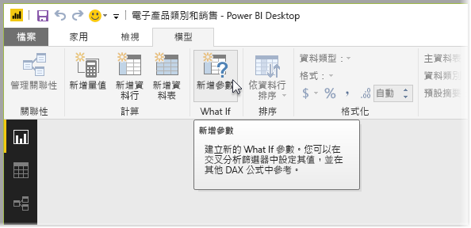
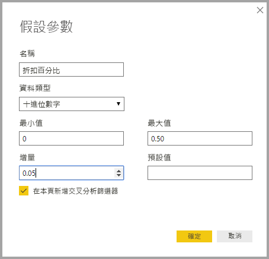
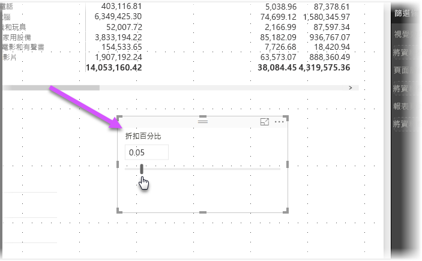
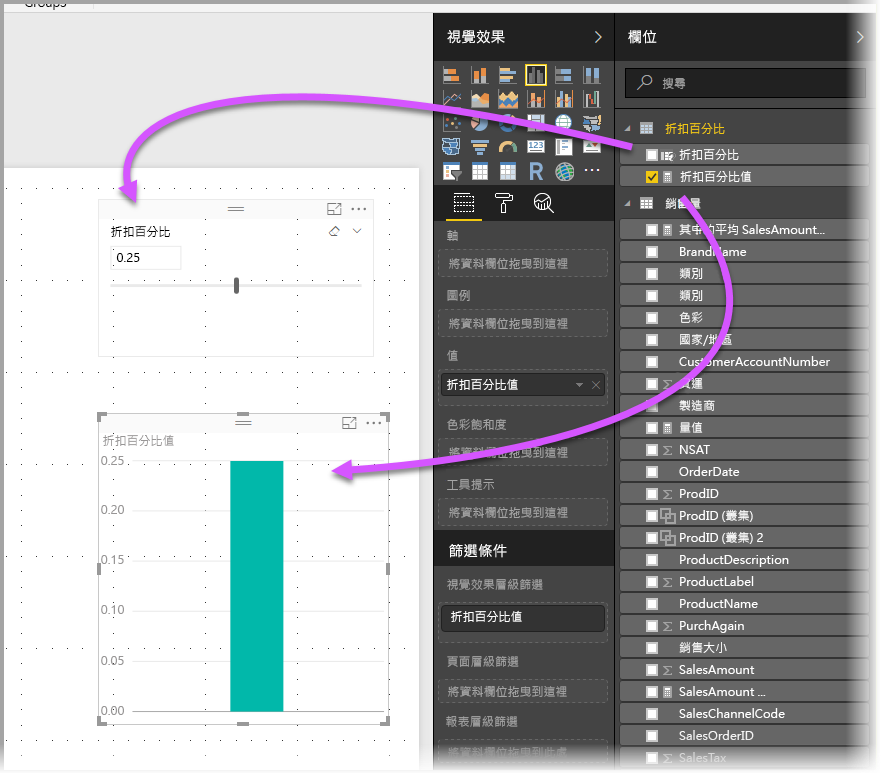
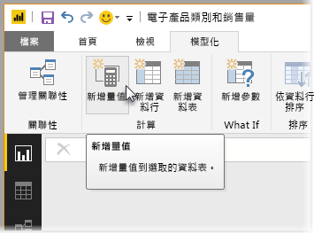
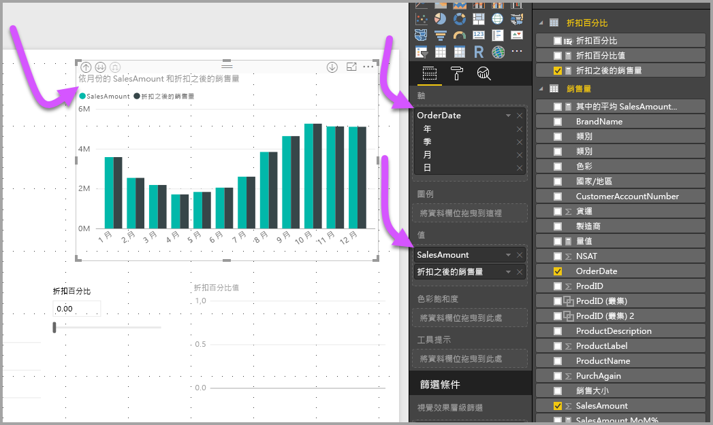

# 在 Power BI Desktop 中建立及使用模擬參數來視覺化變數
從 2017 年 8 月發行的 **Power BI Desktop** 開始，您可以為報表建立**模擬**變數，將變數當作交叉分析篩選器與其互動，進而視覺化及量化報表中的不同索引鍵值。

您可以在 **Power BI Desktop** 的 [模型] 索引標籤上找到**模擬**參數。 當您這樣做時，會出現對話方塊，您可以在其中設定參數。

## 建立模擬參數
若要建立**模擬**參數，請從 **Power BI Desktop** 的 [模型] 索引標籤選取 [模擬] 按鈕。 在下圖中，我們建立了稱為「折扣百分比」的參數，並將其資料類型設定為 [小數]。 [最小值] 為零，[最大值] 為 0.50 (50%)。 我們也將 [增量] 設定為 0.05 (5%)。 這是與報表互動時會調整的參數量。

> [!NOTE]
> 針對小數，請務必在前面加上零，例如該方塊中的 0.50 (而不是 .50)。 否則不會驗證數字，而且無法選取 [確定] 按鈕。
> 
> 

為了方便起見，[在本頁新增交叉分析篩選器] 核取方塊會將含有**模擬**參數的交叉分析篩選器自動放到目前的報表頁面上。

建立**模擬**參數除了建立參數本身之外，也會建立一個量值，可供您用來視覺化**模擬**參數的目前值。

請注意，一旦您建立**模擬**參數，參數和量值會成為模型的一部分。 因此，這些參數和量值可在報表中使用，也可以在其他報表頁面上使用。 因為這些參數和量值是模型的一部分，所以您可以從報表頁面刪除交叉分析篩選器；若要將它放回，只要從 [欄位] 清單擷取**模擬**參數並將它拖曳到畫布上 (然後將視覺效果變更為交叉分析篩選器)，即可輕鬆將**模擬**參數放回您的報表中。

## 使用模擬參數
讓我們建立使用**模擬**參數的簡單範例。 我們在上一節中已建立**模擬**參數，現在我們將建立新量值來使用此參數，該量值的值是利用滑桿來調整。 為了達成此目的，我們將建立一個新量值。

此新量值將會是套用折扣率的總銷售金額。 當然，您可以建立複雜且相關的量值，讓您報表的取用者視覺化**模擬**參數的變數。 例如，您可以建立報表，讓銷售人員查看達到特定銷售目標或百分比時的報酬，或查看銷售量增加對更優惠折扣的影響。

在公式列中鍵入量值公式，並將其命名為 **Sales after Discount** 之後，其結果會如下所示：

接著使用軸上的 *OrderDate* 建立自訂視覺效果，其值為 *SalesAmount* 和剛建立的量值 *Sales after Discount*。

然後，當我們移動滑桿時，我們會看到 [Sales after Discount] 欄反映折扣後的銷售金額。

就是這麼簡單。 您可以在各式各樣的情況下使用**模擬**參數，讓報表的取用者可以與您在報表中建立的不同案例互動。

