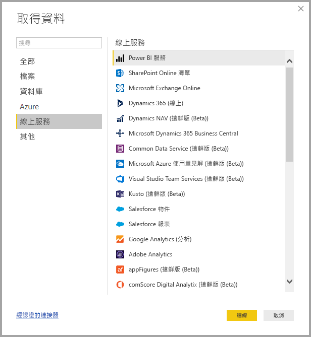
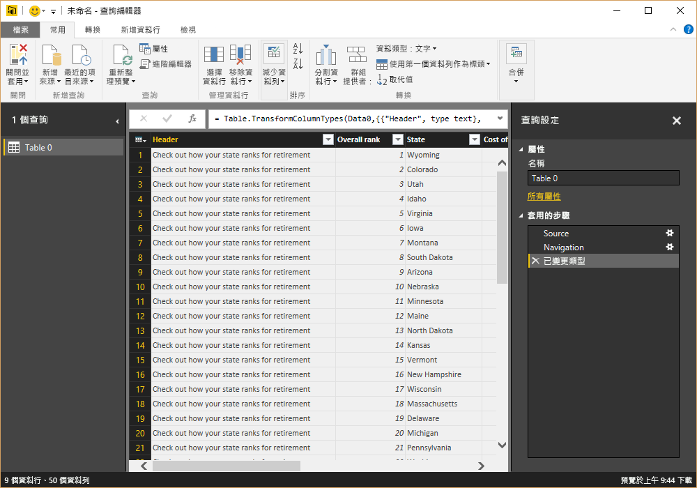
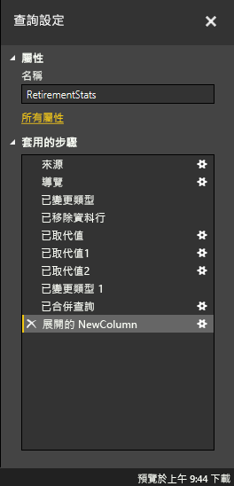
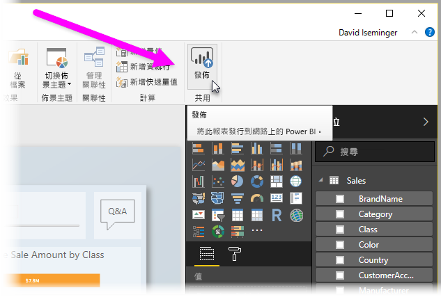

# Power BI Desktop 是什麼？

**Power BI Desktop** 是可以安裝在本機電腦上的免費應用程式。此應用程式可讓您連線與轉換資料，以及將資料視覺化。 您可以使用 **Power BI Desktop** 連線到多個不同的資料來源，並將它們結合成 (通常稱為模型化) 資料模型，以建置視覺效果，以及能以報表方式與組織內其他人員共用的視覺效果集合。 大部分商業智慧專案的使用者都使用 **Power BI Desktop** 來建立報表，然後使用 **Power BI 服務**來與其他人員共用其報表。

以下是最常見的 **Power BI Desktop** 使用方式：

* 連接到資料
* 轉換並清理資料，以建立資料模型
* 建立圖表或圖形之類的視覺效果，以便為資料提供視覺呈現
* 在一或多個報表頁面上，建立視覺效果集合的報表
* 使用 **Power BI 服務**來與其他人共用報表

從事這類工作的人員通常稱為「資料分析師」(有時直接稱為「分析師」) 或商業智慧專業人員 (通常稱為「報表建立者」)。 不過，許多自認並非是分析師或報表建立者的人員也會使用 **Power BI Desktop** 來建立具傑出的報表，或從各種來源提取資料並建置可以和同事及組織分享的資料模型。

**Power BI Desktop** 可讓您使用多個來源的資料，在單一報表中建立複雜且視覺效果豐富的報表，以便和組織中其他人共用。 

## 連接到資料
若要開始使用 **Power BI Desktop**，第一步是連線到資料。 您可以從 **Power BI Desktop** 連線到許多不同的資料來源。 若要連線到資料，只要選取 [常用] 功能區，然後選取 [取得資料] > [其他]。 以下影像顯示出現的 [取得資料] 視窗，其中顯示 Power BI Desktop 可以連線的許多類別。

當您選取資料類型時，會出現提示以要求 URL 和認證等資訊，讓 Power BI Desktop 能代表您連線到資料來源。

連線到一或多個資料來源之後，可以將資料轉換為所要的形式。

## 轉換及清理資料，建立模型

在 Power BI Desktop 中，您可以使用內建的**查詢編輯器**來清理及轉換資料。 您可以使用查詢編輯器變更資料，例如變更資料類型、移除資料行或結合來自多個來源的資料。 這有點像在進行雕塑。您從一大塊黏土 (或資料) 開始著手，然後視需要刮除或加入某些部分，直到資料變成是您想要的模樣。 

在轉換資料的過程中，您採取的每個步驟 (例如重新命名資料表、轉換資料類型或刪除資料行) 都會由**查詢編輯器**記錄，而且每次此查詢連線到資料來源時，都會執行這些步驟，因此資料一律會以您所指定的方式成形。

以下影像顯示查詢的 [查詢設定] 窗格，此查詢已成形並成為模型。

 

一旦資料符合所需，就可以建立視覺效果。 

## 建立視覺效果 

擁有資料模型之後，就可以將「欄位」拖曳到報表畫布來建立「視覺效果」。 「視覺效果」是模型中資料的圖形表示法。 以下視覺效果示範一個簡單的資料行圖表。 

Power BI Desktop 中有許多不同類型的視覺效果可供選擇。 若要建立或變更視覺效果，請從 [視覺效果] 窗格中選取視覺效果圖示。 如果報表畫布上有已選取的視覺效果，則選取的視覺效果會變更成您選取的類型。 如果未選取視覺效果，則會根據您的選擇來建立新的視覺效果。

![Power BI Desktop 中的 [視覺效果] 窗格](media/desktop-what-is-desktop/what-is-desktop_05.png)

## 建立報表

針對在 Power BI Desktop 中用來建立模型的資料，通常您會想要建立視覺效果集合，以顯示資料的各種層面。 在單一 Power BI Desktop 檔案中的視覺效果集合稱為「報表」。 報表可以有一或多個頁面，就像 Excel 檔案可以有一或多個工作表。 以下影像會顯示 Power BI Desktop 報表名為 [概觀] 的第一頁 (索引標籤位於影像的底部)。 在此報表中，共有十頁。

## 共用報表

一旦報表可以和其他人共用，就可以將報表**發行**到 **Power BI 服務**，以供組織中擁有 Power BI 授權的所有人使用。 若要發行 Power BI Desktop 報表，請從 Power BI Desktop 的 [常用] 功能區選取 [發行] 按鈕。

選取 [發行] 之後，Power BI Desktop 就會使用您的 Power BI 帳戶將您連線到 **Power BI 服務**，然後提示您選取要在 Power BI 服務中共用報表的位置，例如您的工作區、小組工作區，或是 Power BI 服務中的其他位置。 您必須擁有 Power BI 授權，才能將報表共用至 Power BI 服務。

## 後續步驟

若要開始使用 **Power BI Desktop**，第一件事就是下載並安裝該應用程式。 有兩種方式可以取得 **Power BI Desktop**：

* [從 Web 下載 Power BI Desktop](desktop-get-the-desktop.md)
* [從 Windows 市集取得 Power BI Desktop](http://aka.ms/pbidesktopstore)
