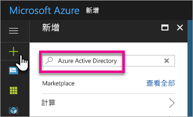
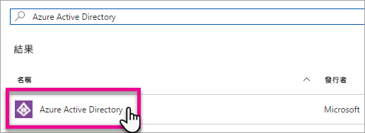
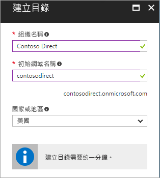
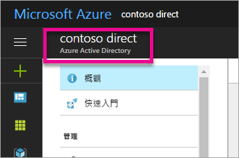
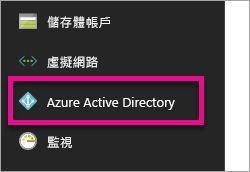
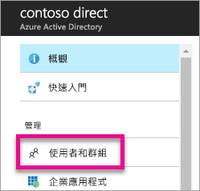
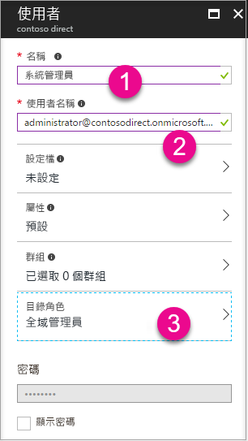
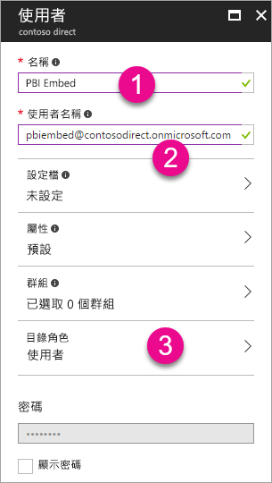
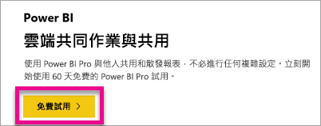

# 建立要搭配 Power BI 使用的 Azure Active Directory 租用戶
了解如何使用 Power BI REST API 來建立新的 Azure Active Directory (Azure AD) 租用戶，以用於您的自訂應用程式。

租用戶代表 Azure Active Directory 內的一個組織。 它是組織在註冊 Azure、Microsoft Intune 或 Office 365 等 Microsoft 雲端服務時，所收到並擁有的 Azure AD 服務專用執行個體。 每個 Azure AD 租用戶彼此有別，各自獨立。

取得 Azure AD 租用戶之後，您就可以定義應用程式並指派權限，讓您的應用程式可以使用 Power BI REST API。

您的組織可能已經有 Azure AD 租用戶，可供您用於應用程式。 您可以利用該租用戶來滿足應用程式需求，也可以特別為您的應用程式建立新的租用戶。 本文探討如何建立新的租用戶。

## 建立 Azure Active Directory 租用戶
若要將 Power BI 整合至自訂應用程式，您需要在 Azure AD 內定義應用程式。 若要這樣做，您在 Azure AD 內需要一個目錄。 這就是您的租用戶。 如果貴組織因未使用 Power BI 或 Office 365 而尚無租用戶，[您就必須建立租用戶](https://docs.microsoft.com/azure/active-directory/develop/active-directory-howto-tenant)。 如果不希望您的應用程式和組織的租用戶混在一起，您可能也需要建立租用戶。 這樣可以保持隔離。

或者，您可能只是為了測試而建立租用戶。

若要建立新的 Azure AD 租用戶，請執行下列動作。

1. 瀏覽至 [Azure 入口網站](https://portal.azure.com)，並使用具有 Azure 訂用帳戶的帳戶登入。
2. 選取**加號圖示 (+)**，並搜尋 *Azure Active Directory*。
   
    
3. 在搜尋結果中選取 [Azure Active Directory]。
   
    
4. 選取 [建立]。
5. 提供**組織的名稱**及**初始網域名稱**。 然後選取 [建立]。 這會建立您的目錄。
   
    
   
   > [!NOTE]
   > 您的初始網域會成為 onmicrosoft.com 的一部分。稍後，您可以新增其他網域名稱。 您可以將多個網域指派至租用戶的目錄。
   > 
   > 
6. 目錄建立完成後，選取資訊方塊來管理您的新目錄。

現在已建立您的目錄。 接下來，我們要將使用者新增至租用戶。

## 在您的 Azure Active Directory 租用戶中建立一些使用者
既然我們有一個目錄，讓我們來建立至少兩個使用者。 其中一個是租用戶的全域管理員，另一個是用於內嵌的主要使用者。 將這個當作服務帳戶。

1. 在 Azure 入口網站內，請確定我們在 Azure Active Directory 飛出窗格上。
   
    
   
    如果不是，請從左側服務列選取 Azure Active Directory 圖示。
   
    
2. 在 [管理] 下方，選取 [使用者和群組]。
   
    
3. 選取 [所有使用者]，然後選取 [+ 新增使用者]。
4. 提供此使用者的名稱和使用者名稱。 這會成為租用戶的全域管理員。 您也應該將 [目錄角色] 變更為 [全域管理員]。 您也可以顯示暫時密碼。 完成時選取 [建立]。
   
    
5. 對於租用戶中的一般使用者，您應該重複這樣做。 這也可用於主要內嵌帳戶。 這一次，我們讓 [目錄角色] 維持為 [使用者]。 請務必記下密碼。 然後選取 [建立]。
   
    
6. 使用您在步驟 5 建立使用者帳戶來註冊 Power BI。 若要這樣做，您可以移至 [powerbi.com](https://powerbi.microsoft.com/get-started/)，然後在 [Power BI - 雲端共同作業與共用] 下選取 [免費試用]。
   
    
   
    登入時，系統會提示您免費試用 Power BI Pro 60 天。 您可以選擇加入而成為 Pro 使用者。 如果內嵌的解決方案就是您的目標，則您現在也可以開始開發。
   
   > [!NOTE]
   > 請確定以您提供給使用者帳戶的電子郵件地址來註冊。
   > 
   > 

## 後續步驟
既然您有 Azure AD 租用戶，您可以在 Power BI 內使用此租用戶來測試項目，及/或更進一步在應用程式中內嵌 Power BI 儀表板和報告。 如需有關如何內嵌項目的資訊，請參閱[如何內嵌 Power BI 儀表板、報告和圖格](embedding-content.md)。

[什麼是 Azure AD 目錄？](https://docs.microsoft.com/azure/active-directory/active-directory-whatis)  
[如何取得 Azure Active Directory 租用戶](https://docs.microsoft.com/azure/active-directory/develop/active-directory-howto-tenant)  

有其他問題嗎？ [嘗試在 Power BI 社群提問](http://community.powerbi.com/)

