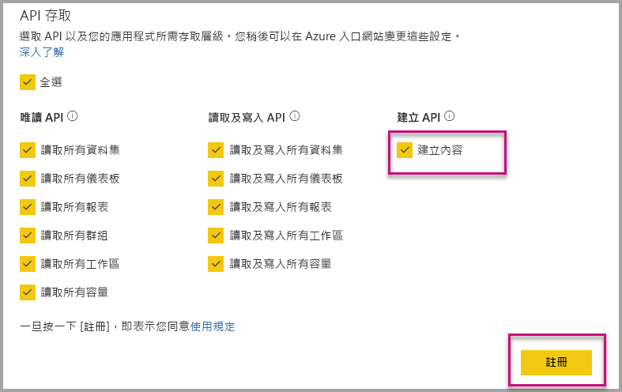

# 自動安裝 Power BI 應用程式時對組織進行內嵌

若要內嵌的應用程式的內容，內嵌的使用者必須擁有[應用程式的存取](../service-create-distribute-apps.md)。 如果使用者安裝應用程式，然後內嵌順暢運作。 如需詳細資訊，請參閱 <<c0> [ 內嵌報表或儀表板應用程式從](embed-from-apps.md)。 可定義中的所有應用程式可以 PowerBI.com[自動安裝](https://powerbi.microsoft.com/blog/automatically-install-apps/)。 不過，此動作是在租用戶層級，並適用於所有的應用程式。

## 內嵌的自動安裝應用程式

如果使用者具有存取應用程式，但未安裝應用程式，然後內嵌失敗。 內嵌的應用程式時，您可以避免這些失敗，因此您可以允許在內嵌的應用程式的自動安裝。 此動作表示如果使用者嘗試將內嵌的應用程式未安裝，它會自動為您安裝。 因此您想要的內容取得內嵌立即導致使用者擁有順暢的體驗。

## 內嵌 Power BI 使用者 （使用者擁有資料）

若要允許自動安裝的應用程式，為您的使用者，您需要提供您的應用程式的內容建立 權限時[註冊您的應用程式](register-app.md#register-with-the-power-bi-application-registration-tool)，或將它加入，如果您已經註冊您的應用程式。

接著，您必須提供內嵌 URL 中的應用程式識別碼。 若要提供的應用程式識別碼，應用程式建立者必須先安裝應用程式，然後使用其中一個支援[Power BI Rest API](https://docs.microsoft.com/rest/api/power-bi/)呼叫[取得報表](https://docs.microsoft.com/rest/api/power-bi/reports/getreports)或是[取得儀表板](https://docs.microsoft.com/rest/api/power-bi/dashboards/getdashboards)。 然後應用程式建立者必須接受來自 REST API 回應的內嵌 Url。 如果內容是來自應用程式，應用程式識別碼會出現在 URL 中。  內嵌 URL 之後，您可以將定期使用它。

## 安全內嵌

若要使用自動安裝的應用程式，應用程式建立者必須先安裝應用程式，再前往 PowerBI.com 上應用程式中，瀏覽至報表，然後取得該連結，以一般方式。 所有其他使用者的存取權的應用程式，可以使用連結，可以內嵌報表。

## 考量與限制

* 您只可以內嵌報表和儀表板，在此案例。

* 這項功能目前不支援的應用程式擁有資料及 SharePoint 內嵌案例。