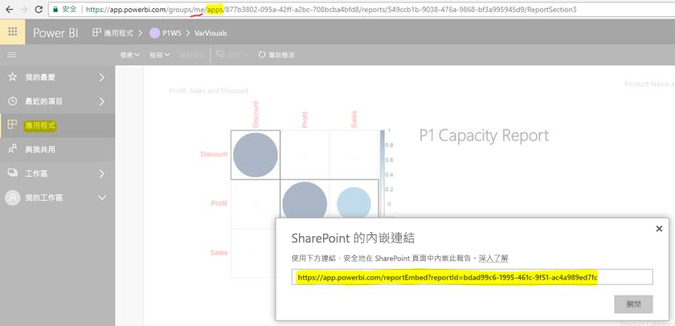

# 從應用程式內嵌報表或儀表板

在 Power BI 中，您可以建立應用程式將相關的儀表板和報表全都帶到同一處。 然後，請將這些應用程式發佈到組織中的大型人員群組。 當您的所有使用者都是 Power BI 使用者時，這些應用程式的用途是相關的。 因此，您可以使用 Power BI 應用程式與他們共用內容。 本文提供一些快速步驟，讓您將內容從發佈的 Power BI 應用程式內嵌至協力廠商應用程式。

## 抓取用於內嵌的報表 embedURL

1. 在 [我的工作區] 使用者工作區中將應用程式具現化。 請與自己共用或引導另一位使用者完成此流程。

2. 在 Power BI 服務中開啟所需的報表。

3. 移至 [檔案] > [內嵌於 SharePoint Online 中]，並抓取報表 embedURL。 下面的螢幕擷取畫面中顯示 embedURL 範例。 或者，您可以呼叫 GetReports/GetReport REST API，並從回應中擷取對應的報表 embedURL 欄位。 當應用程式在使用者的工作區中進行具現化時，REST 呼叫不應使用工作區識別碼作為 URL 的一部分。

    

4. 透過 JavaScript SDK 使用在步驟 3 中擷取的 embedURL。

## 抓取用於內嵌的儀表板 embedURL

1. 在 [我的工作區] 使用者工作區中將應用程式具現化。 請與自己共用或引導另一位使用者完成此流程。

2. 呼叫 GetDashboards REST API，並從回應中擷取對應的儀表板 embedURL 欄位。 當應用程式在使用者的工作區中進行具現化時，REST 呼叫不應使用工作區識別碼作為 URL 的一部分。

3. 透過 JavaScript SDK 使用在步驟 2 中擷取的 embedURL。

## 後續步驟

檢閱如何從應用程式工作區為協力廠商客戶和組織內嵌：

> [!div class="nextstepaction"]
>[為協力廠商客戶內嵌](embed-sample-for-customers.md)

> [!div class="nextstepaction"]
>[為組織內嵌](embed-sample-for-your-organization.md)
