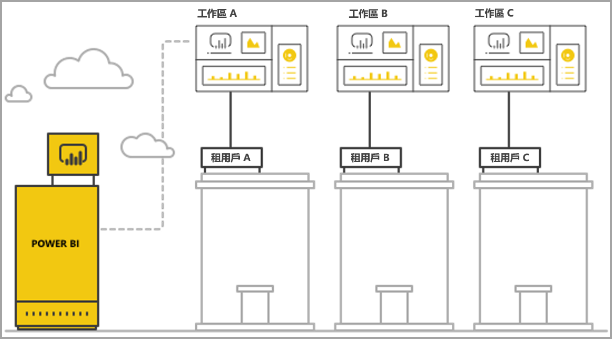
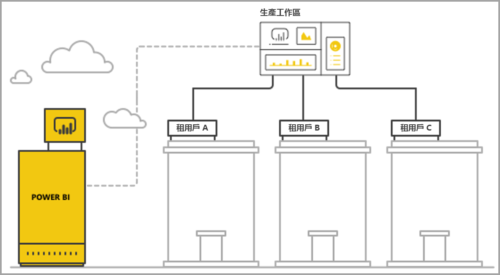

# 使用 Power BI 內嵌式分析管理多租用戶

在設計多租用戶 SaaS 應用程式時，您必須仔細選擇最適合 SaaS 應用程式需求的租用模型。 此程序對於作為 SaaS 應用程式之內嵌式分析一部分的 Power BI 也是有效的。 租用模型可決定如何在 Power BI 和儲存體帳戶內映射和管理每個租用戶的資料。 您的租用模型會影響應用程式的設計和管理。 稍後切換到不同的模型可能既昂貴又造成干擾。

使用 Power BI Embedded，有兩種主要的基本方法可以維護租用戶之間的區隔。

   1. **以工作區為基礎的隔離** - 為每個租用戶建立個別的 Power BI 工作區。
   2. **以資料列層級安全性為基礎的隔離** - 其中基礎資料用於控制和管理每個使用者或群組的資料存取。

本文會說明不同的方法，並根據幾個評估準則對它們進行分析。

## 概念和術語

**[AAD](https://docs.microsoft.com/azure/active-directory/fundamentals/active-directory-whatis)** - Azure Active Directory。

**AAD 應用程式** - AAD 中的應用程式識別。 需要 AAD 應用程式才可驗證。

**SaaS 應用程式 (軟體即服務)**  - 由企業或 ISV 實作的系統，通常是一種線上服務。 它還是為多個客戶租用戶 (組織) 提供服務的相關軟體系統。 在本文中，**SaaS 應用程式使用 Power BI Embedded 為其不同的租用戶提供分析**。 Power BI Embedded 在具有線上連線時也適用於所有類型的應用程式。

**租用戶** - 使用 SaaS 應用程式的單一客戶 (組織) 以及客戶為 SaaS 應用程式帶來的任何資源或資料。

**[Power BI](../power-bi-overview.md)** - Power BI 雲端服務，可作為 Power BI Embedded 的平台。

**Power BI 租用戶** - 是一組與單一 AAD 租用戶相關聯的 Power BI 資源。

**[Power BI workspace](../service-create-workspaces.md)** - Power BI 中內容的容器。

**Power BI 成品** - Power BI 工作區中有數個 Power BI 成品，例如儀表板、報表、資料集和資料流程。

**[Power BI Embedded](azure-pbie-what-is-power-bi-embedded.md)** - 一組公用 API，允許開發人員建置管理 Power BI 內容與內嵌 Power BI 元素的應用程式。

**[資料列層級安全性 (RLS)](embedded-row-level-security.md)** -可控制使用者對資料表中個別資料列之資料的存取。 您可以在資料來源層級或 Power BI 語意模型中實作資料列層級安全性。

**主要使用者** - 表示 Power BI 中 SaaS 應用程式的識別，以及 SaaS 應用程式在呼叫 Power BI API 時所使用的識別。 必須是具有 Power BI Pro 授權的 AAD 使用者。

**AAD 應用程式使用者 (服務主體)** - 表示 Power BI 中 SaaS 應用程式的識別，以及 SaaS 應用程式在呼叫 Power BI API 時所使用的識別。 必須是 AAD Web 應用程式。 可取代使用*主要*使用者對 Power BI 進行驗證。

**容量** - 一組專門用來執行 Power BI 服務的資源。 [Power BI Premium 容量](../service-premium-what-is.md) 適用於內部使用 Power BI 的企業公司，而 [Power BI Embedded 容量](azure-pbie-create-capacity.md)旨在讓應用程式開發人員為第三方開發 SaaS 應用程式。

**[Power BI Pro 授權](../service-admin-purchasing-power-bi-pro.md)** - 以使用者為基礎的授權，可授予權限將內容發行至應用程式工作區、使用無 Premium 容量的應用程式、共用儀表板以及訂閱儀表板和報表。

**[資料連線模式](../desktop-directquery-about.md)** - 將資料來源連接到可以在不同模式中完成的 Power BI：

   * 匯入 - 這是取得資料最常見的方法。
   * DirectQuery - 直接連接到其來源存放庫中的資料。
   * 即時連線 - 另一個直接連接到 Analysis Services 資料 (包括 Azure 和內部部署) 的模式。

## 評估準則

適用於 SaaS 應用程式的正確租用模型的最佳選擇，會根據特定的商務和技術需求、資料架構等而有所不同。 深入了解這些要求以及可用的租用模型選項和取捨，可以協助您為 SaaS 應用程式定義穩固、高效能、符合成本效益且可調整的架構。

以下是在不同租賃模型之間進行選擇時需要考慮的一組方面。

### 資料架構

通常，使用 Power BI Embedded 建置應用程式的開發人員已經擁有單一或多租用戶資料庫。 使用 Power BI Embedded 的租用模型很容易，類似於資料庫的租用模型。 如果尚未定義資料庫租用模型，您可能需要在決定數據體系結構之前考慮其他方面。

### 資料隔離

儲存的資料有多機密？ 您需要將不同的客戶租用戶分隔到什麼層級的隔離？ 答案可能因具有特定需求的不同產業或特定客戶而異。

### 延展性

若要尋找最佳解決方案，請定義在可預見的未來達到的規模。 請記住，當使用量和資料相應增加時，適合的方案目前可能會不敷使用。 分析延展性時，請考慮下列清單：

   * 租用戶 (客戶) 的數目。
   * 每個租用戶的報表、儀表板和資料集的數目。
   * 每個資料集的資料大小和重新整理頻率。
   * 使用者數目。
   * 尖峰時段的並行使用者數目。

有些 SaaS 應用程式的客戶數量較少，且使用率較低，但資料量較大。 其他人可能擁有許多客戶和高使用量，但每個客戶都有少量的資料和報告。 在任何這些情況下，大的數字可能會影響未來的成本和操作複雜度。

### 自動化與操作複雜度

識別需要自動化經常發生的處理程序。

   * 登入新的租用戶的頻率為何？ 完全登入每個租用戶需要採取哪些動作？
   * 完全加載每個操作需要採取哪些措施？需要部署的新的或更新的Power BI內容的發布節奏是什麼？
   * 針對每個租用戶定義了多少資料列層級的安全性角色？  

識別這些程序以及如何解決它們，可協助您了解維護每個模型所涉及的作業複雜性。

### 資料落地需求以及支援多個地理位置的需求

Power BI Embedded 支援多地理位置部署 (預覽功能)。 [Multi-Geo](embedded-multi-geo.md) 可讓 Power BI Embedded 資源部署在不同的區域中，並將特定內容指派給特定區域。 這項功能可用於所有模型，但可能會影響要管理的內容量和成本。 目前，多重異地複寫旨在符合資料落地需求，並且不會通過將資料拉近取用者來提高效能。

### 成本

[Power BI Embedded](https://azure.microsoft.com/services/power-bi-embedded/) 具有以資源為基礎的購買模型，像是 **Power BI Premium**。 您購買一或多個具有固定運算能力和記憶體的容量。 使用 **Power BI Embedded** 時，此容量是主要成本項目。 使用容量的使用者數目沒有限制。 唯一的限制是容量的效能。 每個*主要*使用者或需要存取 Power BI 入口網站的特定使用者都需要 [Power BI Pro 授權](../service-admin-licensing-organization.md)。

我們建議您透過模擬實際環境和使用方式來測試和測量容量的預期負載，並對容量進行負載測試。 您可以使用 Azure 容量或[進階容量計量應用程式](../service-admin-premium-monitor-capacity.md)中提供的各種計量來測量負載和效能。

### 內容的自訂和撰寫

SaaS 應用程式有兩種方法，讓使用者能夠編輯和建立報告，或將資料作為流程的一部分上傳至服務中：

   * [內嵌式 iFrame 中的編輯/建立模式](https://github.com/Microsoft/PowerBI-JavaScript/wiki/Create-Report-in-Embed-View) - 使用者可以在 SaaS 應用程式內取得報告或新空白畫布的檢視。 如此一來，他們就可以使用 Power BI 工具列根據工作區中的資料集建立內容。 我們建議使用此選項，因為它位於熟悉環境的使用者內容中。 開始使用和編輯更容易，且使用者建立的報告會附加至現有的資料集。

   * 使用 Power BI Desktop 建立內容，並透過 SaaS 應用程式 UI將其上載到工作區。 在這種方法中，使用者可以使用更多工具來使用 Power BI Desktop。 但是，我們不建議使用此方法，因為使用者需要熟悉 SaaS 應用程式內容之外的其他工具。 上傳 PBIX 檔案表示使用者正在新增額外的資料集，該資料集可能與工作區中的資料集的資料集重複。

## Power BI 工作區為基礎的隔離

透過 Power BI 工作區為基礎的隔離，SaaS 應用程式可支援來自單一 Power BI 租用戶的多個租用戶。 以工作區為基礎的隔離包含不同的租用戶使用的所有 Power BI 內容。 透過建立多個工作區，即可在 Power BI 工作區層級中完成租用戶隔離。 每個工作區都包含與該租用戶相關的資料集、報告和儀表板。 此外，每個工作區僅連接到該租用戶的資料。 如果您需要進一步的隔離，可以為每個工作區和其內容建立*主要*使用者或服務主體。

### 資料架構

管理租用戶資料有兩種主要的方式。

* 每個租用戶一個個別的資料庫
* 單一多租用戶資料庫

如果 SaaS 應用程式存放區為每個租用戶保留個別的資料庫，那麼自然的選擇是在 Power BI 中使用單一租用戶的資料集，並為每個指向相符資料庫的資料集使用連接字串。

如果 SaaS 應用程式存放區為所有租用戶使用多租用戶資料庫，則可以輕鬆地依工作區區隔租用戶。 您可以使用僅擷取相關租用戶資料的參數化資料庫查詢，設定 Power BI 資料集的資料庫連線。 您可以使用 [Power BI Desktop](../desktop-query-overview.md) 或使用查詢時具有[參數](https://docs.microsoft.com/rest/api/power-bi/datasets/updateparametersingroup)的 [API](https://docs.microsoft.com/rest/api/power-bi/datasets/updatedatasourcesingroup) 來更新連接。

### 資料隔離

此租用模型中的資料在工作區層級區隔。 工作區和租用戶之間的簡單對應可防止一個租用戶的使用者看到來自另一個租用戶的內容。 使用單一*主要*使用者要求您可以存取所有不同的工作區。 針對使用者要顯示那些資料的設定是在[產生內嵌權杖](https://docs.microsoft.com/rest/api/power-bi/embedtoken)期間所定義 (使用者無法查看或變更的僅限後端程序)。

若要新增額外的隔離，應用程式開發人員可以為每個工作區定義*主要*使用者或應用程式，而不是可以存取多個工作區的單一*主要*使用者或應用程式。 如此一來，您可以確保任何人為錯誤或認證洩漏不會導致公開多個客戶的資料。

### 延展性

此模型的一個優點是將資料分成每個租用戶的多個資料集，克服了[單一資料集的大小限制](https://docs.microsoft.com/power-bi/service-premium-large-datasets) (目前容量為 10 GB)。 當容量超載時，它可以收回未使用資料集以釋放使用中資料集的記憶體。 單一的大型資料集無法執行這項工作。 如果需要，還可以使用多個資料集將租用戶分成多個 Power BI 容量。

儘管有這些優點，其中必須考慮 SaaS 應用程式未來可以達到的規模。 例如，人員可能會達到可以管理之成品數目的限制。 如需詳細資料，請參閱本文稍後的[部署限制](#summary-comparison-of-the-different-approaches)。 使用的 SKU 容量引入下列限制：資料集需要適應的記憶體大小、可以同時執行的重新整理次數，以及資料重新整理的最高頻率。 建議您在管理數百或數千個資料集時進行測試。 也建議您考慮平均值和尖峰使用量，以及使用大型資料集或不同使用模式的任何特定租用戶，其管理方式不同於其他租用戶。

### 自動化與操作複雜度

使用 Power BI 工作區為基礎的隔離，應用程式開發人員可能需要管理數百或數千個成品。 請務必定義應用程式生命週期管理中經常發生的程序，並確定您有正確的工具集，以便在此租用模型中大規模執行這些作業。 部分範例作業包括：

   * 加入新的租用戶 (客戶)
   * 更新部分或所有租用戶的報告或儀表板
   * 更新部分或所有租用戶的資料集結構描述
   * 針對特定租用戶的未計劃自訂項目
   * 資料集重新整理的頻率

例如，為新的租用戶建立工作區是常見的工作，它需要自動化。 使用 [Power BI REST API](https://docs.microsoft.com/rest/api/power-bi/)，您可以[在建立工作區時實現完全自動化](https://powerbi.microsoft.com/blog/duplicate-workspaces-using-the-power-bi-rest-apis-a-step-by-step-tutorial/)。

### 多重異地複寫需求

多重異地複寫涉及在所需區域中購買容量，並將工作區指派給該容量。 如果您需要支援不同區域中的不同租用戶，則需要將租用戶的工作區指派到所需區域中的容量。 這項工作是簡單的作業，且其成本不會超過容量相同的所有工作空間。 但是，如果您的租用戶需要資料常駐在多個區域中，則工作區中的所有成品都需要在每個區域的容量中重複，從而增加了成本和管理的複雜度。

### 成本

使用 Power BI Embedded 的應用程序開發人員需要[購買Power BI Embedded容量才能投入生產](embed-sample-for-customers.md#move-to-production)。  請務必了解以工作區為基礎的隔離模型的影響，及其對容量的影響。

以工作區為基礎的隔離模型與容量相當，原因如下：

   * 您可以獨立指派給容量的最小物件是工作區，(亦即，您無法指派報告)，因此可以依工作空間分隔租用戶，您可以充分靈活地管理每個租用戶和其效能需求，並透過相應增加/減少來最佳化容量。 例如，具有高容量和變動性的大型和基本租用戶可以在個別的容量中進行管理，以確保一致的服務層級，同時將較小的租用戶分組到另一個容量中以將成本最佳化。

   * 區隔工作區也表示在租用戶之間區隔資料集，以便資料模型可以在較小的區塊中，而不是在單一大型資料集中。 此工作允許更好地管理記憶體使用量的能力，在不需要時回收小型且未使用的資料集，同時保留使用者對效能的滿意度。

應用程式開發人員需要考慮並行重新整理的數目上限，因為當您有多個資料集時，重新整理處理程序可能需要額外的容量。

### 內容的自訂和撰寫

對於內容建立的主要使用情況，應用程式開發人員必須仔細考慮哪些租用戶可以有編輯功能，以及每個租用戶中可以編輯多少使用者。 允許每個租用戶中的多個使用者進行編輯，可能會導致產生許多內容，而觸達資料集限制，例如每個資料集的報告數目，或工作區中資料集的數目。 如果您為使用者提供這項功能，我們建議您密切監視內容的產生，並視需要相應增加。 基於相同原因，我們不建議將這項功能用於內容個人化，其中每個使用者可以對報告進行小變更並自行儲存。 如果 SaaS 應用程式允許內容個人化，請考慮引入和溝通使用者專屬內容的工作區保留原則，以便在使用者移動到新位置、離職或不再使用該平台時，有利於進行內容刪除流程。

## 資料列層級安全性為基礎的隔離

透過以資料列層級安全性為基礎的隔離，SaaS 應用程式可使用單一工作區來裝載多個租用戶。 這表示一旦所有租用戶使用它，就會建立每個 Power BI 成品的報告、儀表板和資料集。 租用戶之間的資料分離是使用多租用戶資料集上的[資料列層級安全性](embedded-row-level-security.md)完成的。 當使用者登入 SaaS 應用程式並開啟內容時，會針對該使用者的工作階段產生內嵌權杖，其中包含角色和篩選條件，以確保使用者只能看到允許他們查看的資料。 如果不允許來自相同租用戶的使用者檢視相同的資料，則應用程式開發人員需要在租用戶之間和相同的租用戶內實作階層式角色。

### 資料架構

當所有租用戶的資料儲存在單一資料倉儲中時，實作資料列層級安全性為基礎的隔離最為熟悉。 在此情況下，應用程式開發人員只能透過直接查詢或資料匯入將相關的資料從資料倉儲傳遞到 Power BI 資料集。 如果資料庫中的資料按每個租用戶分開，則需要將其合併為單一資料集，這會導致資料庫中存在的租用戶之間的區隔程度較低。

### 資料隔離

使用資料列層級安全性為基礎的隔離，資料區隔是使用資料集上的[資料列層級安全性定義](embedded-row-level-security.md)完成的，這表示所有資料都同時存在。 這種形式的資料區隔，更容易因為開發人員錯誤而導致資料外洩。 即使在後端完成資料列層級安全性並保護使用者，如果資料是高度敏感或客戶要求資料分離，則最好使用以工作區為基礎的隔離。

### 延展性

使用資料列層級安全性為基礎的隔離，資料需要符合資料集的大小限制，目前為 10 GB。 隨著[累加式重新整理](../service-premium-incremental-refresh.md)的引進以及即將發行的 Power BI 資料集的 XMLA 端點，預期資料集大小限制將會大幅增加。 但是，資料仍然需要符合容量的記憶體，並有足夠的剩餘記憶體來執行資料重新整理。 大規模部署需要大容量，以避免使用者因記憶體超過目前的容量限制而發生問題。 處理擴展的替代方式包括使用 **[彙總](../desktop-aggregations.md)** 或直接使用 DirectQuery 或即時連線連接到資料來源，而不是快取 Power BI 容量中的所有資料。

### 自動化與操作複雜度

使用以資料列層級安全性為基礎的隔離比使用以工作區為基礎的隔離更容易管理成品，因為每個環境 (dev/test/production)只有一個成品版本，而不是每個租戶各一個版本。 很大程度上，管理成品表示管理和更新數十個成品，而不是數千到數萬個。

Power BI 還沒有用於修改或建立 RLS 角色和規則的 API。 新增或變更角色只能以手動方式在 Power BI Desktop 中完成。 如果必須套用 RLS 階層架構，假如您不仔細計劃，則可能會很複雜又容易發生錯誤，。

如果應用程式開發人員需要管理必須經常建立或更新的許多角色和角色定義，那麼從管理的角度來看，以資料列層級安全性為基礎的隔離是不可調整的。

另一個操作複雜度是需要密切監視記憶體使用量，並建置健全的警示和調整機制，以確保使用者取得順暢的體驗。  

### 多重異地複寫需求

由於所有資料都儲存在單一資料集中，因此難以符合要求將特定資料繫結至特定位置的資料落地需求。 它還可能會大幅增加使用多個區域的成本，因為所有資料都複寫並儲存在每個區域中。 如果只有少數的租用戶需要不同的地理位置，則可以使用上述以工作區為基礎的隔離模型，將這些租用戶的資料僅保留在不同的區域中。

### 成本

以資料列層級安全性為基礎的隔離主要成本驅動因素是資料集的記憶體使用量。 您需要足夠的容量來儲存資料集，並為記憶體需求中的任何尖峰流量保留一些額外的記憶體緩衝區。 消除這種情況的一種方法是將資料儲存在 SQL Server 資料庫或 SQL Server Analysis Services Cube 中，並使用 Direct Query 或即時連線，即時擷取資料來源中的資料。 這種方法會增加資料來源的成本，但由於記憶體需求減少了對大容量的需求，因此降低了 Power BI 容量的成本。

### 內容的自訂和撰寫

當使用者編輯或建立報告時，他們可以使用生產環境的多租用戶資料集。 基於這個原因，我們建議您僅使用內嵌式 iFrame 選項進行編輯或[建立報告](https://github.com/Microsoft/PowerBI-JavaScript/wiki/Create-Report-in-Embed-View)，因為它依賴相同的資料集，並套用了資料列層級安全性。 讓使用者上傳包含其他資料集的 PBIX 檔案可能成本高昂，而且難以使用以資料列層級安全性為基礎的隔離進行管理。 此外，當使用者在相同的工作區中產生新的內容時，您需要確保生產環境工作區未達到其限制並建置健全的機制，來區分哪些內容已連線到哪一個租用戶。

## 不同方法的摘要比較

> [!Important]
> 下列分析根據產品的目前狀態。 由於我們每月都會發布新功能，我們會繼續提供能夠應對現有限制和弱點的新功能。 請務必查看我們每月的部落格文章以查看最新消息，並回到本文，以查看新功能如何影響租用模型建議。

| 評估準則 | 以工作區為基礎   | 以資料列層級安全性為基礎  |  |  |
|--------------------------------------|----------------------------------------------------------------------------------------------------------------------|---------------------------------------------------------------------------------------|---|---|
| 資料架構  | 每個租用戶都有一個個別的資料庫時最簡單  | 所有租用戶的所有資料都在單一資料倉儲中時最簡單   |  |  |
| 資料隔離  | 好。 每個租用戶都有專用的資料集。  | 中度。 所有資料都在同一個共用資料集中，但透過存取控制進行管理。  |  |  |
| 延展性  | 中。 將資料分成多個資料集可實現最佳化。  | 最低。 受到資料集限制。  |  |  |
| 多重異地複寫需求  | 適合大多數租戶只在一個區域時。  | 不建議使用。 需要將整個資料集保存在多個區域中。  |  |  |
| 自動化與操作複雜度  | 個人租用戶的自動化程度很高。   大規模管理許多成品較複雜。  | 易於管理 Power BI 成品，但是難以大規模管理 RLS。  |  |  |
| 成本  | 低-中。 可以最佳化使用率以降低每個租用戶的成本。  需要經常重新整理時，可能會增加。  | 如果使用匯入模式，則為中-高。  如果使用 Direct Query 模式，則為低-中。  |  |  |
| 內容的自訂和撰寫  | 適合。 可能會達到大規模的限制。  | 僅在內嵌式 iFrame 中產生內容  |  |  |

## 部署考量與限制

**Power BI 成品限制：**

* 單一使用者/應用程式可以是成員/管理員的工作區 V1 (群組) 數目是 250。
* 單一使用者/應用程式可以是成員/管理員的工作區 V2 (資料夾) 數目是 1000。
* 單一工作區中的資料集數目為 1000。
* 連接到單一資料集的報告/儀表板數目為 1000。
* 上傳 *.pbix* 檔案的資料集記憶體大小限制為 10 GB。

**Power BI 容量考量與限制：**

* 根據[購買的 SKU](../service-premium-what-is.md)，每個容量只能使用其配置的記憶體和 V 核心。
* 針對每個 SKU 的建議資料集大小，請參考[進階大型資料集](../service-premium-what-is.md#large-datasets)。
* 專用容量中的最大資料集大小為 10 GB。
* 一天中*匯入模式*資料集的排程重新整理次數為 48。
* *匯入模式*資料集的排程重新整理之間的時間為 30 分鐘。
* 針對可以在容量上同時執行的重新整理次數，請參考[資源管理和最佳化](../service-premium-what-is.md#capacity-nodes)。
* 調整容量的平均時間在 1-2 分鐘之間。 在這段時間內，容量無法使用。 我們建議使用橫向擴展方法來[避免停機時間](https://powerbi.microsoft.com/blog/power-bi-developer-community-november-update-2018/#scale-script)。

## 後續步驟

* [搭配 Power BI 使用內嵌式分析](embedding.md)
* [Power BI Embedded](azure-pbie-what-is-power-bi-embedded.md)
* [Power BI Premium](../service-premium-what-is.md)
* [資料列層級安全性](embedded-row-level-security.md)
